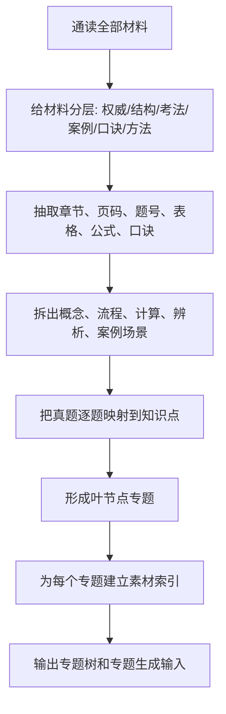

# 00｜建树前深读交付物总览（深度样例）

> 这是一份“Claude Code 深读全部材料后”的中间成果样例。它不是规范说明，而是展示：在真正建立专题树之前，材料应该被加工到什么程度。后续 Codex 生成专题时，不应再从一堆 PDF 里重新摸索，而应直接读取这些中间材料。

## 本轮深读的核心目标

这轮工作不是直接写专题讲义，也不是直接制作 Anki 卡片，而是先完成一套**极细粒度的专题生成索引系统**。它要解决的问题是：当后续要生成任意一个专题时，系统能够马上回答：

这个专题属于哪棵树的哪个叶节点；它的上位知识域是什么；它和相邻专题的边界在哪里；应该从哪些原始材料、哪些页、哪些题、哪些表格、哪些口诀中取材；哪些内容适合写进讲义正文；哪些适合做图；哪些适合做典型题详解；哪些适合在专题学习之后转成 Anki 卡片。

因此，Claude Code 的“脏活累活”主要是三件事：**读材料、做索引、定专题**。后续 Codex 才负责基于这些索引生成每一个高质量专题学习包。

## 材料使用分层

所有材料不能平等使用。必须先给每类材料定位。

**权威边界层**：官方教程、考试说明、报考须知。它们决定考试边界、术语表述、章节结构和知识域划分。凡是定义、过程、输入输出、管理领域名称出现冲突，应优先回到这一层校准。

**结构压缩层**：学习笔记、知识点精华、总结经典。它们适合提取“输入—工具与技术—输出”“过程组—知识域”“概念—流程—产出”等结构，但不能替代权威层。后续专题讲义应吸收它们的结构，而不是照抄条目。

**考法校验层**：历年真题、题库、解析资料。它们决定专题树怎么拆。一个教材章节可能很大，但如果其中某个计算、某组概念辨析、某个案例场景反复出现，就应拆成独立叶节点专题。

**案例表达层**：下午案例分析资料。它负责“如何答题”，尤其是原因题、措施题、流程题、管理问题识别题。案例专题不能只从教材章节生成，必须从案例材料中抽取答题组织方式。

**冲刺记忆层**：口诀和精简背诵材料。它们用于专题末尾的记忆压缩和 Anki 挖空，不适合直接作为第一遍讲解材料。

**制卡方法层**：Anki、SuperMemo、间隔重复资料。它们不进入考试知识树，但要影响后续卡片生成：先理解再制卡，卡片保持原子化，避免大列表，流程和枚举用分组、图示或挖空处理。

## 本轮应形成的核心中间材料

本轮不再做“候选专题池”。所有专题都应进入一棵完整树，树的**叶节点就是专题**。叶节点可以小，但必须有明确学习中心。一个叶节点通常满足以下条件之一：

- 有独立概念中心，例如“项目章程”“WBS”“CCB”“范围基准”；
- 有独立计算中心，例如“PERT 三点估算”“沟通渠道数”“挣值管理 CV/SV/CPI/SPI”；
- 有独立辨析价值，例如“范围确认 vs 质量控制”“项目阶段 vs 过程组”“赶工 vs 快速跟进”；
- 有独立案例价值，例如“范围蔓延”“进度失控”“变更控制缺失”“收尾困难”；
- 有独立记忆负担，例如“系统集成企业资质等级”“监理资质”“政府采购方式”。

本轮建议形成四份核心文件：

1. **全资料细粒度索引与证据库**：告诉后续专题从哪里取材料，细到页码、题号、表格、公式、口诀和案例段落。
2. **极细粒度专题知识树**：给出整场考试的树状认知地图，所有叶节点都是专题。
3. **专题素材索引库**：以专题为单位，汇总讲义、图示、题解、易错点、案例延伸、制卡方向所需素材。
4. **真题考法与题目映射索引**：以题目为单位，拆出考点、陷阱、选项逻辑、专题映射和可转化卡片。

如果只允许保留一份最重要的材料，应保留“专题素材索引库”，因为它最直接服务后续专题生成。但没有前两份，它容易失去全局结构；没有题目映射，它容易变成教材改写。

## 建树前的处理流程

这里最重要的原则是：**不要直接把教材目录当专题树**。教材目录只能提供上层结构，专题树必须被真题考法、计算题、案例题和易混淆点重新塑形。例如“项目进度管理”不能只作为一个专题，而应拆成活动排序、依赖关系、网络图、关键路径、PERT、资源平衡、赶工/快速跟进、进度控制案例等多个叶节点。

## 专题粒度判断样例

**过粗**：项目进度管理。这个粒度会把网络图、PERT、关键路径、进度压缩、资源平衡和案例措施混在一起，不利于深度学习。

**合适**：赶工、快速跟进与进度压缩决策。它有明确概念对、有高频真题、有案例价值，也能独立配图和配题。

**合适**：PERT 期望时间、标准差与典型计算题。它有公式、变量、典型计算、易错点和延伸，不应只塞进“进度管理总览”。

**过细**：PERT 公式中的 4M。这只是公式内部权重，不足以独立成专题，应放在 PERT 专题内部。

## Claude Code 深读完成后的理想状态

理想状态不是“生成了一份漂亮的目录”，而是：后续 Codex 拿到任意专题编号，都能直接知道该专题的材料来源、讲解主线、图示建议、题目素材、易错点、案例延伸和制卡方向。也就是说，Codex 做的是“写作与组织”，而不是重新做资料挖掘。

质量合格的表现：

- 任意叶节点专题都能追溯到材料来源；
- 高频专题至少有多个来源支撑；
- 计算专题包含公式、变量解释、题型和易错点；
- 案例专题包含问题识别、原因分析和措施模板；
- 易混淆专题包含成对或成组比较；
- 树中没有“待定候选”，只有已纳入的专题；
- 后续专题生成不需要再大规模翻原始资料。
