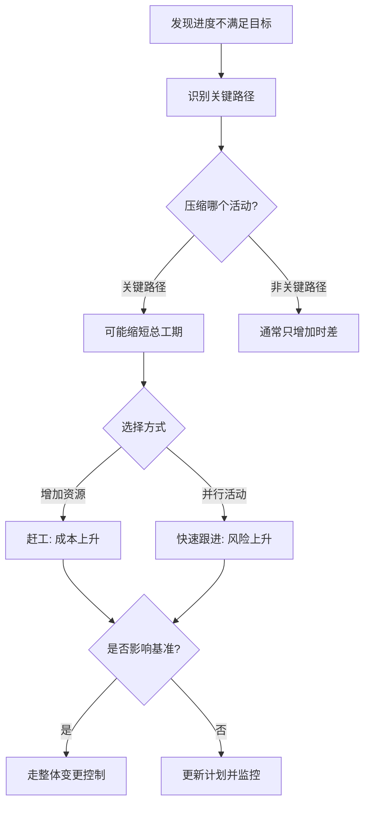
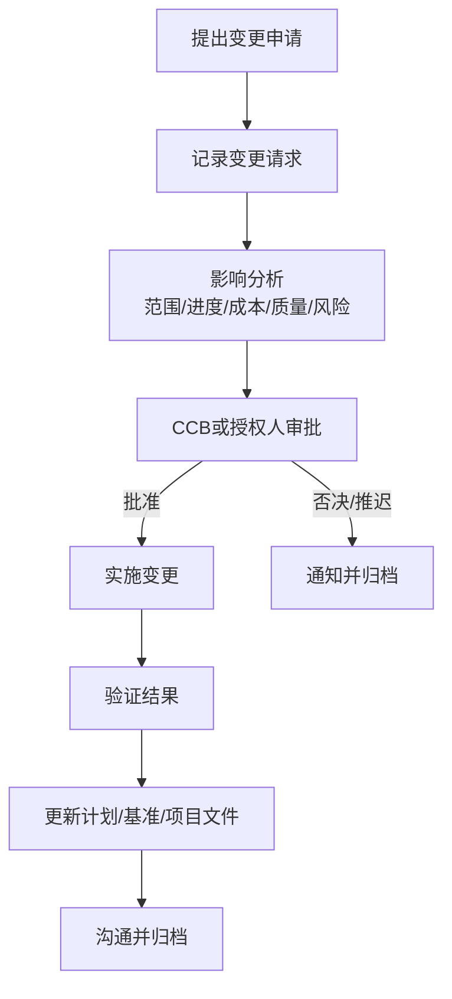
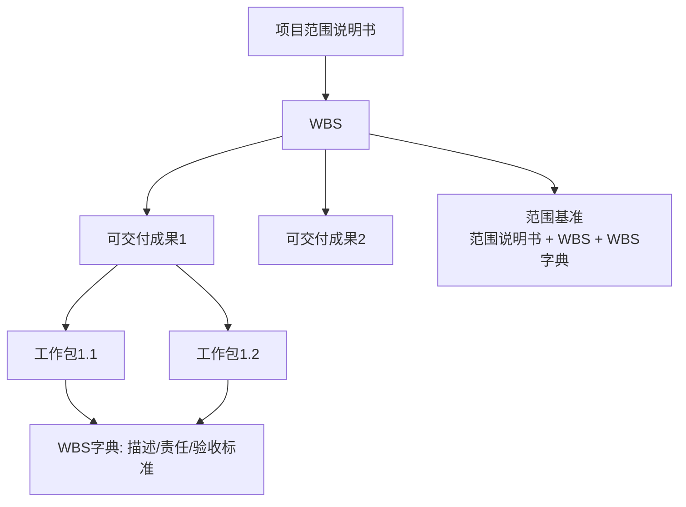

# 03｜专题素材索引库（深度样例）

> 本文件是后续 Codex 生成专题学习包的直接输入。真实执行时，专题树中的每个叶节点都应在这里拥有完整素材档案。这里展示几个代表性专题的深度。

## T-SCH-010｜赶工、快速跟进与进度压缩决策

### 专题定位

本专题属于进度管理的高频核心专题。它表面上只是“赶工”和“快速跟进”的区别，但实际考试中常与关键路径、成本增加、风险增加、整体变更控制、进度失控案例混合出现。因此它应被写成一个“进度压缩决策专题”，而不是概念背诵专题。

### 边界

本专题讲进度压缩的目的、赶工、快速跟进、关键路径优先原则、成本和风险影响、基准变更与变更控制。不展开完整关键路径计算，那属于 T-SCH-005；不展开 PERT，那属于 T-SCH-008；不展开完整进度控制案例，那属于 T-SCH-011。

### 核心思想

进度压缩不是“哪里慢压哪里”，而是围绕**关键路径、成本、风险**进行权衡。项目总工期由关键路径决定，压缩非关键路径活动通常只会增加时差，不会缩短项目完成日期。赶工通过增加资源换时间，主要代价是成本上升；快速跟进通过并行原本顺序活动换时间，主要代价是返工和风险上升。

### 材料来源

- C01-Q1：快速跟进定义题，关键词是“平行任务”。
- C01-Q2：赶工应压缩关键路径活动。
- C01-Q8：进度压缩通常增加成本和风险，“降低风险”是错误说法。
- B01-P3：进度管理工具中包含进度压缩。
- E01：变更流程口诀，可用于解释压缩导致基准变化时的处理。
- D01-P2：整体管理案例素材，连接变更控制和计划更新。

### 必须覆盖的内容

**[定义] 进度压缩**：在不改变项目范围的前提下缩短项目进度计划的技术，主要方法包括赶工和快速跟进。

**[定义] 赶工**：通过增加资源、加班、增加人员、使用更高效设备等方式缩短活动持续时间。它通常增加成本，也可能带来沟通成本和质量风险。

**[定义] 快速跟进**：将本来顺序执行的活动改为部分并行或重叠执行。它通常增加返工风险和协调风险。

**[关键规则] 优先压缩关键路径**：只有压缩关键路径活动才可能缩短项目总工期。压缩非关键路径活动一般只会增加时差。

**[关键联系] 进度压缩与变更控制**：如果压缩导致进度基准、成本基准、风险计划等变化，应进行影响分析并走整体变更控制。

### 建议图示

### 典型题素材

> 快速跟进是指：  
> A. 采用平行任务加速项目进展  
> B. 用一个任务取代另外的任务  
> C. 如有可能减少任务数量  
> D. 以上都不是

解析应强调“平行任务”是快速跟进关键词；B 是替代任务，C 可能涉及减少范围，都不是快速跟进。题后延伸到：快速跟进不是所有活动都能做，硬逻辑依赖强的活动强行并行会导致返工。

> 赶工一个任务时，你应该注重：  
> A. 尽可能多的任务  
> B. 非关键任务  
> C. 加速执行关键路径上的任务  
> D. 通过成本最低化加速执行任务

解析应强调关键路径决定总工期。D 有迷惑性，赶工当然要考虑成本，但如果不压缩关键路径，就算成本最低也不能达成工期目标。

> 压缩项目进度，会产生下列潜在问题，但哪项除外？  
> A. 范围增加  
> B. 成本增加  
> C. 风险增加  
> D. 降低风险

解析应强调进度压缩通常增加风险，不会天然降低风险。题后可延伸到风险管理和变更控制。

### 案例延伸

如果案例中出现“项目延期，领导要求必须按原日期上线”，答题不应只写“加班赶工”。应按“诊断—决策—变更—监控”组织：

先重新评估剩余工作量和关键路径；再分析可压缩活动，优先考虑关键路径；可采用赶工或快速跟进；评估对成本、质量、风险和范围的影响；如影响基准，提交变更申请并走 CCB；更新计划和风险登记册；加强进度监控和干系人沟通。

### 制卡方向

概念卡：赶工、快速跟进。  
辨析卡：赶工 vs 快速跟进。  
理解卡：为什么赶工应作用于关键路径。  
案例卡：进度延期且范围不变时如何处理。  

---

## T-INT-005｜整体变更控制与 CCB：决策、授权与流程

### 专题定位

这是整体管理和案例分析的交汇核心。客户临时提需求、项目经理口头同意、团队直接修改、进度成本失控、验收争议，这些案例常常最终落到变更控制缺失。本专题必须同时服务上午选择题和下午案例题。

### 边界

本专题讲变更请求、整体变更控制、CCB、变更流程、批准后的更新、变更管理与配置管理的区别。不展开范围蔓延细节，那属于 T-SCOPE-006；不展开配置项和配置库，那属于 T-CFG-001；不展开合同索赔，那属于 T-CON-002。

### 核心思想

整体变更控制的核心是：**任何影响项目基准或重要计划的变化，都不能只在局部处理，而要从整体角度评估对范围、进度、成本、质量、风险、采购和干系人的影响**。CCB 的价值不是增加手续，而是防止局部合理的变化导致整体失控。

### 材料来源

- B01-P1：实施整体变更控制的输入输出。
- E01：变更流程口诀“申请、评估、决策、实施、验证、沟通存档”。
- D01-P2：案例中常见整体管理问题，包括缺乏变更控制规程。
- 题库配置管理题：配置管理与整体变更控制相关。

### 必须覆盖的内容

**[定义] 变更请求**：对项目范围、进度、成本、质量、计划、基准、合同或可交付成果等提出的修改请求。

**[定义] CCB**：变更控制委员会，是审查、评价、批准、推迟或否决变更请求的决策机构。CCB 不一定是常设多人委员会，也可以按组织授权由一人或多人组成。

**[关键区别] CCB 与项目经理**：项目经理组织评估、提交变更、执行已批准变更、更新计划和沟通，但不应擅自批准超出权限的基准变更。

### 建议图示

### 典型题素材

> 以下关于 CCB 的说法，哪项错误？  
> A. CCB 是变更请求的决策机构  
> B. CCB 可以由一人或多人组成  
> C. CCB 负责亲自实施所有变更  
> D. CCB 可以批准、否决或推迟变更请求

解析应强调 CCB 是决策机构，不是作业机构。实施变更通常由项目团队或责任人执行。题后延伸到案例：项目经理口头同意客户需求并让开发直接修改，是变更控制缺失。

> 变更获得批准后，项目经理应做什么？

解析应强调批准不是结束。项目经理应更新项目管理计划、相关分计划和基准，安排责任人实施，验证结果，并与干系人沟通归档。

### 案例延伸

常见案例背景：客户不断提出新需求，项目经理为维护关系口头答应；开发人员直接修改；计划未更新；成本进度失控；验收时双方理解不一致。答题应覆盖：

建立变更控制流程；变更书面化；评估范围、进度、成本、质量、风险和合同影响；提交 CCB；批准后更新计划和基准；实施并验证；配置管理和文档归档；与干系人沟通。

### 制卡方向

流程卡：整体变更控制流程。  
概念卡：CCB 是什么。  
辨析卡：CCB vs 项目经理。  
案例卡：客户口头提出新需求，项目经理应如何处理。  

---

## T-SCOPE-004｜WBS、工作包、WBS 字典与范围基准

### 专题定位

WBS 是范围管理的核心结构，也是后续进度、成本、资源、质量和风险计划的基础。它不仅是选择题考点，也能解释案例中的范围不清、职责不清、估算不准和验收争议。

### 核心思想

WBS 的核心是把项目范围分解为可管理、可估算、可分配责任、可验收的工作包。它不是任务清单，也不是组织结构图。**WBS 回答“交付什么”，活动清单进一步回答“怎样完成这些交付物”。**

### 材料来源

- B01-P2：创建 WBS 的输入、工具和输出，输出 WBS、WBS 字典、范围基准。
- C02-Q-WBS：创建 WBS 属于规划过程组。
- D01：案例中范围问题和验收问题可回溯到 WBS 和范围基准。

### 必须覆盖的内容

**[定义] WBS**：以可交付成果为导向，对项目范围进行层级分解。

**[定义] 工作包**：WBS 最底层的可管理工作单元，可用于估算、分配责任、安排进度和验收。

**[定义] WBS 字典**：对 WBS 组件进行详细说明，包括工作描述、责任、验收标准、资源、里程碑等。

**[结构] 范围基准**：通常包括项目范围说明书、WBS 和 WBS 字典。

### 建议图示

### 典型题素材

> “制定工作分解结构”属于哪个过程组？  
> A. 计划  
> B. 实施  
> C. 控制  
> D. 收尾

解析应说明创建 WBS 属于规划过程组，因为项目必须先明确交付成果和范围基准，后续才能定义活动、估算成本、分配资源。

> WBS 和活动清单有什么区别？

解析应说明 WBS 面向可交付成果，活动清单面向完成工作包所需的具体活动。题后延伸到进度管理：活动定义通常以范围基准为输入。

### 案例延伸

如果案例中出现“团队成员不知道自己负责什么”“客户验收时认为少做了功能”“项目经理无法准确估算进度成本”，可能说明 WBS 或范围基准不完善。措施包括重新确认需求和范围说明书，组织创建或完善 WBS，明确工作包责任人和验收标准，建立 WBS 字典，并将其纳入范围基准。

### 制卡方向

概念卡：WBS 是什么。  
辨析卡：WBS vs 活动清单。  
结构卡：范围基准包括什么。  
案例卡：范围不清时如何通过 WBS 改进。  
