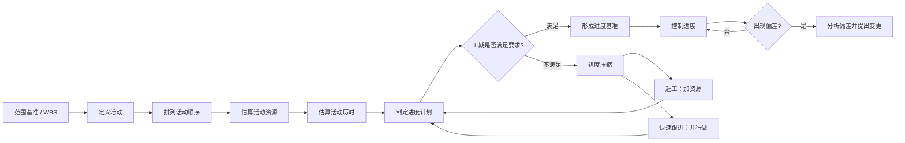
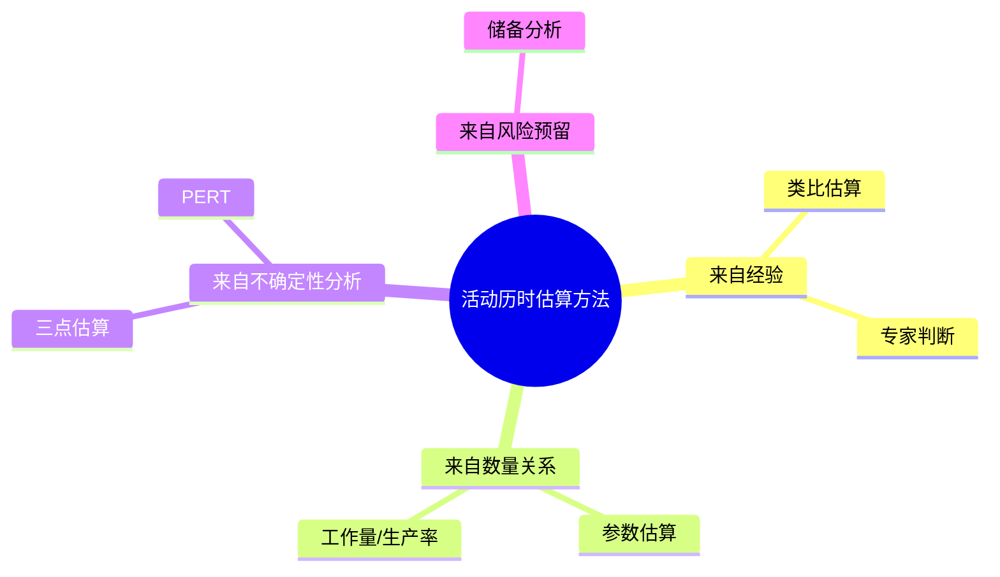
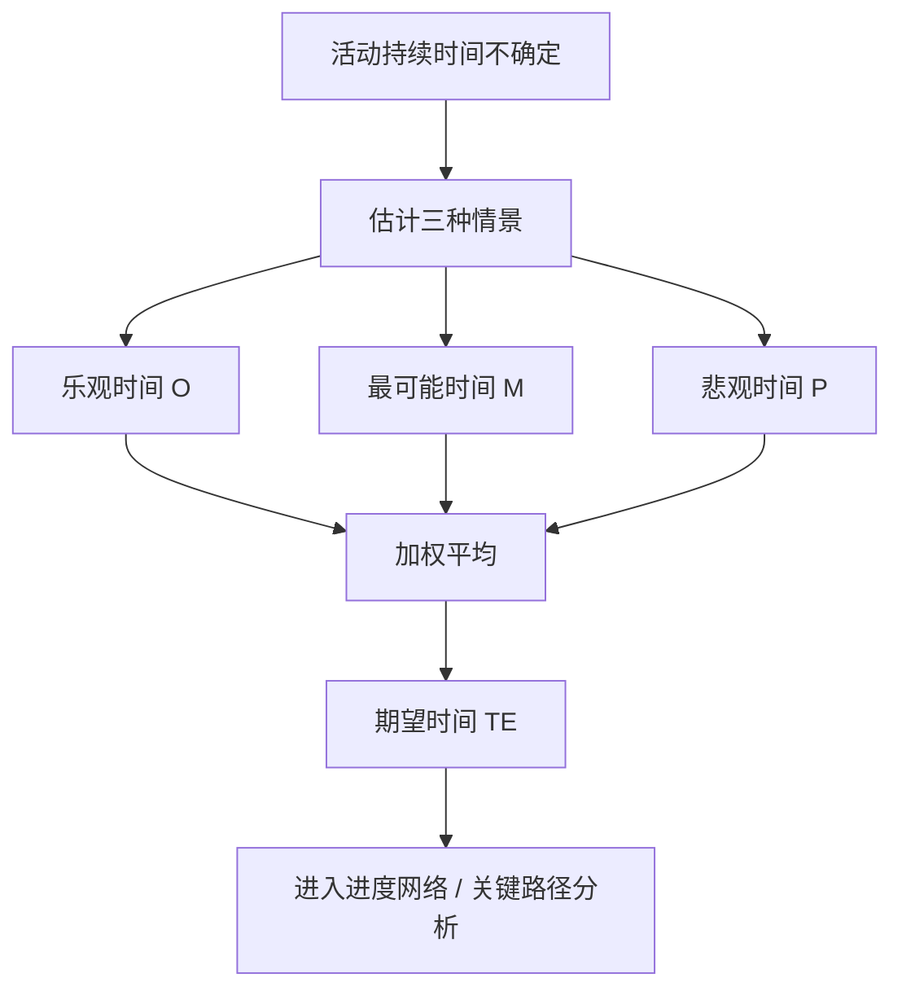
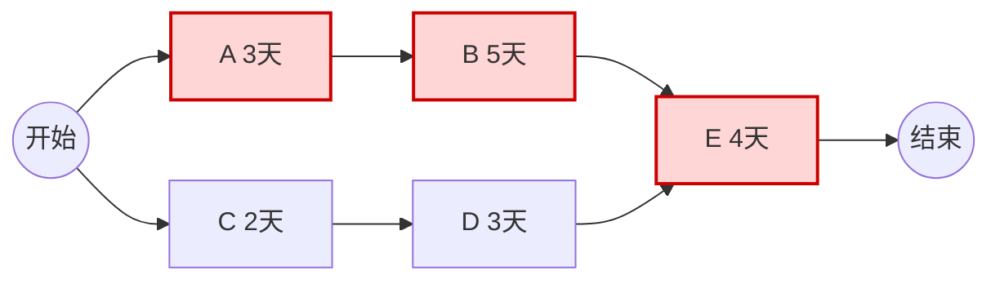
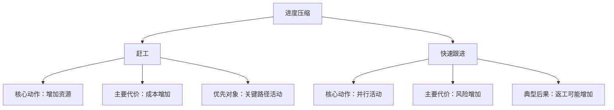
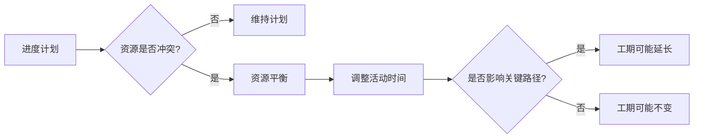

# T007｜PERT、活动历时估算与进度压缩

> 本专题用于学习“项目进度管理”中最容易出选择题、计算题和案例题的一组内容：**活动历时估算、PERT 三点估算、关键路径、赶工、快速跟进、资源平衡与进度控制**。它们不是孤立知识点，而是围绕一个核心问题展开：**当项目工期不确定或进度出现压力时，项目经理如何估算、判断、压缩和控制进度？**

---

## 先看这个专题的主线

进度管理最容易学散，因为它既有概念，又有公式，又有网络图，还会出案例题。真正理解这个专题，要先抓住一条主线：项目经理并不是“凭感觉排日期”，而是先把项目工作拆成活动，再判断活动之间的逻辑关系，估算每个活动需要多久，进而形成进度计划；当计划不能满足目标时，再考虑压缩工期；当执行出现偏差时，再进入控制进度。

这条线可以画成下面这张图：

这张图很重要。它提醒我们：**PERT 不是孤立公式，赶工和快速跟进也不是孤立概念，它们都发生在“制定或调整进度计划”的过程中。** 选择题经常把这些概念拆开问，案例题则经常把它们放在一个混乱的项目情境里让你判断该怎么办。

---

## 活动历时估算：不是估“整个项目”，而是估“具体活动”

**活动历时估算**是进度管理中的关键过程。它关心的是：在已经知道活动范围、资源条件和约束条件的基础上，判断某一项活动从开始到完成大约需要多长时间。

> **[定义｜活动历时估算]** 估算完成单项活动所需工作时段数的过程。这里估算的是**活动持续时间**，不是整个项目工期，也不是工作量本身。
>
> 需要注意：**工作量、资源数量、生产率和持续时间不是同一个概念**。例如，一个活动需要 40 人天工作量，如果投入 2 人，理想情况下持续时间可能是 20 天；如果投入 4 人，可能压缩到 10 天。但现实中还要受到沟通成本、资源熟练度、并行限制等因素影响，不能机械相除。

活动历时估算之所以常考，是因为它连接了“计划”和“现实”。教材中的进度计划看起来像一套顺序流程，但真实项目里的历时往往是不确定的。某些活动有历史数据，可以用类比估算；某些活动工作量和生产率比较清楚，可以用参数估算；某些活动不确定性较高，就适合用三点估算。

为了降低记忆负担，可以把常见估算方法按“数据来源”组织起来：

这张图比单纯背列表更有帮助。你可以这样想：如果题目说“参考以前类似项目”，多半对应**类比估算**；如果题目给出“工作量、生产率、资源数量”等量化关系，多半对应**参数估算**；如果题目给出“最乐观、最可能、最悲观”三个时间，多半对应**三点估算或 PERT**；如果题目强调“考虑进度风险预留”，就会想到**储备分析**。

---

## PERT：用三种情景处理不确定性

PERT 的核心价值不是公式本身，而是它提供了一种处理不确定性的思路。项目活动的持续时间并不总是确定的，尤其在需求不清、技术不熟、外部依赖较多的活动中，一个单一估计值可能过于武断。PERT 要求我们同时考虑三种情景：最好情况、最可能情况、最坏情况。

> **[公式｜PERT 期望时间]**
>
> \[
> T_E = \frac{O + 4M + P}{6}
> \]
>
> 其中，**O** 是乐观时间，表示一切顺利时的最短时间；**M** 是最可能时间，表示正常情况下最可能出现的时间；**P** 是悲观时间，表示不利情况下可能出现的最长时间。
>
> 公式中 **M 的权重是 4**，说明 PERT 并不是简单平均，而是更相信“最可能情况”。

这里有一个非常容易被忽略的重点：**PERT 的计算结果是期望时间，不是承诺时间，也不是最安全时间。** 如果题目问“该活动的期望持续时间是多少”，用 PERT 公式；如果题目问“为了保证更高概率完成，应考虑什么”，则可能要想到风险储备、应急储备或管理储备，而不只是套公式。

PERT 的思维可以画成这样：

这也说明了 PERT 与关键路径之间的关系：PERT 得到的是活动历时估计值，而关键路径法使用这些活动历时和逻辑关系来判断项目总工期与关键活动。**PERT 解决“单个活动可能多久”，关键路径法解决“整个项目最短需要多久、哪些活动不能拖”。**

---

## 关键路径：压缩进度时优先盯住的对象

在进度压缩问题中，**关键路径**是一个绕不开的核心概念。所谓关键路径，是项目进度网络中持续时间最长的路径，它决定了项目的最短工期。关键路径上的活动如果延误，通常会直接导致项目总工期延误；非关键路径上的活动则可能有一定浮动时间。

> **[定义｜关键路径]** 项目网络图中决定项目最短完成时间的路径，通常是总持续时间最长、总浮动时间最小的一条或多条路径。
>
> **这里要特别注意：关键路径可能不止一条。** 当项目存在多条关键路径时，进度风险会增加，因为任何一条关键路径上的活动延误都可能影响项目完工时间。

选择题常常围绕关键路径设置陷阱。比如题目问“赶工时应该优先关注哪些活动”，正确思路是：优先压缩**关键路径上**的活动，而且要综合考虑成本斜率、资源可得性和风险影响。压缩非关键路径活动，往往不能缩短项目总工期，除非压缩后网络结构发生变化。

可以用下面这张图理解关键路径和非关键路径的区别：

上图中，路径 S-A-B-E-F 的持续时间为 3+5+4=12 天；路径 S-C-D-E-F 的持续时间为 2+3+4=9 天。假设其他条件不变，前者就是关键路径。此时即使把 C 或 D 压缩 1 天，项目总工期仍然可能是 12 天；但如果 A 或 B 延误，项目总工期就会受到直接影响。

---

## 进度压缩：赶工和快速跟进的区别要真正理解

进度压缩通常发生在两种情境：一种是计划阶段发现预计工期超过目标，需要重新优化计划；另一种是执行阶段进度落后，需要采取纠偏措施。软考最喜欢考的两个压缩技术是**赶工**和**快速跟进**。

> **[定义｜赶工]** 通过增加资源、增加投入、加班、使用更高效资源等方式压缩活动持续时间，通常会增加成本。赶工一般优先作用于**关键路径活动**。
>
> **[定义｜快速跟进]** 将原本按顺序执行的活动改为部分并行或并行执行，以缩短整体工期，通常会增加风险和返工可能。

这两个概念之所以容易混淆，是因为它们都能“缩短工期”。但它们缩短工期的机制完全不同：**赶工改变的是资源投入，快速跟进改变的是活动逻辑关系。** 赶工像是“给关键活动加人加钱”；快速跟进像是“本来要等设计完全结束再开发，现在设计未完全结束就先开发一部分”。

这里要重点标注：**赶工不等于盲目加人。** 有些活动受到技术顺序、场地、设备、沟通成本限制，即使增加资源也未必能线性缩短时间。软件项目中常说“向延误的软件项目增加人手，可能使项目更加延误”，背后的道理就是沟通成本和学习成本会上升。

同样，**快速跟进也不等于随便并行。** 只有当活动之间存在可以重叠的部分，或者逻辑关系允许调整时，快速跟进才有意义。如果是强制依赖关系，例如“编码前不能进行针对该代码的测试”，就不能简单并行。

---

## 资源平衡：它经常不是压缩工期，而是让计划更可执行

很多同学容易把资源平衡也理解成“优化进度、缩短工期”的手段，但在考试中要谨慎。**资源平衡**的主要目的通常是解决资源过载或资源冲突，让资源使用更平稳、更现实。它可能导致工期延长，尤其当关键路径活动受到资源限制时。

> **[定义｜资源平衡]** 根据资源约束调整活动开始和完成日期，使资源需求不超过资源可用量。它可能改变关键路径，也可能延长项目工期。
>
> **这里要注意：资源平衡不是典型的进度压缩技术。** 它更像是把“纸面上可行但资源上不可行”的计划调整成“资源上可执行”的计划。

可以用一张图理解它的定位：

因此，做题时看到“资源有限”“同一资源被多个活动同时占用”“资源过度分配”时，应优先想到资源平衡；看到“工期必须缩短”“项目要提前完工”时，应优先想到赶工和快速跟进。

---

## 典型题详解与举一反三

下面的例题不是为了刷题数量，而是为了覆盖这个专题的主要考法。每道题后面都安排了“延伸理解”，帮助你把一道题转化为一类题。

---

> **例题 1｜PERT 公式计算**
>
> 某活动的乐观时间为 4 天，最可能时间为 7 天，悲观时间为 16 天。根据 PERT 方法，该活动的期望持续时间是多少？
>
> A. 7 天  
> B. 8 天  
> C. 9 天  
> D. 10 天

这道题考查的是 PERT 最基础的公式。按照公式：

> **[解题过程]**
>
> \[
> T_E = \frac{O + 4M + P}{6} = \frac{4 + 4\times7 + 16}{6} = \frac{48}{6}=8
> \]
>
> 所以答案是 **B**。

这类题的关键不是计算难度，而是识别题干中的三个关键词：**乐观时间、最可能时间、悲观时间**。只要同时出现这三个时间，通常就是三点估算或 PERT。若题目没有说明采用三角分布或贝塔分布，软考中通常按 PERT 加权公式处理。

**延伸理解：** 如果题目问的是“三点估算的简单平均”，公式会变成 \((O+M+P)/3\)。但软考项目管理语境中更常出现的是 PERT 加权平均。你需要记住：**PERT 最可能时间的权重是 4，而不是 1。** 这一点非常适合做一张公式卡和一张陷阱卡。

---

> **例题 2｜PERT 概念辨析**
>
> 关于 PERT 的说法，以下哪项最准确？
>
> A. PERT 使用单一历时估算值，因此适合确定性很高的活动  
> B. PERT 通过乐观、最可能、悲观三个估计值来处理活动历时的不确定性  
> C. PERT 的计算结果就是项目的最终承诺工期  
> D. PERT 只能用于成本估算，不能用于进度估算

正确答案是 **B**。A 错在“单一历时估算值”；C 错在把“期望值”当成“承诺工期”；D 错在 PERT 正是进度估算中常见的技术。

**延伸理解：** 这道题提醒我们，公式只是表层，PERT 的本质是**用概率思维处理不确定性**。如果你只记公式，不理解“为什么有三个时间”，遇到概念题就容易失分。制卡时可以做一张这样的卡：问“PERT 为什么使用三个估计值？”答“因为活动历时存在不确定性，三点估算通过乐观、最可能、悲观三个情景形成加权期望值”。

---

> **例题 3｜赶工与快速跟进**
>
> 项目经理希望缩短项目工期，决定增加关键路径活动的人力投入，并安排部分成员加班。该措施属于：
>
> A. 快速跟进  
> B. 赶工  
> C. 资源平衡  
> D. 范围确认

正确答案是 **B**。题干中的关键词是“增加人力投入”“加班”“关键路径活动”。这些都指向赶工。

快速跟进的关键词通常是“并行”“重叠”“将顺序活动改为并行活动”。资源平衡的关键词通常是“资源冲突”“资源过度分配”“调整活动时间以适应资源限制”。范围确认则属于范围管理，不是进度压缩技术。

**延伸理解：** 这类题可以用“动作—代价”来判断。赶工的动作是**加资源**，代价是**成本增加**；快速跟进的动作是**改逻辑、并行做**，代价是**风险和返工增加**。如果题目问“哪种方法可能增加风险但不一定显著增加成本”，往往是快速跟进；如果题目问“哪种方法通常会增加直接成本”，往往是赶工。

---

> **例题 4｜快速跟进的适用边界**
>
> 下列哪种情况最适合采用快速跟进？
>
> A. 两个活动之间存在不可违反的强制依赖关系  
> B. 后续活动可以在前序活动部分完成后先行开展  
> C. 项目资源已经严重不足，需要减少资源投入  
> D. 项目范围尚未确认，所有活动都应暂停

正确答案是 **B**。快速跟进的核心是让原本顺序进行的活动部分重叠或并行，因此它要求活动之间存在可调整的逻辑空间。

A 错在强制依赖关系通常不能随意并行。C 是资源不足问题，不是快速跟进的典型适用情境。D 涉及范围确认和项目治理，不能简单理解为进度压缩。

**延伸理解：** 快速跟进不是“越并行越好”。它通常会带来返工风险，因为后续活动可能基于尚未完全稳定的前序成果开展。案例题中，如果项目经理未经评估就让设计和开发大面积并行，导致返工增加，就可以指出其问题是：**未充分评估快速跟进带来的风险，缺乏必要的变更与风险应对措施。**

---

> **例题 5｜关键路径与压缩对象**
>
> 项目存在两条路径：路径 1 为 A-B-D，持续时间分别为 3、6、5 天；路径 2 为 A-C-D，持续时间分别为 3、4、5 天。若希望缩短项目总工期，优先应考虑压缩哪个活动？
>
> A. B  
> B. C  
> C. A 或 D  
> D. 任意活动都可以

先计算两条路径：路径 1 的持续时间为 3+6+5=14 天；路径 2 的持续时间为 3+4+5=12 天。因此路径 1 是关键路径。关键路径上的活动是 A、B、D。题目问“优先应考虑压缩哪个活动”，A、B、D 都可能影响总工期；如果选项中只有 B 是只属于关键路径的活动，A 和 D 虽然也在关键路径上，但同时被两条路径共享。

更稳妥的判断是：**不能优先压缩 C，因为 C 在非关键路径上，压缩它通常不能缩短项目总工期。** 本题在给定选项下，最佳答案是 **A**。

**延伸理解：** 真题中如果给出成本斜率，还要进一步比较“压缩 1 天需要增加多少成本”。也就是说，关键路径只是第一层判断，成本效率是第二层判断。案例题里可以写得更完整：先识别关键路径，再分析关键活动的压缩可能性和成本风险，优先选择单位压缩成本低、风险可控的关键路径活动进行赶工。

---

> **例题 6｜资源平衡的后果**
>
> 项目经理发现同一名数据库专家在同一周内被安排到多个关键活动中，资源不可同时满足。项目经理调整了部分活动开始时间，使资源需求不超过可用量。该方法最可能导致什么结果？
>
> A. 一定缩短项目工期  
> B. 一定降低项目范围  
> C. 可能改变关键路径并延长工期  
> D. 消除所有项目风险

正确答案是 **C**。资源平衡的目的是解决资源冲突，而不是直接压缩工期。调整活动时间后，如果被调整的是关键路径活动，项目工期可能延长；如果调整的是有浮动时间的非关键活动，则工期可能不变。

**延伸理解：** 看到“资源冲突”“资源过载”“同一资源不可同时参与多个活动”，要想到资源平衡。看到“缩短工期”，才优先想到赶工或快速跟进。资源平衡常被误认为进度优化技术，但考试里更强调它的现实约束意义：**让计划可执行，代价可能是工期变长。**

---

> **例题 7｜案例题：进度落后如何处理**
>
> 某系统集成项目原计划 6 个月完成。执行到第 4 个月时，项目经理发现多个关键模块开发进度落后，测试团队已开始等待开发交付。客户要求不能推迟上线时间。项目经理准备直接要求所有成员加班，并把尚未完成设计评审的模块交给测试团队提前测试。请指出该做法可能存在的问题，并提出改进措施。

这是一道典型案例题，不能只答“赶工、快速跟进”。题干里的关键信息包括：项目已经落后、关键模块受影响、测试团队等待、客户要求不延期、项目经理打算加班、未完成设计评审就提前测试。这里既涉及进度压缩，也涉及质量、风险、变更和沟通。

> **[答题思路]**
>
> 先判断问题：项目经理采取赶工和快速跟进的思路本身可能合理，但做法过于粗糙。**直接要求所有成员加班**没有识别关键路径和关键活动，也没有评估成本、质量和人员负荷；**未完成设计评审就提前测试**可能带来返工和质量风险；如果涉及进度基准变化，还应走变更控制流程。

可以从以下角度组织答案，但不要机械堆列表。先说“诊断”，再说“压缩”，最后说“控制”。

项目经理应首先重新评估当前进度状态，识别关键路径、关键活动和实际偏差，确认哪些活动真正影响总工期。随后对关键路径活动分析是否适合赶工，例如增加关键资源、安排有经验人员支援、适度加班，但要评估新增成本、人员疲劳和质量风险。对于可以重叠的活动，可以考虑快速跟进，但必须明确前置成果的成熟度、接口边界和返工预案，不能在设计评审尚未完成且风险不可控的情况下盲目提前测试。同时，应更新进度计划，必要时提交变更请求，评估对成本、质量、范围和风险的影响，并与客户和相关干系人沟通调整方案。最后，要加强进度跟踪和质量控制，避免为了赶工牺牲必要评审和测试质量。

**延伸理解：** 下午案例题最忌讳只写术语。你要把术语放回管理动作中：不是写“赶工、快速跟进、资源平衡”就结束，而是说明**先识别关键路径，再选择压缩手段，再评估成本与风险，再更新计划并沟通控制**。这类题非常适合转化为“案例模板卡”。

---

## 这个专题应该怎样转化为 Anki 卡片

这个专题的制卡重点不在于把全文切碎，而是围绕高频考点建立几类卡。

**概念卡**适合处理 PERT、关键路径、赶工、快速跟进、资源平衡等定义。定义卡的答案要短，但最好附一行解释，避免只背名词。

**辨析卡**是本专题最重要的卡型。赶工 vs 快速跟进、PERT vs 简单平均、关键路径活动 vs 非关键路径活动、资源平衡 vs 进度压缩，这些都值得做成辨析卡。

**公式卡**要包含公式、符号含义和一个最小例子。PERT 卡不能只写公式，否则复习时容易记住形式却忘记适用条件。

**题型卡**可以从例题中转化。例如“题干出现乐观、最可能、悲观三个时间时，应想到什么方法？”“题干出现增加资源、加班、关键路径时，应想到什么压缩技术？”这类卡能帮助你把知识和题目关键词连接起来。

**案例模板卡**应该围绕“进度落后如何处理”建立。答案不要背大段文字，而应背组织框架：**诊断偏差 → 识别关键路径 → 选择压缩手段 → 评估成本/质量/风险 → 走变更控制 → 沟通并跟踪**。

---

## 本专题的最小掌握标准

学完本专题后，你至少应该能做到五件事。

第一，看到乐观、最可能、悲观时间，能立即判断是否使用 PERT，并正确计算期望时间。第二，能解释 PERT 为什么不是简单平均，以及为什么最可能时间权重更高。第三，能根据网络路径判断关键路径，并知道压缩非关键路径通常不能缩短总工期。第四，能清楚区分赶工、快速跟进和资源平衡：**赶工加资源，快速跟进改逻辑，资源平衡调资源冲突**。第五，面对进度落后的案例，能按“先分析、再压缩、再评估、再变更、再沟通控制”的顺序组织答案。

如果这五件事都能做到，这个专题就不是“看过了”，而是已经具备了应对选择题、计算题和案例题的基础。
