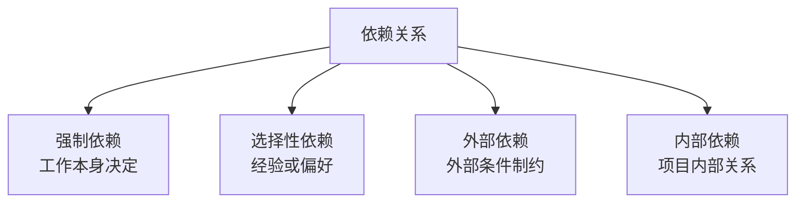

# 04｜真题考法与题目映射索引（深度样例）

> 本文件以题目为单位，拆出考点、陷阱、专题映射、讲义延伸和制卡方向。真实执行时，应覆盖全部真题和题库。它的作用是防止专题树只像教材目录，而不反映真实考法。

## C01-Q1｜快速跟进定义题

> 快速跟进是指：  
> A. 采用平行任务加速项目进展  
> B. 用一个任务取代另外的任务  
> C. 如有可能减少任务数量  
> D. 以上都不是

- **来源**：2020 选择试题，第 1 页第 1 题。
- **题型**：定义识别 / 概念辨析。
- **正确答案**：A。
- **主专题**：T-SCH-010｜赶工、快速跟进与进度压缩决策。
- **关联专题**：T-SCH-003 活动排序；T-SCH-004 提前量/滞后量；T-RISK-003 风险应对。

**考点拆解**：快速跟进的关键词是“平行、并行、重叠执行”。它不减少范围，不替代任务，而是让原本顺序活动出现部分重叠。

**选项分析**：A 符合定义；B 是替代任务，可能涉及方案变化；C 是减少任务数量，可能涉及范围减少；D 不成立。

**讲义延伸**：本题可引出“进度压缩的两条路”：赶工是加资源，快速跟进是改顺序。快速跟进看似不增加直接成本，但主要代价是返工和协调风险。

**制卡方向**：快速跟进定义卡；快速跟进为什么增加风险；快速跟进 vs 赶工辨析卡。

---

## C01-Q2｜赶工关注关键路径题

> 赶工一个任务时，你应该注重：  
> A. 尽可能多的任务  
> B. 非关键任务  
> C. 加速执行关键路径上的任务  
> D. 通过成本最低化加速执行任务

- **来源**：2020 选择试题，第 1 页第 2 题。
- **题型**：概念应用 / 决策规则。
- **正确答案**：C。
- **主专题**：T-SCH-010。
- **关联专题**：T-SCH-005｜关键路径、总时差与自由时差。

**考点拆解**：项目总工期由关键路径决定。赶工若作用于非关键活动，往往只是增加时差，不会缩短项目完成时间。

**选项分析**：A 会浪费资源；B 通常无效；C 正确；D 有迷惑性，成本需要考虑，但不是首要判断，首要判断是是否能缩短总工期。

**讲义延伸**：压缩关键路径后，关键路径可能发生变化，所以进度压缩不是一次性动作，需要重新计算和监控。

**制卡方向**：赶工为什么应压缩关键路径；非关键路径压缩为何通常不缩短工期。

---

## C01-Q3｜硬逻辑依赖题

> “在对软件编码前我不能实行软件测试”说明哪种依赖关系？  
> A. 随意的  
> B. 软逻辑关系  
> C. 优先  
> D. 强制或硬逻辑关系

- **来源**：2020 选择试题，第 1 页第 3 题。
- **题型**：场景判断 / 概念辨析。
- **正确答案**：D。
- **主专题**：T-SCH-003｜活动排序、强制依赖、选择性依赖、外部依赖。
- **关联专题**：T-SCH-004 网络图；T-SW-001 软件开发方法。

**考点拆解**：测试依赖编码产物，这种先后关系来自工作本身的内在逻辑，属于强制依赖。

**讲义延伸**：不是所有先后关系都是强制依赖。强制依赖来自客观限制，选择性依赖来自经验或偏好，外部依赖来自项目外部因素。

**建议图示**：

**制卡方向**：强制依赖定义卡；强制依赖 vs 选择性依赖辨析卡。

---

## C01-Q5｜活动历时公式题

> 以下哪个公式能最准确地计算活动历时？  
> A. 活动历时 = 工作数量 / 生产率  
> B. 活动历时 = 工作数量 / 资源数量  
> C. 活动历时 = 生产率 / 工作数量  
> D. 活动历时 = 生产率 × 工作数量 / 资源数量

- **来源**：2020 选择试题，第 2 页第 5 题。
- **题型**：公式理解 / 参数估算。
- **正确答案**：A。
- **主专题**：T-SCH-007｜活动历时估算。
- **关联专题**：T-SCH-006 资源估算；T-COST-002 成本估算。

**考点拆解**：活动历时的基础估算思想是：完成一定工作量需要多少时间，取决于生产率。生产率越高，时间越短。

**选项分析**：A 合理；B 把资源数量误当生产率；C 单位逻辑不合理；D 混合变量没有合理意义。

**讲义延伸**：这道题可引出参数估算。资源增加不一定线性提高生产率，因为存在沟通成本、工作不可分割和资源能力差异。

**制卡方向**：活动历时基础公式；资源数量为什么不等于生产率。

---

## C01-Q8｜进度压缩潜在问题题

> 压缩项目进度，会产生下列潜在问题，但哪项除外？  
> A. 范围增加  
> B. 成本增加  
> C. 风险增加  
> D. 降低风险

- **来源**：2020 选择试题，第 2 页第 8 题。
- **题型**：错误选项 / 影响判断。
- **正确答案**：D。
- **主专题**：T-SCH-010。
- **关联专题**：T-RISK-003 风险应对；T-INT-005 变更控制。

**考点拆解**：压缩进度通常会带来成本上升、风险增加、质量风险或返工风险，不会自然降低风险。

**讲义延伸**：赶工和快速跟进都可能改变项目风险暴露。如果压缩进度导致进度基准或成本基准变化，应走整体变更控制。

**制卡方向**：进度压缩常见影响；快速跟进为什么增加风险；赶工为什么增加成本。

---

## C02-Q-PMO｜PMO 是否能成为关键决策者

> 下列都是 PMO 的正确说法，除了：  
> A. PMO 中的 P 可指 Project / Program / Portfolio  
> B. PMO 任务范围很广，但不能充当关键的决策人  
> C. PMO 注重项目统一规划和优先顺序  
> D. PMO 识别与提出项目管理方法、最佳实践和标准

- **来源**：系统集成项目管理工程师试题库，第 1 页。
- **题型**：错误说法 / 概念辨析。
- **正确答案**：B。
- **主专题**：T-PM-021｜PMO 的职责、权限与常见错误说法。

**考点拆解**：PMO 的权力取决于组织授权。它可以从支持、培训、模板，到集中配置管理、风险库管理、项目工具管理、跨项目资源协调，甚至在授权情况下成为关键决策者。

**讲义延伸**：适合讲支持型、控制型、指令型 PMO 的梯度。不要把 PMO 理解为“只做文档模板的办公室”。

**制卡方向**：PMO 是否可以成为关键决策者；PMO 常见职责。

---

## C02-Q-PDCA｜过程组与 PDCA

> 下列关于过程组和 PDCA 循环的关系都正确，除了：  
> A. 规划过程组对应 Plan  
> B. 执行过程组对应 Do  
> C. 控制过程组对应 Check/Act  
> D. 收尾过程组对应 Act

- **来源**：系统集成项目管理工程师试题库，第 1 页。
- **题型**：错误说法 / 过程组辨析。
- **正确答案**：D。
- **主专题**：T-PM-012｜五大过程组与 PDCA 的关系。
- **关联专题**：T-PM-013｜过程组不是项目阶段。

**考点拆解**：Act 更接近监控过程中的纠正和调整，不是项目收尾。收尾过程组不能机械对应 PDCA 的 A。

**讲义延伸**：PDCA 是循环思想，过程组是项目管理活动组织方式。二者可以对应，但不能强行一一映射。

**制卡方向**：PDCA 与过程组对应关系；为什么收尾不对应 Act。

---

## C02-Q-WBS｜创建 WBS 属于哪个过程组

> “制定工作分解结构”属于哪个过程组？  
> A. 计划  
> B. 实施  
> C. 控制  
> D. 收尾

- **来源**：系统集成项目管理工程师试题库，第 3 页。
- **题型**：过程归属。
- **正确答案**：A。
- **主专题**：T-SCOPE-004｜WBS、工作包、WBS 字典与范围基准。
- **关联专题**：T-PM-013；T-SCH-002。

**考点拆解**：创建 WBS 属于规划过程组，因为它用于明确项目范围和可交付成果，为后续活动定义、成本估算、资源安排提供基础。

**讲义延伸**：本题不能只背“规划”。应解释 WBS 为什么在执行前完成：项目必须先明确交付什么，才能安排怎样做。

**制卡方向**：创建 WBS 属于哪个过程组；WBS 为什么是规划工作。

---

## 案例索引样例｜变更管理失控

> 某项目中，客户在开发过程中多次提出新需求，项目经理为维护客户关系口头答应，并安排开发人员修改；项目进度逐渐延误，成本增加，验收时客户认为仍有功能未完成，团队内部也找不到完整变更记录。

- **题型**：案例 / 问题识别 / 原因分析 / 措施题。
- **主专题**：T-CASE-011｜变更管理案例。
- **关联专题**：T-INT-005、T-SCOPE-006、T-CFG-001、T-COM-002。

**可识别问题**：

项目没有建立或遵守变更控制流程；需求变更没有书面记录；项目经理擅自答应客户变更；未评估变更对范围、进度、成本、质量、风险的影响；未提交 CCB 或授权机制审批；未更新项目计划和基准；缺少配置管理和版本记录；与干系人对验收标准沟通不足。

**答题组织**：

第一段识别管理问题：缺乏规范的整体变更控制和范围管理。  
第二段说明影响：导致范围蔓延、进度延误、成本增加、验收标准不清。  
第三段提出措施：变更书面化、影响分析、CCB 审批、更新计划和基准、实施验证、沟通归档。

**制卡方向**：客户口头提出需求变更如何处理；变更管理案例常见问题；整体变更控制流程。
