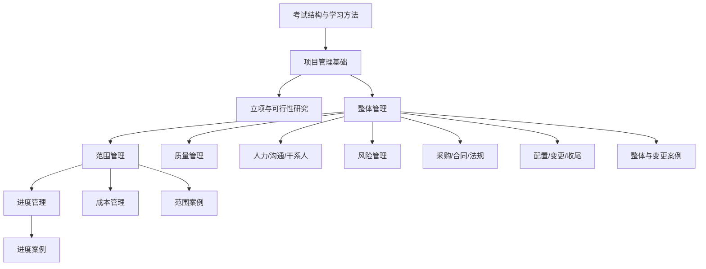

# 05｜全量专题生成清单与依赖路径（深度样例）

> 本文件不是候选池，而是全量专题生成的执行清单。真实执行时，专题树中的每个叶节点都应进入本清单。这里展示如何组织生成顺序、依赖关系和专题产出要求。

## 总体学习路径

专题生成顺序不应机械等同教材顺序。更好的策略是：先生成全局框架，再生成项目管理基础，再生成整体管理这条主线，然后依次生成范围、进度、成本、质量、人力沟通、风险、采购合同、配置变更和案例专题。

## 第一批｜全局框架专题

### G01｜T-META-001｜考试结构、上午选择题与下午案例题的能力差异

- **依赖**：无。
- **支撑**：所有专题。
- **来源**：报考须知、案例分析材料、真题结构。
- **生成重点**：讲清上午题偏识别、辨析、计算；下午题偏问题诊断、原因分析、措施表达。
- **图示要求**：上午/下午能力结构对比图。
- **例题要求**：用一个选择题和一个案例片段展示能力差异。

### G02｜T-META-ANKI-001｜软考 Anki 制卡与复习原则

- **依赖**：G01。
- **支撑**：所有专题末尾制卡建议。
- **来源**：间隔重复、SuperMemo 规则。
- **生成重点**：先理解再制卡；卡片原子化；避免大列表；真题错因回流制卡。
- **图示要求**：专题→题解→制卡→复习→错题回炉闭环图。

## 第二批｜项目管理基础专题

### PM01｜T-PM-001｜项目的临时性、独特性与渐进明细

- **依赖**：G01。
- **支撑**：生命周期、项目管理计划、变更控制。
- **来源**：官方教程、口诀材料。
- **生成重点**：临时性不是工期短；独特性不是完全新颖；渐进明细解释为什么计划会逐步细化。
- **图示要求**：项目特征三角图。

### PM02｜T-PM-012｜五大过程组与 PDCA 的关系

- **依赖**：PM01。
- **支撑**：所有过程组归属题。
- **来源**：PDCA 真题、官方教程。
- **生成重点**：规划对应 Plan，执行对应 Do，监控对应 Check/Act，收尾不对应 Act。
- **图示要求**：PDCA 与过程组关系图。
- **例题要求**：必须详解 PDCA 错误说法题。

### PM03｜T-PM-013｜过程组不是项目阶段

- **依赖**：PM02。
- **支撑**：范围、进度、成本等所有过程理解。
- **来源**：题库过程组题。
- **生成重点**：每个项目阶段都可能重复五大过程组；过程组可以跨阶段相互影响。
- **图示要求**：项目阶段内重复过程组图。

### PM04｜T-PM-021｜PMO 的职责、权限与常见错误说法

- **依赖**：PM01。
- **支撑**：组织结构、项目治理。
- **来源**：PMO 真题。
- **生成重点**：PMO 可支持、控制或直接管理项目；授权情况下可成为关键决策者。
- **图示要求**：支持型—控制型—指令型 PMO 梯度图。

## 第三批｜立项与可行性研究专题

### FEA01｜T-FEA-001｜可行性研究的目的、阶段与基本内容

- **依赖**：PM01。
- **支撑**：项目章程、商业论证、立项类选择题。
- **来源**：知识点精华、口诀材料。
- **生成重点**：可研围绕项目是否值得做，包含技术、经济、运行环境、法律社会可行性。
- **图示要求**：四类可行性象限图。

### FEA02｜T-FEA-002｜可行性研究七步法

- **依赖**：FEA01。
- **支撑**：前期调研不足案例。
- **来源**：知识点精华、口诀材料。
- **生成重点**：确定目标、研究现行系统、建立逻辑模型、比较方案、推荐方案、编写并递交报告。
- **图示要求**：七步流程图。
- **制卡倾向**：流程挖空卡。

### FEA03｜T-FEA-012｜项目评估与可行性论证的区别

- **依赖**：FEA01。
- **支撑**：立项辨析题。
- **来源**：知识点精华。
- **生成重点**：主体、立足点、侧重点、作用、先后顺序。
- **图示要求**：双流程对照图，不要大表堆砌。

## 第四批｜整体管理专题

### INT01｜T-INT-001｜整体管理主线

- **依赖**：PM02、PM03。
- **支撑**：所有管理知识域和案例专题。
- **来源**：B01-P1、D01-P2。
- **生成重点**：章程授权，计划整合，执行产生成果和信息，监控发现偏差，变更控制协调影响，收尾完成移交。
- **图示要求**：整体管理信息流图。
- **例题要求**：项目计划实施输出、配置管理与变更控制相关题。

### INT02｜T-INT-002｜项目章程

- **依赖**：INT01、FEA01。
- **支撑**：项目启动、项目经理授权。
- **来源**：B01-P1、口诀材料。
- **生成重点**：正式批准项目；授权项目经理；由项目外部发起人或资助人发布；包含商业需求、里程碑、概要预算、假设约束等。
- **图示要求**：发起人→章程→项目经理授权图。

### INT03｜T-INT-003｜项目管理计划

- **依赖**：INT01。
- **支撑**：范围、进度、成本、质量、风险等分计划。
- **来源**：B01-P1、口诀材料。
- **生成重点**：项目管理计划不是进度计划，而是综合计划体系。
- **图示要求**：分计划汇入总计划图。

### INT04｜T-INT-005｜整体变更控制与 CCB

- **依赖**：INT01、INT03。
- **支撑**：范围蔓延、进度失控、配置管理、合同变更、案例题。
- **来源**：B01-P1、D01-P2、口诀材料。
- **生成重点**：变更请求、影响分析、CCB 决策、实施、验证、更新、沟通归档。
- **图示要求**：变更控制流程图。
- **例题要求**：至少包含 CCB 职责题和变更批准后项目经理行动题。

## 第五批｜范围管理专题

### SCOPE01｜T-SCOPE-001｜范围管理基本逻辑

- **依赖**：INT03。
- **支撑**：WBS、活动定义、范围蔓延案例。
- **来源**：B01-P2。
- **生成重点**：需求转化为范围，范围转化为 WBS，WBS 支撑进度成本，范围控制防止蔓延。
- **图示要求**：范围管理闭环图。

### SCOPE02｜T-SCOPE-004｜WBS、工作包、WBS 字典与范围基准

- **依赖**：SCOPE01。
- **支撑**：进度活动定义、成本估算、范围案例。
- **来源**：B01-P2、WBS 真题。
- **生成重点**：WBS 面向可交付成果；工作包是最低层可管理单元；范围基准包括范围说明书、WBS、WBS 字典。
- **图示要求**：WBS 层级图。
- **例题要求**：创建 WBS 属于规划过程组；WBS 与活动清单区别。

### SCOPE03｜T-SCOPE-006｜范围蔓延

- **依赖**：SCOPE01、INT04。
- **支撑**：案例专题。
- **来源**：B01-P2、D01。
- **生成重点**：未经控制的需求增加；范围基准缺失；变更流程缺失；干系人沟通不足；应对措施。
- **图示要求**：范围蔓延因果链。
- **案例要求**：至少一个需求变化案例片段。

## 第六批｜进度管理专题

### SCH01｜T-SCH-001｜进度管理总览

- **依赖**：SCOPE02。
- **支撑**：全部进度专题。
- **来源**：B01-P3。
- **生成重点**：范围基准→活动→网络图→资源与历时→进度计划→进度控制。
- **图示要求**：进度管理总流程图。

### SCH02｜T-SCH-003｜活动排序与依赖关系

- **依赖**：SCH01。
- **支撑**：网络图、快速跟进。
- **来源**：B01-P3、C01-Q3。
- **生成重点**：强制依赖、选择性依赖、外部依赖、内部依赖。
- **图示要求**：依赖关系分类图。
- **例题要求**：编码前不能测试 = 强制依赖。

### SCH03｜T-SCH-005｜关键路径、总时差与自由时差

- **依赖**：SCH02。
- **支撑**：赶工、进度控制、案例。
- **来源**：B01-P3、C01-Q2。
- **生成重点**：关键路径决定总工期；压缩关键路径才可能缩短项目；关键路径可能变化。
- **图示要求**：网络图高亮关键路径。

### SCH04｜T-SCH-007｜活动历时估算方法

- **依赖**：SCH01。
- **支撑**：PERT、储备分析。
- **来源**：B01-P3、C01-Q5。
- **生成重点**：类比、参数、自下而上、三点估算；活动历时 = 工作数量 / 生产率。
- **图示要求**：估算方法选择图。

### SCH05｜T-SCH-008｜PERT 期望时间、标准差与典型计算题

- **依赖**：SCH04。
- **支撑**：进度风险、关键路径概率理解。
- **来源**：B01-P3、C01-Q12。
- **生成重点**：O/M/P；TE = (O + 4M + P) / 6；标准差；典型计算；PERT 与 CPM。
- **图示要求**：三点估算分布图。
- **例题要求**：不少于 5 道，至少 2 道计算、2 道概念辨析、1 道综合延伸。

### SCH06｜T-SCH-010｜赶工、快速跟进与进度压缩决策

- **依赖**：SCH03、SCH04。
- **支撑**：进度控制案例、风险管理、变更管理。
- **来源**：C01-Q1、C01-Q2、C01-Q8、B01-P3。
- **生成重点**：赶工、快速跟进、关键路径、成本和风险影响、变更控制。
- **图示要求**：进度压缩决策图。
- **例题要求**：不少于 4 道，每道都要题后延伸。

### SCH07｜T-SCH-011｜进度控制与进度失控案例

- **依赖**：SCH03、SCH06、INT04。
- **支撑**：案例专题。
- **来源**：B01-P3、D01。
- **生成重点**：绩效审查、偏差分析、进度报告、纠偏措施、基准变更。
- **图示要求**：进度控制闭环图。
- **案例要求**：必须包含一个完整案例片段和答题模板。

## 第七批｜成本与挣值专题

### COST01｜T-COST-010｜PV、EV、AC

- **依赖**：成本管理总览。
- **支撑**：CV/SV/CPI/SPI/EAC。
- **来源**：成本管理资料、真题。
- **生成重点**：PV 是计划工作的预算价值，EV 是已完成工作的预算价值，AC 是实际成本。
- **图示要求**：PV/EV/AC 曲线。
- **例题要求**：不少于 4 道。

### COST02｜T-COST-011｜CV、SV、CPI、SPI

- **依赖**：COST01。
- **支撑**：成本案例。
- **来源**：成本管理资料、真题。
- **生成重点**：CV = EV - AC；SV = EV - PV；CPI = EV / AC；SPI = EV / PV；正负号和大于小于 1 的判断。
- **图示要求**：偏差判断四象限图。

## 第八批｜案例专题

### CASE01｜T-CASE-001｜案例题通用阅读法

- **依赖**：G01。
- **支撑**：全部案例专题。
- **来源**：D01-P1。
- **生成重点**：先看问题，带着问题读背景，标证据，组织答案。
- **图示要求**：案例阅读流程图。

### CASE02｜T-CASE-011｜变更管理案例

- **依赖**：INT04、SCOPE03、配置管理专题。
- **来源**：D01、E01、B01-P1。
- **生成重点**：需求变化、口头变更、基准失控、CCB 缺失、文档缺失、验收争议。
- **图示要求**：变更失控因果链。
- **例题要求**：至少 2 个案例片段，一个偏客户需求变化，一个偏内部技术变更。

### CASE03｜T-CASE-012｜进度失控案例

- **依赖**：SCH07、INT04、沟通专题。
- **来源**：B01-P3、D01。
- **生成重点**：估算不足、关键路径未监控、资源冲突、进度报告不足、纠偏措施。
- **图示要求**：进度失控因果链。

### CASE04｜T-CASE-013｜范围蔓延案例

- **依赖**：SCOPE03、INT04、沟通专题。
- **来源**：B01-P2、D01。
- **生成重点**：需求未确认、范围基准缺失、口头变更、验收标准不清、应对措施。
- **图示要求**：范围蔓延闭环图。
