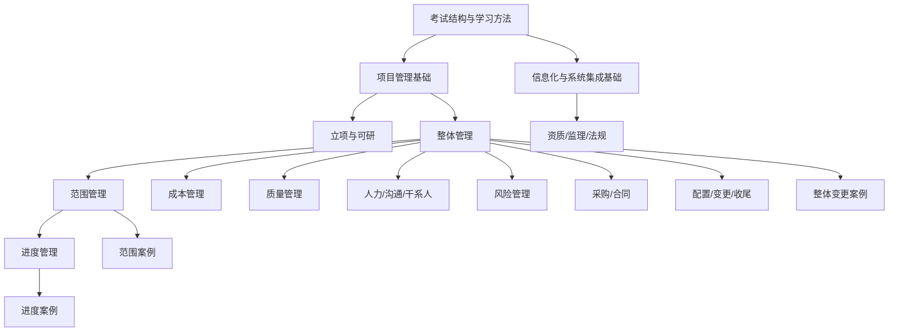

# 05_全量专题生成清单与依赖路径

## 全局路径图

## 第一批｜全局与方法专题

### G01｜T-META-001｜考试结构、上午题与下午案例题的能力差异

- **依赖**：无
- **后续支撑**：全部专题
- **材料来源**：报考须知，`总结经典` P1-P2
- **生成重点**：上午/下午能力差异，案例答题基本流程
- **建议图示**：能力差异图
- **典型题要求**：1 个选择题 + 1 个案例方法片段
- **是否需要计算**：否
- **是否需要案例模板**：是
- **是否适合 Anki**：适合提醒卡

### G02｜T-META-ANKI-001｜软考专题到 Anki 的转化原则

- **依赖**：G01
- **后续支撑**：全部专题的制卡方向
- **材料来源**：Anki / SuperMemo / 间隔重复资料
- **生成重点**：先理解再制卡，原子化，错题回流
- **建议图示**：学习闭环图
- **典型题要求**：不需要真题，需给制卡反例
- **是否需要计算**：否
- **是否需要案例模板**：否
- **是否适合 Anki**：本身就是元规则

## 第二批｜信息化与基础专题

### INF01｜T-INFO-001｜信息、信息化、信息系统与信息系统生命周期

- **依赖**：G01
- **后续支撑**：T-INFO-002 T-INFO-003
- **材料来源**：C03-Q7，B01-P11
- **生成重点**：信息系统生命周期与项目生命周期区分
- **建议图示**：多生命周期对照图
- **是否需要计算**：否

### INF02｜T-INFO-002｜ERP、CRM、SCM、EAI、BI 的对象、边界与常见混淆

- **依赖**：INF01
- **后续支撑**：企业应用辨析题
- **材料来源**：C03-Q4-Q6，B01-P11，E01
- **生成重点**：对象、业务焦点、混淆点
- **建议图示**：企业运营分层图
- **典型题要求**：至少 4 道辨析题

### INF03｜T-INFO-003｜信息系统工程监理：职责边界、四控三管一协调与错误说法

- **依赖**：INF01
- **后续支撑**：资质、法规专题
- **材料来源**：C03-Q9，E02-P2，E01
- **生成重点**：能做什么、不能做什么、监理资质
- **建议图示**：三方关系图

### INF04｜T-INFO-004｜结构化方法、原型法、面向对象方法与典型适用场景

- **依赖**：INF01
- **后续支撑**：软件工程基础辨析题
- **材料来源**：C03-Q10-Q11，B01-P12
- **生成重点**：特点、适用情境、错误说法

### INF05｜T-INFO-005｜软件测试计划阶段、黑盒/白盒测试与常见考法

- **依赖**：INF04
- **后续支撑**：软件工程基础题
- **材料来源**：B01-P12-P13
- **生成重点**：测试计划阶段、黑白盒方法

## 第三批｜项目管理基础与立项专题

### PM01｜T-PM-001｜项目特性、项目目标特性与项目生命周期

- **依赖**：G01
- **后续支撑**：T-PM-002 T-INT-002
- **材料来源**：E01，B02-第5章
- **生成重点**：临时性/独特性/渐进明细，目标特性

### PM02｜T-PM-002｜五大过程组、PDCA、项目阶段三者的关系

- **依赖**：PM01
- **后续支撑**：全部管理域专题
- **材料来源**：C02-Q-PDCA/Q-阶段，E01
- **生成重点**：过程组不是阶段，收尾不对应 Act
- **建议图示**：阶段与过程组叠加图

### PM03｜T-PM-003｜PMO 的职责、授权梯度与常见错误说法

- **依赖**：PM01
- **后续支撑**：组织治理题
- **材料来源**：C02-Q-PMO，B02-第19章
- **生成重点**：授权梯度、关键决策权

### FEA01｜T-FEA-001｜可行性研究的内容、七步法与初步/详细可研

- **依赖**：PM01
- **后续支撑**：T-FEA-002 T-INT-002
- **材料来源**：B02-P1，E01
- **生成重点**：内容、步骤、初步/详细可研
- **建议图示**：七步流程图

### FEA02｜T-FEA-002｜项目论证与项目评估：主体、立足点、依据与先后顺序

- **依赖**：FEA01
- **后续支撑**：立项辨析题
- **材料来源**：B02-P1-P2，E01
- **生成重点**：论证 vs 评估
- **建议图示**：双列对照图

## 第四批｜整体、范围、进度主线专题

### INT01｜T-INT-001｜整体管理主线

- **依赖**：PM02
- **后续支撑**：范围/进度/成本/质量/风险/采购/收尾
- **材料来源**：B01-P1，D01-P3
- **生成重点**：章程→计划→执行→监控→变更→收尾
- **建议图示**：信息流图

### INT02｜T-INT-002｜项目章程与工作说明书 SOW

- **依赖**：INT01 FEA01
- **后续支撑**：计划、范围、风险
- **材料来源**：B02-第5章，E01，C02-Q4
- **生成重点**：章程作用、发布者、SOW 来源

### INT03｜T-INT-003｜项目管理计划、工作绩效信息与项目基准

- **依赖**：INT01
- **后续支撑**：所有控制类专题
- **材料来源**：B01-P1，E01
- **生成重点**：总计划体系、绩效信息

### INT04｜T-INT-004｜整体变更控制与 CCB：决策、授权、流程、批准后更新

- **依赖**：INT01 INT03
- **后续支撑**：范围蔓延、配置管理、收尾案例
- **材料来源**：B01-P1，E01，C04-Q22/Q26
- **生成重点**：流程、CCB、批准后更新
- **建议图示**：变更控制流程图
- **典型题要求**：至少 3 道
- **是否需要案例模板**：是

### SCP01｜T-SCOPE-001｜范围管理逻辑：需求、范围、WBS、验收、控制

- **依赖**：INT03
- **后续支撑**：T-SCOPE-002 T-SCOPE-003 T-SCH-001
- **材料来源**：B01-P2，B02-P5
- **生成重点**：范围管理闭环

### SCP02｜T-SCOPE-002｜WBS、工作包、WBS 字典与范围基准

- **依赖**：SCP01
- **后续支撑**：进度、成本、RAM、案例题
- **材料来源**：B01-P2，B02-P6，E01，C02-Q-WBS
- **生成重点**：WBS 作用、范围基准
- **建议图示**：WBS 树图

### SCP03｜T-SCOPE-003｜范围确认、范围控制、产品范围 vs 项目范围、范围蔓延

- **依赖**：SCP01 INT04
- **后续支撑**：案例专题
- **材料来源**：B01-P2，D01-P4，E01
- **生成重点**：范围蔓延原因与措施
- **是否需要案例模板**：是

### SCH01｜T-SCH-001｜进度管理总览：从 WBS 到进度基准

- **依赖**：SCP02
- **后续支撑**：全部进度专题
- **材料来源**：B01-P3，B02-第7章
- **生成重点**：进度总流程

### SCH02｜T-SCH-002｜活动排序、依赖关系、PDM/AON、AOA 与提前量/滞后量

- **依赖**：SCH01
- **后续支撑**：T-SCH-003 T-SCH-005
- **材料来源**：B01-P3，C01-Q3/Q4/Q6/Q9
- **生成重点**：依赖关系与图示法
- **建议图示**：网络图样例

### SCH03｜T-SCH-003｜关键路径、总时差、自由时差与网络图判断

- **依赖**：SCH02
- **后续支撑**：T-SCH-005
- **材料来源**：B02-第7章，D01-P5-P6，C01-Q2
- **生成重点**：关键路径判断
- **是否需要计算**：是

### SCH04｜T-SCH-004｜活动历时估算、参数估算、三点估算与 PERT

- **依赖**：SCH01
- **后续支撑**：进度计算题
- **材料来源**：B01-P3，C01-Q5/Q12，E01
- **生成重点**：公式、变量、估算思想
- **是否需要计算**：是

### SCH05｜T-SCH-005｜赶工、快速跟进、进度压缩与进度控制案例

- **依赖**：SCH02 SCH03 SCH04 INT04
- **后续支撑**：风险、变更、案例专题
- **材料来源**：C01-Q1/Q2/Q8，B02-P8-P10，E01
- **生成重点**：压缩工期决策、风险与成本
- **建议图示**：进度压缩决策图
- **典型题要求**：至少 4 道
- **是否需要案例模板**：是

## 第五批｜成本、质量、人力沟通专题

### CST01｜T-COST-001｜成本估算、成本预算、成本基准与成本失控原因

- **依赖**：SCP02
- **后续支撑**：CST02
- **材料来源**：B01-P4，B02-P11/P13，D01-P7-P8
- **生成重点**：估算-预算-控制主线

### CST02｜T-COST-002｜挣值管理：PV/EV/AC、CV/SV/CPI/SPI

- **依赖**：CST01
- **后续支撑**：成本控制题
- **材料来源**：B02-P12，E01
- **生成重点**：公式与解释
- **是否需要计算**：是

### QUA01｜T-QUAL-001｜质量计划、质量保证、质量控制与验收标准

- **依赖**：INT03
- **后续支撑**：QUA02 CLOSE01
- **材料来源**：B01-P5，B02-P14，D01-P9-P10
- **生成重点**：质量三过程边界

### QUA02｜T-QUAL-002｜质量管理七工具、新七工具与控制图/因果图考法

- **依赖**：QUA01
- **后续支撑**：质量工具辨析题
- **材料来源**：B01-P10，B02-P15
- **生成重点**：工具分类与典型用途

### HR01｜T-HR-001｜人力资源计划、RAM、OBS 与团队职责分配

- **依赖**：SCP02
- **后续支撑**：COM01
- **材料来源**：B01-P6，E01
- **生成重点**：WBS/OBS/RAM 关系

### COM01｜T-COM-001｜沟通管理、沟通渠道数与信息发布

- **依赖**：HR01
- **后续支撑**：STK01 CASE02
- **材料来源**：B01-P7，D01 沟通条目
- **生成重点**：公式与沟通管理过程
- **是否需要计算**：是

### STK01｜T-STAKE-001｜干系人识别、参与和期望管理

- **依赖**：COM01
- **后续支撑**：案例题
- **材料来源**：B01-P7，C04-Q23
- **生成重点**：目标差异与参与管理

## 第六批｜风险、采购、配置、收尾专题

### RSK01｜T-RISK-001｜风险管理流程与风险登记册

- **依赖**：INT03
- **后续支撑**：RSK02
- **材料来源**：B01-P9，E01
- **生成重点**：六过程与登记册

### RSK02｜T-RISK-002｜定性风险分析、定量风险分析、EMV 与决策树

- **依赖**：RSK01
- **后续支撑**：计算与决策题
- **材料来源**：B01-P9，E01
- **生成重点**：概率影响矩阵、EMV、决策树
- **是否需要计算**：是

### PRC01｜T-PROC-001｜采购计划、自制外购分析与合同类型

- **依赖**：SCP02 RSK01
- **后续支撑**：PRC02 PRC03
- **材料来源**：B01-P8，B02-第13章
- **生成重点**：采购决策与合同类型

### PRC02｜T-PROC-002｜招投标、政府采购方式与否决投标考法

- **依赖**：PRC01
- **后续支撑**：LAW01
- **材料来源**：C03-Q16-Q17，E01
- **生成重点**：采购方式判断与否决投标

### PRC03｜T-PROC-003｜合同管理、合同变更控制与合同收尾

- **依赖**：PRC01 INT04
- **后续支撑**：CLOSE01
- **材料来源**：B01-P8，D01 合同段
- **生成重点**：执行、变更、收尾

### CFG01｜T-CFG-001｜配置管理：配置项、三类基线、版本控制、配置库

- **依赖**：INT03
- **后续支撑**：CFG02 CLOSE01
- **材料来源**：B02-第15章，E01
- **生成重点**：基线、版本、配置库

### CFG02｜T-CFG-002｜配置管理与整体变更控制的关系与区别

- **依赖**：INT04 CFG01
- **后续支撑**：案例题
- **材料来源**：C02-Q-CFG，E01
- **生成重点**：决定 vs 追踪

### CLOSE01｜T-CLOSE-001｜项目收尾、管理收尾、合同收尾与验收

- **依赖**：INT01 PRC03 CFG01
- **后续支撑**：CASE02
- **材料来源**：B01-P1，D01-P3，E01
- **生成重点**：验收、移交、归档、经验教训
- **是否需要案例模板**：是

## 第七批｜资质、法规与案例专题

### QF01｜T-QUALIFY-001｜系统集成企业资质等级：人数、资金、收入与项目经理要求

- **依赖**：INF03
- **后续支撑**：QF02
- **材料来源**：E02-P1，B01-P16-P17，C03-Q1-Q3
- **生成重点**：数字对照与反推判断

### QF02｜T-QUALIFY-002｜监理资质等级与可承担项目规模

- **依赖**：INF03
- **后续支撑**：监理法规题
- **材料来源**：E02-P2
- **生成重点**：甲乙丙对照

### LAW01｜T-LAW-001｜招投标与政府采购高频时限、程序与数字记忆点

- **依赖**：PRC02
- **后续支撑**：法规速记
- **材料来源**：E01，C03-Q16-Q17
- **生成重点**：时间轴与程序节点

### CASE01｜T-CASE-001｜下午案例总方法：审题、定位、分条、原因题与措施题表达

- **依赖**：G01
- **后续支撑**：CASE02 和所有案例导向专题
- **材料来源**：D01-P1-P2
- **生成重点**：案例解题工作流
- **是否需要案例模板**：是

### CASE02｜T-CASE-002｜范围、进度、变更、收尾类案例的共性诊断框架

- **依赖**：CASE01 SCP03 SCH05 INT04 CLOSE01
- **后续支撑**：下午题综合训练
- **材料来源**：D01-P3-P10，E01
- **生成重点**：问题识别、原因归纳、措施模板
- **建议图示**：问题-原因-措施三栏图
- **典型题要求**：每类至少 1 个场景

## 生成顺序建议总结

1. 先生成 `G01/G02`，把考试结构和制卡约束定住。  
2. 再生成 `PM/FEA/INT` 主线，避免后续知识域失去上位框架。  
3. 范围 → 进度 → 成本/质量/沟通 → 风险/采购/配置/收尾 是最顺的主线。  
4. 资质法规和案例专题放在中后段，但 A 级数字专题可提前穿插生成。  
5. 所有需要案例模板的专题，应在生成时同步读取 `04` 的题目映射和 `D01` 的案例表达方式。  
