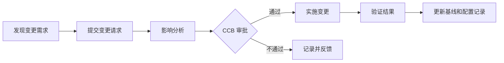

# 软考专题学习包建设说明 v2｜以 T007 样例为正式标准

> 适用项目：软考「系统集成项目管理工程师」学习材料工程  
> 适用对象：Codex、Claude Code、其他代码/文档生成 Agent，以及后续人工校对者  
> 核心目标：把项目内已有的教材 OCR、真题 OCR、旧索引、专题树、素材映射、题型映射、样例专题和制卡方法论，转化为一批**可直接用于学习、复习和后续 Anki 制卡的正式专题学习包**。  
> 最高参考样例：`04_专题学习包_新版样例_v2_T007_PERT估算与进度压缩.md`。  

---

## 0. 本说明文件的定位

本说明文件不是普通提示词，也不是写作风格建议，而是项目中“专题学习包”建设阶段的**生产规范、验收标准和执行约束**。

此前项目已经完成了很多重要的中间工作：资料 OCR、全量 Markdown、旧索引、专题树、专题素材索引、真题考法映射、专题生成清单等。这些工作非常有价值，但它们多数仍属于**索引层、素材层、规划层**。本阶段要推进的是另一件事：

> **把每一个叶节点专题真正写成一篇可阅读、可学习、可做题、可制卡的正式专题学习包。**

因此，本说明文件必须解决一个核心偏差：不要再把“专题建设”理解成“继续补索引、补清单、补映射”。索引只是辅助，正式专题正文才是主交付。

如果 Agent 在执行时发现索引不完整，可以补；如果发现旧专题树存在耦合，可以调整；如果发现题型映射不足，可以扩展。但这些动作都必须服务于最终目标：**生成符合 T007 样例深度和形态的专题正文文件**。

---

## 1. 最终交付物是什么

### 1.1 主交付物：正式专题学习包正文

每个专题学习包都是一个独立 Markdown 文件。它应该像一篇高质量讲义，而不是素材摘抄、知识点提纲、题库答案或 Agent 生成计划。

一个合格专题文件必须让学习者做到：

1. 读完后知道这个专题解决什么问题；
2. 明白专题内概念之间的关系；
3. 能识别考试题干中的语言信号；
4. 能处理基础选择题、辨析题、计算题或案例题；
5. 知道哪些内容应该转成 Anki 卡片，哪些内容只适合保留在讲义中；
6. 能把该专题放回软考整体知识树中理解。

每个专题文件不是“为了凑齐目录”，而是一个完整学习单元。学习者应该可以单独打开某个专题，从头读到尾并获得完整学习体验。

### 1.2 辅助交付物：索引、映射和报告

索引和报告仍然需要，但它们是辅助产物。建议保留以下文件：

```text
outputs/topic_learning_packages/
  README.md
  manifest.json
  coverage_matrix.md
  topic_build_log.md
  quality_review_report.md
  topics/
    T001_专题学习包_信息化与信息系统基础.md
    T002_专题学习包_项目生命周期与组织方式.md
    ...
```

其中：

- `topics/` 是主目录，存放所有正式专题正文；
- `manifest.json` 记录专题 ID、标题、来源、状态、依赖关系、字数、图数量、题目数量；
- `coverage_matrix.md` 记录知识树覆盖情况和真题覆盖情况；
- `topic_build_log.md` 记录专题拆分、合并、重命名、结构调整的理由；
- `quality_review_report.md` 记录自检和抽检结果。

注意：这些辅助文件不能替代专题正文。任何只生成索引、不生成专题正文的结果，都视为没有完成本阶段任务。

---

## 2. T007 样例到底规定了什么

`04_专题学习包_新版样例_v2_T007_PERT估算与进度压缩.md` 是本阶段最重要的样式锚点。它提供的不只是一个格式，而是一种“专题应当如何被讲清楚”的标准。

T007 样例具有以下特征，后续所有专题都应尽量对齐。

### 2.1 它有明确的专题主线

T007 不是直接列出“PERT、关键路径、赶工、快速跟进、资源平衡”的定义，而是先提出一个核心问题：

> 当项目工期不确定或进度出现压力时，项目经理如何估算、判断、压缩和控制进度？

这个问题把多个知识点统一起来。后续专题也必须这样做：不要把一组概念并排罗列，而要找到它们共同回答的管理问题、技术问题或考试问题。

例如：

- 范围管理专题的主线不是“范围计划、需求收集、范围定义、WBS、确认范围、控制范围”，而是“如何把模糊需求变成可交付、可验收、可控制的工作边界”；
- 风险管理专题的主线不是“识别、分析、应对、监控”，而是“如何在不确定性下提前识别威胁和机会，并把风险变成可跟踪、可应对的管理对象”；
- 质量管理专题的主线不是“质量规划、质量保证、质量控制”，而是“如何让项目不是最后才发现质量问题，而是在过程和结果两个层面持续保证质量”。

### 2.2 它用连续讲解建立理解

T007 的主体是讲义式连续讲解。它不会用大量短列表直接堆知识点，而是解释概念为什么出现、和前后内容有什么关系、考试为什么这样考、学习者容易在哪里误解。

这是专题学习包和索引文件最大的区别：

```text
索引文件：告诉你某个专题要写什么。
专题学习包：真的把这个专题讲清楚。
```

后续生成专题时，不能只写：

```markdown
## 核心知识点
- 质量规划
- 质量保证
- 质量控制
```

而应写成类似：

```markdown
质量管理最容易被学成“检查结果是否合格”，但项目管理中的质量并不只发生在交付物完成之后。真正的质量管理至少包含两个层面：一是在计划阶段确定质量标准和质量活动，二是在执行和监控过程中确认过程是否按标准运行、结果是否满足要求。也就是说，质量管理既关心“做出来的东西好不好”，也关心“做东西的过程是否可靠”。
```

### 2.3 它使用图来解释结构

T007 中的 Mermaid 图不是装饰，而是帮助建立知识结构。后续专题也必须使用图，尤其适合以下场景：

- 管理过程链路；
- 输入、工具技术、输出之间的关系；
- 易混概念之间的辨析；
- 题型地图；
- 案例题答题流程；
- 生命周期或状态流转；
- 层级结构或分类体系。

每个中等以上专题一般应有 3～6 张图。小专题至少 2 张图。大专题如低于 3 张图，通常说明讲解还不够结构化。

### 2.4 它包含典型题详解与举一反三

T007 的题目部分不是简单给答案，而是承担二次教学功能。每道题都要帮助学习者识别一类考法。

后续专题的题目部分也必须做到：

- 覆盖不同考法，而不是同一题型换数字；
- 每题必须有解题过程；
- 每题必须说明题干关键词；
- 每题必须分析错项；
- 每题必须有延伸理解；
- 每题必须指出可制卡点。

如果某个专题只有概念没有题，说明它还不是一个合格的软考专题学习包。

### 2.5 它在末尾给出 Anki 转化建议

T007 没有直接生成 Anki 卡片，而是说明哪些内容适合转成概念卡、辨析卡、公式卡、题型卡、案例模板卡。这一点非常重要。

本阶段不是最终制卡阶段。专题学习包应该为后续制卡提供高质量原料，但不要把讲义强行切碎成卡片。后续制卡 Skill 可以基于专题正文再生成具体卡片。

---

## 3. 对现有 Skill v1 的评价与补强方向

用户提供的 `软考专题学习包生成规范_Skill_v1.md` 整体方向是正确的。它已经明确了专题学习包不是 Anki 卡片、不是原始教材缩写，而是“把一个专题讲清楚、讲完整、讲到能做题，并为后续制卡提供高质量原料”的中间层。这与本阶段目标高度一致。

它尤其做对了以下几点：

1. 明确要求讲义式连续讲解，而不是提纲式；
2. 明确要求信息密度高，但用解释降低理解难度；
3. 强调图示优先，建议使用 Mermaid；
4. 要求典型题详解，并要求每题有延伸；
5. 要求结尾给后续制卡建议，而不是直接制卡；
6. 明确禁止伪造来源、禁止题目只有答案、禁止过度模板化。

但如果要用于当前项目的“全量专题建设”，Skill v1 还需要补强几类硬约束。

### 3.1 必须明确：T007 样例是正式专题正文标准

Skill v1 说明了专题应该怎么写，但还不够强制地说明：项目中已有的 `00-05` 文件属于索引层样例，不是正式专题正文样例。下一轮 Agent 容易继续模仿 `00-05` 产出索引，而不是模仿 T007 产出讲义。

因此需要在说明文件里明确：

```text
T007 样例 = 正式专题学习包标准。
00-05 文件 = 索引层、素材层、规划层标准。
本阶段的主交付必须模仿 T007，而不是继续扩写 00-05。
```

### 3.2 必须明确：所有叶节点专题都要成稿

Skill v1 更像“生成一个专题时的规范”，但当前任务是“批量生成所有专题”。因此需要增加批量建设规则：

- 先读取旧知识树和专题生成清单；
- 识别所有叶节点专题；
- 为每个叶节点建立正式专题文件；
- 如果专题过大，应拆分；
- 如果专题耦合过高，应重构；
- 如果发现旧专题树不合理，应记录调整理由；
- 不得只生成 A 级专题而长期搁置 B/C 级专题；
- 对暂缓专题必须说明暂缓原因和恢复条件。

### 3.3 必须增加“材料整合顺序”

当前项目不是从零开始。已有材料包括：

- 全量教程 OCR Markdown；
- 全量真题/题库 OCR Markdown；
- 分块 Markdown；
- 旧索引文件；
- 旧专题树；
- 专题素材索引；
- 真题考法映射；
- 旧生成清单；
- Anki/间隔重复方法论资料；
- 用户上传的 T007 正式样例；
- 用户上传的 Skill v1。

Agent 不应只使用两份 `full.clean.md`，也不应只使用旧索引。正确做法是：**先用旧索引和专题树确定专题边界，再用 OCR 正文补充材料，再用真题材料补题型，再用 T007 和 Skill v1 约束文风。**

### 3.4 必须增加验收量化指标

Skill v1 有质量自检，但当前批量任务需要更硬的可验收指标，例如：

- 每篇专题是否达到最低字数；
- 是否有主线图；
- 是否有至少 2 张有效 Mermaid 图；
- 是否有足够典型题；
- 是否有 Anki 制卡建议；
- 是否明确覆盖范围与排除范围；
- 是否记录来源和待核验点；
- 是否避免了“索引化口吻”。

这些指标要写入 manifest 或质量报告，便于下一轮自动检查。

---

## 4. 专题学习包与其他项目文件的关系

为了避免 Agent 混淆，本阶段必须清楚区分以下文件类型。

### 4.1 原始资料层

包括 PDF、DOC、OCR 原文、全量 Markdown、分块 Markdown。

作用：提供知识内容和题目材料。  
不应直接复制为专题正文。  
使用方式：抽取、归纳、重组、讲解。

### 4.2 索引规划层

包括旧的：

- `00_建树前深读交付物总览.md`
- `01_全资料细粒度索引与专题素材映射.md`
- `02_极细粒度专题知识树_叶节点为专题.md`
- `03_专题素材索引库.md`
- `04_真题考法与题目映射索引.md`
- `05_全量专题生成清单与依赖路径.md`

作用：确定专题边界、依赖路径、材料来源、题型覆盖。  
不应被误认为正式专题正文。  
使用方式：作为生成专题的导航和检查表。

### 4.3 正式专题学习包层

这是本阶段要建设的主产物。

特点：

- 每篇都是完整讲义；
- 每篇可以单独阅读；
- 每篇都有解释、图示、例题、延伸、制卡建议；
- 每篇都尽量覆盖一个清晰、稳定、低耦合的专题。

### 4.4 后续制卡层

后续 Anki 卡片不在本阶段直接生成。专题学习包只提供：

- 概念卡候选；
- 辨析卡候选；
- 流程卡候选；
- 公式卡候选；
- 案例模板卡候选；
- 陷阱卡候选；
- 暂不制卡内容。

后续制卡 Skill 应读取专题正文和制卡建议，再生成具体卡片。

---

## 5. 专题边界设计规则

### 5.1 专题必须以“可学习的问题”为单位

一个专题不能只是教材目录，也不能只是一个孤立术语。它应该围绕一个可学习的问题建立。

好的专题标题通常同时包含：

- 管理场景；
- 核心概念群；
- 考试高频动作；
- 可闭环的学习目标。

示例：

```text
T007｜PERT、活动历时估算与进度压缩
```

这个标题不是单一术语，而是一组高度相关的知识点，围绕“估算与压缩进度”形成完整学习单元。

类似地，后续专题可以采用：

```text
范围基准、WBS 与需求边界控制
质量保证、质量控制与质量审计辨析
风险识别、定性/定量分析与应对策略
合同类型、采购文件与供应商选择
配置管理、变更控制与版本基线
信息安全等级保护、访问控制与安全管理制度
```

### 5.2 专题不能过大

如果一个专题试图覆盖整个知识域，就会变成臃肿教材。大专题应该拆成若干学习包。

例如“进度管理”不能直接写成一篇超大专题，而应拆为：

- 活动定义与活动排序；
- 网络图、前导图法与依赖关系；
- 活动历时估算、PERT 与进度压缩；
- 进度基准、控制进度与进度偏差处理。

拆分标准：

- 如果一个文件预计超过 25,000 中文字，应考虑拆分；
- 如果典型题超过 15 道且仍无法覆盖，应考虑拆分；
- 如果 Mermaid 图超过 8 张且主线分散，应考虑拆分；
- 如果读者必须掌握两个明显不同的能力群，应考虑拆分。

### 5.3 专题不能过小

如果一个专题只围绕一个孤立定义，可能不足以形成学习包。过小专题应与相邻概念合并。

例如：

```text
“类比估算”单独成专题通常过小；
可以并入“活动历时估算、三点估算与 PERT”。
```

合并标准：

- 概念必须在同一题型中经常共同出现；
- 单独讲解不足 5,000 字且无法形成题型覆盖；
- 与相邻概念存在强依赖；
- 学习者必须一起辨析才不容易混淆。

### 5.4 允许重构旧专题树

如果 Agent 在生成过程中发现旧专题树有问题，可以调整，但必须记录：

```markdown
## 专题结构调整记录

- 原专题：T-SCH-004｜活动历时估算、参数估算、三点估算与 PERT
- 调整后：T007｜PERT、活动历时估算与进度压缩
- 调整原因：原专题只覆盖估算，不足以承载真题中常与关键路径、赶工、快速跟进、资源平衡共同出现的考法。为形成完整学习闭环，将进度压缩和资源平衡纳入同一专题。
- 影响文件：...
```

结构调整不是失败，而是深度专题建设的一部分。但调整必须有理由，不能随意重命名。

---

## 6. 单篇专题学习包的标准结构

下面是推荐结构。标题可以根据专题调整，但功能必须保留。

```markdown
# T007｜PERT、活动历时估算与进度压缩

> 本专题用于学习……它们不是孤立知识点，而是围绕一个核心问题展开：……

---

## 先看这个专题的主线

连续讲解：
- 这个专题为什么重要；
- 它在软考知识体系中的位置；
- 它解决什么管理问题；
- 它为什么容易出题；
- 它和前置/后续专题的关系。

加入一张总览图。

## 核心概念一：用问题引出概念

不要直接贴定义。先说明概念为什么出现，再给定义。

> **[定义｜核心概念]** ……

随后解释适用条件、相邻概念、常见误解。

## 核心概念二：讲清机制、流程或公式

如果有公式，必须给：
- 公式；
- 变量含义；
- 适用场景；
- 易错点；
- 最小例子。

## 易混淆点与考试陷阱

用连续讲解和图示解释辨析关系。不要只用表格。

## 典型题详解与举一反三

每道题必须包含：
- 题目原文；
- 考查点；
- 题干关键词；
- 解题过程；
- 正确答案；
- 错项分析；
- 延伸理解；
- 可制卡点。

## 学完本专题后，应该留下哪些能力

总结能力，而不是重复知识点。

## 后续制卡建议

说明概念卡、辨析卡、流程卡、公式卡、案例模板卡、陷阱卡的转化方向。

## 待核验与后续改进

标出不确定来源、需要回查教材/真题的地方。
```

### 6.1 标题层级控制

推荐以二级标题为主。三级标题可以少量使用，但不要把文件写成四五级编号大纲。

推荐：

```markdown
## PERT：用三种情景处理不确定性
```

不推荐：

```markdown
## 2.1.3.4 PERT 方法的定义、公式、适用条件与案例说明
```

标题应该像讲义章节，而不是制度文件目录。

### 6.2 文件开头必须定调

每篇专题开头必须有一段导言，说明本专题不是孤立知识点，而是围绕什么问题展开。

模板：

```markdown
> 本专题用于学习“……”中最容易出选择题、计算题或案例题的一组内容：**A、B、C、D**。它们不是孤立知识点，而是围绕一个核心问题展开：**……？**
```

这个导言很重要，它决定全文主线。不要写成：

```markdown
> 本专题介绍 A、B、C、D。
```

### 6.3 每个核心部分必须有“为什么”

每个核心概念至少要回答：

- 它为什么出现；
- 它解决什么问题；
- 它如何在项目管理场景中发挥作用；
- 它如何在软考中被考；
- 它最容易和什么混淆。

如果只回答“是什么”，说明深度不够。

---

## 7. 文风标准

### 7.1 讲义式连续讲解

专题学习包应像老师在讲课，而不是像助手在列清单。

不合格写法：

```markdown
配置管理包括配置识别、配置控制、配置状态报告和配置审计。
变更管理包括变更申请、评估、审批、实施和验证。
```

合格写法：

```markdown
配置管理和变更管理经常被放在一起考，是因为它们都在解决“项目成果如何保持受控”的问题。配置管理关注的是项目交付物和中间成果如何被识别、记录、基线化和审计；变更管理关注的是当这些受控对象需要改变时，如何提出、评估、批准、实施和验证。简单说，配置管理让对象“有身份、有状态、有基线”，变更管理让修改“有流程、有审批、有追踪”。
```

### 7.2 信息密度高，但不能堆术语

信息密度高意味着每段都要有信息增量。不要写空泛句子，如：

```text
这个知识点非常重要，考试经常考，大家一定要掌握。
```

应改为：

```text
这个知识点经常考，是因为它连接了计划、执行和监控三个场景：计划阶段要用它确定基准，执行阶段要用它安排活动，监控阶段要用它判断偏差是否需要变更。
```

### 7.3 避免过度模板化

不要频繁使用：

- 一句话定义；
- 常见考法；
- 易错点；
- 记忆口诀；
- 考点 1/2/3；
- 高频考点；
- 必背；
- 秒杀技巧。

这些功能可以有，但应自然融入讲义，而不是每节都套模板。

### 7.4 加粗要服务理解

必须加粗：

- 核心概念；
- 关键判断；
- 易错提醒；
- 公式名称；
- 题解结论；
- 关键动作与代价。

不要整段加粗。不要为了显得重要而加粗太多。加粗的目标是让学习者回看时能抓住骨架。

---

## 8. 图示规范

### 8.1 每篇专题必须有图

图不是美化，而是认知工具。建议数量：

```text
小专题：2～3 张
中等专题：3～6 张
大专题：5～8 张，或拆分专题
```

至少应有一张“专题主线图”。

### 8.2 图的类型选择

优先使用：

```text
flowchart：过程、因果链、管理动作
mindmap：分类、知识结构、题型覆盖
graph LR/TD：依赖关系、网络结构
quadrantChart：二维辨析，如风险高低/影响大小
stateDiagram-v2：状态转换，如变更状态、缺陷状态
sequenceDiagram：交互流程，如采购/验收/沟通
```

### 8.3 图必须配讲解

每张图前要说明为什么画这张图。每张图后要解释图的含义和考试价值。

不合格：

```markdown

```

合格：

```markdown
为了避免把变更控制学成“审批表流程”，可以先把它看成一条从问题发现到基线更新的闭环。图中最关键的不是“提交申请”本身，而是评估、审批、实施、验证和记录之间的连续性。



这张图提醒我们：**变更控制不是简单同意或拒绝，而是让范围、进度、成本、质量和配置状态都保持可追踪。** 案例题中如果只写“提交领导审批”，通常是不够的。
```

### 8.4 Mermaid 自检要求

生成后必须检查：

- 代码块是否以 ` ```mermaid ` 开头；
- 节点文本是否过长；
- 是否包含容易导致渲染失败的特殊符号；
- 箭头方向是否清晰；
- 图是否真的解释了正文，而不是孤立存在。

---

## 9. 典型题详解规范

### 9.1 题目数量要求

每篇专题都必须有题目。建议：

```text
小专题：4～6 道
中等专题：6～10 道
大专题：10～15 道，或拆分专题
```

如果某专题短期内没有找到真题，可以先写“仿真典型题”，但必须标明：

```text
[仿真题｜用于覆盖考法，非原题]
```

不要伪造真题年份和出处。

### 9.2 题目覆盖要求

题目不是越多越好，而是要覆盖不同考法。

一篇合格专题至少应覆盖以下几类中的多数：

- 定义识别；
- 概念辨析；
- 流程排序；
- 场景判断；
- 简单计算；
- 案例分析；
- 错误做法识别；
- 管理措施选择；
- 反向陷阱。

### 9.3 每道题的固定质量要求

每道题至少包含：

```markdown
> **例题 X｜题型名称**
>
> 题目正文……
>
> A. ...  
> B. ...  
> C. ...  
> D. ...

这道题考查的是……题干里的关键词是……

正确答案是 **B**。

A 错在……；C 错在……；D 错在……。B 之所以正确，是因为……

**延伸理解：** ……

**可制卡点：** ……
```

不要求机械逐字套用，但这些功能必须存在。

### 9.4 题解必须承担教学功能

题解不能只是“为什么选 B”。它还要告诉学习者：

- 下次看到什么词应想到这个概念；
- 这个题和哪一类题相似；
- 出题人容易设置什么错项；
- 这个考点如何和案例题结合；
- 后续应该做什么卡片。

题解越能转化为“题型识别能力”，专题价值越高。

---

## 10. 后续制卡建议规范

专题末尾必须有“后续制卡建议”。这部分不是正式制卡，而是给后续 Anki Skill 的输入说明。

建议按以下结构写：

```markdown
## 后续制卡建议

本专题不建议把整篇讲义直接切成卡片。更好的做法是先提取“长期需要保持的判断”和“做题时需要调用的思路”。

**概念卡**适合承载：……

**辨析卡**应重点覆盖：……

**流程卡**适合覆盖：……

**公式卡**只适合：……

**案例模板卡**应围绕：……

**陷阱卡**可以来自：……

**暂不制卡内容**包括：……
```

必须区分：

- 适合制卡的内容；
- 不适合制卡但适合保留在讲义中的内容；
- 需要等真题校验后再制卡的内容。

不要在本阶段直接批量生成卡片。否则会把专题学习包变成卡片草稿，破坏讲义阅读体验。

---

## 11. 来源使用与可信度规则

### 11.1 材料优先级

生成专题时，应按以下优先级使用材料：

1. 官方教程 OCR 或官方教材相关章节；
2. 历年真题与答案解析；
3. 项目已有旧索引、专题树、素材映射、题型映射；
4. 用户提供的样例与 Skill 规范；
5. 用户项目中的其他 PDF/DOC 学习资料、精华资料、口诀资料；
6. Agent 自身项目管理知识补充。

越靠后的材料，越不能用来编造权威表述。对于不确定来源，应标注 `[待核验]`。

### 11.2 不要伪造页码、真题年份和官方原文

如果无法确认某题来自哪年真题，不要写“2021 年上半年真题”。可以写：

```text
[仿真题｜根据历年常见考法整理]
```

如果无法确认教材页码，不要写具体页码。可以写：

```text
[待核验] 该表述需要回查官方教程原文。
```

### 11.3 允许合理综合，但要避免无来源扩写

专题学习包不是逐字摘抄教材，允许整合、解释、归纳和重组。但涉及以下内容时要谨慎：

- 法规条文；
- 标准名称；
- 数值阈值；
- 考试评分规则；
- 真题年份；
- 官方定义。

这些内容如果来源不明，必须标注待核验。

---

## 12. 批量生成流程

### 12.1 第一步：盘点输入材料

Agent 开始前必须先扫描项目材料，至少确认：

```text
- T007 正式样例是否存在；
- Skill 规范是否存在；
- docmind_ocr_full/markdown_full 是否存在；
- docmind_ocr_full/markdown_chunks 是否存在；
- outputs/00-05 旧索引是否存在；
- 是否已有 topic_learning_packages 目录；
- 是否已有 manifest 或旧专题文件。
```

并输出简短盘点报告。

### 12.2 第二步：建立专题清单

从旧专题树、旧生成清单和素材索引中提取叶节点专题。每个专题至少包含：

```yaml
id: T007
title: PERT、活动历时估算与进度压缩
domain: 项目进度管理
priority: A/B/C
source_index:
  - 官方教程章节
  - 真题映射
  - 旧专题素材库位置
expected_size: medium
status: pending
```

如果旧专题 ID 与新专题 ID 不一致，应维护映射表。

### 12.3 第三步：按优先级生成专题正文

优先级建议：

1. 高频考试专题；
2. 连接多个知识域的枢纽专题；
3. 计算题/案例题高价值专题；
4. 容易混淆的辨析专题；
5. 纯记忆型低频专题。

但最终目标是覆盖所有专题，不能只生成前几篇。

### 12.4 第四步：生成时动态重构专题结构

如果发现某专题太大、太小、耦合过高或边界重叠，允许调整：

- 拆分；
- 合并；
- 重命名；
- 修改依赖；
- 调整输出顺序。

每次调整必须写入 `topic_build_log.md`。

### 12.5 第五步：质量自检与补齐

生成后必须自动检查：

- 文件是否存在；
- 字数是否达标；
- 是否有专题导言；
- 是否有主线图；
- Mermaid 图数量；
- 例题数量；
- 是否有 Anki 制卡建议；
- 是否有待核验与改进；
- 是否过度列表化；
- 是否缺少错项分析；
- 是否缺少延伸理解。

不达标专题必须进入返工队列。

---

## 13. 质量验收标准

### 13.1 单篇专题最低标准

每篇专题至少满足：

```text
- 有清晰专题 ID 和标题；
- 有开头导言，说明核心问题；
- 有“专题主线”部分；
- 有至少 2 张有效 Mermaid 图；
- 有定义/公式/判断规则引用框；
- 有连续讲义式解释；
- 有典型题详解；
- 每道题有答案、错项分析、延伸理解、可制卡点；
- 有“学完后应留下的能力”或等价总结；
- 有“后续制卡建议”；
- 有“待核验与后续改进”；
- 没有明显伪造来源；
- 没有退化成提纲或索引。
```

### 13.2 字数与深度建议

```text
小专题：5,000～8,000 中文字，4～6 道题，2～3 张图
中等专题：8,000～15,000 中文字，6～10 道题，3～6 张图
大专题：15,000～25,000 中文字，10～15 道题，5～8 张图
超大专题：应拆分，不建议单篇超过 25,000 中文字
```

字数不是唯一标准，但如果一个中等专题只有 2,000 字，通常说明还停留在索引层。

### 13.3 五档质量评级

建议在 manifest 中记录质量等级：

```text
S：可直接作为正式学习资料，接近 T007 样例水平
A：基本可用，只需少量校对
B：结构完整，但讲解深度或题目覆盖不足
C：更像素材整理，需要大幅重写
D：索引/提纲，不算专题学习包
```

只有 S/A 可以进入后续 Anki 制卡阶段。B 需要补强后再进入。C/D 必须返工。

### 13.4 质量评分表

建议按 100 分评价：

```text
专题主线与边界：15 分
讲义式解释深度：25 分
图示质量：15 分
典型题覆盖与题解：25 分
制卡建议：10 分
可信度与待核验标注：5 分
可读性与格式控制：5 分
```

低于 80 分不应视为完成。

---

## 14. 禁止事项

### 14.1 禁止只生成索引

以下文件不算专题学习包：

```text
- 只有专题定位和材料来源；
- 只有知识点列表；
- 只有题型映射；
- 只有生成计划；
- 只有依赖路径；
- 只有“建议后续扩写”。
```

### 14.2 禁止照搬 OCR 原文

OCR 原文是材料，不是讲义。专题学习包必须经过重组、解释、辨析和题型化。

### 14.3 禁止只写上午选择题，不写下午案例题

系统集成项目管理工程师考试需要同时关注选择题和案例题。对于项目管理类专题，必须考虑案例题表达方式。

### 14.4 禁止只有题没有讲义

题目是教学的一部分，但不能替代讲义正文。

### 14.5 禁止大量表格替代讲解

表格可用于极简辨析，但不能成为主体。主体必须是讲义式连续文本。

### 14.6 禁止伪造来源

不得编造真题年份、页码、官方原文、标准条款。无法确认时标注 `[待核验]`。

---

## 15. 给 Codex / Claude Code 的执行提示词模板

下面这段可以直接作为下一轮 Agent 任务的核心提示词使用。

```markdown
你现在接手的是软考“系统集成项目管理工程师”学习资料工程中的“正式专题学习包建设”阶段。

请注意：本轮主任务不是继续补索引、补专题树、补素材映射，也不是生成 Anki 卡片。本轮主任务是：基于项目内全部已有资料，为所有叶节点专题生成符合 T007 样例标准的正式专题学习包正文。

## 最高写作标准

请以以下文件作为正式专题正文的最高样例：

- `04_专题学习包_新版样例_v2_T007_PERT估算与进度压缩.md`

请以以下文件作为专题生成规范：

- `软考专题学习包建设说明_v2_以T007样例为标准.md`
- `软考专题学习包生成规范_Skill_v1.md`

注意：项目中的 `00-05` 文件主要是索引层、素材层、规划层样例，不是正式专题正文样例。你可以利用它们确定专题边界、材料来源、真题映射和依赖关系，但不要模仿它们的输出形态来代替专题正文。

## 必须利用的资料

请先盘点并利用项目内所有相关资料，包括但不限于：

- `docmind_ocr_full/markdown_full/tutorial.full.clean.md`
- `docmind_ocr_full/markdown_full/questions.full.clean.md`
- `docmind_ocr_full/markdown_chunks/`
- `outputs/00_建树前深读交付物总览.md`
- `outputs/01_全资料细粒度索引与专题素材映射.md`
- `outputs/02_极细粒度专题知识树_叶节点为专题.md`
- `outputs/03_专题素材索引库.md`
- `outputs/04_真题考法与题目映射索引.md`
- `outputs/05_全量专题生成清单与依赖路径.md`
- 项目中其他 PDF/DOC/MD 学习材料
- `anki/` 或其他制卡方法论资料

## 主交付目录

请创建或更新：

```text
outputs/topic_learning_packages/
  README.md
  manifest.json
  coverage_matrix.md
  topic_build_log.md
  quality_review_report.md
  topics/
```

所有正式专题正文必须放入：

```text
outputs/topic_learning_packages/topics/
```

## 单篇专题必须达到的形态

每篇专题都应像 T007 样例一样，是一份完整讲义，而不是提纲。必须包含：

1. 清晰标题和开头导言；
2. 专题主线说明；
3. 至少 2 张有效 Mermaid 图；
4. 讲义式连续解释；
5. 定义、公式、判断规则引用框；
6. 易混淆点和考试陷阱；
7. 典型题详解与举一反三；
8. 每道题的错项分析、延伸理解、可制卡点；
9. 学完本专题后应留下的能力；
10. 后续制卡建议；
11. 待核验与后续改进。

推荐长度：

- 小专题：5,000～8,000 中文字；
- 中等专题：8,000～15,000 中文字；
- 大专题：15,000～25,000 中文字，必要时拆分。

## 批量建设要求

1. 先从旧专题树、旧生成清单和素材索引中提取所有叶节点专题。
2. 按考试价值和依赖关系排序。
3. 对每个专题生成正式学习包。
4. 如果发现专题太大、太小、耦合过高或边界重叠，可以拆分、合并或重命名，但必须记录在 `topic_build_log.md`。
5. 不得只生成索引、清单或计划。
6. 不得只写少量示例专题后停止，除非受上下文限制；如果无法一次完成全部，必须留下明确的继续队列，并保证已经完成的专题都达到正式标准。
7. 不确定来源必须标注 `[待核验]`，不得伪造真题年份、页码或官方表述。

## 质量自检

每生成一个专题，都要在 manifest 中记录：

- 字数；
- Mermaid 图数量；
- 例题数量；
- 是否有 Anki 制卡建议；
- 是否有待核验点；
- 质量等级 S/A/B/C/D；
- 是否可进入后续制卡。

只有 S/A 级专题可以进入后续 Anki 制卡阶段。
```

---

## 16. README 建议内容

`outputs/topic_learning_packages/README.md` 建议写明：

```markdown
# 软考专题学习包目录

本目录存放正式专题学习包。每个专题学习包都是一篇可独立阅读的 Markdown 讲义，用于连接“全量 OCR/索引材料”和“后续 Anki 制卡”。

## 目录结构

- `topics/`：正式专题正文
- `manifest.json`：专题元数据与质量状态
- `coverage_matrix.md`：知识域和真题覆盖矩阵
- `topic_build_log.md`：专题拆分、合并、重命名和返工记录
- `quality_review_report.md`：质量审查报告

## 重要说明

`outputs/00-05` 是索引层和规划层材料，不是正式专题正文。
正式专题正文应以 `samples/topic_learning_package/04_专题学习包_新版样例_v2_T007_PERT估算与进度压缩.md` 的形态为标准。
```

---

## 17. manifest.json 字段建议

```json
{
  "topics": [
    {
      "id": "T007",
      "title": "PERT、活动历时估算与进度压缩",
      "domain": "项目进度管理",
      "file": "topics/T007_专题学习包_PERT活动历时估算与进度压缩.md",
      "status": "done",
      "quality_grade": "S",
      "word_count": 12000,
      "mermaid_count": 5,
      "example_question_count": 7,
      "has_anki_guidance": true,
      "has_pending_verification": true,
      "source_materials": [
        "docmind_ocr_full/markdown_full/tutorial.full.clean.md",
        "docmind_ocr_full/markdown_full/questions.full.clean.md",
        "outputs/03_专题素材索引库.md",
        "outputs/04_真题考法与题目映射索引.md"
      ],
      "depends_on": ["WBS", "活动定义", "活动排序"],
      "can_enter_anki_generation": true,
      "notes": "已达到 T007 样例标准"
    }
  ]
}
```

---

## 18. coverage_matrix.md 建议内容

```markdown
# 专题覆盖矩阵

| 知识域 | 专题 ID | 专题名称 | 状态 | 质量等级 | 题目覆盖 | 案例题覆盖 | 是否可制卡 |
|---|---|---|---|---|---|---|---|
| 项目进度管理 | T007 | PERT、活动历时估算与进度压缩 | done | S | 充分 | 是 | 是 |
```

覆盖矩阵的目的不是好看，而是防止：

- 只写了高频专题，低频专题漏掉；
- 只写了上午选择题，下午案例题漏掉；
- 只写了项目管理，技术基础漏掉；
- 只写了教材内容，真题考法没有覆盖。

---

## 19. topic_build_log.md 建议内容

```markdown
# 专题建设日志

## 结构调整记录

### 2026-xx-xx

- 原专题：T-SCH-004｜活动历时估算、参数估算、三点估算与 PERT
- 新专题：T007｜PERT、活动历时估算与进度压缩
- 调整类型：扩展合并
- 调整原因：真题中 PERT、关键路径、赶工、快速跟进、资源平衡经常共同出现，单独讲估算无法形成完整题型闭环。
- 影响：更新 manifest、coverage_matrix，并将进度压缩相关题目纳入 T007。
```

建设日志是为了让后续人类和 Agent 理解为什么专题结构发生变化。

---

## 20. 最终判断

当前用户提供的 Skill v1 已经比较符合“单篇专题学习包生成规范”的方向，但它还不足以单独驱动当前项目的全量专题建设。它需要和 T007 样例绑定，并补充以下硬约束：

1. **T007 是正式专题正文标准**；
2. **00-05 是索引层，不是正文层**；
3. **本阶段主任务是所有叶节点专题成稿**；
4. **必须利用项目内全部旧素材，而不是只用两份新 OCR Markdown**；
5. **允许并要求在生成中动态调整专题结构**；
6. **必须建立 manifest、覆盖矩阵、建设日志和质量报告**；
7. **只有达到 S/A 级的专题才能进入后续 Anki 制卡阶段**。

只要把这些规则写入项目，并让 Codex / Claude Code 在执行时强制遵守，后续专题文档就更有可能真正接近 T007 样例，而不是再次退化成索引、提纲或素材清单。
