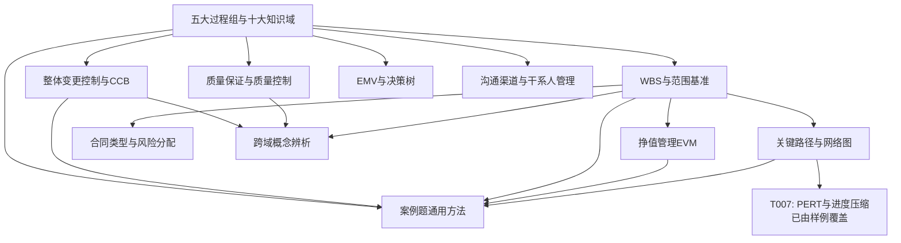

# 专题依赖关系图

> 展示已建专题之间的学习路径依赖。

## 推荐学习路径

1. **T-PM-002**（五大过程组 + 十大知识域）→ 建立全局框架
2. **T-INT-004**（整体变更控制）→ 理解贯穿所有知识域的控制机制
3. **T-SCOPE-002**（WBS 与范围基准）→ 理解项目管理的基础结构
4. **T-SCH-003**（关键路径）→ 掌握核心计算技能
5. **T-COST-002**（挣值管理）→ 掌握成本控制核心计算
6. **T-QUAL-001**（QA/QC 辨析）→ 理解质量管理框架
7. **T-RISK-002**（EMV 与决策树）→ 掌握风险量化分析
8. **T-PROC-001**（合同类型）→ 理解采购管理基础
9. **T-COM-001**（沟通渠道 + 干系人）→ 掌握沟通和人员管理
10. **T-CASE-001**（案例答题方法）→ 将知识转化为答题能力
11. **T-CROSS-001**（跨域辨析）→ 修补易混淆概念

> T007 样例（PERT + 进度压缩）建议在学完 T-SCH-003 之后阅读。
