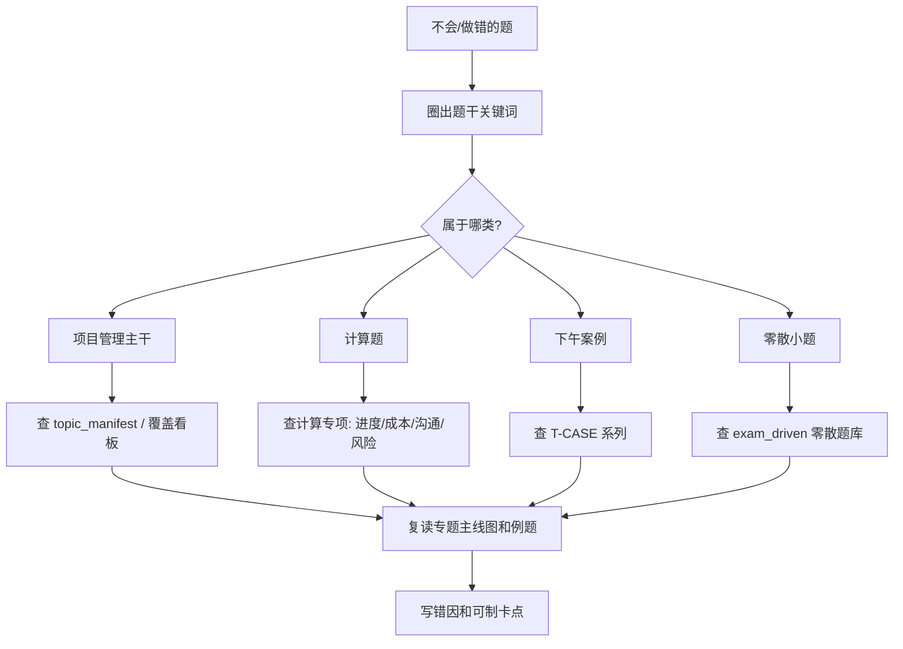

# 系统集成项目管理工程师专题学习路线与打卡 TODO

## 使用说明

这份路线按“框架 → 主干 → 计算 → 案例 → 零散补漏 → 真题回流”组织。每天建议学习 1～3 个专题，不追求一口气读完，而是完成一个闭环：**读主线、看图、做例题、写错因、标记制卡点**。

每个专题建议按下面四步打卡：

- [ ] 读开头主线，能用一句话说出专题解决什么问题。
- [ ] 复述专题中的 Mermaid 图，不看原文说出节点关系。
- [ ] 做完典型题，至少记录 1 个易错点。
- [ ] 标记 3～5 个适合后续制卡的概念、公式或辨析点。

掌握程度建议用三档标记：

- `A`：能讲给别人听，能独立做题。
- `B`：能看懂，但做题仍会犹豫。
- `C`：读过但不能稳定判断，需要回炉。

遇到 `[待核验]` 内容时，只做“待核验笔记”，暂时不要做稳定记忆卡。

---

## 阶段 0：准备与总览

- [ ] 阅读 [README.md](../README.md)，知道专题库、索引、报告和零散题库的位置。
- [ ] 阅读 [topic_coverage_dashboard.md](../index/topic_coverage_dashboard.md)，了解强覆盖和弱覆盖区域。
- [ ] 阅读 [exam_question_coverage_matrix.md](../index/exam_question_coverage_matrix.md)，知道真题如何反查专题。
- [ ] 阅读 `T-PM-002｜五大过程组、十大知识域与 PDCA`，建立项目管理总框架。
- [ ] 新建个人错题记录文件，字段至少包括：题干关键词、错选项、正确专题、错因、下次复习日期。
- [ ] 浏览 [pending_verification_register.md](../reports/pending_verification_register.md)，知道哪些内容不能直接当稳定事实背。

**完成标准：** 能画出五大过程组、十大知识域的大致位置；知道遇到错题要回流到哪个索引文件。

---

## 阶段 1：项目管理主线

### 1.1 整体管理

- [ ] 学习 `T-INT-002｜项目章程、SOW、项目管理计划与基准体系`，区分章程、SOW、管理计划和三大基准。
- [ ] 学习 `T-INT-004｜整体变更控制与 CCB`，背熟“变更请求 → 影响分析 → 审批 → 更新基准 → 通知干系人”。
- [ ] 学习 `T-CLOSE-001｜项目收尾管理、合同收尾与验收`，整理管理收尾和合同收尾的区别。
- [ ] 做 3 道变更流程题，错题回流到 `T-INT-004`。

### 1.2 范围管理

- [ ] 学习 `T-SCOPE-002｜WBS、工作包、WBS 字典与范围基准`，能说清 WBS、工作包、WBS 字典和范围基准。
- [ ] 学习 `T-SCOPE-003｜范围确认、质量控制、验收与测试边界辨析`，区分核实的可交付成果和验收的可交付成果。
- [ ] 写一张“WBS vs 活动清单”的辨析笔记。

### 1.3 进度管理

- [ ] 学习 `T-SCH-002｜活动排序、依赖关系、PDM/AOA 与提前滞后量`，区分强制依赖、选择性依赖、外部依赖。
- [ ] 学习 `T-SCH-003｜关键路径、总时差、自由时差与网络图判断`，手算至少 2 个网络图。
- [ ] 回看 T007 样例中的 PERT 和进度压缩，整理赶工 vs 快速跟进。

### 1.4 成本管理

- [ ] 学习 `T-COST-001｜成本估算、成本预算、储备分析与成本基准`，整理估算方法和储备口径。
- [ ] 学习 `T-COST-002｜挣值管理与成本绩效分析`，完成所有例题并重算一遍。
- [ ] 写一张 PV/EV/AC、CV/SV、CPI/SPI 的公式总表。

### 1.5 质量管理

- [ ] 学习 `T-QUAL-001｜质量保证、质量控制与质量审计`，区分 QA、QC、质量审计。
- [ ] 学习 `T-QUAL-002｜质量管理七工具、新七工具与质量问题分析`，按“工具解决什么问题”记忆。
- [ ] 学习 `T-QUAL-003｜质量问题案例模板`，整理质量案例的不妥点模板。

### 1.6 风险管理

- [ ] 学习 `T-RISK-001｜风险识别、风险登记册与风险应对策略`，区分风险、问题、假设。
- [ ] 学习 `T-RISK-002｜定性/定量风险分析、EMV 与决策树`，手算至少 3 道 EMV。
- [ ] 学习 `T-RISK-003｜风险、问题、变更与应急措施跨域辨析`，整理“已发生/未发生/要不要改基准”的判断表。

### 1.7 采购合同、法律与配置

- [ ] 学习 `T-PROC-001｜合同类型、风险分配与采购决策`，区分固定总价、成本补偿、工料合同。
- [ ] 学习 `T-PROC-002｜招投标、政府采购与采购流程管理`，整理招标、投标、评标、中标、签约的程序链。
- [ ] 学习 `T-LAW-001｜法律法规基础、合同法、招投标法与政府采购法考点`，只背已核验规则，法规数字先标记。
- [ ] 学习 `T-CFG-001｜配置管理、配置项、基线、配置库与版本控制`，区分配置控制和变更控制。

### 1.8 人力资源、沟通与干系人

- [ ] 学习 `T-HR-001｜项目人力资源管理`，整理 RAM、团队建设、激励和冲突管理。
- [ ] 学习 `T-COM-001｜沟通渠道计算与干系人参与管理`，熟练计算 `n(n-1)/2`。
- [ ] 学习 `T-COM-002｜沟通管理与干系人冲突案例模板`，整理“识别干系人 → 沟通计划 → 书面确认 → 问题跟踪”。
- [ ] 学习 `T-ORG-001｜组织结构、项目经理权限与 PMO`，区分职能型、矩阵型、项目型组织。

**完成标准：** 能把任意上午项目管理题定位到一个专题；看到案例题干中的“没计划、没评审、没确认、没走变更、没人沟通”，能说出对应知识域。

---

## 阶段 2：计算题专项

- [ ] PERT：掌握 `TE=(O+4M+P)/6`，能判断题干中的乐观、最可能、悲观时间。
- [ ] 关键路径：手算最早开始、最早完成、最晚开始、最晚完成、总时差和自由时差。
- [ ] 挣值管理：用 `T-COST-002` 连续做 PV/EV/AC、CV/SV、CPI/SPI、EAC/ETC/TCPI。
- [ ] 沟通渠道：至少做 5 个不同人数变化题，写出新增成员导致渠道数增加的原因。
- [ ] EMV/决策树：至少做 5 道方案期望值比较题。
- [ ] 采购评分：用零散题库中的加权评分题练习“平均分 × 权重”。
- [ ] 经济评价：回到 `T-FEA-001` 标记静态/动态投资回收期为待增强内容。
- [ ] 建立个人“公式错题表”，每个公式至少有一个最小例子。

**完成标准：** 看到计算题能先列已知量和要求量；公式不会混分母；结果后能写出管理含义。

---

## 阶段 3：下午案例专项

- [ ] 学习 `T-CASE-001｜下午案例题通用审题与答题方法`，掌握事实层、管理层、答题层。
- [ ] 学习 `T-CASE-002｜进度延误与成本超支案例专项模板`，能从 EVM 指标回到管理措施。
- [ ] 学习 `T-CASE-003｜范围蔓延、变更失控与合同纠纷案例模板`，整理范围失控证据链。
- [ ] 复习 `T-QUAL-003`，整理质量案例“角色职责、计划评审、过程控制、缺陷纠偏”。
- [ ] 复习 `T-COM-002`，整理沟通冲突案例的干系人识别和书面确认动作。
- [ ] 从 `questions.full.clean.md` 中抽 1 个下午案例，按“问题 → 原因 → 措施”重写答案。
- [ ] 每次案例练习后，给答案标注知识域标签，如 `scope change cost communication risk`。

**完成标准：** 能在 3 分钟内标出案例题干中的角色、时间、数字、信号词；答案能分条，不写空泛的“加强管理”。

---

## 阶段 4：上午零散考点补漏

- [ ] 学习 `T-INFO-001｜信息化、信息系统生命周期与系统集成基础`，区分信息系统、信息化、系统生命周期。
- [ ] 学习 `T-INFO-002｜企业信息化系统 ERP/CRM/SCM/BI/EAI 辨析`，按“管理对象”记忆。
- [ ] 学习 [零散考点与小题型专项训练.md](../exam_driven/零散考点与小题型专项训练.md) 的标准代号部分。
- [ ] 学习零散题库的软件文档、软件质量、软件测试、UML/OO 部分。
- [ ] 学习零散题库的 DNS/FTP、DAS/NAS/SAN、电子商务安全部分。
- [ ] 学习零散题库的投标送达、评分标准、单一来源采购部分。
- [ ] 标记知识产权/软件著作权为 `P0 待补专题`。
- [ ] 标记资质等级/监理为 `P0 待核验`，不直接制卡旧制度数字。
- [ ] 整理一页“上午短散题速记表”，每组只写题干关键词和答案触发词。

**完成标准：** 零散题不是背长文，而是看到关键词能快速定位；所有法规、标准、资质数字都知道是否已核验。

---

## 阶段 5：真题回流与复盘

- [ ] 做一套上午题，不查资料限时完成。
- [ ] 标出所有错题对应专题 ID。
- [ ] 对每道错题写一句错因：概念不清、公式混淆、题干没读准、法规未核验、记忆缺失。
- [ ] 复读错题对应专题的主线图和典型题。
- [ ] 如果错题属于短散考点，补到个人零散题表。
- [ ] 如果错题涉及 `[待核验]`，补到个人待核验列表，不直接背。
- [ ] 做一套下午案例，按知识域标签批注答案。
- [ ] 周末复盘本周所有错题，选 10 个最值得制卡的点。

**完成标准：** 错题能回到专题，专题能反过来解释错题；每周至少关闭 5 个重复错因。

---

## 遇到不会的题如何回到专题



---

## 每日学习模板

```markdown
日期：
今日专题：
学习时长：

- [ ] 读完主线段
- [ ] 复述 Mermaid 图
- [ ] 完成例题
- [ ] 记录错题/疑点
- [ ] 标记可制卡点

今日最重要的 3 个结论：
1.
2.
3.

今日错题：
- 题干关键词：
- 错因：
- 对应专题：
- 下次复习日期：
```

---

## 周复盘模板

```markdown
周次：
本周完成专题：
本周计算题数量：
本周案例题数量：
本周错题数量：

高频错因：
- [ ] 概念边界
- [ ] 公式混淆
- [ ] 题干关键词漏读
- [ ] 法规/标准未核验
- [ ] 案例答案太空泛

下周优先：
1.
2.
3.

适合后续制卡的 10 个点：
1.
2.
...
```

