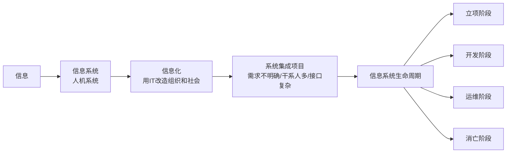

# T-INFO-001｜信息化、信息系统生命周期与系统集成基础

> 本专题用于学习"信息化与系统集成基础"中的核心总览内容：**信息与信息化的概念、信息系统生命周期（立项/开发/运维/消亡）、系统集成项目的特点、信息化与项目管理的对接点**。它不与 ERP/CRM/SCM 等具体应用专题重复，而是提供一个基础框架。

---

## 先看这个专题的主线

信息化与系统集成基础是上午选择题的固定考点（通常 3-5 分），内容分布较散——既有概念题（信息 vs 信息化）、生命期题（各阶段做什么）、技术题（开发方法、测试）、也有法规题（监理、资质）。

---

## 信息、信息系统与信息化

> **[概念组｜三个基本概念]**
>
> - **信息**：经过加工后能减少不确定性的内容。数据是信息的载体，信息是有含义的数据。
> - **信息系统**：由人、流程、数据、硬件、软件和网络共同构成的人机系统。核心功能：输入→处理→输出→反馈。
> - **信息化**：利用信息技术改造组织业务流程、管理方式和社会活动的过程。**信息化 ≠ 采购设备**。

---

## 信息系统生命周期

> **[概念组｜信息系统生命周期四阶段]**
>
> 1. **立项阶段**：提出系统建设的初步设想，形成项目建议书，进行可行性研究。
> 2. **开发阶段**：需求分析→系统设计→编码实现→测试。最终产出可交付的信息系统。
> 3. **运维阶段**：系统投入使用后的运行维护、用户支持、性能优化、缺陷修复。
> 4. **消亡阶段**：系统因技术落后、业务变化或成本过高被替代或退役。

> **[辨析｜信息系统生命周期 vs 项目生命周期 vs 产品生命周期]**
> - 信息系统生命周期：围绕一个信息系统从生到死的全过程（含运维和消亡）。比项目生命周期长。
> - 项目生命周期：一个项目从启动到收尾的阶段。系统集成项目只覆盖信息系统生命周期中的立项和开发阶段（有时含运维前期）。
> - 产品生命周期：产品从概念到退出市场的全过程。更偏商业视角。

---

## 系统集成项目的特点

系统集成项目为什么比普通项目更难管？因为它有几个鲜明的特征：

- **需求不明确**：客户常常说不清到底要什么，需要项目过程中不断澄清和确认→需求管理和变更管理极为重要
- **干系人多**：涉及建设方、承建方、监理方、最终用户、运维团队等多方→干系人管理和沟通管理挑战大
- **软硬件服务组合**：不只是软件，还包括硬件、网络、培训、运维等多种交付物→范围管理和采购管理复杂
- **接口和集成点多**：不同子系统之间的联调、数据交换、协议对接→质量管理和配置管理要求高
- **变更频繁**：需求变化、技术更新、环境改变→变更控制必须严格

---

## 典型题详解与举一反三

> **例题 1｜信息 vs 信息化**
>
> 以下哪项描述的是"信息化"而非"信息系统"？
>
> A. 企业内部的 ERP 管理平台
> B. 政府部门的网上办事大厅
> C. 用信息技术改造组织的业务流程
> D. 学校的教务管理系统

A、B、D 都是具体的信息系统（产品）。C 描述的是一个**过程**（用 IT 改造）→ 这是信息化。正确答案是 **C**。

**可制卡点：** 信息系统（产品/系统）vs 信息化（过程/活动）辨析卡。

---

> **例题 2｜生命周期辨析**
>
> 某系统集成项目交付了一个财务管理系统。该系统后续的日常使用、数据备份、软件升级属于哪个阶段？
>
> A. 项目生命周期
> B. 信息系统生命周期的运维阶段
> C. 立项阶段
> D. 开发阶段

交付后→日常使用和维护→运维阶段。这已经超出了项目生命周期（项目在交付后就结束了），但属于信息系统生命周期的运维阶段。正确答案是 **B**。

**可制卡点：** 信息系统生命周期各阶段判断卡。

---

> **例题 3｜系统集成项目特点**
>
> 系统集成项目与其他类型项目相比，最突出的特征之一是：
>
> A. 团队规模小
> B. 需求明确且稳定
> C. 需求常常不明确、变更频繁
> D. 不涉及技术和管理的交叉

正确答案是 **C**。需求不明确和变更频繁是系统集成项目最核心的特点。

**可制卡点：** 系统集成项目四大特点卡。

---

> **例题 4｜信息系统生命周期与项目生命周期的关系**
>
> 一个系统集成项目的项目生命周期通常覆盖信息系统生命周期的哪些阶段？
>
> A. 全部四阶段
> B. 立项 + 开发阶段（有时含运维前期）
> C. 仅运维和消亡阶段
> D. 仅开发阶段

正确答案是 **B**。系统集成项目通常从立项后开始，到系统交付完成结束，覆盖立项和开发阶段，有时含运维初期的支持。

**可制卡点：** 两种生命周期的交叉关系卡。

---

## 这个专题应该怎样转化为 Anki 卡片

**概念卡**：信息、信息系统、信息化、信息系统生命周期四阶段、系统集成项目特征。

**辨析卡**：信息系统生命周期 vs 项目生命周期 vs 产品生命周期、信息系统 vs 信息化。

**陷阱卡**："信息化就是上系统"→ 错，信息化是用 IT 改造组织的过程，不是采购软件。

---

## 本专题的最小掌握标准

至少能做到：① 区分信息、信息系统、信息化三个概念；② 说出信息系统生命周期的四个阶段并判断给定活动属于哪个阶段；③ 识别系统集成项目的五个核心特征；④ 区分信息系统生命周期和项目生命周期。

---

## 待核验与后续改进

- 信息化体系的具体要素（如国家信息化体系六要素）在教程中的表述需确认。[待核验]
- 建议与 T-INFO-002（ERP/CRM/SCM/EAI/BI）和 T-INFO-004（开发方法与测试）组合学习，构成本知识域的完整覆盖。
