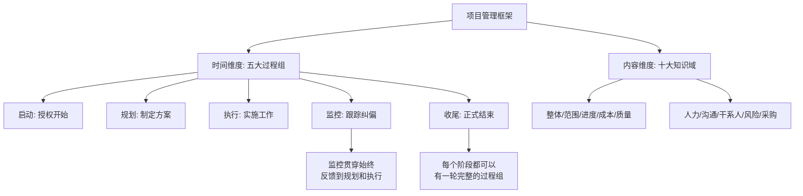
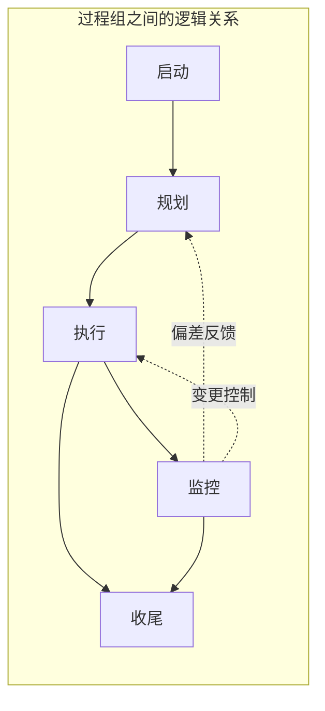
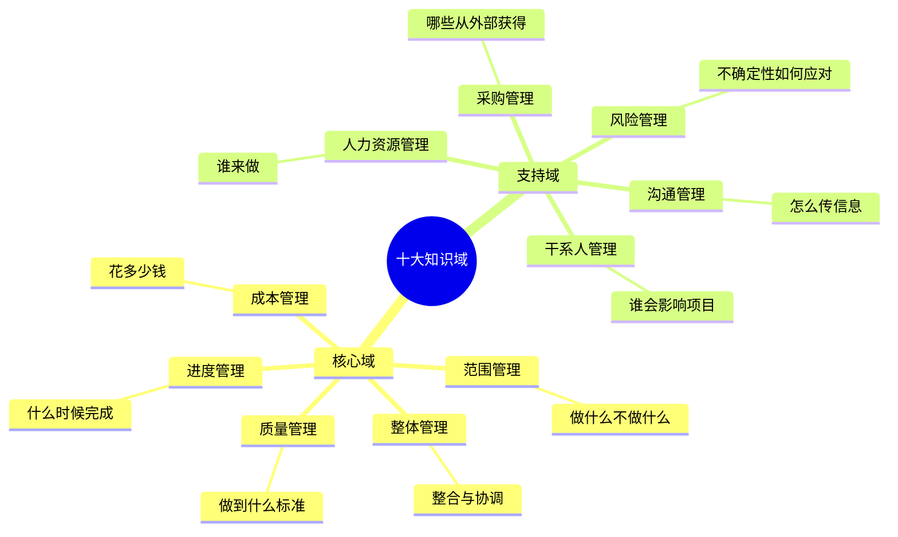
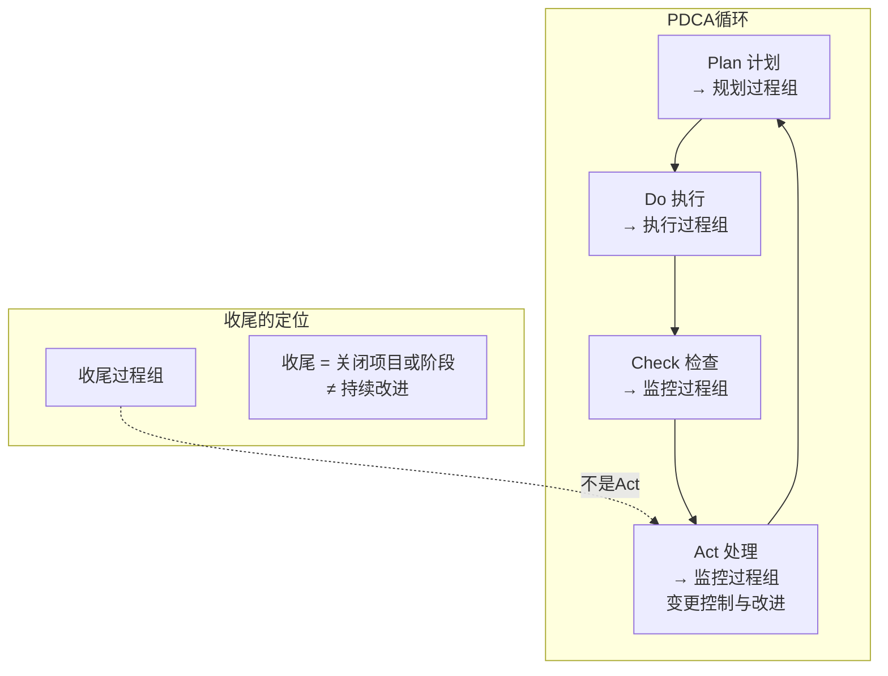
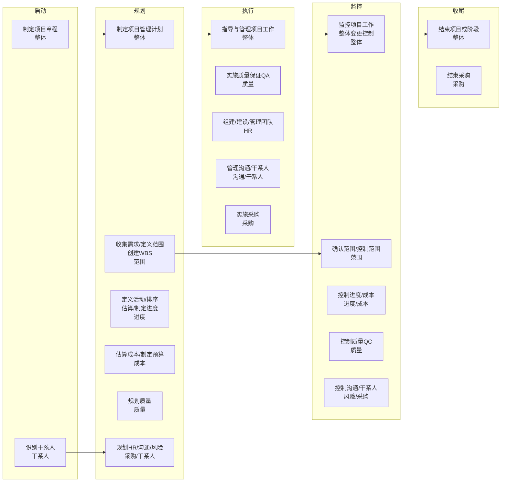
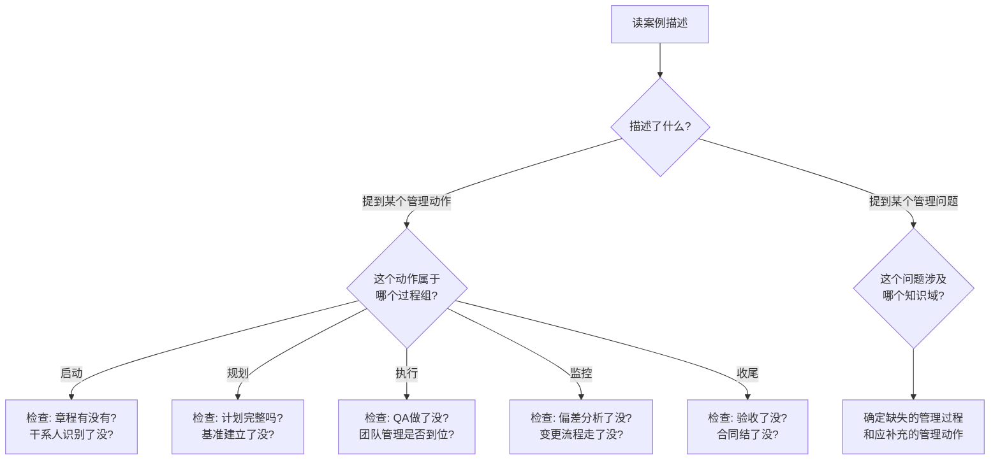
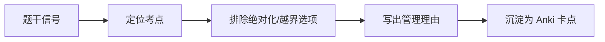

# T-PM-002｜五大过程组、十大知识域与 PDCA

> 本专题用于学习"项目管理基础"中为后续所有知识域提供框架的一组核心内容：**五大过程组（启动、规划、执行、监控、收尾）、十大知识领域、过程组与知识域的矩阵关系、PDCA 循环、项目阶段与过程组的关系、关键管理过程的过程组归属**。它们不是需要死记硬背的列表，而是围绕一个核心问题展开：**项目管理工作从开始到结束，要在哪些方面、按什么节奏、用什么逻辑来组织？这个框架怎样帮你快速定位案例题中的问题属于哪个管理领域？**

---

## 先看这个专题的主线

很多同学第一步就是背"五大过程组、十大知识域、47 个过程"，但背完仍然不知道怎么用。因为过程组和知识域不是"目录"——它们是项目经理的"工作组织框架"。理解这个框架的关键在于回答两个问题：**在什么时间维度上管理（过程组），在什么内容维度上管理（知识域）。**

更关键的是：**软考不是让你默写过程组和知识域的名字，而是把它们当作"定位系统"——看到案例题中某个管理动作，立刻能判断它属于哪个过程组、哪个知识域，进而判断它做得对不对、缺了什么。**

这张图是整个项目管理知识体系的骨架。**监控过程组不是只在"执行完了才检查"——它从启动之后就一直在运转。收尾过程组也不是"PDCA 的 Act"——收尾是关闭项目，Act 是持续改进。**

---

## 为什么不能只按知识域学习？

很多同学按知识域一个一个学——范围管理学完学进度、进度学完学成本——这样学完一门忘一门，而且无法理解过程之间的联系。

问题在于：**任何一个真实的管理场景都同时跨越多个知识域和多个过程组。** 比如"客户要求加功能"这个场景，涉及：
- **范围管理**（范围蔓延）
- **变更管理**（是否需要走 CCB）
- **进度管理**（加了功能工期会不会延长）
- **成本管理**（加了功能成本会不会超支）
- **沟通管理**（变更后要通知谁）
- **干系人管理**（客户为什么绕过项目经理直接找开发人员）

所以，**过程组给你时间轴（事情做到哪一步了），知识域给你检查清单（该做哪些方面的事）。** 两者结合才是一个完整的项目管理思维框架。

---

## 五大过程组：管理的"时间维度"

> **[概念组｜五大过程组]**
>
> 1. **启动过程组**：定义一个新项目或现有项目的一个新阶段，授权开始该项目或阶段。核心输出：**项目章程**（批准项目存在、任命项目经理、授权动用资源）、**识别干系人**（形成干系人登记册）。
> 2. **规划过程组**：明确项目范围，优化目标，为实现目标制定行动方案。核心输出：**项目管理计划**（整合所有子管理计划和三大基准——范围基准、进度基准、成本基准）。
> 3. **执行过程组**：完成项目管理计划中确定的工作，满足项目规范要求。核心活动：协调资源、管理团队、**实施质量保证（QA）**、管理干系人参与、实施采购。
> 4. **监控过程组**：跟踪、审查和调整项目进展与绩效，识别偏差并启动变更。核心活动：**控制范围/进度/成本/质量**、**确认范围**、监控风险、实施整体变更控制、监控沟通和干系人参与。
> 5. **收尾过程组**：完结所有过程组的所有活动，正式结束项目或阶段。核心活动：获得验收、移交成果、总结经验教训、归档文件、释放资源。

> **[关键辨析｜过程组 ≠ 阶段]** 过程组不是项目生命周期的阶段。项目生命周期是按时间顺序排列的阶段（如需求→设计→开发→测试→部署），而过程组可以在每个阶段内重复出现。例如，在"设计阶段"内部，可能先启动（授权进入设计阶段），再规划（制定设计计划），再执行（做设计），再监控（评审设计质量），再收尾（阶段交付评审）。**所以五大过程组会"在每个阶段内滚一轮"，而不是整个项目只滚一轮。**

这个辨析是选择题的高频考点。题目可能说"五大过程组就是项目的五个阶段"——**错**。可能说"每个阶段只包含一个过程组"——**错**。

---

## 十大知识域：管理的"内容维度"

系统集成项目管理工程师的十大知识域及核心管理问题：

| 知识域 | 核心管理问题 | 关键词 |
|---|---|---|
| 整体管理 | 如何把所有要素整合为协调一致的整体 | 章程、计划、执行、监控、变更、收尾 |
| 范围管理 | 项目要做什么、不做什么 | WBS、范围说明书、需求、确认、蔓延 |
| 进度管理 | 项目什么时候完成 | 活动、网络图、关键路径、PERT、压缩 |
| 成本管理 | 项目要花多少钱 | 估算、预算、挣值、EAC、超支 |
| 质量管理 | 项目产出物应达到什么标准 | QA、QC、审计、工具、缺陷 |
| 人力资源管理 | 谁来做、团队如何组织和建设 | RAM、OBS、激励、冲突、培训 |
| 沟通管理 | 谁需要什么信息、怎么传递 | 渠道、模型、推拉交互、计划 |
| 干系人管理 | 谁对项目有影响、如何让他们参与 | 识别、分析、参与度、策略 |
| 风险管理 | 不确定性如何影响项目、如何应对 | 识别、定性、定量、EMV、应对策略 |
| 采购管理 | 哪些工作从外部获得、如何合同管理 | 自制外购、合同类型、招投标、收尾 |

每个知识域在五大过程组中有对应的管理过程。举例：

- **范围管理**：规划过程组有"规划范围管理、收集需求、定义范围、创建 WBS"；监控过程组有"确认范围、控制范围"。范围管理在启动和收尾过程组中没有直接过程。
- **质量管理**：规划过程组有"规划质量管理"；执行过程组有"实施质量保证（QA）"；监控过程组有"控制质量（QC）"。
- **整体管理**：是唯一在所有五个过程组都有过程的知识域（制定项目章程→启动，制定项目管理计划→规划，指导与管理项目工作→执行，监控项目工作+实施整体变更控制→监控，结束项目或阶段→收尾）。

> **[关键理解]** 知道每个关键过程属于哪个过程组，是选择题中快速判断"这项管理活动应该什么时候做"的基础。如果题目说"在规划阶段进行质量控制"，就明显不对——QC 属于监控过程组，虽然在执行阶段进行，但归类上属于监控。

---

## PDCA 循环与过程组的关系

> **[概念｜PDCA]** PDCA 循环（Plan-Do-Check-Act）是由休哈特提出、戴明推广的持续改进循环。在项目管理中：
>
> - **Plan（计划）** → 对应**规划过程组**：确定目标、制定方案
> - **Do（执行）** → 对应**执行过程组**：按计划开展工作
> - **Check（检查）** → 对应**监控过程组**：测量绩效、发现偏差
> - **Act（处理/行动）** → 对应**监控过程组中的变更控制与改进活动**：根据检查结果采取纠正或预防措施

> **[高频陷阱｜收尾过程组 ≠ PDCA 的 Act]** 这是一个非常细微但常考的陷阱。PDCA 的 Act 阶段是"根据检查结果采取纠正或改进措施"——这在项目管理中属于监控过程组中的变更控制活动。**收尾过程组不对应 Act。** 收尾是对整个项目（或阶段）的关闭和移交——它是一次性的结束动作，而不是循环改进的一部分。

---

## 过程组 × 知识域矩阵：考试定位系统

以下矩阵帮助你快速判断每个管理过程属于哪个过程组和知识域。**记住关键过程的位置，是做选择题和案例题时的基础导航能力。**

> **[速记口诀]** 常考的过程组归属：
> - 确认范围 → **监控**（不是执行）
> - 实施质量保证 QA → **执行**（不是监控）
> - 控制质量 QC → **监控**（不是执行）
> - 实施整体变更控制 → **监控**
> - 制定项目章程 → **启动**
> - 制定项目管理计划 → **规划**
> - 指导与管理项目工作 → **执行**
> - 识别干系人 → **启动**
> - 结束项目或阶段 → **收尾**

**QA 和 QC 的过程组归属是最常考的一组对比**：QA 在执行过程组（因为质量保证是做出来的，不是检查出来的），QC 在监控过程组（因为质量控制的核心是测量和判断）。

---

## 案例题中如何利用过程组/知识域框架定位问题

这个框架在下午案例题中是最核心的"定位系统"。当你读到一个案例场景时，可以用以下流程快速归类：

这个流程的价值在于：**你不会拿到案例题后脑子一片空白。** 你有一个清晰的分析路径：先判断题干描述的场景处于项目生命周期的什么位置（过程组视角），再判断问题涉及哪些管理方面（知识域视角），最后交叉定位到具体缺失的管理过程。

---

## 典型题详解与举一反三

> **例题 1｜过程组 vs 阶段（高频）**
>
> 以下关于项目过程组和项目阶段的说法，哪项是正确的？
>
> A. 五大过程组就是项目的五个阶段
> B. 每个项目阶段内可以包含全部五个过程组
> C. 过程组必须按顺序严格执行，不能重叠
> D. 启动过程组只在项目开始时执行一次

正确答案是 **B**。过程组不是阶段——阶段是按时间排列的（需求→设计→编码→测试），每个阶段内部都可以有一轮完整的过程组。A 混淆了概念；C 错在监控过程组贯穿始终，与其他过程组重叠；D 错在每个阶段开始时都可能需要启动过程来授权进入该阶段。

**延伸理解：** 这个辨析是你理解整个项目管理框架的基础。如果过程组=阶段，那一个阶段内只能做一件事——这显然不符合现实。大型项目的设计阶段内部，可能先启动（授权开始设计）、再规划（制定设计计划）、再执行（做设计）、再监控（设计评审）、再收尾（设计交付），这就是一轮过程组在单个阶段内的体现。

**可制卡点：** 过程组 vs 阶段的两句话辨析卡。关键词判断卡：看到"阶段"想到时间顺序，看到"过程组"想到管理活动类型。

---

> **例题 2｜PDCA 对应关系（高频陷阱）**
>
> 在 PDCA 循环中，项目管理中的收尾过程组最接近哪个环节？
>
> A. Plan
> B. Do
> C. Check
> D. Act
> E. 收尾过程组不对应 PDCA 的任何单一环节

正确答案是 **E**。这是本专题最核心的辨析。PDCA 的 Act = 根据检查结果采取改进措施 → 属于监控过程组中的变更控制活动。收尾是关闭项目/阶段，是一次性的结束动作，不在 PDCA 循环中。很多人会误选 D（Act），就是混淆了"收尾"和"改进"。

**延伸理解：** PDCA 循环是一种**持续改进**的思维方式，它假设工作会不断循环——计划→执行→检查→改进→再计划→……。而收尾是**终结**一个项目或阶段——不会再循环了。所以收尾天然就不属于 PDCA 循环。

**可制卡点：** "收尾 ≠ Act"陷阱卡。PDCA 四环节与过程组对应关系卡。

---

> **例题 3｜知识域在不同过程组的分布**
>
> 关于"确认范围"过程，以下哪种说法正确？
>
> A. 它属于规划过程组
> B. 它属于执行过程组
> C. 它属于监控过程组
> D. 它属于收尾过程组

确认范围是监控过程组的过程。正确答案是 **C**。

很多人误以为"确认=验收=收尾"或"确认发生在执行阶段=执行过程组"。但过程组是**按管理活动的性质**归类的——确认范围的核心是对已完成可交付成果的审查和正式验收，本质是"检查和判断"，所以归属监控过程组。

**延伸理解：** 类似容易混淆的归属还有：实施质量保证 QA → 执行过程组（不是监控！），控制质量 QC → 监控过程组（不是执行！）。QA 是"在做中保证质量"，所以归执行；QC 是"测量和判断是否合格"，所以归监控。

**可制卡点：** 确认范围/QA/QC/整体变更控制的过程组归属速记卡。

---

> **例题 4｜QA vs QC 过程组归属（高频）**
>
> "实施质量保证"属于哪个过程组？
>
> A. 规划
> B. 执行
> C. 监控
> D. 收尾

实施质量保证（QA）属于**执行过程组**。正确答案是 **B**。

注意区分：QA 在执行过程组——它的核心是审计过程、推动过程改进，这些是在执行阶段进行的活动。QC 在监控过程组——它的核心是测量结果是否符合标准。**QA 管过程、在执行；QC 管结果、在监控。**

**可制卡点：** QA（执行）vs QC（监控）辨析卡。附带过程组速记表。

---

> **例题 5｜整体变更控制的过程组归属**
>
> 项目经理收到一个变更请求，组织团队进行了影响分析，并将分析结果提交给 CCB 审批。这个过程属于：
>
> A. 规划过程组
> B. 执行过程组
> C. 监控过程组
> D. 收尾过程组

实施整体变更控制属于**监控过程组**。正确答案是 **C**。

变更控制为什么属于监控？因为它的本质是"发现了计划与实际之间的差距（或潜在差距），通过变更流程来管理这种差距"——这恰恰是监控过程组的核心功能。监控不只是"看看"，也包括"根据看到的情况做调整"。

**延伸理解：** 一个常见的误解是"变更是新的工作，所以属于执行"——不对。变更控制的重点是**审查、评估、批准/否决**变更请求，而不是实施变更本身。批准后的变更实施可能涉及执行过程组，但**变更控制本身是监控活动**。

**可制卡点：** 整体变更控制 → 监控过程组 判断卡。

---

> **例题 6｜综合场景：过程组与知识域交叉定位**
>
> 某项目的项目经理在做以下工作时：
> ① 编写项目管理计划
> ② 对已完成模块进行测试
> ③ 评估一个变更请求对进度的影响
> ④ 邀请客户正式验收已完成的可交付成果
>
> 以上四项活动分别属于什么过程组？
>
> A. 规划、监控、监控、收尾
> B. 规划、监控、规划、监控
> C. 规划、监控、执行、收尾
> D. 执行、监控、监控、监控

逐一分析：① 编写项目管理计划 → 规划过程组；② 测试（控制质量 QC）→ 监控过程组；③ 评估变更请求影响（整体变更控制的一部分）→ 监控过程组；④ 邀请客户正式验收（确认范围）→ 监控过程组。正确答案是 **A**。

**延伸理解：** 这道题的④特别容易错——很多人把"验收"和"收尾"关联，会选④属于收尾过程组。但请注意：**确认范围**（邀请客户验收可交付成果）属于**监控过程组**，而**收尾过程组**中的"验收"是整个项目的最终验收和移交。两者的区别在于：确认范围是**过程中的验收**（每完成一个可交付成果就验收一次），收尾是**项目级的验收**（项目结束时验收整个项目的成果）。

**可制卡点：** 关键管理动作 → 过程组归属的综合判断卡。

---

> **例题 7｜案例题综合训练：识别管理缺失**
>
> 阅读以下案例片段，从过程组和知识域的框架分析管理中存在的问题。
>
> "某系统集成项目启动后，项目经理直接带领团队开始编码。三个月后，客户提出需求变更，项目经理口头同意，开发人员加班完成。项目进行到第五个月，客户投诉很多功能不符合预期，测试团队反映 bug 数量急剧增加，进度滞后约两个月。"

**过程组视角分析**：
- **启动过程组缺失**：项目启动后直接编码，说明没有正式的项目章程？[待核验] 题干未提。
- **规划过程组严重缺失**：直接编码意味着没做 WBS、没做进度计划、没做质量计划、没做风险管理计划。三个月后客户投诉"功能不符合预期"——本质是需求收集和范围定义没做好。
- **监控过程组严重缺失**：需求变更口头同意 = 变更控制缺失；bug 激增但到第五个月才反映 = 质量控制缺失；进度滞后两个月才被发现 = 进度控制缺失。
- **执行过程组有动作但质量不可靠**：团队加班完成变更但没有 QA 过程保证。

**知识域视角分析**：
- 范围管理：需求不明确，口头变更为范围蔓延
- 变更管理：没有正式变更流程
- 质量管理：没有测试计划和质量控制点
- 进度管理：没有进度基准所以无法判断偏差
- 沟通管理：客户投诉说明期望管理缺失

**延伸理解：** 这个案例展示了过程组×知识域框架作为诊断工具的价值。你不需要事先知道"答案"，而是用框架逐一检查——启动做了什么？规划做了什么？监控做了什么？每个知识域在这个阶段应该有什么输出？一一对照，缺失的管理过程就暴露出来了。

**可制卡点：** 过程组×知识域诊断框架卡（可作为案例题答题起点）。

---

## 本轮真题覆盖增强：过程组归属与 PDCA 定位

本节把 `questions.full.clean.md` 与既有真题映射中的高频考法反查回本专题。题库反复考“创建 WBS 属于规划过程组”“过程组不是项目阶段”“PDCA 与监控闭环”。 学习时不要只背定义，要能从题干信号判断它在考哪一个管理动作或技术边界。

这类题的识别链路可以这样看：

图里的重点是“先定位，再排错”。软考选择题常用绝对化说法、角色越权、流程跳步来制造干扰；下午案例题则把同一个错误包装成多句背景，需要把事实翻译回管理过程。

> **例题｜过程组归属与 PDCA 定位（真题型改编训练题）**
>
> 创建 WBS 在项目管理过程组中通常属于：
>
> A. 启动过程组  
> B. 规划过程组  
> C. 执行过程组  
> D. 收尾过程组

**考查点：** 过程组归属、范围管理与规划动作。

**题干关键词：** 创建 WBS、规划、范围基准。

**解题过程：** WBS 是把范围说明书进一步分解为可管理工作包，为进度、成本、责任和验收奠定基础，因此是规划动作。

**正确答案：** B。

**错项分析：**

- A 启动侧重章程和初始干系人识别。
- C 执行侧重完成计划中的工作，不是建立范围基准。
- D 收尾侧重验收、归档和经验教训。

**举一反三：** 凡是“制定计划、建立基准、分解范围、估算成本/进度”，优先归入规划；凡是“按计划完成工作”，才是执行。

**可制卡点：** 创建 WBS 属于哪个过程组；过程组 vs 阶段；PDCA 中 Check/Act 与监控纠偏。

## 这个专题应该怎样转化为 Anki 卡片

**概念卡**：五大过程组的定义和核心输出。十大知识域的核心管理问题。每张概念卡附带一个典型场景——例如"制定项目管理计划 → 规划过程组 → 整体管理"。

**辨析卡（本专题最重要的卡型）**：
- 过程组 vs 阶段
- PDCA 的 Act vs 收尾过程组
- QA（执行）vs QC（监控）
- 确认范围（监控）vs 项目收尾（收尾）
- 整体变更控制（监控）vs 指导与管理项目工作（执行）

**结构卡**（推荐用表格形式或矩阵图做卡）：
- 常考管理过程的过程组归属表（确认范围→监控、QA→执行、QC→监控、制定章程→启动、制定计划→规划、整体变更控制→监控、结束项目→收尾）

**案例定位卡**：
- 题干描述一个管理动作 → 判断属于哪个过程组和知识域
- 题干描述一个管理问题 → 判断哪个过程组/知识域缺失

**陷阱卡**：
- "启动过程组只在项目开始时执行一次"——错
- "五大过程组就是项目的五个阶段"——错
- "收尾过程组对应 PDCA 的 Act"——错
- "确认范围属于收尾过程组"——错
- "QA 属于监控过程组"——错

**暂不制卡内容**：完整的 47 个过程列表（不需要全背，背关键归属即可）、每个知识域的全部 ITTO（输入输出工具技术，这些在各自知识域专题中再处理）。

---

## 本专题的最小掌握标准

学完本专题后，你至少应该能做到五件事。

第一，能解释过程组和阶段的本质区别——过程组是按管理活动类型分的（不是按时间），每个阶段内可以包含全部过程组。第二，能正确说出五个过程组各自的核心管理焦点和关键输出（启动→章程+干系人；规划→管理计划+三大基准；执行→QA+团队管理+采购；监控→QC+确认范围+变更控制；收尾→验收+移交+归档）。第三，知道 PDCA 的 Act 对应监控过程组中的变更控制和改进活动，收尾过程组不对应 PDCA 的任何单一环节。第四，对常考管理过程能立即说出其过程组归属（确认范围→监控、QA→执行、QC→监控、整体变更控制→监控、制定章程→启动、制定计划→规划）。第五，在案例题中能使用"过程组×知识域"框架作为诊断工具——逐一检查每个过程组在每个知识域上的管理动作是否到位，缺失什么就写什么。

如果你能做到这五件事，这个专题就不是"背过了"，而是已经建立了整个项目管理知识体系的导航系统——后续学习每个具体知识域专题时，你都能自动把它放到正确的位置上。

---

## 待核验与后续改进

- 软考教程第二版中过程的数量和名称可能与 PMBOK 第五版/第六版存在差异，本专题的关键归属判断以系统集成项目管理工程师教程为准。[待核验]
- "确认范围"在考试中的过程组归属是否被所有真题一致归类为监控过程组，建议用 1-2 道真题验证。[待核验]
- 十大知识域的名称中，教材使用"项目时间管理"还是"项目进度管理"需确认（PMBOK 中文版演进中有过调整）。[待核验]
