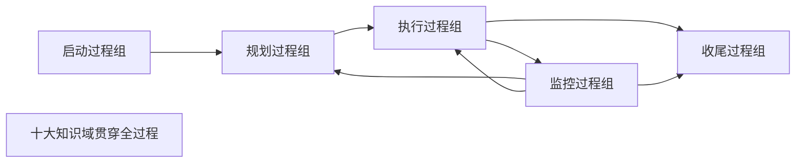

# T-PM-002｜五大过程组、十大知识域与 PDCA

> 本专题用于学习"项目管理基础"中为后续所有知识域提供框架的一组核心内容：**五大过程组（启动、规划、执行、监控、收尾）、十大知识领域、过程组与知识域的矩阵关系、PDCA 循环、项目阶段与过程组的关系**。它们不是需要死记硬背的列表，而是围绕一个核心问题展开：**项目管理工作从开始到结束，要在哪些方面、按什么节奏、用什么逻辑来组织？**

---

## 先看这个专题的主线

很多同学第一步就是背"五大过程组、十大知识域、47 个过程"，但背完仍然不知道怎么用。因为过程组和知识域不是"目录"——它们是项目经理的"工作组织框架"。理解这个框架的关键在于回答两个问题：**在什么时间维度上管理（过程组），在什么内容维度上管理（知识域）。**

这张图有两个重要信息：第一，过程组之间不是严格的线性关系——**监控过程组贯穿始终**，它随时把偏差反馈回规划和执行；第二，十大知识域不是按过程组切割的，每个知识域都可能在多个过程组中有对应的管理过程。

---

## 五大过程组：管理的"时间维度"

> **[概念组｜五大过程组]**
>
> 1. **启动过程组**：定义一个新项目或现有项目的一个新阶段，授权开始该项目或阶段。核心输出：项目章程、识别干系人。
> 2. **规划过程组**：明确项目范围，优化目标，为实现目标制定行动方案。核心输出：项目管理计划（含各子计划和基准）。
> 3. **执行过程组**：完成项目管理计划中确定的工作，满足项目规范要求。核心活动：协调资源、管理团队、实施质量保证、管理干系人参与。
> 4. **监控过程组**：跟踪、审查和调整项目进展与绩效，识别偏差并启动变更。核心活动：控制范围/进度/成本/质量、监控风险、实施整体变更控制。
> 5. **收尾过程组**：完结所有过程组的所有活动，正式结束项目或阶段。核心活动：获得验收、移交成果、总结经验教训、归档文件。

> **[关键辨析｜过程组 ≠ 阶段]** 过程组不是项目生命周期的阶段。一个项目阶段内（如设计阶段），可能完整地经历启动、规划、执行、监控、收尾五组过程。所以过程组可以在每个阶段内重复出现，而阶段是按时间顺序排列的。

---

## 十大知识域：管理的"内容维度"

系统集成项目管理工程师的十大知识域是：

| 知识域 | 核心管理问题 |
|---|---|
| 整体管理 | 如何把所有要素整合为协调一致的整体 |
| 范围管理 | 项目要做什么、不做什么 |
| 进度管理 | 项目什么时候完成 |
| 成本管理 | 项目要花多少钱 |
| 质量管理 | 项目产出物的标准是什么、如何达到 |
| 人力资源管理 | 谁来做什么、团队如何组织 |
| 沟通管理 | 谁需要什么信息、怎么传递 |
| 干系人管理 | 谁对项目有影响、如何让他们参与 |
| 风险管理 | 不确定性如何影响项目、如何应对 |
| 采购管理 | 哪些工作从外部获得、如何合同管理 |

每个知识域在五大过程组中有对应的管理过程。例如"范围管理"在规划过程组有"规划范围管理、收集需求、定义范围、创建 WBS"，在监控过程组有"确认范围、控制范围"——但范围管理在启动和收尾过程组中没有直接的过程。

---

## PDCA 与过程组的关系

> **[概念｜PDCA]** PDCA 循环（Plan-Do-Check-Act）是由休哈特提出、戴明推广的持续改进循环。在项目管理中：
>
> - **Plan（计划）** → 对应规划过程组
> - **Do（执行）** → 对应执行过程组
> - **Check（检查）** → 对应监控过程组
> - **Act（行动/处理）** → 对应监控过程组中的变更控制和改进活动

注意：**收尾过程组不对应 Act。** 这是一个常考的陷阱。PDCA 的 Act 阶段是"根据检查结果采取纠正或改进措施"——这在项目管理中属于监控过程组中的变更控制活动，而不是收尾。收尾是对整个项目（或阶段）的关闭和移交。

---

## 典型题详解与举一反三

> **例题 1｜过程组 vs 阶段**
>
> 以下关于项目过程组和项目阶段的说法，哪项是正确的？
>
> A. 五大过程组就是项目的五个阶段
> B. 每个项目阶段内可以包含全部五个过程组
> C. 过程组必须按顺序严格执行，不能重叠
> D. 启动过程组只在项目开始时执行一次

正确答案是 **B**。过程组不是阶段，每个阶段都可以有自己的一轮过程组。A 错在混淆；C 错在过程组可以重叠（如监控贯穿始终）；D 错在启动过程组可能在每个阶段开始时重新执行（如授权进入下一阶段）。

**可制卡点：** 过程组 vs 阶段辨析卡。

---

> **例题 2｜PDCA 对应**
>
> 在 PDCA 循环中，项目管理中的收尾过程组最接近哪个环节？
>
> A. Plan
> B. Do
> C. Check
> D. 收尾过程组不对应 PDCA 的任何单一环节

正确答案是 **D**。PDCA 的 Act 对应的是持续改进和变更控制，而不是收尾。收尾是关闭项目/阶段，不是一个"改进已有工作"的动作。

**延伸理解：** PDCA 是一个循环，它会不断转。收尾是一次性的结束。所以收尾不等于 Act。这个点非常细微但常考。

**可制卡点：** PDCA 与过程组对应关系卡（含"收尾 ≠ Act"陷阱）。

---

> **例题 3｜知识域在不同过程组的分布**
>
> 关于"确认范围"过程，以下哪种说法正确？
>
> A. 它属于规划过程组
> B. 它属于执行过程组
> C. 它属于监控过程组
> D. 它属于收尾过程组

确认范围是监控过程组的过程，与控制范围一起属于范围管理的监控活动。正确答案是 **C**。

**延伸理解：** 很多人误以为"确认"在执行过程组——因为验收发生在执行阶段。但项目管理的归类逻辑是：确认范围是对已完成可交付成果的审查和正式验收，其本质是"检查和判断"，所以归入监控过程组。

**可制卡点：** 关键过程的"过程组归属"卡。

---

> **例题 4｜过程的归属**
>
> "实施质量保证"属于哪个过程组？
>
> A. 规划
> B. 执行
> C. 监控
> D. 收尾

实施质量保证（QA）属于**执行过程组**。注意和"控制质量（QC）"区分——QA 在执行过程组，QC 在监控过程组。正确答案是 **B**。

**延伸理解：** 类似地：指导与管理项目工作 → 执行；实施整体变更控制 → 监控；结束项目或阶段 → 收尾；制定项目管理计划 → 规划；制定项目章程 → 启动。这些归属关系在做选择题和案例题时常常被当作背景知识使用。

**可制卡点：** 关键过程的过程组归属速记卡。

---

## 这个专题应该怎样转化为 Anki 卡片

**概念卡**：五大过程组的定义 + 核心输出；十大知识域的核心管理问题。

**辨析卡**：过程组 vs 阶段、PDCA vs 过程组（收尾 ≠ Act）、QA（执行）vs QC（监控）。

**结构卡**：过程组和知识域的矩阵关系——哪些知识域在哪些过程组有过程。不需要全背，但要背关键的"归属"（如确认范围→监控，实施质量保证→执行）。

**陷阱卡**："启动过程组只在项目开始时执行一次"——错，每个阶段开始时可能都要启动。

---

## 本专题的最小掌握标准

学完本专题后，你至少应该能做到四件事。

第一，能解释过程组和阶段的区别——过程组不是按时间切分的阶段，每个阶段内可以包含所有过程组。第二，知道五个过程组的核心输出和管理焦点。第三，知道 PDCA 的 Act 对应的是变更控制和改进（监控过程组），不是收尾。第四，对关键管理过程能说出它们属于哪个过程组——这是后续所有专题学习的基础框架。

---

## 待核验与后续改进

- 软考教程第二版中过程的数量可能与 PMBOK 第五版/第六版存在差异，具体过程清单以教程为准。[待核验]
