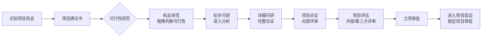

# T-FEA-001｜立项管理：项目建议书、可行性研究与项目论证

> 本专题用于学习"项目立项管理"的核心内容：**项目建议书、可行性研究（内容与七步法）、机会研究与初步/详细可研、项目论证与项目评估、投资估算与经济评价基础**。它们围绕一个核心问题展开：**在项目正式启动之前，如何证明这个项目值得做、必须做、可以做？**

---

## 先看这个专题的主线

立项管理是整个项目管理知识体系的前置环节——发生在项目章程之前。很多同学跳过它直接学十大知识域，但选择题和案例题中立项管理是独立考点。

---

## 项目建议书

> **[定义｜项目建议书]** 项目建议书是项目发起人向主管部门报送的，请求批准项目立项的书面文件。它是立项的第一步，内容相对粗略，主要回答"为什么要做这个项目"和"大致要做什么"。

常考内容：项目建议书包含项目的必要性、建设方案（概要）、投资估算（粗略）、预期效益等内容。

---

## 可行性研究：内容与步骤

> **[概念组｜可行性研究]** 可行性研究是对拟建项目在技术、经济、社会、环境等方面的可行性和合理性进行全面分析论证的过程。

**可行性研究的四个主要方面**（常考）：

1. **技术可行性**：技术方案是否成熟可用？团队是否有能力？
2. **经济可行性**：投资回报是否合理？成本效益分析。
3. **社会可行性**：是否符合法律法规、社会伦理、组织文化？
4. **环境可行性**：对环境的影响是否可接受？

**可行性研究七步法**：① 明确目标和范围 → ② 调查研究 → ③ 方案设计 → ④ 方案评估 → ⑤ 推荐方案 → ⑥ 编写报告 → ⑦ 审查和批准。

---

## 机会研究、初步可研与详细可研

> **[辨析｜三级可研]**
>
> - **机会研究**：最粗略的可行性判断。主要回答"有没有机会？值不值得往下看？" 误差通常在 ±30%。
> - **初步可行性研究**：对项目进行初步论证。主要回答"初步看起来是否可行？是否需要进一步做详细可研？" 误差 ±20%。
> - **详细可行性研究**：最完整的可行性分析。主要回答"项目到底能不能做？怎么做最优？" 误差 ±10%。为最终决策提供依据。

> **[考试辨析]** 如果题目问"误差最大、最粗略的可研是哪个"→ 机会研究。问"为最终投资决策提供依据的是哪个"→ 详细可研。

---

## 项目论证与项目评估

> **[辨析｜项目论证 vs 项目评估]**
>
> **项目论证**：项目团队/组织内部对项目的必要性、可行性、合理性进行分析论证。主体是项目方自己。侧重于"我们怎么看这个项目"。
> **项目评估**：由第三方/外部机构/上级主管部门对项目论证结果进行评审，提出独立判断。主体是外部方。侧重于"别人怎么看这个项目"。
>
> 先后顺序：先论证（自己做），后评估（别人审）。

---

## 投资估算与经济评价基础

**投资估算方法**与成本估算方法相通（类比/参数/自下而上）。经济评价主要关注：投资回收期、净现值（NPV）、内部收益率（IRR）等指标。在软考中，这部分多为选择题的识别题，不要求复杂计算。

---

## 典型题详解与举一反三

> **例题 1｜可行性研究内容**
>
> 可行性研究通常不包括以下哪方面？
>
> A. 技术可行性
> B. 经济可行性
> C. 社会可行性
> D. 美学可行性

正确答案是 **D**。四方面是：技术、经济、社会、环境可行性。

**可制卡点：** 可行性研究四方面卡。

---

> **例题 2｜三级可研**
>
> 误差范围最大、内容最粗略的是：
>
> A. 机会研究
> B. 初步可行性研究
> C. 详细可行性研究
> D. 项目评估

正确答案是 **A**。机会研究是三级可研中最粗略的，误差约 ±30%。

**可制卡点：** 三级可研的精度递进卡。

---

> **例题 3｜论证 vs 评估**
>
> 项目论证和项目评估的主要区别在于：
>
> A. 论证在前、评估在后
> B. 论证由外部做、评估由内部做
> C. 评估在前、论证在后
> D. 两者没有区别

正确答案是 **A**。论证（内部先做）→ 评估（外部再审）。B 把主体说反了。

**可制卡点：** 论证 vs 评估的先后和主体辨析卡。

---

> **例题 4｜项目建议书**
>
> 项目建议书的主要作用是：
>
> A. 取代可行性研究报告
> B. 请求主管部门批准项目立项
> C. 详细规划项目的具体实施方案
> D. 作为项目收尾的依据

正确答案是 **B**。项目建议书是立项审批的第一步文件。

**可制卡点：** 项目建议书的作用卡。

---

## 这个专题应该怎样转化为 Anki 卡片

**概念卡**：项目建议书、可行性研究（四方面）、机会研究/初步可研/详细可研（三级）、项目论证、项目评估。每张概念卡附带"它发生在哪个阶段、输入什么、输出什么"。

**辨析卡**：论证 vs 评估（主体不同、先后不同）、三级可研（精度递进）。

**流程卡**：项目建议书 → 机会→初步→详细可研 → 论证 → 评估 → 立项审批的完整流程。

---

## 本专题的最小掌握标准

至少能做到：① 说出可行性研究的四个方面；② 区分三级可研的精度递进关系；③ 区分项目论证（内部）和项目评估（外部/第三方）；④ 知道立项管理的完整流程顺序。

---

## 待核验与后续改进

- 软考教程中立项管理的具体流程节点（特别是审批权限）需与教材核对。[待核验]
- 投资估算的误差容差范围可能因教材版本有差异。[待核验]
