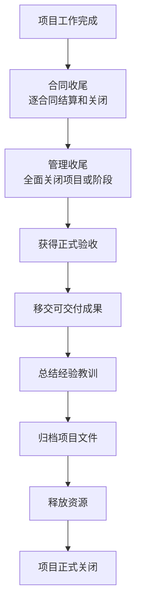
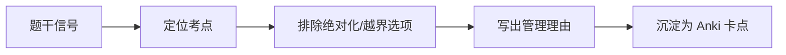

# T-CLOSE-001｜项目收尾：管理收尾、合同收尾与验收

> 本专题用于学习"项目收尾管理"中最容易出辨析题和流程题的核心内容：**管理收尾（行政收尾）与合同收尾的区别、验收与移交、经验教训总结、项目档案归档、资源释放、收尾过程的输入输出**。它们不是"项目做完了签个字"这么简单，而是围绕一个核心问题展开：**如何确保项目的结束不是"人去楼空"，而是有序、完整、可追溯的正式关闭？**

---

## 先看这个专题的主线

收尾管理最容易被轻视——选择题总觉得"收尾没什么可考的"，案例题也经常漏掉收尾环节。但实际上收尾有一组固定的辨析考点：管理收尾 vs 合同收尾、收尾 vs PDCA 的 Act、验收 vs 确认范围。

---

## 管理收尾 vs 合同收尾

> **[高频辨析｜管理收尾 vs 合同收尾]**
>
> **管理收尾（行政收尾）**：项目或阶段结束时的全面收尾活动。包括：获得最终验收、移交成果、总结经验教训、归档文件、释放资源。**每个阶段结束时也做，但项目结束时做最后一次全面收尾。**
>
> **合同收尾**：针对每个合同的收尾活动。包括：确认合同条款已满足、完成合同结算、关闭合同、更新合同记录。**每个合同单独做合同收尾，先做合同收尾，再做管理收尾。**

> **[顺序口诀]** 先合同收尾（每个合同），后管理收尾（整个项目）。合同收尾是管理收尾的前置条件之一。

---

## 验收与确认范围的关系

> **[辨析｜验收 vs 确认范围]**
>
> **确认范围**（监控过程组）：过程中对已完成可交付成果的阶段性验收。发生在项目执行过程中，每个可交付成果完成后都可以做一次确认范围。
> **最终验收**（收尾过程组）：项目或阶段结束时的总体验收。发生在收尾阶段，是对项目整体成果的正式验收和移交。
>
> 两者的关系：多次确认范围 → 最终验收。确认范围是"过程中的验收"，最终验收是"项目级的验收"。

---

## 典型题详解与举一反三

> **例题 1｜收尾顺序**
>
> 项目进入收尾阶段，以下哪个顺序是正确的？
>
> A. 管理收尾 → 合同收尾
> B. 合同收尾 → 管理收尾
> C. 两者同时进行
> D. 不分先后

正确答案是 **B**。先结算每个合同，再全面关闭项目。

**可制卡点：** 合同收尾 → 管理收尾 的顺序卡。

---

> **例题 2｜合同收尾的时机**
>
> 某项目有三个外包合同。合同收尾应该：
>
> A. 在项目结束时统一做一次
> B. 每个合同分别做，完成一个关一个
> C. 在项目启动时就做好
> D. 不需要做合同收尾

每个合同单独结算和关闭。正确答案是 **B**。

**可制卡点：** 多个合同的收尾策略卡。

---

> **例题 3｜收尾 vs PDCA**
>
> 项目收尾过程组对应 PDCA 的哪个环节？
>
> A. Plan
> B. Do
> C. Check
> D. Act
> E. 收尾不对应 PDCA 的任何单一环节

正确答案是 **E**。收尾是关闭项目，不是持续改进循环中的一环。Act 对应的是变更控制和改进（监控过程组）。

**可制卡点：** 收尾 ≠ Act 陷阱卡。

---

> **例题 4｜经验教训总结**
>
> 经验教训总结应该在什么时候做？
>
> A. 只在项目结束时做一次
> B. 在项目整个生命周期中持续进行，项目结束时汇总
> C. 只在出现问题时才做
> D. 不需要做

经验教训总结是贯穿整个项目的过程，不只是在收尾时做。正确答案是 **B**。

**可制卡点：** 经验教训总结的时机判断卡。

---

## 本轮真题覆盖增强：验收、合同收尾与管理收尾

本节把 `questions.full.clean.md` 与既有真题映射中的高频考法反查回本专题。2019 下午合同案例和多类案例题都会追问验收、索赔、归档、经验教训，收尾不是“项目做完就散”。 学习时不要只背定义，要能从题干信号判断它在考哪一个管理动作或技术边界。

这类题的识别链路可以这样看：

图里的重点是“先定位，再排错”。软考选择题常用绝对化说法、角色越权、流程跳步来制造干扰；下午案例题则把同一个错误包装成多句背景，需要把事实翻译回管理过程。

> **例题｜验收、合同收尾与管理收尾（真题型改编训练题）**
>
> 项目已经通过客户验收并移交系统，项目经理接下来仍应重点完成的管理工作是：
>
> A. 删除所有项目文档以避免泄密  
> B. 组织经验教训总结、归档项目文件并完成合同收尾  
> C. 立即启动未经批准的新需求开发  
> D. 让团队自行离场，不再通知干系人

**考查点：** 管理收尾、合同收尾、组织过程资产更新。

**题干关键词：** 验收、移交、归档、经验教训、合同。

**解题过程：** 客户验收只说明成果被接受，项目经理还要完成文件归档、合同结清、资源释放和经验教训沉淀。

**正确答案：** B。

**错项分析：**

- A 破坏组织过程资产和审计证据。
- C 新需求应进入新项目或变更流程。
- D 缺少正式沟通和资源释放安排。

**举一反三：** 案例题问“收尾不妥”时，通常从验收手续、合同结算、文档归档、经验教训和资源释放五个角度找点。

**可制卡点：** 管理收尾 vs 合同收尾；验收通过后还要做什么；经验教训为什么是组织过程资产。

## 这个专题应该怎样转化为 Anki 卡片

**概念卡**：管理收尾、合同收尾、最终验收、经验教训总结。

**辨析卡**：管理收尾 vs 合同收尾、最终验收 vs 确认范围、收尾 vs PDCA Act。

**流程卡**：合同结算→管理收尾→验收→移交→总结→归档→释放资源的完整时序。

**陷阱卡**："收尾只在项目结束时做一次"→ 错，每个阶段结束时也应做管理收尾。

---

## 本专题的最小掌握标准

至少能做到：① 区分管理收尾和合同收尾；② 知道合同收尾在管理收尾之前；③ 区分最终验收和确认范围；④ 知道收尾 ≠ PDCA 的 Act。

---

## 待核验与后续改进

- 教程中收尾过程的正式名称和输入输出需回查。[待核验]
