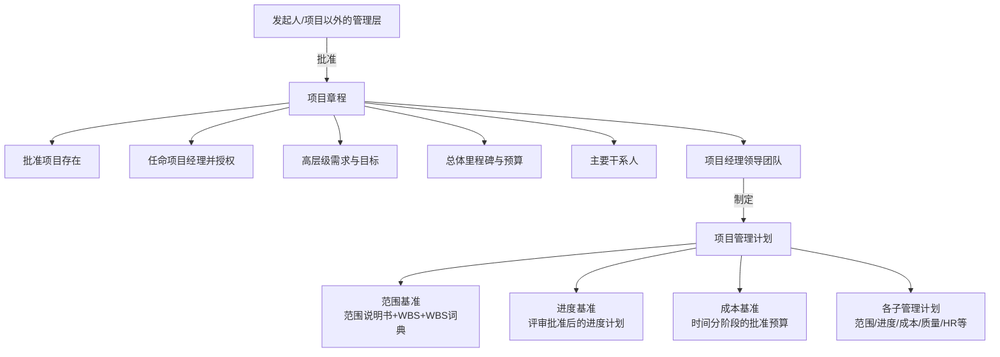
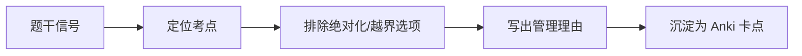

# T-INT-002｜项目章程、SOW、项目管理计划与基准体系

> 本专题用于学习"项目整体管理"中定义项目起点和管理框架的一组核心内容：**项目章程（内容、作用、发布者）、工作说明书 SOW、项目管理计划（总计划与子计划体系）、三大基准（范围/进度/成本基准）、章程与计划的关系与区别**。它们不是独立文档，而是围绕一个核心问题展开：**一个项目从"被批准存在"到"有可执行的完整路线图"，需要哪些关键文件？它们之间的层级和演化关系是什么？**

---

## 先看这个专题的主线

项目章程和项目管理计划是软考选择题中最高频的"调换陷阱"——题目把章程的内容说成计划的，把计划的特征说成章程的。要破解这类题，关键是抓住两个文档的不同本质。

---

## 项目章程：项目的"出生证"

> **[定义｜项目章程]** 项目章程是正式批准项目存在、授权项目经理动用组织资源开展项目活动的文件。由**发起人**（或项目以外的管理层）发布，是项目的起点。

章程的核心内容（常考）：项目目的/目标、高层级需求、总体范围、主要可交付成果、总体里程碑、总体预算、关键干系人、项目经理的任命和授权。

> **[高频陷阱｜章程由谁发布？]** 章程由**发起人或项目以外的管理层**发布和批准，不是由项目经理自己写自己批。如果题目说"项目经理批准了项目章程"→ **错**。项目经理可以参与起草，但批准者是发起人。

---

## 工作说明书 SOW

> **[定义｜SOW]** 工作说明书（Statement of Work）是对项目需交付的产品或服务的叙述性说明。它可以来自发起人、客户或其他干系人。SOW 是制定项目章程的重要输入。

SOW 的三种来源：
1. **客户提供**：作为合同的一部分
2. **发起人提供**：作为内部项目的需求说明
3. **项目团队编写**：基于业务需求分析编写

---

## 项目管理计划：项目的"操作手册"

> **[定义｜项目管理计划]** 项目管理计划是说明项目将如何执行、监督和控制的文件。它整合了所有子管理计划和基准，由项目经理领导制定，是项目工作的总指南。

> **[高频辨析｜章程 vs 计划]**
>
> | 维度 | 项目章程 | 项目管理计划 |
> |---|---|---|
> | 谁发布/制定 | 发起人批准 | 项目经理领导制定 |
> | 内容级别 | 高层级（目标、总体范围） | 详细（各管理过程如何执行） |
> | 包含什么 | 目标、总体范围、里程碑、PM任命 | 各子管理计划 + 三大基准 |
> | 能否轻易修改 | 不轻易修改 | 通过整体变更控制流程修改 |
> | 目的 | 授权项目+授权PM | 指导执行和监控 |

---

## 三大基准

> **[概念组｜项目管理三大基准]**
>
> 1. **范围基准**：范围说明书 + WBS + WBS 词典。回答"项目要交付什么"。
> 2. **进度基准**：经过批准的项目进度计划。回答"什么时候完成什么"。
> 3. **成本基准**：经过批准的时间分阶段预算。回答"花多少钱、何时花"。成本基准 = 工作包估算总和 + 应急储备。

**三大基准是项目绩效测量的比较基准。** 任何一个基准的修改，都需要走正式的变更控制流程。

---

## 典型题详解与举一反三

> **例题 1｜章程 vs 计划内容**
>
> 以下哪项是项目章程的内容？
>
> A. 详细的 WBS
> B. 成本绩效基准
> C. 任命项目经理并授权
> D. 风险应对计划

A、B、D 属于项目管理计划或子计划的产物。C 是章程的核心内容之一。正确答案是 **C**。

**可制卡点：** 章程 vs 计划的内容区分卡。

---

> **例题 2｜章程的发布者**
>
> 项目章程由谁批准或发布？
>
> A. 项目经理
> B. 发起人或项目以外的管理层
> C. 项目团队成员
> D. 客户

正确答案是 **B**。经理参与起草但不批准，这是考试的固定考点。

**可制卡点：** 章程发布者卡。

---

> **例题 3｜基准变更**
>
> 项目经理需要修改进度基准，他应该：
>
> A. 直接修改并通知团队
> B. 通过实施整体变更控制流程提交变更请求
> C. 基础基准不能修改
> D. 只需客户同意即可

基准修改必须走正式变更控制流程——这是变更控制的核心原则。正确答案是 **B**。

**可制卡点：** 基准变更必须走变更控制的规则卡。

---

> **例题 4｜SOW 的来源**
>
> 某公司内部 IT 部门要开发一个内部管理系统。该项目的 SOW 最可能来自：
>
> A. 外部客户
> B. 发起人或业务部门的需求说明
> C. 项目经理自己写
> D. 供应商

内部项目的 SOW → 通常由发起人或业务部门提供需求说明。正确答案是 **B**。

**可制卡点：** SOW 来源判断卡。

---

## 本轮真题覆盖增强：章程、SOW、计划和基准

本节把 `questions.full.clean.md` 与既有真题映射中的高频考法反查回本专题。上午题常用文件内容设陷阱：授权项目经理是章程，整合各分计划的是项目管理计划，经批准的范围/进度/成本形成基准。 学习时不要只背定义，要能从题干信号判断它在考哪一个管理动作或技术边界。

这类题的识别链路可以这样看：

图里的重点是“先定位，再排错”。软考选择题常用绝对化说法、角色越权、流程跳步来制造干扰；下午案例题则把同一个错误包装成多句背景，需要把事实翻译回管理过程。

> **例题｜章程、SOW、计划和基准（真题型改编训练题）**
>
> 公司正式任命小张为项目经理，并说明项目目标、主要里程碑和授权级别。该文件最可能是：
>
> A. 项目章程  
> B. WBS 字典  
> C. 风险登记册  
> D. 质量核对单

**考查点：** 项目章程的作用、项目经理授权。

**题干关键词：** 任命项目经理、授权级别、项目目标。

**解题过程：** 项目章程由发起人或组织发布，核心作用之一是正式授权项目经理动用组织资源。

**正确答案：** A。

**错项分析：**

- B 描述工作包细节，不授权项目经理。
- C 记录风险，不定义项目存在理由。
- D 用于质量检查，不承担启动授权。

**举一反三：** 看到“正式任命、授权、项目存在理由、总体目标”，先想到章程；看到“各子计划整合、执行监控依据”，再想到项目管理计划。

**可制卡点：** 项目章程由谁发布；章程 vs 项目管理计划；基准从哪里来。

## 这个专题应该怎样转化为 Anki 卡片

**概念卡**：项目章程、SOW、项目管理计划、三大基准（每个一张）。

**辨析卡**：章程 vs 计划的全面对比（发布者、内容级别、包含内容、修改方式）。

**陷阱卡**："项目经理批准项目章程"→ 错、"项目管理计划由发起人编写"→ 错、"基准可以直接修改"→ 错。

---

## 本专题的最小掌握标准

至少能做到：① 区分章程和计划各自的内容和发布者；② 知道三大基准由什么组成；③ 理解基准修改必须走变更控制流程；④ 不做"章程=计划"的调换题。

---

## 待核验与后续改进

- 教程中章程的具体内容条目数需与教材核对。[待核验]
