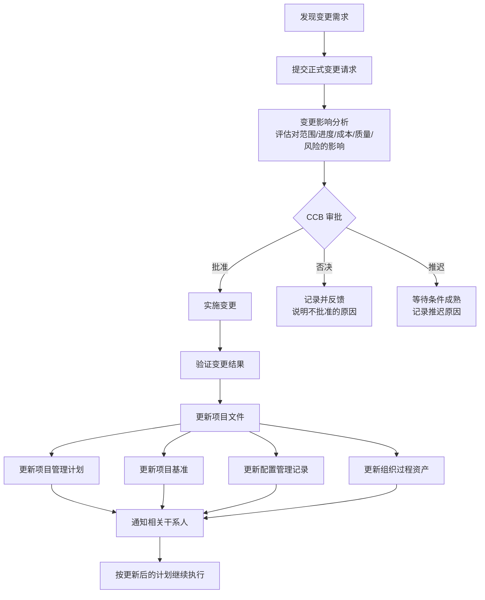

# T-INT-004｜整体变更控制与 CCB

> 本专题用于学习"项目整体管理"中必出选择题和案例题的一组核心内容：**整体变更控制、变更控制委员会（CCB）、变更请求的四种类型、变更控制流程、批准后更新**。它们不是孤立管理动作，而是围绕一个核心问题展开：**当项目需要改变时，如何确保这种改变是经过评估、经过授权、经过记录、经过沟通的——而不是"谁嗓门大谁说了算"？**

---

## 先看这个专题的主线

变更控制在很多同学看来就是"填个表、领导签个字"。但软考对变更控制的考查远超这个层次——它会从变更和配置的关系、CCB 的角色边界、不同类型的变更请求、变更后必须更新哪些文件等多个维度出题。

这个专题的主线很简单：**变更不是坏事，不加控制的变更才是坏事。** 项目管理不是要避免变更，而是要让每一个变更都在可控的框架内发生。

这张图把变更控制的闭环画全了。**选择题中常考的陷阱是：CCB 批准后就算改完了吗？不——必须更新文件、更新基准、通知干系人。** 案例题中常考的是：项目经理擅自改了范围、领导口头同意就改了功能——这些都不符合变更控制流程。

---

## 变更控制的核心理念

> **[定义｜整体变更控制]** 整体变更控制是审查所有变更请求、批准变更、管理对可交付成果、组织过程资产、项目文件和项目管理计划的变更，并对变更处理结果进行沟通的过程。它贯穿项目始终，项目经理对此负最终责任。

变更控制的核心理念有几个：

1. **只有经批准的变更才能纳入基准**。任何未经 CCB（或授权人）批准的变更，即使已经实施了，也不能算合法的变更。
2. **变更是对基准的修改**。如果某个调整不影响基准（如在浮动时间内的进度调整），可以不走变更控制。但如果要动基准，必须走流程。
3. **CCB 是一个正式团体**。它不是某个人，而是由多个干系人代表组成的委员会，负责审查、评价、批准、推迟或否决变更。

---

## CCB：变更控制委员会的角色与边界

> **[定义｜CCB]** 变更控制委员会（Change Control Board）是一个正式组成的团体，负责审查、评价、批准、推迟或否决项目变更，以及记录和传达变更处理决定。

关于 CCB，有几个高频考点：

**CCB 批什么？** CCB 审批的是变更请求，特别是涉及基准变更的请求。它不负责实施变更，也不负责验证变更结果。

**CCB 由谁组成？** 通常包括项目经理、客户代表、发起人代表、关键干系人代表、技术专家等。项目经理可以是 CCB 成员，但通常不是 CCB 主席。

**项目经理在变更中的角色是什么？** 项目经理负责：发现变更需求、组织影响分析、提交变更请求供 CCB 审批、在批准后组织实施变更和更新文件。项目经理对变更控制负有最终管理责任，但不是最终审批者（特别是涉及基准的重大变更，通常需要发起人或客户的批准）。

> **[易错辨析]** CCB 批准的是"变更请求"，不是"所有管理决策"。日常管理中的调整（如团队成员请假调配）不需要 CCB。CCB 处理的是"改变范围、进度、成本等基准"或"影响重大的"变更请求。

---

## 四种变更请求

软考中会出现的变更请求类型不止一种。能够区分它们是理解变更管理的基础。

> **[概念组｜变更请求的四种类型]**
>
> 1. **纠正措施**：为使项目工作绩效与项目管理计划重新一致而采取的有目的的活动。关键词：绩效偏差、纠正、回到计划。
> 2. **预防措施**：为确保项目工作的未来绩效与项目管理计划一致而采取的有目的的活动。关键词：预防、避免、提前。
> 3. **缺陷补救**：为了修正不一致的产品或产品组件而采取的有目的的活动。关键词：修复、修正产品缺陷、质量问题。
> 4. **更新**：对正式受控的项目文件或计划等进行的变更。关键词：修改文件、更新基准。

这四种请求都是通过"实施整体变更控制"过程来处理的。在选择题中，可能给你一个场景，问"这是哪种变更请求"——关键是抓住动作的目的（纠正过去/预防未来/修产品/改文件）。

---

## 变更控制与配置管理：两个密切相关但不同的概念

这是一个高考频的辨析点：

> **[辨析｜变更控制 vs 配置管理]**
>
> **变更控制**关注的是"允许不允许改、怎么改、谁批准"。它的核心问题是：对一个变更请求，应该批准、否决还是推迟？
>
> **配置管理**关注的是"改了之后怎么记录、怎么追踪版本状态"。它的核心问题是：被修改的对象当前处于什么版本？它的基线是什么？谁在什么时候做了什么修改？

简单地说，**变更控制管"改不改"，配置管理管"改成什么样、记没记"**。两者需要紧密配合：每次批准的变更，都必须在配置管理系统中更新对应配置项的状态。

---

## 典型题详解与举一反三

> **例题 1｜CCB 审批范围**
>
> 以下哪项通常需要提交给 CCB 审批？
>
> A. 项目团队成员的请假申请
> B. 增加新功能的变更请求
> C. 周报中发现的进度偏差
> D. 项目例会的会议纪要

A 属于日常人员管理，不需要 CCB；C 是监控发现的问题，可能需要分析后提出变更请求，但偏差本身不需要 CCB 审批；D 是例行文档，不需要 CCB。增加新功能属于范围基准变更，需要提交 CCB 审批。正确答案是 **B**。

**延伸理解：** 关键判断点是"是否涉及基准变更"。涉及范围基准、进度基准、成本基准的变更 → CCB。日常管理调整 → 不需要 CCB。

**可制卡点：** CCB 审批范围判断卡。

---

> **例题 2｜变更请求类型识别**
>
> 项目经理发现，项目产品的某个模块在处理大数据量时频繁崩溃。项目团队提交了一个技术修复方案。这个属于什么类型的变更请求？
>
> A. 纠正措施
> B. 预防措施
> C. 缺陷补救
> D. 更新

"频繁崩溃"→ 这是产品组件有问题，"技术修复方案"→ 修复不一致的产品组件 → 缺陷补救。正确答案是 **C**。如果是项目进度偏差的纠正方案，才是纠正措施（针对过程）；如果还没出问题就提前改，才是预防措施。

**延伸理解：** 纠正措施针对"过程绩效偏离"，缺陷补救针对"产品组件不合格"。这两个在选择题中常互相混淆。记忆法：产品出问题 = 缺陷补救；过程出问题 = 纠正措施。

**可制卡点：** 四种变更请求类型辨析卡（含题干关键词）。

---

> **例题 3｜变更控制流程**
>
> CCB 批准了一项变更请求后，项目经理下一步最应该做什么？
>
> A. 立刻通知所有干系人
> B. 更新项目管理计划和项目文件
> C. 开始实施变更
> D. 记录 CCB 的审批决定

在 CCB 批准之后，应该更新项目文件（包括计划和基准），然后通知干系人，再实施变更。正确的顺序应该是：批准→更新文件→通知→实施。但题目问"下一步最应该做什么"——更新项目管理计划和项目文件是批准后的直接管理动作。正确答案是 **B**。D（记录审批决定）发生在批准的同时，不是下一步。

**延伸理解：** 变更控制的闭环中，"更新"非常关键。如果只批不改文件，变更仍然没有正式纳入项目。这也是案例题中常见的错误——项目经理拿到了口头许可就去实施了，没有走正式变更流程、没有更新文件。

**可制卡点：** 变更批准后更新清单（计划、基准、配置记录、组织过程资产）。

---

> **例题 4｜CCB 的权限边界**
>
> 以下关于 CCB 的说法，哪项是正确的？
>
> A. CCB 由项目经理担任主席，所有决定都由项目经理批准
> B. CCB 仅负责审批变更请求，不负责变更的实施和验证
> C. 所有项目都必须成立 CCB
> D. CCB 批准变更后，变更由 CCB 负责实施

A 错：项目经理不一定是 CCB 主席，发起人或客户可能是。B 正确：CCB 审批变更请求，不负责实施。C 错：小项目可以不设正式 CCB，由项目经理或发起人直接审批变更。D 错：CCB 不负责实施。

**延伸理解：** CCB 的"正式"程度取决于项目规模。大型复杂项目有正式的 CCB 章程和例会；小型项目可能只需要发起人或项目经理审批即可。但无论规模大小，"变更控制"这一管理过程是必须存在的。

**可制卡点：** CCB 角色边界辨析卡。

---

> **例题 5｜案例题：变更失控**
>
> 某项目在执行中期，客户多次直接联系开发人员修改功能，开发人员听从了客户的建议并做了修改。项目经理发现后，进度严重滞后，部分修改与其他模块冲突导致返工。请指出问题并提出改进方案。

问题清单：① 客户绕过变更控制流程直接要求修改，属于"非正式变更"；② 开发人员未经授权实施变更，扩大了范围；③ 没有影响分析，没有 CCB 审批；④ 变更没有记录、没有更新文件和基准；⑤ 没有沟通给相关干系人，导致接口冲突。

改进方案：① 强化变更控制意识，所有变更必须提交正式变更请求；② 严格执行变更控制流程：申请→影响分析→CCB 审批→实施→验证→更新→沟通；③ 教育客户和团队，变更不是不允许，但必须走流程；④ 设立单一变更入口，避免多头对接；⑤ 更新项目基准和配置记录，确保后续工作基于最新、经批准的基准。

**延伸理解：** 下午案例题中，只要出现"客户直接找开发人员改功能""领导口头要求增加功能""团队自行修改了设计但没有走流程"——这些都是典型的变更失控。答题时要指出现象、分析影响、给出流程化改进方案。

**可制卡点：** 变更控制案例模板卡。

---

## 这个专题应该怎样转化为 Anki 卡片

**概念卡**：整体变更控制、CCB、纠正措施、预防措施、缺陷补救、更新。每个概念一张，答案要包含"一句话定义 + 一个典型场景"。

**辨析卡**：
- 变更控制 vs 配置管理（改不改 vs 记没记）
- 纠正措施 vs 缺陷补救（过程偏差 vs 产品缺陷）
- 预防措施 vs 纠正措施（事前 vs 事后）
- CCB 审批 vs 项目经理日常管理权限

**流程卡**：变更控制八步法：发现需求→提交请求→影响分析→CCB 审批→实施→验证→更新文件→通知干系人。

**案例模板卡**：变更失控的常见表现 + 改进措施模板。

**陷阱卡**：
- "CCB 批准后就算改完了"——错，必须更新文件和基准
- "所有变更都要 CCB 审批"——错，日常调整不需要
- "项目经理可以直接批准所有变更"——错，基准变更需要走正式流程

**暂不制卡内容**：CCB 的具体章程格式（不需要背诵）。

---

## 本专题的最小掌握标准

学完本专题后，你至少应该能做到五件事。

第一，能画出变更控制的完整流程（从发现需求到更新记录+通知），并说出每个环节的关键动作。第二，能区分四种变更请求（纠正措施、预防措施、缺陷补救、更新），并能根据题干场景判断属于哪种。第三，理解 CCB 的角色边界——它审批变更请求，不实施变更。第四，知道变更批准后必须更新的文件清单（计划、基准、配置记录、过程资产）。第五，能在案例题中识别变更失控的表现（未经审批的变更、口头变更、越级变更），并给出流程化改进方案。

---

## 待核验与后续改进

- 四种变更请求的教材中文表述可能与 PMBOK 标准中文版有细微差异，建议与教程第 6 章对照。[待核验]
