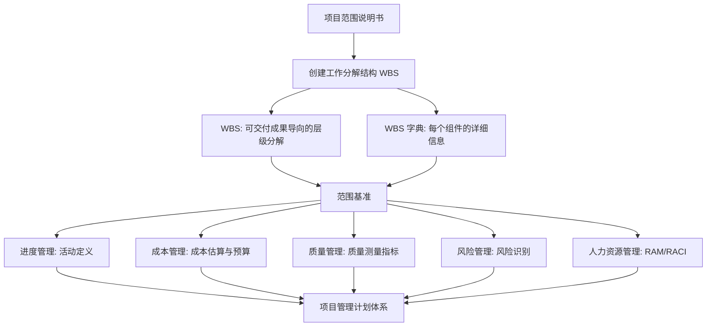
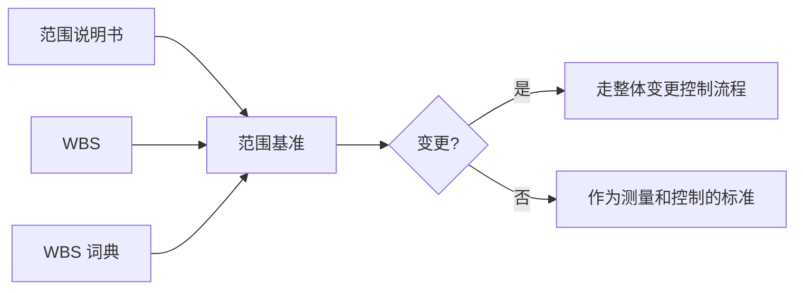

# T-SCOPE-002｜WBS、工作包、WBS 字典与范围基准

> 本专题用于学习"项目范围管理"中最核心也最容易被低估的一组内容：**工作分解结构（WBS）、工作包、WBS 字典、范围基准、控制账户和分解原则**。它们不是孤立文档，而是围绕一个核心问题展开：**如何把模糊的项目目标转化为可管理、可估算、可分配、可控制的工作单元，并形成稳定的范围基准？**

---

## 先看这个专题的主线

WBS 在很多同学眼里就是"画一棵倒树"，画完就结束了。但软考对 WBS 的考查远不止于此——它会从"什么应该包含在 WBS 中""WBS 词典有什么用""范围基准由什么组成""WBS 与进度、成本的关系"等多个角度出题。

这个专题的主线是：WBS 不是孤立工具，它是范围管理的"枢纽"。向上连接范围说明书和需求文件，向下为进度计划、成本估算、资源分配和风险管理提供基础结构。如果 WBS 建错了，整个项目管理计划的地基就不稳。

这张图说明了 WBS 为什么被称为"项目管理的骨架"。**如果某个工作不在 WBS 中，它就不在项目范围之内。** 这句话是范围管理的核心原则，也是案例题中判断"范围蔓延"的依据。

---

## WBS 是什么：以可交付成果为导向的层级分解

> **[定义｜WBS]** 工作分解结构（Work Breakdown Structure）是以可交付成果为导向的，对项目团队为实现项目目标、创建所需可交付成果而需要实施的全部工作范围的层级分解。WBS 组织并定义了项目的全部范围。

这里有几个关键词值得注意：

**"以可交付成果为导向"**——WBS 分解的对象是"要交付什么"，而不是"要做什么动作"。分解的结果是名词（如"用户登录模块""培训手册"），而不是动词（如"编写代码""组织培训"）。这一点在选择题中经常考：如果题目给了一个 WBS 片段问"是否合格"，你要检查上层和下层之间的逻辑是否按可交付成果分解。

**"层级分解"**——WBS 从顶层（项目本身）开始，逐层向下分解到工作包级别。上层是对下层内容的汇总，下层是对上层内容的详细描述。

**"全部工作范围"**——WBS 包含了项目 100% 的工作范围。WBS 之外的任何工作都不属于项目范围。这就是所谓的 **"100% 规则"**。

> **[原则｜100% 规则]** WBS 必须包含项目范围内 100% 的工作，既不能遗漏，也不能包含不在范围内的工作。

---

## WBS 的分解：到什么程度才算"够"？

WBS 应该分解到多细？这是规划和案例题中的常见问题。分解得太粗，无法有效估算和管理；分解得太细，管理成本过高。

> **[原则｜WBS 分解停止条件]** 工作包是 WBS 最底层的组件。WBS 分解到以下条件之一满足时停止：
> 1. 工作包可以可靠地估算成本和工期
> 2. 工作包可以分配给一个责任人/团队
> 3. 工作包的工作量足够小，便于有效控制
> 4. 无法进一步合理细分

在实践中，一般将工作包控制在 8~80 小时的范围内作为参考标准，但这并非硬性规定。

**工作包**（Work Package）是 WBS 的最底层的组件，也是后续活动定义、成本估算、资源分配的直接输入。工作包再往下分解就变成了**活动**——但那已经属于进度管理（定义活动）的范畴了。

> **[辨析｜WBS 的工作包 vs 进度管理的活动]** WBS 定义的是"要交付什么"（工作包），进度管理定义的是"怎么做、什么顺序"（活动）。工作包属于范围管理，活动属于进度管理。一个工作包可以包含多个活动。

---

## WBS 词典：WBS 的"说明书"

> **[定义｜WBS 词典]** WBS 词典是对 WBS 中每个组件的详细说明文件。它包含该组件的账户编码、工作说明、负责人、进度里程碑清单等信息，还可能包括合同信息、质量要求、技术文献、计划活动、资源和成本估算等。

WBS 只画了结构，但每个方框代表什么、边界在哪里、由谁负责——这些信息都在 WBS 词典里。WBS 和 WBS 词典是一体的，不能只有一面。

选择题中可能这样考：给出一个场景，问"下列信息应该从哪里获取"，如果问某个具体工作包的详细描述、负责人、验收标准，答案是 WBS 词典，而不是 WBS 本身。

---

## 范围基准：WBS + WBS 词典 + 范围说明书

> **[定义｜范围基准]** 范围基准是经过批准的项目范围说明书、WBS 和 WBS 词典的组合。只有通过正式的变更控制程序才能更改范围基准。范围基准是项目管理计划的组成部分，是衡量项目绩效和进行范围控制的依据。

范围基准的三个组件各有分工：

- **项目范围说明书**：描述项目的范围、主要可交付成果、假设条件和制约因素。回答"这个项目要做什么"。
- **WBS**：将范围说明书中的可交付成果和工作分解为更小、更易管理的组件。回答"要交付的具体内容有哪些，它们的关系是什么"。
- **WBS 词典**：对 WBS 中每个组件给出详细信息。回答"每个组件具体是什么、谁负责、有什么要求"。

---

## 控制账户：连接范围、成本与进度的管理点

> **[定义｜控制账户]** 控制账户（Control Account）是设置在 WBS 选定节点上的管理控制点。在该点上，把范围、预算、实际成本和进度加以整合，并与挣值相比较，以测量绩效。一个控制账户可以包含一个或多个工作包，但一个工作包只能属于一个控制账户。

控制账户的概念在挣值管理的语境中频繁出现。它是 WBS 结构中的"管理节点"，通常与组织分解结构（OBS）相关联——控制账户的负责人对某个 WBS 节点下的范围、进度、成本负整合管理责任。

---

## 典型题详解与举一反三

> **例题 1｜WBS 的核心特征**
>
> 以下关于 WBS 的描述，哪项是正确的？
>
> A. WBS 是按项目活动对项目工作进行层级分解
> B. WBS 的最底层组件称为控制账户
> C. WBS 是以可交付成果为导向的层级分解
> D. WBS 由项目经理单独负责创建

A 错：WBS 是以可交付成果（而非活动）为导向的分解。B 错：最底层是工作包，控制账户是中间层的管理控制点。D 错：WBS 应由项目团队共同创建，而非项目经理单独负责。正确答案是 **C**。

**延伸理解：** 这道题的每个错项都对应一个常见误区。WBS ≠ 活动清单（那是进度管理的产物），WBS ≠ 项目经理的个人作品（需要团队参与）。记住"可交付成果导向"是 WBS 最核心的特征。

**可制卡点：** WBS 核心特征卡。"可交付成果导向"vs"活动导向"辨析卡。

---

> **例题 2｜范围基准的组成**
>
> 范围基准由以下哪组文件组成？
>
> A. 项目章程 + WBS + WBS 词典
> B. 范围说明书 + WBS + 项目管理计划
> C. 范围说明书 + WBS + WBS 词典
> D. 需求文件 + 范围说明书 + WBS

正确答案是 **C**。范围基准 = 范围说明书 + WBS + WBS 词典。项目章程属于整体管理，需求文件是范围管理的输入但不是范围基准的组成部分。

**延伸理解：** 范围基准是项目管理计划的核心组件之一（和进度基准、成本基准并列）。这三个基准 + 其他子管理计划 = 项目管理计划。这个层级关系在选择题中常考——题目可能问"以下哪些属于项目管理计划的组成部分"。

**可制卡点：** 范围基准三组件卡。三大基准（范围/进度/成本）对应内容卡。

---

> **例题 3｜分解原则判断**
>
> 某项目经理在创建 WBS 时，将"系统测试"作为一个工作包。以下评价最恰当的是：
>
> A. 合理，测试是一项完整的工作，可以作为工作包
> B. 不合理，应进一步分解为"单元测试""集成测试""系统测试""验收测试"等
> C. 不确定，取决于测试工作的规模和复杂度
> D. 不合理，测试属于质量管理，不应出现在范围管理的 WBS 中

WBS 分解的粒度取决于项目具体情况。"系统测试"作为工作包是否合理，要看其规模和复杂性在具体项目中是否可以有效估算和管理。正确答案是 **C**。"系统测试"可能过粗，也可能合适，没有绝对答案。

B 可能对也可能错——如果项目很简单，"系统测试"本身足够小，就不必再拆。D 错在测试虽然属于质量管理范畴，但测试工作本身也是项目工作范围的一部分，应出现在 WBS 中。

**延伸理解：** WBS 没有唯一正确答案。它的检验标准不是"是否符合教科书给的样例"，而是"是否满足 100% 规则、是否足以进行有效管理和估算"。

**可制卡点：** WBS 分解灵活性理解卡。

---

> **例题 4｜WBS 词典的作用**
>
> 你接手了一个进行中的项目。你想了解某个工作包的验收标准、负责团队和估算依据，你应该首先查看：
>
> A. 项目管理计划
> B. WBS
> C. WBS 词典
> D. 范围说明书

WBS 词典是对 WBS 每个组件的详细说明，包含验收标准、负责人、估算信息等。正确答案是 **C**。WBS 只有结构，没有这些细节；范围说明书是项目级别的，不会细化到具体工作包。

**延伸理解：** WBS 词典 = WBS 的"说明书"。实际项目管理中，很多人建了 WBS 图但没维护 WBS 词典，导致后人根本不知道一个工作包具体是什么。这也是案例题中常见的"管理疏漏"考点。

**可制卡点：** WBS 词典 vs WBS vs 范围说明书的内容区分卡。

---

> **例题 5｜WBS 的作用范围**
>
> 根据"100% 规则"，WBS 应该：
>
> A. 包含项目 100% 的成本预算
> B. 包含项目 100% 的工作范围
> C. 由 100% 的项目团队成员参与创建
> D. 覆盖项目 100% 的时间跨度

正确答案是 **B**。"100% 规则"的核心含义是 WBS 必须完整覆盖项目全部范围——不能有遗漏的工作，也不能有范围外的工作。

**延伸理解：** 如果项目执行中实际做了某项工作，但在 WBS 中找不到对应的工作包，就说明范围蔓延了——或者说，WBS 本来就是不全的。案例题中识别范围蔓延，可以从"WBS 中是否有这项工作"入手。

**可制卡点：** 100% 规则卡。WBS 与范围蔓延关系卡。

---

> **例题 6｜案例题：WBS 不合理导致的问题**
>
> 某系统集成项目的 WBS 按部门划分：软件开发部的 WBS、测试部的 WBS、运维部的 WBS。项目执行到中期，项目经理发现多个工作包的边界不清，测试部和开发部对某些工作的归属争论不休，部分功能被两个部门重复开发。请指出 WBS 编制中存在的问题。

WBS 应该以**可交付成果**为导向，而不是以**组织部门**为导向。按部门分解会导致：工作边界不清晰、部门间的接口缺失或重复、"三不管"工作的遗漏。正确的做法是以项目可交付成果（如系统的各个模块或子系统）为对象进行分解，再将工作包分配给具体责任部门或团队。同时应补充 WBS 词典，明确每个工作包的责任人、交付物和验收标准。

**延伸理解：** 案例题中"按部门分解 WBS"是一个很经典的错误。项目管理强调以可交付成果为导向分解工作，而不是按组织架构分解。后者的典型后果就是"铁路警察各管一段"，接口责任模糊。

**可制卡点：** WBS 案例错误模式卡。

---

## 这个专题应该怎样转化为 Anki 卡片

**概念卡**：WBS、工作包、WBS 词典、范围基准、控制账户、100% 规则——每个一张。WBS 的概念卡强调"以可交付成果为导向"和"层级分解"。

**辨析卡**：
- WBS vs 活动清单（范围管理 vs 进度管理）
- 工作包 vs 控制账户（最底层交付单元 vs 中间管理控制点）
- WBS vs WBS 词典（结构图 vs 详细说明）
- 范围说明书 vs WBS vs WBS 词典（三层信息粒度）

**案例模板卡**：WBS 常见错误：按部门分解、分解不完整、没有 WBS 词典、缺乏团队参与、粒度不一致、遗漏验收交付物。

**流程卡**：创建 WBS 的基本步骤：识别主要可交付成果 → 判断是否可有效估算/管理 → 如不能则进一步分解 → 为每个组件编制 WBS 词典 → 整合为范围基准。

**暂不制卡内容**：具体的 WBS 绘图样式（树状图、缩进图等，理解即可）。

---

## 本专题的最小掌握标准

学完本专题后，你至少应该能做到五件事。

第一，能解释 WBS 为什么是"以可交付成果为导向的层级分解"，并指出"按活动分解"和"按部门分解"的错误。第二，知道范围基准由范围说明书、WBS 和 WBS 词典三部分组成。第三，能区分工作包（WBS 最底层）和控制账户（管理控制点），并说出它们各自的作用。第四，理解"100% 规则"——WBS 外的工作不属于项目范围。第五，能在案例题中诊断 WBS 编制不当导致的管理问题（范围蔓延、接口不清、责任不明）。

---

## 待核验与后续改进

- 工作包 8~80 小时的经验规则来源于 PMI 实践指南，软考教程的具体表述需回查原文。[待核验]
- 控制账户在挣值管理中的具体配置规则需结合教材第 9 章成本管理部分确认。[待核验]
