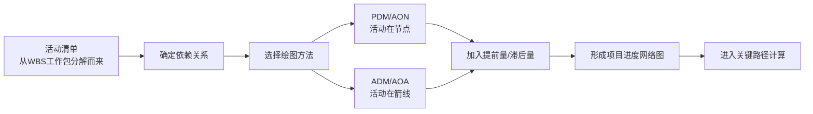

# T-SCH-002｜活动排序、依赖关系、PDM/AOA 与提前滞后量

> 本专题用于学习"项目进度管理"中连接"活动定义"和"关键路径计算"的关键中间环节：**活动排序、四种依赖关系（FS/SS/FF/SF）、前导图法（PDM/AON）与箭线图法（ADM/AOA）、四种依赖类型（强制性/选择性/外部/内部）、提前量与滞后量**。它们不是孤立画法，而是围绕一个核心问题展开：**活动之间的先后顺序如何被准确表达？这些表达方式如何影响后续的工期计算和进度压缩决策？**

---

## 先看这个专题的主线

很多同学学进度管理时直接从 WBS 跳到关键路径，忽略了中间最关键的"排序"环节。活动排序决定了整个网络图的结构——如果依赖关系画错了，后面的关键路径、时差计算、进度压缩全都跟着错。

这条主线说明：**活动排序不是"随便排一下"，它是后续所有进度计算的输入。依赖关系画错一个，整个项目的进度分析就不可靠。**

---

## 四种依赖关系类型

> **[概念组｜活动的四种依赖关系]**
>
> 1. **完成-开始（FS）**：前序活动完成后，后续活动才能开始。这是最常用的关系。例如：编码完成后才能开始测试。
> 2. **开始-开始（SS）**：前序活动开始后，后续活动才能开始。例如：开始编写用户手册后，才能开始翻译用户手册。
> 3. **完成-完成（FF）**：前序活动完成后，后续活动才能完成。例如：文档编写完成后，文档审核才能完成。
> 4. **开始-完成（SF）**：前序活动开始后，后续活动才能完成。最少使用。例如：新系统上线开始后，旧系统才能正式关闭。

> **[考试重点]** FS 是最常用的关系。SF 是最少使用的。选择题中如果问"哪种依赖关系最常用"→ FS。如果问"哪种依赖关系很少使用"→ SF。

---

## 四种依赖确定方式

> **[概念组｜依赖的确定方式]**
>
> 1. **强制性依赖（硬逻辑）**：工作本身的内在性质决定的，不可违反。例如：必须先建地基才能建墙壁。关键词："法律要求"、"合同规定"、"物理上不可颠倒"。
> 2. **选择性依赖（软逻辑）**：基于最佳实践或团队偏好，可调整。例如：通常先做设计再编码，但在敏捷中可以并行。关键词："最佳实践"、"惯例"、"偏好"。**快速跟进时，调整的多是选择性依赖。**
> 3. **外部依赖**：项目活动与非项目活动之间的依赖，超出项目团队控制。例如：等待政府审批、等待外部硬件到货。关键词："非项目"、"外部"、"不在控制范围内"。
> 4. **内部依赖**：项目活动之间的依赖，在项目团队控制范围内。关键词："项目内部"、"团队可控"。

> **[考试辨析]** 强制性依赖 ≠ 外部依赖。强制性来自工作性质（硬逻辑），外部来自"非项目方"（在团队外）。两者可以组合出现：强制性外部依赖（法律要求政府审批通过后才能开工）。

---

## PDM/AON 与 ADM/AOA 对比

> **[辨析｜PDM vs ADM]**
>
> **PDM（前导图法）= AON（单代号网络图）**：活动在**节点**（方框）上，箭线表示逻辑关系。这是大多数项目管理软件采用的方法，也是软考最常用的画法。
>
> **ADM（箭线图法）= AOA（双代号网络图）**：活动在**箭线**上，节点表示事件（活动的开始或完成）。需要使用**虚活动**（虚线箭头）来表达复杂的依赖关系，虚活动不消耗时间和资源。

| 对比维度 | PDM/AON | ADM/AOA |
|---|---|---|
| 活动在哪 | 节点（方框） | 箭线 |
| 节点含义 | 活动本身 | 事件（开始/完成） |
| 虚活动 | 不需要 | 需要（表达复杂依赖） |
| 软件采用 | 主流 | 较少 |
| 依赖类型 | FS/SS/FF/SF 四种 | 主要 FS |

> **[考试判断]** 看到"方框是活动"→ PDM/AON。看到"箭线是活动"、"虚线箭头"、"虚活动" → ADM/AOA。问"虚活动的作用" → 正确表达活动之间的逻辑依赖关系，不消耗时间和资源。

---

## 提前量与滞后量

> **[定义｜提前量（Lead）]** 允许后续活动**提前**开始的时间量。在 FS 关系中，后续活动可以在前序活动完成**之前**开始。提前量用**负值**表示。例如：FS-5 意味着前序活动完成前 5 天，后续活动就可以开始。

> **[定义｜滞后量（Lag）]** 要求后续活动**推迟**开始的时间量。例如：FS+10 意味着前序活动完成后，需要等 10 天才能开始后续活动（如混凝土浇筑后需要养护 10 天）。滞后量用**正值**表示。

> **[辨析｜提前量与快速跟进]** 提前量和快速跟进都会造成活动重叠，但提前量是**主动规划**的（在设计网络图时就安排了），快速跟进是**被动应对**的（项目出问题后才把原来顺序的活动改成并行的）。

---

## 典型题详解与举一反三

> **例题 1｜依赖关系类型识别**
>
> 活动 A 开始 3 天后，活动 B 才能开始。这种关系是：
>
> A. FS+3
> B. SS+3
> C. SF+3
> D. FF+3

"开始后→才能开始"→SS。"3天后"→ 滞后量 +3。所以是 SS+3。正确答案是 **B**。

**延伸理解：** 判断依赖关系类型的关键是看两个动作是什么——A 的动作和 B 的动作各是"开始"还是"完成"。A 开始 → B 开始 = SS。A 完成 → B 开始 = FS。A 完成 → B 完成 = FF。

**可制卡点：** 四种依赖关系的动作对卡（正面：A的动作和B的动作，背面：关系类型）。

---

> **例题 2｜PDM vs ADM 识别**
>
> 在某网络图中，活动被画在箭线上，节点代表事件。这是哪种绘图方法？
>
> A. 前导图法 PDM
> B. 箭线图法 ADM
> C. 甘特图
> D. 里程碑图

"活动在箭线上，节点代表事件"→ ADM/AOA。正确答案是 **B**。

**可制卡点：** PDM vs ADM 的特征识别卡。

---

> **例题 3｜虚活动的作用**
>
> 在箭线图法（ADM）中，虚活动的主要作用是：
>
> A. 表示需要等待但不需要资源的缓冲活动
> B. 正确表达活动之间的逻辑依赖关系
> C. 标记项目的里程碑节点
> D. 估算不确定的活动历时

正确答案是 **B**。虚活动不消耗时间、不消耗资源，唯一作用是补充箭线图在表达活动依赖关系方面的不足。A 描述的是滞后量或等待，C 描述的是里程碑，D 描述的是 PERT/三点估算的用途。

**可制卡点：** 虚活动定义与作用卡。

---

> **例题 4｜依赖类别判断**
>
> 建筑项目中，"必须等混凝土养护 7 天达到强度后才能拆模"。这个依赖属于：
>
> A. 选择性外部依赖
> B. 强制性内部依赖
> C. 强制性外部依赖
> D. 选择性内部依赖

"混凝土养护"是工作内在性质决定的（物理规律）→ 强制性。"达到强度后拆模"是内部工作衔接 → 内部。所以是强制性内部依赖。正确答案是 **B**。

**可制卡点：** 四种依赖类别判断卡（强制/选择 × 外部/内部）。

---

> **例题 5｜提前量与滞后的计算**
>
> 活动 A 工期 5 天，活动 B 工期 3 天，两者关系为 FS-2（提前量 2 天）。活动 A 在第 1 天开始。活动 B 最早在第几天完成？
>
> A. 第 6 天
> B. 第 7 天
> C. 第 8 天
> D. 第 9 天

A: 第 1 天开始，工期 5 → 第 5 天完成。
FS-2：B 可以在 A 完成前 2 天开始 → B 最早在第 4 天开始（5−2+1=4，或理解为 A 第 3 天结束后就可以开始 B）。
B: 第 3 天结束开始（A完成前两天 = 第 3 天末），工期 3 → 第 6 天完成（第 4、5、6 三天 → 第 6 天末完成）。

更正：A 第 1 天开始，持续 5 天 → 第 5 天末完成（第 1-5 天）。FS-2 意味着 B 可以比 A 完成提前 2 天开始 → B 最早在第 4 天开始（第 4 天开始 = A 的第 4 天开始时 A 还没完成，差 2 天）。B 工期 3 → 第 4、5、6 天 → 第 6 天末完成。正确答案是 **A**。

**可制卡点：** 提前量/滞后量的计算示例卡。

---

> **例题 6｜快速跟进与选择性依赖**
>
> 项目需要进行快速跟进以压缩工期。团队发现活动 C 和活动 D 之间有"按照惯例先 C 后 D"的约定。项目经理决定让 C 和 D 部分并行。这调整的是什么？
>
> A. 强制性依赖
> B. 选择性依赖
> C. 外部依赖
> D. 法规依赖

"按照惯例"→ 选择性依赖（软逻辑）。快速跟进通常调整的是选择性依赖关系。正确答案是 **B**。

**可制卡点：** 快速跟进 → 调整选择性依赖的判断卡。

---

## 本轮真题覆盖增强：依赖关系与前导图识别

本节把 `questions.full.clean.md` 与既有真题映射中的高频考法反查回本专题。题库出现“编码前不能测试”判断强制依赖，以及 PDM/AOA 英文题。 学习时不要只背定义，要能从题干信号判断它在考哪一个管理动作或技术边界。

这类题的识别链路可以这样看：

图里的重点是“先定位，再排错”。软考选择题常用绝对化说法、角色越权、流程跳步来制造干扰；下午案例题则把同一个错误包装成多句背景，需要把事实翻译回管理过程。

> **例题｜依赖关系与前导图识别（真题型改编训练题）**
>
> “没有完成编码产物，就不能对该代码执行测试”体现的依赖关系最可能是：
>
> A. 选择性依赖  
> B. 强制依赖  
> C. 外部依赖  
> D. 资源依赖

**考查点：** 强制依赖、PDM、活动排序。

**题干关键词：** 不能、编码、测试、客观逻辑。

**解题过程：** 测试依赖编码产物，这是工作本身决定的客观先后关系，属于强制依赖。

**正确答案：** B。

**错项分析：**

- A 是团队经验或偏好形成的顺序。
- C 来自项目外部主体或条件。
- D 强调资源可用性，不是活动产品之间的必然逻辑。

**举一反三：** 判断依赖关系时，不要只看“谁先谁后”，要问这个顺序是客观必须、组织选择、外部条件还是资源限制。

**可制卡点：** 强制依赖 vs 选择性依赖；PDM 节点表示活动；提前量和滞后量的题干信号。

## 这个专题应该怎样转化为 Anki 卡片

**概念卡**：FS/SS/FF/SF 四种依赖关系（每个一张）、PDM/AON、ADM/AOA、虚活动、提前量、滞后量、强制性依赖、选择性依赖、外部依赖、内部依赖。

**辨析卡**：
- PDM vs ADM（活动在哪、虚活动有无、哪个主流）
- 强制性依赖 vs 外部依赖（来自工作性质 vs 来自非项目方）
- 提前量 vs 快速跟进（规划安排 vs 应急手段）

**计算卡**：给定活动工期和依赖关系（含提前量/滞后量），计算最早开始/完成时间。

**陷阱卡**："SF 是最常用的依赖关系"→ 错，FS 最常用，SF 最少用。"虚活动有工期但不消耗资源"→ 错，虚活动无工期也不消耗资源。

---

## 本专题的最小掌握标准

学完本专题后，你至少应该能做到四件事。

第一，能根据描述判断依赖关系的类型（FS/SS/FF/SF）并正确写出含提前量/滞后量的表达式。第二，能区分 PDM（活动在节点）和 ADM（活动在箭线），并理解虚活动的作用。第三，能区分强制性/选择性/外部/内部四类依赖，特别是在进度压缩场景中识别"快速跟进调整的是选择性依赖"。第四，能在给定活动工期、依赖关系和提前/滞后的情况下，正确计算活动的最早开始和最早完成时间。

---

## 待核验与后续改进

- 教材中"提前量用负数表示、滞后量用正数表示"的约定是否与所有真题一致需回查。[待核验]
