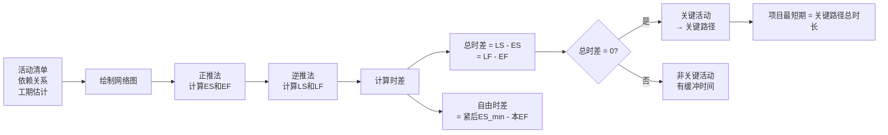
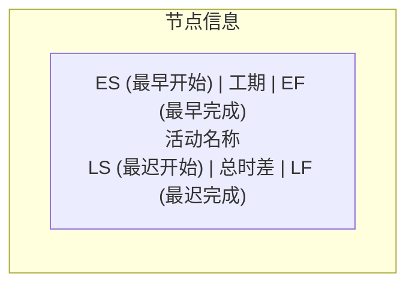
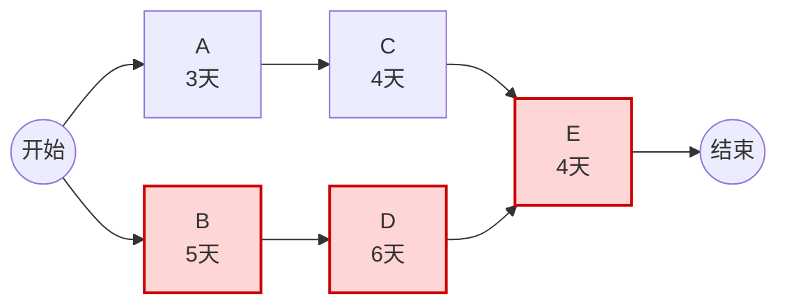
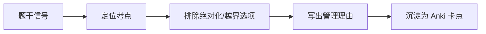

# T-SCH-003｜关键路径、总时差、自由时差与网络图判断

> 本专题用于学习"项目进度管理"中必出计算题和选择题的一组核心内容：**前导图法（PDM）、箭线图法（ADM）、关键路径法（CPM）、总时差（总浮动时间）、自由时差（自由浮动时间）、网络图的正推法与逆推法**。它们不是孤立概念，而是围绕一个核心问题展开：**给定一组活动的工期和逻辑关系，如何确定项目的最短工期？哪些活动不能延误？哪些活动有缓冲时间？**

---

## 先看这个专题的主线

关键路径这个专题最容易学成"算数训练"——拿到网络图就算 ES、EF、LS、LF，算出关键路径就结束。但软考不只需要你会算，还需要你理解背后的管理含义。

这个专题的主线其实很清楚：项目经理排好活动顺序和工期后，需要回答三个问题：

1. 项目最少需要多少天？（关键路径决定最短期）
2. 哪些活动一天都不能拖？（关键活动，总时差为零）
3. 哪些活动有一定的缓冲？（非关键活动，总时差 > 0）

而这三个问题的答案，都通过对网络图进行正推和逆推计算得出。



这条主线也解释了为什么考试喜欢把关键路径和进度压缩放在一起考——压缩工期必须优先压缩关键路径上的活动。

---

## 网络图的两种画法：PDM vs ADM

在计算关键路径之前，需要先理解活动之间的逻辑关系是如何表达的。

### 前导图法（PDM / AON）

> **[定义｜PDM / AON]** 前导图法（Precedence Diagramming Method）用方框（节点）代表活动，箭头表示活动之间的逻辑关系。因为只有活动节点需要编号，所以也叫单代号网络图（Activity On Node, AON）。这是大多数项目管理软件采用的方法，也是软考中最常考的表示法。

PDM 中，每个节点通常标注以下信息：



PDM 定义了四种依赖关系：
- **完成-开始（FS）**：A 完成后 B 才能开始（最常用）
- **开始-开始（SS）**：A 开始后 B 才能开始
- **完成-完成（FF）**：A 完成后 B 才能完成
- **开始-完成（SF）**：A 开始后 B 才能完成（很少用）

### 箭线图法（ADM / AOA）

> **[定义｜ADM / AOA]** 箭线图法（Arrow Diagramming Method）用箭线代表活动，节点代表事件（活动的开始或完成）。因为节点和箭线都需要编号，所以也叫双代号网络图（Activity On Arrow, AOA）。

AOA 中有一个特殊概念——**虚活动**（dummy activity），用虚线箭头表示。虚活动不消耗时间和资源，仅用于表达活动之间的依赖关系。当两个活动之间存在复杂的逻辑关系而无法用实箭线直接表达时，引入虚活动。

> **[易错提醒]** 软考中可能要求你识别网络图的类型。看到"节点是活动"→ AON/PDM；看到"箭线是活动、有虚线箭头"→ AOA/ADM。选择题还可能问"虚活动的作用"——就是表达依赖关系，不消耗时间和资源。

---

## 正推法与逆推法：计算时间参数的核心方法

### 正推法（Forward Pass）：计算 ES 和 EF

正推法从网络图的起点开始，沿箭线方向逐个计算每个活动的最早开始时间（ES）和最早完成时间（EF）。

> **[规则｜正推法]**
>
> 1. 起始活动的 ES = 0（或项目指定的开始日期）
> 2. EF = ES + 工期
> 3. 后续活动的 ES = 所有紧前活动中最大的 EF
> 4. 遇到汇合点时，ES 取所有进入路径中 EF 的最大值
>
> 正推法的口诀：**"顺箭线，取最大"**

### 逆推法（Backward Pass）：计算 LS 和 LF

逆推法从网络图的终点开始，逆箭线方向逐个计算每个活动的最迟开始时间（LS）和最迟完成时间（LF）。

> **[规则｜逆推法]**
>
> 1. 结束活动的 LF = 项目的总工期（正推法算出的最后 EF）
> 2. LS = LF − 工期
> 3. 前置活动的 LF = 所有紧后活动中最小的 LS
> 4. 遇到分支点时，LF 取所有出去路径中 LS 的最小值
>
> 逆推法的口诀：**"逆箭线，取最小"**

正推和逆推完成后，每个活动就有了一组完整的时间参数：(ES, EF, LS, LF)。总时差 = LF − EF = LS − ES。

---

## 关键路径：决定项目最短工期的那条路径

> **[定义｜关键路径]** 关键路径是项目网络图中总持续时间最长的路径，它决定了项目的最短完成时间。关键路径上的活动称为关键活动，关键活动的总时差通常为零（在大多数情况下）。

关键路径有三个核心特征：

1. **持续时间最长**：在所有从起点到终点的路径中，关键路径的总工期最长
2. **总时差最小**：关键路径上的活动总时差通常为零（或多条关键路径时可能为零或最小）
3. **决定工期**：任何关键活动的延误都会直接影响项目总工期

> **[关键理解]** 关键路径可能不止一条。当项目存在多条关键路径时，项目的进度风险更大——因为任何一条关键路径上的延误都会影响项目完工。而且压缩工期也更难——需要在多条关键路径上同时压缩。

下面用一个具体网络图来演示关键路径的计算：



上图中三条路径：
- S-A-C-E-F: 3 + 4 + 4 = 11 天
- S-B-D-E-F: 5 + 6 + 4 = **15 天** ← 关键路径
- 关键活动：B, D, E（总时差 = 0）

---

## 总时差与自由时差：两个最容易被混淆的概念

> **[定义｜总时差（总浮动时间）]** 在不延误项目完工日期的前提下，活动可以从其最早开始时间推迟的最大时间量。总时差 = LF − EF = LS − ES。

> **[定义｜自由时差（自由浮动时间）]** 在不延误任何紧后活动的最早开始时间的前提下，活动可以从其最早开始时间推迟的最大时间量。自由时差 = 紧后活动 ES 的最小值 − 本活动的 EF。

用一张图理解两个时差的区别：

```mermaid
flowchart TD
    A[活动 X: EF = 10] --> B[紧后活动 Y: ES = 12]
    A --> C[紧后活动 Z: ES = 15]
    B --> D[......]
    C --> E[......]
    
    F[自由时差 = min(12, 15) - 10 = 2天] --> G[活动X最多延迟2天<br>不影响Y和Z的最早开始]
    H[总时差: 可能更大<br>因为后续活动可能有缓冲] --> I[总时差 >= 自由时差]
```

> **[核心辨析｜总时差 vs 自由时差]** 总时差关心的是"会不会拖累整个项目"，自由时差关心的是"会不会拖累紧后活动"。自由时差 ≤ 总时差。如果某个活动的自由时差用完了，它可能开始影响紧后活动，但项目总工期可能仍不受影响（因为总时差还没用完）。

这道辨析是高频考点。题干如果问"在不影响总工期的前提下可以推迟多久"→ 总时差；如果问"在不影响紧后活动最早开始的前提下可以推迟多久"→ 自由时差。

---

## 典型题详解与举一反三

> **例题 1｜关键路径识别**
>
> 某项目网络图包含以下路径：路径 1：A-C-F（工期 12 天），路径 2：A-D-G（工期 15 天），路径 3：B-E-G（工期 14 天）。关键路径是哪条？项目最短工期是多少？
>
> A. 路径 1，12 天
> B. 路径 2，15 天
> C. 路径 3，14 天
> D. 无法确定

关键路径是总持续时间最长的路径，即路径 2 的 15 天。正确答案是 **B**。

**延伸理解：** 识别关键路径的最基础方法是：列出所有从起点到终点的路径，计算每条路径的总工期，最大的那条就是关键路径。这是不需要计算 ES/EF/LS/LF 的最快方法——只要网络图不太复杂。但如果题目要求计算某个活动的时差，就必须用正推逆推法了。

**可制卡点：** 关键路径定义卡 + 识别方法卡。

---

> **例题 2｜总时差计算**
>
> 活动 A 的 ES = 5, EF = 10, LS = 8, LF = 13，则活动 A 的总时差是多少？
>
> A. 3 天
> B. 5 天
> C. 2 天
> D. 8 天

总时差 = LF − EF = 13 − 10 = 3 天，或 LS − ES = 8 − 5 = 3 天。正确答案是 **A**。

**延伸理解：** 总时差可以从两个方向算，结果应该一致。LF − EF 是"最迟什么时候必须完成"与"最早什么时候能完成"之间的差；LS − ES 是"最迟什么时候必须开始"与"最早什么时候能开始"之间的差。两道算式实质上测量的是同一件事：这个活动有多少浮动空间。

**可制卡点：** 总时差双公式卡。

---

> **例题 3｜自由时差计算**
>
> 活动 X 的 EF = 20。它的两个紧后活动 Y 和 Z 的 ES 分别为 22 和 25。活动 X 的自由时差是多少？
>
> A. 2 天
> B. 5 天
> C. 3 天
> D. 0 天

自由时差 = min(22, 25) − 20 = 2 天。正确答案是 **A**。

**延伸理解：** 自由时差只看"最近的紧后活动"什么时候必须开始。即使 Z 给了 5 天的空间，但 Y 只给了 2 天，X 最多也只能延迟 2 天——超过 2 天就会让 Y 无法按时开始。这也说明自由时差 ≤ 总时差（因为总时差还受益于后续活动的缓冲）。

**可制卡点：** 自由时差公式卡 + "取紧后 ES 最小值"的关键操作卡。

---

> **例题 4｜关键路径的变化**
>
> 项目的关键路径为 A-B-D（工期 18 天）。在执行过程中，活动 B 提前了 2 天完成，同时活动 C（原在非关键路径上，工期 10 天，总时差 1 天）延误了 3 天。以下说法正确的是：
>
> A. 项目总工期将缩短 2 天
> B. 项目总工期将延长 1 天
> C. 关键路径可能发生变化
> D. 项目总工期不变

B 提前 2 天 → 关键路径缩短 2 天。C 在非关键路径上，原总时差 1 天，延误 3 天 → 超过总时差 2 天 → C 所在路径变成新的关键（或与原关键路径并列）。关键路径可能发生变化。正确答案是 **C**。

**延伸理解：** 关键路径不是一成不变的。非关键活动的延误超过其总时差，就会改变关键路径。项目中可能出现新的关键路径，这是进度管理中的常见现象。当总时差被消耗殆尽时，原本"不关键"的活动就变成了关键活动。

**可制卡点：** 时差消耗与关键路径变化的判断卡。

---

> **例题 5｜虚活动的作用**
>
> 在箭线图法（ADM/AOA）中，虚活动的主要作用是：
>
> A. 表示实际存在但不消耗资源的活动
> B. 增加网络图的复杂性以提高准确性
> C. 正确表达活动之间的逻辑依赖关系
> D. 表示需要等待外部条件的活动

虚活动不消耗时间和资源，其唯一作用是弥补箭线图在表达活动依赖关系方面的不足。正确答案是 **C**。

A 错在"实际存在"（虚活动不是实际活动）；B 错在目的不是增加复杂性；D 描述的是外部依赖关系而非虚活动。

**延伸理解：** 如果题目给你一个带虚线的 AOA 网络图，问关键路径怎么算——虚活动工期 = 0，照常参与路径总工期计算即可。

**可制卡点：** 虚活动定义与作用卡。

---

> **例题 6｜关键活动特征判断**
>
> 关于关键活动的说法，以下哪项是正确的？
>
> A. 关键活动的工期之和一定等于项目总工期
> B. 所有总时差为 0 的活动一定在同一条路径上
> C. 关键路径上的活动一旦延误，必然导致项目总工期延长
> D. 压缩非关键活动一定不能缩短项目总工期

正确答案是 **C**。

A 错在：关键路径上的活动工期之和才等于总工期，但关键活动不一定在同一条路径上（如果有多条关键路径）；B 错在：多条关键路径上的关键活动总时差可能都是 0，但不在同一条路径上；D 错在：如果非关键活动被大幅压缩直到其所在路径的浮动时间消耗完，也可以改变关键路径，但确实是间接手段。

**延伸理解：** 这道题考查的是对关键路径概念体系的整体理解。关键路径法的核心价值不在于"算数"，而在于帮项目经理识别出管理重点——哪些活动需要最密切的关注。

**可制卡点：** 关键活动特性辨析卡。

---

> **例题 7｜综合计算：正推逆推全流程**
>
> 某项目的活动及依赖关系如下（活动：紧前活动，工期）：
> A：无，3；B：A，4；C：A，5；D：B，6；E：B 和 C，4；F：D 和 E，3。
> 请绘制网络图并计算关键路径。

正推：A(0→3), B(3→7), C(3→8), D(7→13), E(max(7,8)=8→12), F(max(13,12)=13→16)
逆推：F(13→16), D(7→13), E(8→12), B(min(7,?)=7→7 不对...)

实际上：逆推从 F 开始：LF_F = 16, LS_F = 13。然后计算 D 和 E 的 LF。
D: LF = LS_F = 13, LS = 13-6 = 7。E: LF = LS_F = 13, LS = 13-4 = 9。
B: LF = min(LS_D, LS_E) = min(7, 9) = 7, LS = 7-4 = 3。
C: LF = LS_E = 9, LS = 9-5 = 4。
A: LF = min(LS_B, LS_C) = min(3, 4) = 3, LS = 3-3 = 0。

时差计算：A(0), B(0), C(1), D(0), E(1), F(0)
关键路径：A-B-D-F，总工期 16 天。

**延伸理解：** 完整计算中特别要注意汇合点——B 和 C 都指向 E 时，E 的 ES = max(B的EF, C的EF)。分支点——D 和 E 的 LF 都受 F 的 LS 约束，B 的 LF 受 D 和 E 的 LS 中较小者约束。正推取最大，逆推取最小。

**可制卡点：** 正推逆推完整流程卡。

---

## 本轮真题覆盖增强：关键路径变化与时差

本节把 `questions.full.clean.md` 与既有真题映射中的高频考法反查回本专题。下午题常给活动表求关键路径；上午题常考“关键路径可能变化、可能不止一条、不是所有控制点都在关键路径上”。 学习时不要只背定义，要能从题干信号判断它在考哪一个管理动作或技术边界。

这类题的识别链路可以这样看：



图里的重点是“先定位，再排错”。软考选择题常用绝对化说法、角色越权、流程跳步来制造干扰；下午案例题则把同一个错误包装成多句背景，需要把事实翻译回管理过程。

> **例题｜关键路径变化与时差（真题型改编训练题）**
>
> 某非关键路径活动拖延后超过了原有总时差，最可能发生的是：
>
> A. 项目总工期一定不变  
> B. 该路径可能变成新的关键路径并影响总工期  
> C. 只有成本基准会改变，进度不受影响  
> D. 总时差会自动抵消所有延误

**考查点：** 总时差、关键路径变化、进度影响。

**题干关键词：** 非关键、超过总时差、可能变成关键路径。

**解题过程：** 非关键活动只是在总时差范围内可延误；一旦超过总时差，就可能推迟后续节点并改变关键路径。

**正确答案：** B。

**错项分析：**

- A 忽略了时差耗尽后的影响。
- C 进度偏差可能进一步引起成本变化，但不是只影响成本。
- D 时差不是无限缓冲。

**举一反三：** 关键路径不是画完就固定不变，进度控制要随实际完成情况滚动重算网络。

**可制卡点：** 总时差的意义；关键路径为什么会变化；非关键活动延误何时影响总工期。

## Anki 补强：关键路径计算卡的防错链

制卡时不要只保留“关键路径=最长路径”这一张定义卡。关键路径专题至少应拆成以下可主动回忆的卡：

- 正推法：顺箭线，遇到多个紧前活动取最大 EF。
- 逆推法：逆箭线，遇到多个紧后活动取最小 LS。
- 总时差：不影响项目完工日期时活动可推迟的时间。
- 自由时差：不影响紧后活动最早开始时活动可推迟的时间。
- 压缩工期：优先检查关键路径，压缩非关键活动不一定缩短总工期。

计算卡的 Back 必须分步写出路径或公式，Extra 应提醒“总时差看总工期，自由时差看紧后活动”，不要把两者合并成一张大卡。

## 这个专题应该怎样转化为 Anki 卡片

**概念卡**：关键路径、关键活动、总时差、自由时差、PDM/AON、ADM/AOA、虚活动——每个概念一张卡。定义要短，但要附带"在什么情况下用到它"。

**流程卡**：正推法步骤（含"取最大"规则）、逆推法步骤（含"取最小"规则）。背的不是公式，是操作顺序和判断点。

**辨析卡**：总时差 vs 自由时差（比较对象不同、计算公式不同、管理含义不同）、PDM vs ADM（活动在哪、虚活动有无、适用软件不同）。

**计算卡**：给一个小网络图（3-4 个活动），要求心算出关键路径和每个活动的总时差。可以做成多张卡片，每张卡片一个不同的网络结构。

**陷阱卡**：
- "总时差为 0 的活动就是关键活动"——前提是项目只有一个结束日期约束。如果项目规定了比关键路径更早的完工日期，所有活动的总时差可能都是负数。
- "压缩非关键活动不能缩短工期"——通常正确，但如果非关键活动被压缩到改变网络结构，也可能缩短工期。

**暂不制卡内容**：具体的绘图方法（考试不考画图，只考看图）。

---

## 本专题的最小掌握标准

学完本专题后，你至少应该能做到五件事。

第一，给定一个 5-10 个活动的网络图，能通过正推法和逆推法正确计算每个活动的 ES、EF、LS、LF，并识别关键路径。第二，能区分总时差和自由时差，并分别用正确的公式计算。第三，理解关键路径的管理含义——它决定了项目最短工期，压缩进度必须优先关注关键路径。第四，能判断非关键活动延误是否会改变关键路径（看是否超过总时差）。第五，能识别网络图类型（PDM vs ADM）并理解虚活动的作用。

---

## 待核验与后续改进

- 本专题的例题为典型仿真题，基于常见考法构造，非引用具体年份真题。[待核验]
- 关键链法（CCM）的内容在教程中存在，但非本专题重点，可在后续扩展。[待核验]
