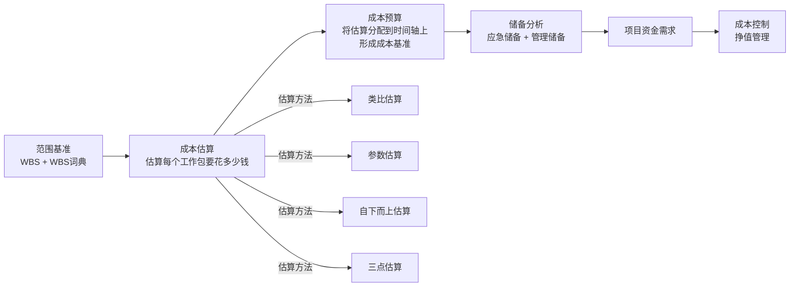

# T-COST-001｜成本估算、成本预算、储备分析与成本基准

> 本专题用于学习"项目成本管理"中为挣值管理提供基础和上下文的核心内容：**成本估算方法（类比/参数/自下而上/三点估算）、成本预算、成本基准、储备分析（应急储备 vs 管理储备）、资金限制平衡、成本失控的常见原因**。它们不是挣值管理的附属品，而是围绕一个核心问题展开：**在还不知道项目实际要花多少钱的时候，如何尽可能准确地估算？估算出来的数字如何变成可执行、可控制的预算基准？**

---

## 先看这个专题的主线

很多同学学成本管理直接跳到挣值管理（EV/PV/AC/CPI/SPI），忽略了挣值管理依赖的前提——成本基准（PV 的来源）是怎么来的。如果成本基准不准，挣值管理的所有计算都是基于错误基线的"精确错误"。

这条主线说明：**成本估算是从 WBS 开始的——没有 WBS 就没有靠谱的成本估算。** 估算的结果加上时间分配和储备，才形成可用于挣值管理的成本基准。

---

## 成本估算方法

> **[概念组｜成本估算主要方法]**
>
> 1. **类比估算**：使用以往类似项目的实际成本数据来估算当前项目。**优点是快、成本低；缺点是准确性差。** 适合项目早期、信息有限时使用。
> 2. **参数估算**：使用历史数据与项目参数之间的统计关系来估算。例如：每行代码 = 50 元 × 预计 10 万行 = 500 万元。**准确性取决于参数模型的成熟度和数据的可靠性。**
> 3. **自下而上估算**：从 WBS 底层的工作包开始逐一估算，然后逐层汇总。**最准确但最耗时。** 软考中间接提到"如果无法合理估算，应将活动进一步细化后再估算"。
> 4. **三点估算**：乐观(O)、最可能(M)、悲观(P)三个值，通过公式计算期望成本。与进度管理中的 PERT 公式相通。

> **[考试辨析｜类比 vs 参数]** 类比估算用的是"类似项目整体"的经验数据，参数估算用的是"单位工作量 × 费率"的数量关系。如果题目说"参考上一个类似项目的实际成本"→ 类比；如果题目说"按每人每月 2 万元 × 预计 200 人月"→ 参数。

---

## 成本预算与成本基准

> **[定义｜成本预算]** 成本预算是将批准的总成本估算分配到各个工作包和各个时间段的过程。它的输出是**成本基准**。

> **[定义｜成本基准]** 成本基准是经过批准的时间分阶段预算，用于测量、监督和控制项目的整体成本绩效。成本基准 = 各工作包估算之和 + 应急储备。它通常用 S 曲线表示，是挣值管理中**PV（计划价值）的参照对象**。

成本估算 vs 成本预算的关键区别：
- **估算**回答"要花多少钱"（总量）
- **预算**回答"什么时候花多少钱"（时间分配）→ 形成成本基准

---

## 储备分析：应急储备 vs 管理储备

> **[高频辨析｜应急储备 vs 管理储备]**
>
> **应急储备**：针对**已识别风险**（已知-未知）的预算预留。已经包含在成本基准中，项目经理可以动用。例如：预留 10% 的预算应对已知的技术风险。
>
> **管理储备**：针对**未识别风险**（未知-未知）的预算预留。**不包含在成本基准中**，需要管理层批准才能动用。动用后需要调整成本基准。
>
> 关键判断：应急储备 → 在成本基准内，项目经理有权使用。管理储备 → 在成本基准外，动用需走变更。

---

## 典型题详解与举一反三

> **例题 1｜估算方法选择**
>
> 项目早期，需求尚未详细明确，项目经理需要快速给出一个粗略的成本估算。最合适的方法是：
>
> A. 自下而上估算
> B. 参数估算
> C. 类比估算
> D. 三点估算

项目早期、信息有限、需要快速 → 类比估算最合适。正确答案是 **C**。自下而上最准确但也最耗时，不适合早期粗略估算。

**可制卡点：** 估算方法选择判断卡（场景→方法）。

---

> **例题 2｜储备区分**
>
> 项目经理为可能发生的服务器故障预留了 20 万元。这笔钱属于：
>
> A. 管理储备
> B. 应急储备
> C. 利润预留
> D. 成本超支

"可能发生的服务器故障"→ 已识别的风险 → 应急储备。正确答案是 **B**。如果题目说"为完全不可预见的情况预留"→ 管理储备。

**可制卡点：** 应急储备 vs 管理储备判断卡（含关键词）。

---

> **例题 3｜成本基准的构成**
>
> 成本基准由以下哪项构成？
>
> A. 各工作包估算 + 管理储备
> B. 各工作包估算 + 应急储备
> C. 各工作包估算 + 应急储备 + 管理储备
> D. 仅各工作包估算

成本基准 = 工作包估算之和 + 应急储备。管理储备**不在**成本基准内。正确答案是 **B**。

**可制卡点：** 成本基准组成卡。

---

> **例题 4｜成本失控原因**
>
> 某项目成本严重超支。经查，项目在设计阶段没有做成本估算，也没有设偏差预警阈值。以下哪项是造成成本失控的最可能原因？
>
> A. 缺乏成本估算和成本基准
> B. 团队成员太多
> C. 客户要求太高
> D. 技术太复杂

题干直接说"没有做成本估算""没有设偏差预警阈值"→ 缺乏成本估算和基准是根因。正确答案是 **A**。

**可制卡点：** 成本失控常见原因记忆卡。

---

> **例题 5｜案例题：成本估算不准**
>
> 项目经理使用类比估算法，参考了公司两年前的一个类似项目（实际成本 200 万元），直接将当前项目估算为 200 万元。但当前项目采用了新技术栈，且客户要求更短的工期。项目执行到一半时发现成本严重超支。请分析估算中的问题。

问题：① 类比估算的参考项目与当前项目差异显著（新技术、更短工期），不具备直接类比的条件；② 未考虑新技术带来的学习成本和风险溢价；③ 压缩工期可能导致赶工费用，应在估算中体现；④ 只采用了单一估算方法，未交叉校验（可结合参数估算或自下而上验证）。

改进：① 在使用类比估算的同时，补充自下而上估算（基于 WBS 工作包）做交叉验证；② 对新技术部分增加风险储备；③ 考虑赶工/加班的额外成本。

**可制卡点：** 成本估算案例模板卡。

---

## 这个专题应该怎样转化为 Anki 卡片

**概念卡**：类比估算、参数估算、自下而上估算、三点估算（成本版）、成本基准、应急储备、管理储备。

**辨析卡**：类比 vs 参数（参考类似项目 vs 用数量关系算）、应急储备 vs 管理储备（基准内/外、已识别/未识别风险、项目经理可用/需管理层审批）。

**流程卡**：WBS → 估算 → 预算 → 基准 → 控制 的完整链路。

**陷阱卡**：管理储备包含在成本基准中 → 错，管理储备在基准之外。

---

## 本专题的最小掌握标准

学完本专题后，至少能做到：① 区分四种估算方法并判断适用场景；② 区分应急储备和管理储备（基准内/外、谁可动用）；③ 理解成本基准 = 工作包估算 + 应急储备；④ 在案例题中分析估算不准的原因。

---

## 待核验与后续改进

- 软考教程中储备分析的具体分类术语需回查确认。[待核验]
