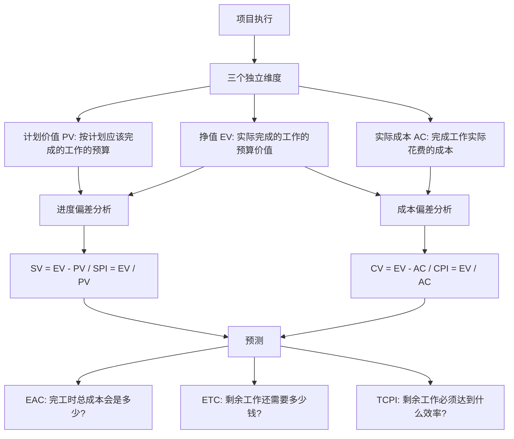
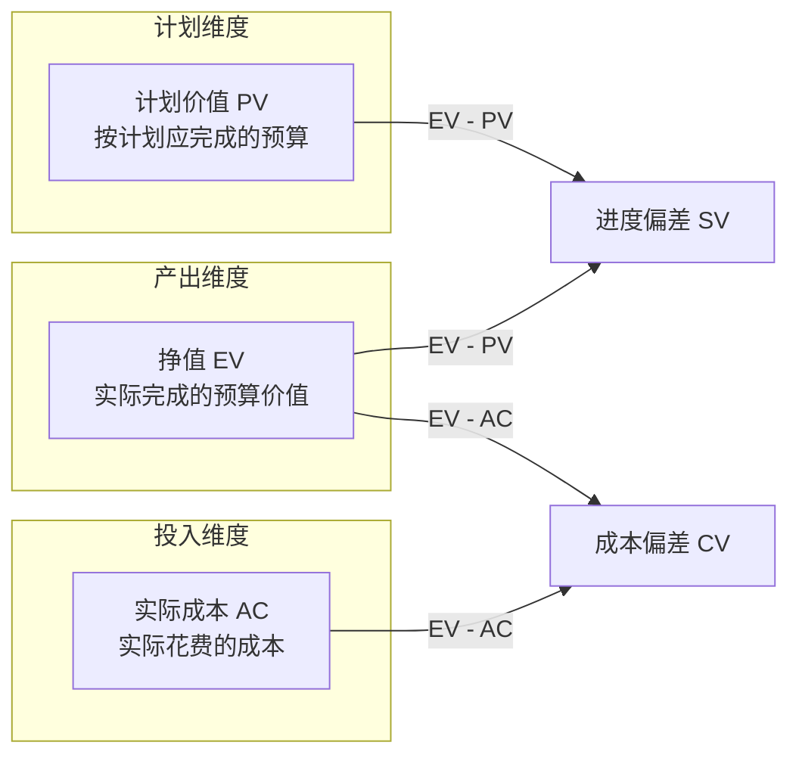
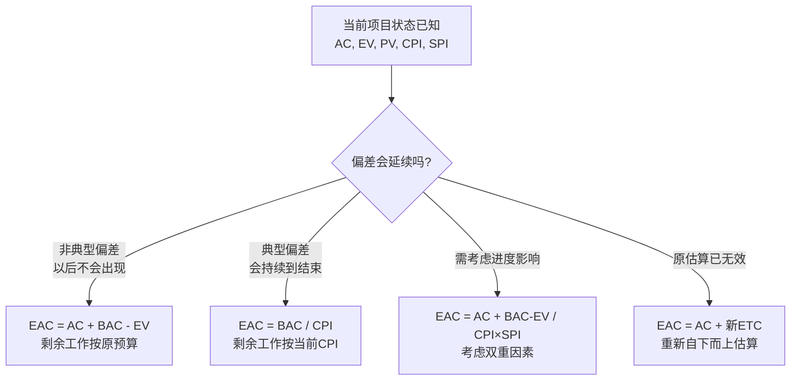
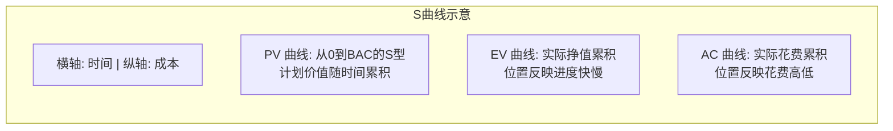

# T-COST-002｜挣值管理与成本绩效分析

> 本专题用于学习"项目成本管理"中最容易出计算题和案例题的一组核心内容：**挣值管理（EVM）、计划值（PV）、挣值（EV）、实际成本（AC）、成本偏差（CV）、进度偏差（SV）、成本绩效指数（CPI）、进度绩效指数（SPI）、完工估算（EAC）、完工尚需估算（ETC）和完工偏差（VAC）**。它们不是孤立公式，而是围绕一个核心问题展开：**在项目执行过程中，如何用一套统一的货币化指标，同时判断项目的进度状态和成本状态，并预测最终结果？**

---

## 先看这个专题的主线

挣值管理最容易被学成"背公式"。很多同学把 PV、EV、AC、CV、SV、CPI、SPI 的公式抄在纸上反复默写，但一遇到稍微变化的题目就不知道用哪个公式。真正理解挣值管理，要先抓住它的设计意图：项目管理中有三个独立维度——**计划做多少、实际花了多少钱、真正完成了多少**——挣值管理用统一货币单位把这三个维度放在一起比较，从而得出进度和成本的综合判断。

这张图把挣值管理的逻辑说清楚了：**PV、EV、AC 是三个输入**，它们之间的差值和比值产生 SV、CV、SPI、CPI 四个绩效指标，绩效指标再结合预算产生 EAC、ETC、TCPI 等预测指标。整个挣值管理的本质是"测量过去、判断现在、预测未来"。

这也解释了为什么软考特别喜欢考挣值管理——它可以在一道题里同时考查进度判断、成本判断、预测计算和决策分析，极易出综合计算题和下午案例题。

---

## 为什么要用挣值管理？传统方法的局限

先理解挣值管理解决了什么问题。在没有挣值管理之前，项目经理通常只能分别看两套数据：财务部给的"花了多少钱"和进度报告里的"完成了百分之多少"。这两个数各自看都还好，但合在一起就可能掩盖严重问题。

举一个经典例子：项目计划工期 10 个月，预算 100 万元。第 5 个月末，财务报告显示实际支出 50 万元，进度报告显示"完成 50%"。表面上看，钱花了 50%，活干了 50%，似乎一切正常。但实际上完全可能存在以下情况：

- 实际完成的 50% 工作，其预算价值只值 30 万元，而实际花了 50 万元——项目成本严重超支；
- 实际应该完成的工作（按计划到第 5 个月末），其预算价值是 60 万元，但只完成了值 30 万元的工作——项目进度严重滞后。

传统方法看不到这些问题，因为"花了多少钱"和"计划花多少钱"是两本账，而挣值管理把它们统一在一个框架下进行比较。

> **[核心思想｜挣值管理]** 挣值管理（Earned Value Management, EVM）是把范围基准、成本基准和进度基准整合起来，形成绩效基准，用于综合评估项目绩效和进展的方法。它不单独看进度或成本，而是用统一的货币单位同时衡量"计划做什么、实际完成了什么、花了多少钱"。

---

## 三个基础指标：PV、EV、AC

挣值管理的所有计算都建立在三个基础指标之上。这三个指标需要深刻理解，不是简单背定义。

### 计划价值（PV）——"按计划应该完成的工作值多少钱"

> **[定义｜计划价值 PV]** 计划价值（Planned Value）是为计划工作分配的经批准的预算。它是到某个特定时点为止，按计划应该完成的工作所对应的预算金额。PV 的总和就是项目的总预算，完工时的 PV 等于 BAC（完工预算）。

PV 的关键词是"计划应该"。它不是实际完成了多少，而是"按原计划这个时间点应该做到什么程度"。PV 只看计划，不关心实际情况。在挣值管理的 S 曲线图中，PV 通常是一条从零到 BAC 的平滑曲线。

### 挣值（EV）——"实际完成的工作按预算值多少钱"

> **[定义｜挣值 EV]** 挣值（Earned Value）是对已完成工作的测量值，用分配给该工作的预算来表示。它是实际完成的工作所对应的经批准的预算。EV 的计算必须与 PV 的预算口径一致。

EV 是整个挣值管理的核心——也是最容易出错的概念。EV 不是实际花了多少钱，也不是完成百分比乘以时间，而是**实际完成的工作在预算中值多少钱**。

> **[关键判断]** EV = 实际完成工作量 × 预算单价。EV 反映的是"产出"的价值，而不是"投入"的成本。EV 永远不大于对应工作包的 PV 总预算。

举个例子：某个工作包的预算是 100 万元。如果这个工作包完成了 40%，则 EV = 100 × 40% = 40 万元。这里说的"40 万元"是预算价值，不是实际花了多少钱——实际可能花了 35 万元，也可能花了 50 万元。

### 实际成本（AC）——"完成这些工作实际花了多少钱"

> **[定义｜实际成本 AC]** 实际成本（Actual Cost）是在给定时段内，执行工作而实际发生的总成本。它是为完成与 EV 相对应的工作而发生的全部费用。AC 的计算口径必须与 PV 和 EV 保持一致。

AC 是最直接的概念——就是财务账上实际花出去的钱。但要注意 AC 的计算口径：如果 PV 和 EV 只计算直接成本，AC 也只计算直接成本；如果都包含间接成本，那么三者口径统一。

### 三个指标的关系：一图胜千言

把这三个指标画在一起的时候，PV 代表"时间线上的预算"，EV 代表"实际产出能折合多少预算"，AC 代表"实际投入了多少钱"。**SV 比较的是产出和计划，CV 比较的是产出和投入。**

---

## 四个绩效指标：偏差与指数

有了三个基础指标后，就可以计算偏差和绩效指数。

### 进度偏差（SV）和成本偏差（CV）

> **[公式｜进度偏差 SV]**
>
> SV = EV − PV
>
> - SV > 0：进度提前（完成的预算价值超过了计划值）
> - SV = 0：进度符合计划
> - SV < 0：进度滞后（完成的预算价值低于计划值）

> **[公式｜成本偏差 CV]**
>
> CV = EV − AC
>
> - CV > 0：成本节约（完成的工作价值超过了实际花费）
> - CV = 0：成本符合预算
> - CV < 0：成本超支（实际花费超过了完成工作的价值）

注意 SV 和 CV 的单位都是货币（如元、万元），不是天数或百分比。SV 为正负时分别表示"挣的钱比计划多/少"，而不是直接说"提前了几天"。但在实际管理中，正的 SV 通常对应进度提前，负的 CV 通常对应成本超支。

### 进度绩效指数（SPI）和成本绩效指数（CPI）

> **[公式｜进度绩效指数 SPI]**
>
> SPI = EV / PV
>
> - SPI > 1：进度效率高于计划
> - SPI = 1：进度效率符合计划
> - SPI < 1：进度效率低于计划

> **[公式｜成本绩效指数 CPI]**
>
> CPI = EV / AC
>
> - CPI > 1：成本效率高于计划（花更少的钱完成更多的工作）
> - CPI = 1：成本效率符合计划
> - CPI < 1：成本效率低于计划（花更多的钱完成更少的工作）

SPI 和 CPI 是无量纲的比值，可以跨项目比较。**CPI 被认为是挣值管理中最重要的指标**，因为它直接反映已完成工作的成本效率。CPI 小于 1 意味着每花 1 元钱，只完成了不到 1 元的工作价值。

> **[易错提醒]** SPI 测量的是项目总工作量的效率，不专门测量关键路径。有可能 SPI > 1（整体工作量进度超前）但关键路径上的活动却延误了。所以挣值管理需要和关键路径法配合使用，不能只看 SPI 就判断项目一定能按期完工。

---

## 预测指标：EAC、ETC、TCPI

挣值管理的终极价值在于预测。当项目已经执行了一段时间，掌握了 CV、SV、CPI、SPI 等指标后，就可以预测项目完工时的总成本。

### 完工估算（EAC）

> **[定义｜完工估算 EAC]** 根据当前项目绩效和风险量化，对项目完工时总成本的预测。EAC 不是一个确定的数，而是基于不同假设条件计算出的预测值。

EAC 的计算公式取决于你对"未来绩效会怎样"的假设，这是挣值管理中最容易失分的判断题：

> **[公式组｜EAC 的四种典型计算方法]**
>
> **情况 1：剩余工作按预算单价进行（当前偏差不会延续）**
>
> EAC = AC + (BAC − EV)
>
> 适用条件：当前的偏差是非典型的，以后不会出现类似偏差。
>
> **情况 2：剩余工作按当前 CPI 进行（当前偏差会延续）**
>
> EAC = BAC / CPI
>
> 适用条件：当前的成本绩效会持续到项目结束，偏差是典型的。
>
> **情况 3：剩余工作同时受 CPI 和 SPI 影响**
>
> EAC = AC + (BAC − EV) / (CPI × SPI)
>
> 适用条件：需要同时考虑成本和进度对剩余工作的影响。
>
> **情况 4：重新自下而上估算**
>
> EAC = AC + 自下而上重新估算的 ETC
>
> 适用条件：原来的估算假设已经严重不成立，需要重新估算。

这四种情况中，**情况 1 和情况 2 是考试中最常出现的**。判断用哪个公式的关键在于题干有没有提示"偏差是典型的/非典型的"、"以后不会再出现类似偏差"、"项目将继续按当前绩效执行"等说法。

用一张图来理解这四种预测路径：

### 完工尚需估算（ETC）

> **[公式｜ETC]**
>
> ETC = EAC − AC
>
> ETC 表示从当前时点到项目完工还需要多少成本。它不是独立计算的，而是从 EAC 减去已发生的 AC 得出。

### 完工偏差（VAC）

> **[公式｜VAC]**
>
> VAC = BAC − EAC
>
> VAC 表示完工时预算与最终估算之间的差异。VAC > 0 表示预计成本结余，VAC < 0 表示预计成本超支。

### 完工尚需绩效指数（TCPI）

> **[公式｜TCPI]**
>
> TCPI = (BAC − EV) / (BAC − AC)
>
> 或当 BAC 不可行时：TCPI = (BAC − EV) / (EAC − AC)
>
> TCPI 表示"为了实现 BAC（或 EAC），剩余工作必须以什么成本效率完成"。TCPI > 1 意味着剩余工作必须比原计划更高效才能达标。

TCPI 是一个"倒逼指标"——已知项目目前花了 AC 完成了 EV，如果要实现 BAC 的目标，剩余工作的 CPI 必须达到 TCPI。如果 TCPI 远大于 1，说明目标已经很困难了。

---

## S 曲线：将挣值管理可视化

挣值管理的三个基础指标通常用 S 曲线图表示，这在考试中也会出现（看图判断题）。

在 S 曲线图中：
- PV 曲线在 EV 曲线上方 → EV < PV → SV < 0 → 进度滞后
- AC 曲线在 EV 曲线上方 → AC > EV → CV < 0 → 成本超支
- 理想状态：三条曲线接近或 EV 在最上方

---

## 典型题详解与举一反三

> **例题 1｜基础指标计算**
>
> 某项目到第 4 个月末的计划价值 PV = 100 万元，实际成本 AC = 110 万元，挣值 EV = 90 万元。请问该项目的进度偏差和成本偏差分别是多少？
>
> A. SV = 10 万元, CV = 20 万元
> B. SV = -10 万元, CV = -20 万元
> C. SV = -10 万元, CV = 20 万元
> D. SV = 10 万元, CV = -20 万元

这道题考查的是最基本的两组减法公式。SV = EV − PV = 90 − 100 = −10 万元，CV = EV − AC = 90 − 110 = −20 万元。正确答案是 **B**。

A 把符号搞反了；C 和 D 各自只反了一个。SV 为负说明进度滞后，CV 为负说明成本超支——这个项目既滞后又超支。

**延伸理解：** 这道题做完后要形成一个条件反射——看到 PV、EV、AC 三个数同时出现，第一反应是算 SV 和 CV，然后再算 SPI 和 CPI。EV 永远是"被减数"，SV = EV − PV，CV = EV − AC，顺序不要反。

**可制卡点：** SV 和 CV 的公式卡、符号含义卡。

---

> **例题 2｜绩效指数判断**
>
> 某项目 SPI = 0.8, CPI = 1.2，以下哪个判断是正确的？
>
> A. 进度超前，成本节约
> B. 进度滞后，成本节约
> C. 进度超前，成本超支
> D. 进度滞后，成本超支

SPI = 0.8 < 1，说明挣值低于计划值，进度滞后。CPI = 1.2 > 1，说明挣值高于实际成本，每花 1 元完成了超过 1 元的工作价值，成本节约。正确答案是 **B**。

**延伸理解：** 这道题揭示了挣值管理的价值——进度和成本是两个独立维度，完全可能出现"滞后但省钱"或"超前但费钱"的情况。你不需要知道 PV、EV、AC 的具体数值，只需要记住 SPI 和 CPI 的阈值：大于 1 是好的（正向），小于 1 是差的（负向）。

**可制卡点：** SPI/CPI 阈值判断卡。

---

> **例题 3｜EAC 计算——非典型偏差**
>
> 项目预算 BAC = 500 万元，目前 AC = 200 万元，EV = 180 万元。项目经理认为当前的成本偏差是由一次性的设备故障造成的，后续工作不会再出现此类偏差。完工估算 EAC 是多少？
>
> A. 520 万元
> B. 556 万元
> C. 500 万元
> D. 480 万元

题干关键词是"不会再出现"——这是非典型偏差的信号。公式用 EAC = AC + (BAC − EV) = 200 + (500 − 180) = 520 万元。正确答案是 **A**。

B 是用 BAC / CPI = 500 / (180/200) = 500 / 0.9 ≈ 556 万元（典型偏差公式）；C 是直接用 BAC；D 是错的。

**延伸理解：** 判断 EAC 公式的核心不在数学，在读题——你能不能从题干中识别出"典型"还是"非典型"。典型偏差的关键词有："预计将持续"、"按目前趋势"、"没有改善迹象"、"预计类似的偏差会继续"。非典型偏差的关键词有："一次性的"、"不会再出现"、"偶然发生"、"已采取措施纠正"、"已解决"。

**可制卡点：** EAC 公式选择判断卡（含题干关键词→公式的映射）。

---

> **例题 4｜EAC 计算——典型偏差**
>
> 某项目 BAC = 1000 万元，当前 EV = 400 万元，AC = 500 万元。如果项目团队预计目前成本绩效将贯穿项目始终，完工估算 EAC 预计为多少？
>
> A. 1100 万元
> B. 1250 万元
> C. 1000 万元
> D. 800 万元

CPI = EV / AC = 400 / 500 = 0.8。"目前成本绩效将贯穿项目始终"说明是典型偏差。EAC = BAC / CPI = 1000 / 0.8 = 1250 万元。正确答案是 **B**。

**延伸理解：** EAC = BAC / CPI 这个公式其实等价于 EAC = AC + (BAC − EV) / CPI。当 CPI < 1 时（成本超支），BAC / CPI > BAC，EAC 会大于原预算。CPI = 0.8 意味着每花 1 元只完成 0.8 元的工作，按这个效率做到完工，总成本就是 1000 / 0.8 = 1250 万元。

**可制卡点：** CPI 与 EAC 关系的直觉判断卡。

---

> **例题 5｜TCPI 计算**
>
> 项目 BAC = 800 万元，目前 EV = 300 万元，AC = 360 万元。项目经理希望项目完工时不超过原预算 BAC。为实现这一目标，剩余工作的成本绩效指数（TCPI）至少应达到多少？
>
> A. 1.0
> B. 1.14
> C. 0.88
> D. 1.2

TCPI = (BAC − EV) / (BAC − AC) = (800 − 300) / (800 − 360) = 500 / 440 ≈ 1.14。正确答案是 **B**。

当前 CPI = 300 / 360 = 0.83。TCPI = 1.14 > 1，意味着如果要在不超预算的情况下完工，剩余工作的效率必须从当前的 0.83 提升到 1.14，这是一个相当大的提升。

**延伸理解：** TCPI 和 CPI 的比较很有意义。如果 TCPI 远大于当前 CPI，说明目标很困难——项目团队必须以远超当前的效率工作才能达标。这可以用来判断"项目目标是否还现实"。如果 CPI = 0.8 而 TCPI = 1.5，基本可以判断原预算已经不可能实现了。

**可制卡点：** TCPI 公式卡 + TCPI 与 CPI 比较的意义卡。

---

> **例题 6｜挣值管理综合判断**
>
> 某信息化项目到第 6 个月末时，PV = 600 万元，EV = 540 万元，AC = 630 万元。BAC = 1200 万元。以下说法哪个最准确？
>
> A. 项目进度滞后但成本节约，预计完工总成本将低于预算
> B. 项目进度超前且成本节约，预计可提前完工
> C. 项目进度滞后且成本超支，如按当前绩效继续，预计完工总成本将超过预算
> D. 项目进度超前但成本超支，需要加强成本控制

先算 SPI = 540 / 600 = 0.9 < 1 → 进度滞后。CPI = 540 / 630 ≈ 0.857 < 1 → 成本超支。如按当前 CPI 继续（典型偏差），EAC = BAC / CPI = 1200 / 0.857 ≈ 1400 万元 > BAC。正确答案是 **C**。

A 错在"成本节约"（CPI < 1 是超支）；B 全都错；D 错在"进度超前"。

**延伸理解：** 挣值管理的价值在这道题中充分体现：进度和成本一起给出完整图景。如果只看花了多少钱（AC = 630），你可能以为项目在推进；如果只看完成了多少（EV = 540），你可能觉得还行。但三个数放在一起，就暴露了既慢又费钱的问题。

**可制卡点：** 挣值综合判断的快速分析流程卡。

---

> **例题 7｜案例题：挣值分析与管理建议**
>
> 某系统集成项目 BAC = 800 万元，计划工期 10 个月。第 5 个月末，项目经理收集到以下数据：PV = 400 万元，EV = 320 万元，AC = 380 万元。请分析项目的进度和成本状况，预测完工总成本，并提出管理建议。

这是下午案例题的典型出法。不能只算数，还要分析原因和提出措施。

> **[答题思路]**
>
> 第一步，计算绩效指标。SV = 320 − 400 = −80 万元（进度滞后），CV = 320 − 380 = −60 万元（成本超支），SPI = 320 / 400 = 0.8，CPI = 320 / 380 ≈ 0.842。
>
> 第二步，预测。如果按当前绩效继续（典型偏差），EAC = BAC / CPI = 800 / 0.842 ≈ 950 万元；如果偏差是非典型的（可纠正），EAC = AC + (BAC − EV) = 380 + 480 = 860 万元。ETC = EAC − AC。
>
> 第三步，诊断原因。进度滞后的可能原因：关键路径活动延误、资源不足或效率低、需求变更频繁导致返工。成本超支的可能原因：加班费增加、使用了高于预算单价的外部资源、范围蔓延导致额外工作。
>
> 第四步，提出管理建议。进度方面：识别关键路径偏差活动，评估是否可通过赶工（增加关键资源）或快速跟进（调整活动逻辑）压缩工期。成本方面：加强成本监控，严格控制非关键开支，评估是否可通过资源优化降低后续成本。变更方面：如有范围蔓延，应严格变更控制流程。同时应更新项目管理计划和成本基准，经 CCB 审批后与干系人沟通。

**延伸理解：** 下午案例题中，挣值管理往往不是单独出现的，而是和进度管理、范围管理、变更控制绑在一起考。阅卷人希望你展示的能力是：能够从数据中提取信息，关联可能的原因，给出具体的管理措施——而不是只写"加强管理""注意成本"这些空话。

**可制卡点：** 挣值案例答题模板卡：计算→判断→预测→诊断→建议。

---

## 这个专题应该怎样转化为 Anki 卡片

**公式卡**是本专题最重要的卡型。但公式卡不能只写"CV = EV − AC"，必须带上：变量含义、正负号代表什么、一个最小数值例子。建议把每个公式做成一张卡，正面是公式名称和变量含义提示，背面是公式、正负判断和一个例子。

**辨析卡**应重点覆盖：
- 典型偏差 vs 非典型偏差（题干关键词→公式选择）
- SV 和 CV（各自的比较对象不同）
- SPI 和 CPI（各自的含义和阈值判断）
- EAC 的四种计算路径

**判断卡**：看到"不会再出现"→ 非典型 → EAC = AC + BAC − EV；看到"将贯穿始终"→ 典型 → EAC = BAC / CPI。

**案例模板卡**：挣值案例答题框架：先算 SV/CV/SPI/CPI → 判断偏差方向与幅度 → 选 EAC 公式做预测 → 分层分析原因（进度、成本、范围）→ 给出分项措施 → 提出变更和沟通建议。

**陷阱卡**：
- SPI > 1 不等于项目一定提前完工（关键路径可能延误）
- SV 的单位是货币不是天数
- EV 不是实际花费，是实际完成工作的预算价值

**暂不制卡内容**：S 曲线图的绘制方法（理解即可，不考作图）。

---

## 本专题的最小掌握标准

学完本专题后，你至少应该能做到六件事。

第一，给出 PV、EV、AC 三个数，能立即正确计算 SV、CV、SPI、CPI，并准确判断进度和成本状态。第二，能从题干关键词中识别"典型偏差"和"非典型偏差"，并选择正确的 EAC 计算公式。第三，理解 EV 的核心含义——它是"实际完成工作的预算价值"，不是实际花费，也不是完成百分比。第四，能够计算 TCPI 并解释其管理含义——它不是回顾性的，而是对剩余工作提出的效率要求。第五，面对挣值管理的综合计算题，能够按"基础指标→绩效指标→预测指标"的顺序逐步求解，不乱套公式。第六，面对下午案例题，能够将挣值数据转化为管理诊断和具体建议，而不是只汇报计算结果。

如果这六件事都能做到，挣值管理对你来说就不是"一堆公式"，而是一个完整的"测量—判断—预测—决策"管理工具。

---

## 待核验与后续改进

- 本专题中的具体数值例题为典型题，基于常见考法和教材公式构造，非引用具体年份真题。[待核验] 如需精确匹配历年真题年份，需回查真题汇编。
- EAC 的"CPI × SPI"加权公式在教程中是否存在明确表述需回查教材原文。[待核验]
