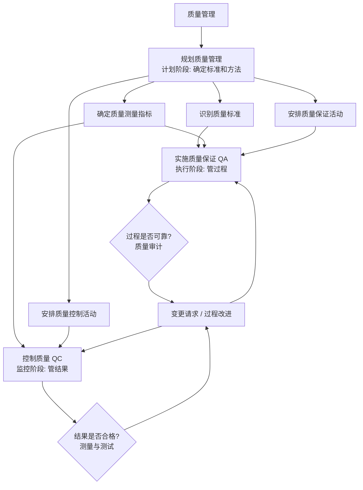

# T-QUAL-001｜质量保证、质量控制与质量审计

> 本专题用于学习"项目质量管理"中最容易出辨析题和案例题的一组核心内容：**质量规划、质量保证（QA）、质量控制（QC）、质量审计、质量与等级的区别、预防与检查**。它们不是孤立管理动作，而是围绕一个核心问题展开：**如何让项目不是最后才发现质量问题，而是在过程和结果两个层面持续保证质量？**

---

## 先看这个专题的主线

质量管理最容易被学成"检查结果是否合格"。但项目管理中的质量管理远不止于此——它至少在两个层面同时运作：一是确保过程是可靠的（做东西的方法对不对），二是确保结果满足要求（做出来的东西好不好）。



这张图的核心信息是：**QA 管过程，QC 管结果。** QA 问的是"我们做事的方法本身能不能产出合格品？"，QC 问的是"当前做出来的东西到底合格不合格？"两者互相配合——QC 发现的问题可能说明过程有问题，需要通过 QA 来改进过程。

---

## 质量 vs 等级：一个经典混淆

> **[辨析｜质量 vs 等级]**
>
> **质量**是一系列内在特性满足要求的程度。质量反映的是"好不好"——有没有缺陷、是否满足规格。低质量始终是一个问题。
>
> **等级**是对用途相同但技术特性不同的可交付成果的级别分类。等级反映的是"高端还是低端"——功能多还是少、配置高还是低。低等级不一定有问题，只要你买的就是低等级的产品。
>
> 关键判断：**低质量永远不能接受。低等级可能是可接受的设计选择。**

这道辨析在选择题中经常出现。例如："客户选择了经济型配置的服务器，这不影响其质量"——正确。等级是低端，但只要满足低端配置对应的全部质量要求，质量就是合格的。

---

## QA 与 QC：最核心的辨析

> **[定义｜质量保证 QA]** 质量保证是审计质量要求和质量控制测量结果，确保项目采用合理的质量标准和操作性定义的过程。QA 关注的是**过程**是否可靠，主要手段是**质量审计**和**过程分析**。

> **[定义｜质量控制 QC]** 质量控制是监测并记录执行质量活动的结果，从而评估绩效并建议必要变更的过程。QC 关注的是**结果**是否合格，主要手段是**检查、测试、测量、七种基本质量工具**。

```mermaid
flowchart LR
    QA[质量保证 QA] -->|关注| P[过程 Process]
    QA -->|手段| A1[质量审计]
    QA -->|手段| A2[过程分析]
    QA -->|问题| "做的方法对不对?"
    QC[质量控制 QC] -->|关注| R[结果 Result]
    QC -->|手段| C1[测量与测试]
    QC -->|手段| C2[七种质量工具]
    QC -->|问题| "做出来的东西好不好?"
    P -->|过程质量影响| R
    R -->|发现偏差后反馈改进| P
```

> **[考试口诀]** QA = 管过程（审计、改进）。QC = 管结果（测量、判断）。QC 发现结果不合格 → 通过 QA 改进过程 → 下一次结果更好。

以下是一个常考的判断题：

- "QC 关注的是核实可交付成果是否符合质量要求"——正确。
- "QA 关注的是项目过程是否符合既定的质量标准和组织政策"——正确。
- "QA 和 QC 是一回事"——错误，这是最大的混淆点。

---

## 质量审计：QA 的核心工具

> **[定义｜质量审计]** 质量审计是确定项目活动是否遵循了组织的质量政策和项目质量要求的结构化、独立的过程。它可以由内部或外部审计师执行。

质量审计的目标不是"抓错误"，而是：
1. 识别所有正在实施的好的/最佳实践
2. 识别所有差距/不足
3. 分享好的实践到组织其他项目
4. 帮助过程改进

质量审计是 QA 的核心工具——它检查的不是产品是否合格，而是你们做事的方式是否合理、是否合规、是否在持续改进。

---

## 典型题详解与举一反三

> **例题 1｜质量 vs 等级**
>
> 项目团队交付了一个低等级但高质量的软件产品。以下理解哪项正确？
>
> A. 这不可能，低等级一定意味着低质量
> B. 软件的功能少（低等级），但所有已实现的功能都没有缺陷（高质量）
> C. 项目经理应该拒绝交付低等级产品
> D. 低等级意味着产品有大量缺陷

正确答案是 **B**。等级和质量的本质区别在于：等级是设计的意图（故意做功能少的版本），质量是执行的符合程度（做出来的功能是否没有缺陷）。

**延伸理解：** 手机的例子最直观——一台入门级安卓手机和一台旗舰手机比，等级不同；但如果入门级手机所有功能都按设计正常运行，它的质量就是合格的。

**可制卡点：** 质量 vs 等级辨析卡。

---

> **例题 2｜QA vs QC**
>
> 项目过程中，质量管理团队组织了一次审计，发现团队的代码审查流程没有按公司标准执行。这属于什么活动？
>
> A. 质量控制
> B. 质量保证
> C. 范围确认
> D. 进度控制

关键在于"审计流程是否按标准执行"——这是检查过程是否合规，属于 QC？不，审计过程属于 QA。正确答案是 **B**。如果审计的是代码本身有没有 bug，那就是 QC。

**延伸理解：** 判断 QA 还是 QC 的关键问题：它在检查"做事的方法"还是"做出来的产品"？方法 = QA，产品 = QC。

**可制卡点：** QA vs QC 场景判断卡（含关键词判断表）。

---

> **例题 3｜质量成本类型**
>
> 项目投入资源对已完成模块进行测试，发现了一批缺陷并要求开发人员修复。测试活动属于以下哪种质量成本？
>
> A. 预防成本
> B. 评估成本
> C. 内部失败成本
> D. 外部失败成本

测试是评估活动——目的是判断产品是否符合要求 → 评估成本。修复缺陷本身属于内部失败成本，但测试活动是评估成本。正确答案是 **B**。

**延伸理解：** 质量成本四分类：
- **预防成本**：培训、流程改进、工具投入（让问题不发生）
- **评估成本**：测试、检查、评审（发现问题）
- **内部失败成本**：交付前返工、报废（内部发现的问题）
- **外部失败成本**：保修、召回、商誉损失（客户发现的问题）

**可制卡点：** 质量成本四分类辨析卡。

---

> **例题 4｜质量保证与质量控制的配合**
>
> QC 检测发现某个模块连续三次迭代都出现类似的边界条件错误。以下哪项是最合理的下一步行动？
>
> A. 继续增加测试用例
> B. 通过 QA 审查该模块的开发流程，找出为什么同类错误反复出现
> C. 更换开发人员
> D. 降低质量测量标准

QC 发现结果问题反复出现 → 问题可能不在结果本身，而在产生结果的过程 → 应该通过 QA（过程分析）从源头上解决。正确答案是 **B**。A（继续测）治标不治本，C（换人）不分析原因，D（降标准）违背质量原则。

**延伸理解：** 这道题体现了 QA 和 QC 的协同关系——QC 发现模式，QA 追根溯源。案例题中如果能写出这个逻辑链条，比只说"加强质量管理"要有效得多。

**可制卡点：** QA-QC 协同工作流卡。

---

> **例题 5｜案例题：质量问题的系统性分析**
>
> 某项目在上线前一周的集中测试中发现了大量缺陷。经调查，团队在整个开发周期里基本只做了功能测试，没有做代码评审、没有做集成测试、没有对关键模块进行性能压测。项目经理要求加班修复缺陷并直接上线。请分析问题并提出改进建议。

问题：① 质量管理前置不足——没有制定和实施质量计划；② 过程失控——缺乏代码评审（QA 缺失），导致缺陷积累到后期才暴露（QC 发现）；③ "测试只在最后做"违背了质量管理的持续预防原则——预防成本远低于失败成本；④ 项目经理让加班修复直接上线的做法是让团队承担前期质量规划失败的全部后果。

改进建议：① 质量规划阶段明确质量测量指标、必要的质量活动（代码评审、各阶段测试、性能测试）；② 执行阶段坚持 QA 活动（代码评审流程），持续保证过程质量；③ QC 活动贯穿开发周期（单元测试→集成测试→系统测试），而不是集中在最后；④ 建立缺陷追踪和根因分析机制，从过程上防止同类错误反复。

**延伸理解：** 案例题中只要看到"测试集中在最后""前期不做评审""缺陷集中爆发""加班修复直接上线"，这四个信号要立即识别为质量管理体系性失败。

**可制卡点：** 质量案例共性诊断模板卡。

---

## 这个专题应该怎样转化为 Anki 卡片

**概念卡**：质量、等级、质量保证（QA）、质量控制（QC）、质量审计、预防成本、评估成本、内部失败成本、外部失败成本。

**辨析卡**：QA vs QC（过程 vs 结果、审计 vs 测量/测试）、质量 vs 等级（符合程度 vs 设计级别）、预防成本 vs 评估成本（防止缺陷 vs 发现缺陷）。

**案例模板卡**：质量问题的系统诊断框架——是否缺质量规划 → 是否有过程保证（QA）→ 是否有充分 QC → 偏差是否反馈到过程改进。

**陷阱卡**：
- "质量越高越好" → 错，质量应满足要求即可，过度质量增加成本
- "QA 就是测试" → 错，QA 关注过程，测试属于 QC
- "质量审计是外部审计" → 错，可以是内部也可以是外部

---

## 本专题的最小掌握标准

学完本专题后，你至少应该能做到四件事。

第一，能清楚区分 QA（管过程、做审计）和 QC（管结果、做测量），并能根据具体管理活动的描述判断属于 QA 还是 QC。第二，理解质量成本的四分类，并能在题干场景中正确归类。第三，理解质量和等级的区别——低质量永远不可接受，低等级可能是合理选择。第四，能在案例题中诊断质量管理体系性失败，并给出"规划→过程保证→持续检测→过程改进"的系统改进方案。

---

## 待核验与后续改进

- 质量成本四分类的术语与软考教程中文版的一致性需回查教材。[待核验]
- 质量管理七工具和新七工具的具体内容在本专题中简要提及，详细覆盖建议另设专题。[待核验]
