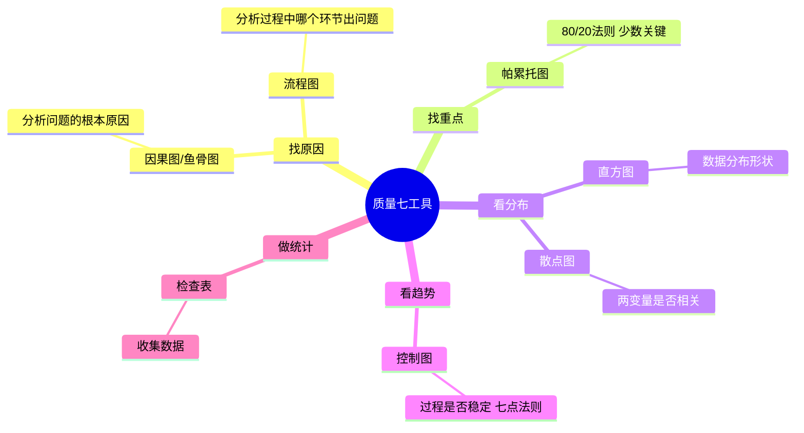
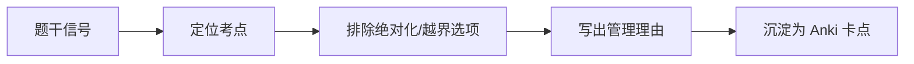

# T-QUAL-002｜质量管理七工具、新七工具与质量问题分析

> 本专题用于学习"项目质量管理"中的核心工具内容：**质量七工具（因果图/流程图/检查表/帕累托图/直方图/控制图/散点图）、新七工具简介、控制图的判定规则（七点法则）、质量工具的选择场景**。它们不是可背可不背的冷门知识，而是围绕一个核心问题展开：**在质量管理中，什么时候用什么工具来分析问题、发现问题、展示问题、改进过程？**

---

## 先看这个专题的主线

质量管理七工具是选择题的高频考点——不是考你"会用"，而是"能区分"。题目通常给你一个场景描述（如"项目经理想看哪些缺陷最严重"），让你选出正确的工具。考的是**工具与场景的匹配**。

---

## 七工具逐一精讲

### 1. 因果图（鱼骨图/石川图）

> 用途：**找问题的根本原因**。将问题（鱼头）和可能的原因（鱼骨）用图形连接。常用于质量问题的根因分析。

**考试场景**：团队在分析"为什么 bug 增多"→ 画因果图，从人员、方法、工具、环境几个维度找原因。

### 2. 流程图

> 用途：**分析过程中哪个环节可能出问题**。显示输入→过程步骤→输出的顺序关系。

**考试场景**：想了解变更请求在组织里经过哪些环节 → 画流程图。

### 3. 检查表（核查表）

> 用途：**收集数据**。用标准化的表格记录观测数据。**是所有质量分析的数据基础。**

**考试场景**：测试人员记录每种 bug 出现的次数 → 用检查表。

### 4. 帕累托图

> 用途：**找出"关键的少数"**。80/20 法则——80%的问题由 20% 的原因造成。将原因按发生频率从高到低排列并叠加累计百分比线。

> **[考试特征]** 帕累托图 = 柱状图（频率降序）+ 折线（累计百分比）。常用于排序缺陷类型、投诉原因等。题目出现"哪种缺陷最多、哪些是最主要的"→ 帕累托图。

### 5. 直方图

> 用途：**展示数据的分布形状**。将连续数据分成若干区间，显示每个区间中有多少数据点。可以判断是否符合正态分布、是否偏斜。

**考试场景**：展示一批零件尺寸的分布是否在规格范围内 → 用直方图。注意与帕累托图的区别：直方图按**数值区间**分组，帕累托图按**类别**排序。

### 6. 控制图

> 用途：**判断过程是否稳定**。显示随时间变化的数据点，加上中心线、上控制限（UCL）和下控制限（LCL）。

> **[高频考点｜七点法则]** 连续七个数据点出现在中心线的同一侧，即使没有超出控制限，也说明过程出现了异常变化，需要调查。

**考试场景**："连续 7 天每天缺陷数都在平均值以上"→ 即使不超控制限，也说明过程失控了→ 属于控制图的判断规则。

### 7. 散点图

> 用途：**判断两个变量之间是否存在相关性**。X 轴一个变量，Y 轴另一个变量，看数据点是否呈现趋势。

**考试场景**：想验证"代码行数越多是否缺陷密度越高"→ 散点图。

---

## 新七工具简介

| 工具 | 用途 |
|---|---|
| 亲和图 | 归类大量想法/数据 |
| 关联图 | 展示复杂因果关系 |
| 树形图 | 层级分解（类似 WBS） |
| 矩阵图 | 展示多因素关系 |
| 优先矩阵 | 加权排序决策 |
| 活动网络图 | 展示活动顺序（类似 PDM） |
| 过程决策程序图 | 预测障碍并制定对策 |

新七工具考得较少，以识别题为主（问"以下哪个不属于新七工具""亲和图属于什么"）。

---

## 工具选择速查表

## Anki 补强：质量工具题干信号

质量工具卡不应做成“七工具有哪些”的大列表，而应按题干信号拆成识别卡：

- 找根因：因果图。
- 找关键少数：帕累托图。
- 看过程稳定性：控制图。
- 看数据分布：直方图。
- 看两个变量相关关系：散点图。
- 收集和记录缺陷数据：检查表。
- 看流程步骤和责任交接：流程图。

新七工具若教材名称或覆盖范围不稳，应先标记待核验，不进入主复习。

| 考试场景 | 选什么工具 |
|---|---|
| 分析 bug 的根因 | 因果图（鱼骨图） |
| 想看什么类型的缺陷最多 | 帕累托图 |
| 想看代码缺陷数随时间的变化趋势 | 控制图 |
| 收集测试缺陷数据 | 检查表 |
| 想看交付物尺寸是否集中在目标范围 | 直方图 |
| 想看测试覆盖率和缺陷率有无关系 | 散点图 |
| 想分析变更审批经过哪些环节 | 流程图 |

---

## 典型题详解与举一反三

> **例题 1｜帕累托图**
>
> 项目经理整理了过去 3 个月的缺陷数据，想找出最主要的三类缺陷并优先处理。最适合的工具是：
> A. 因果图  B. 控制图  C. 帕累托图  D. 散点图

"找出最主要的三类"→ **帕累托图（80/20法则）。** 正确答案是 **C**。因果图找根因但不排序，控制图看趋势不看类别。

**可制卡点：** 帕累托图 vs 因果图的场景区分卡。

---

> **例题 2｜七点法则**
>
> 在控制图中，连续 7 个数据点出现在中心线同一侧，意味着什么？
> A. 过程非常稳定  B. 过程出现了异常，需要调查  C. 数据测量有误  D. 可以降低控制限

正确答案是 **B**。连续 7 点同侧是"非随机模式"的典型标志，即使不超出控制限也说明过程异常。

**可制卡点：** 控制图七点法则卡。

---

> **例题 3｜因果图的使用场景**
>
> 某系统上线后频繁出现响应超时。团队召开分析会，从网络、数据库、代码、服务器四个维度分析可能的原因。他们最可能使用的工具是：
> A. 直方图  B. 因果图  C. 帕累托图  D. 散点图

"从多个维度分析可能的原因"→ **因果图（鱼骨图）**。正确答案是 **B**。

**可制卡点：** 因果图使用场景判断卡。

---

> **例题 4｜直方图 vs 帕累托图**
>
> 直方图和帕累托图最本质的区别是：
> A. 直方图用柱状，帕累托图用折线
> B. 直方图按数值区间分组，帕累托图按类别降序排列
> C. 直方图用于分析原因，帕累托图用于展示结果
> D. 两者没有本质区别

正确答案是 **B**。直方图展示连续数据的分布（按数值区间），帕累托图展示类别数据按频率排序。

**可制卡点：** 直方图 vs 帕累托图的核心区别卡。

---

> **例题 5｜检查表的定位**
>
> 以下哪项最适合用检查表来完成？
> A. 分析缺陷的根本原因
> B. 记录每次测试中发现的缺陷数量和类型
> C. 判断过程是否统计受控
> D. 分析两个变量之间的相关性

"记录"→ 检查表就是用来**系统化收集数据**的。正确答案是 **B**。

**可制卡点：** 检查表作用卡（收集数据的基础工具）。

---

> **例题 6｜综合场景**
>
> 某项目在系统测试阶段发现大量缺陷。项目经理想要：① 记录所有缺陷的类型和频率；② 找出缺陷数量最多的三个模块；③ 分析这些模块缺陷集中的根本原因。分别应使用什么工具？

① 检查表（收集缺陷数据）→ ② 帕累托图（按模块排序找 Top 3）→ ③ 因果图（从方法/人员/设计/工具等维度找根因）。

**可制卡点：** 质量工具链卡（检查表→帕累托→因果图）。

---

## 本轮真题覆盖增强：质量工具按问题选

本节把 `questions.full.clean.md` 与既有真题映射中的高频考法反查回本专题。题库常考排列图、因果图、控制图、新七工具；工具题关键不是背名词，而是看“要解决什么问题”。 学习时不要只背定义，要能从题干信号判断它在考哪一个管理动作或技术边界。

这类题的识别链路可以这样看：

图里的重点是“先定位，再排错”。软考选择题常用绝对化说法、角色越权、流程跳步来制造干扰；下午案例题则把同一个错误包装成多句背景，需要把事实翻译回管理过程。

> **例题｜质量工具按问题选（真题型改编训练题）**
>
> 某项目缺陷统计显示，80% 的缺陷集中在少数几个模块。项目经理下一步最适合先使用的工具是：
>
> A. 帕累托图  
> B. 责任分配矩阵  
> C. 风险登记册  
> D. 项目章程

**考查点：** 七工具、帕累托图、主要少数。

**题干关键词：** 80%、少数模块、缺陷集中。

**解题过程：** 帕累托图用于识别造成多数问题的少数关键因素，适合先定位主要缺陷来源。

**正确答案：** A。

**错项分析：**

- B 用于分配责任，不直接分析缺陷分布。
- C 记录风险，不是质量统计工具。
- D 是启动文件。

**举一反三：** 质量工具题用“目的”反推：抓主要少数用帕累托，找根因用因果图，看过程稳定性用控制图，看相关关系用散点图。

**可制卡点：** 帕累托图用途；因果图用途；控制图用途。

## 这个专题应该怎样转化为 Anki 卡片

**概念卡**：七工具每工具一张（名称+用途+考试场景）。

**辨析卡**：帕累托图 vs 直方图、因果图 vs 流程图、控制图 vs 散点图。

**场景判断卡（最重要的卡型）**：正面=考试场景描述，背面=应选什么工具。

**规则卡**：七点法则（连续 7 点同侧→异常）。

**陷阱卡**："新七工具就是质量七工具的升级版"→ 错，两个分类体系不同。

---

## 本专题的最小掌握标准

至少能做到：给定一个考试场景描述（如"想看什么缺陷最多"、"想判断过程是否稳定"、"想找根因"），能立即匹配正确的质量工具。记住七点法则。

---

## 待核验与后续改进

- 新七工具的具体名称和分类在软考教程中是否完整列出需回查。[待核验]
- 控制图的具体公式（UCL/LCL）不要求记忆，但七点法则是否为教材原文需确认。[待核验]
