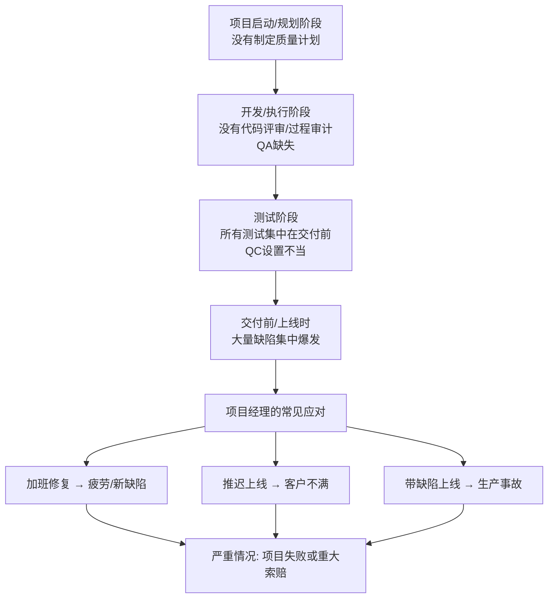
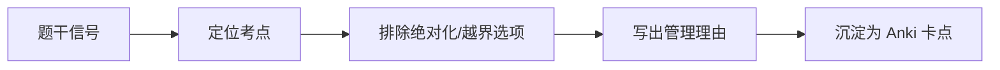

# T-QUAL-003｜质量问题案例模板：缺陷、测试、验收与纠偏

> 本专题与 T-CASE-001 通用方法和 T-QUAL-001 QA/QC 基础配合使用。提供"质量问题"这一高频下午案例场景的**专项诊断模板和答题框架**，核心问题是：**项目后期集中爆发大量缺陷——到底是哪里没做对？怎么在案例题中组织一个从"诊断"到"定措施"的完整答案？**

---

## 典型剧情模式

质量问题案例有一条高度可识别的"标准剧情链"：

---

## 诊断框架（三问法）

面对质量问题案例，用三个问题驱动诊断：

**问 1：规划阶段有没有质量计划？**
- 有没有质量测量指标？（"什么叫质量好"有没有明确定义）
- 有没有安排质量活动？（代码评审、测试计划、质量审计）
- 有没有识别相关质量标准？

**问 2：执行阶段有没有做 QA？**
- 有没有过程审计？（检查"做事的方法"对不对）
- 有没有代码评审/技术评审？
- 有没有识别出过程中的问题并做改进？

**问 3：监控阶段 QC 怎么做的？**
- 测试是不是一直拖到最后一刻？（QC 前置不足）
- 缺陷数据有没有被记录和趋势分析？
- 发现了问题有没有反馈到过程和计划中改进？

> **[核心规律]** 如果题干说"项目前期没有做质量计划"或"没有测试计划"→ 规划阶段质量管理缺失。题干说"没有进行代码评审/过程检查"→ QA 缺失。题干说"所有测试集中在交付前两周"→ QC 设置不当。

---

## 答题框架

| 答题步骤 | 内容 |
|---|---|
| **找问题** | ① 未制定质量计划/质量测量指标缺失 ② QA 过程缺失（无代码评审/无过程审计）③ QC 集中在后期，缺陷积累 ④ 未进行根因分析，同类错误反复出现 |
| **分析原因** | 预防成本投入严重不足 → 内部失败成本急剧放大；质量是"做出来的"不是"测出来的"的意识缺失 |
| **提措施** | ① 制定/补充质量计划 ② 建立代码评审和技术评审流程（QA）③ 重新设计测试策略：单元→集成→系统→验收 ④ 建立缺陷根因分析和追踪机制 ⑤ 加强团队质量意识培训 |
| **评估影响** | 推迟上线 → 与客户沟通、评估合同影响；加班修复 → 评估人员负荷和二次缺陷风险 |
| **沟通与变更** | 质量基准变更（如有）→ 走整体变更控制 → 通知相关干系人 |

---

## 案例训练片段

> **训练的片段｜测试集中在最后**
>
> 某信息系统项目计划 12 个月完成。前 10 个月团队专注于功能开发，没有做过程评审。第 11 个月开始集中测试，发现了 300+ 个缺陷，其中 50 个为严重/致命级别。项目经理要求所有开发人员暂停新功能开发，全员修复缺陷，并安排每天加班到晚上 10 点。

**问题识别**：① 前 10 个月无过程评审 → **QA 缺失**；② 测试集中在第 11 个月 → **QC 前置不足**；③ 300+ 缺陷 50 严重 → 预防成本严重不足，失败成本被放大；④ 全员加班修复 → 人员疲劳风险，可能引入新缺陷。

**措施**：① 立即做缺陷根因分析（因果图），区分缺陷类型（需求不清/设计缺陷/编码错误/测试遗漏）；② 严重缺陷优先修复并进行代码评审；③ 建立持续集成和分阶段测试机制；④ 与客户/发起人沟通当前质量和进度状况；⑤ 将 QA 活动（代码评审）纳入后续开发的日常流程。

**易漏点**：不要只写"要测试"，而是写"测试要前置（分阶段）+ 过程要有保证（QA）"。
**可制卡点**：质量案例三问诊断法卡。

---

## 本轮真题覆盖增强：质量案例答题链

本节把 `questions.full.clean.md` 与既有真题映射中的高频考法反查回本专题。2019 下午质量案例集中考“不妥之处、质量控制步骤、质量计划工具”，是质量案例模板的核心来源。 学习时不要只背定义，要能从题干信号判断它在考哪一个管理动作或技术边界。

这类题的识别链路可以这样看：

图里的重点是“先定位，再排错”。软考选择题常用绝对化说法、角色越权、流程跳步来制造干扰；下午案例题则把同一个错误包装成多句背景，需要把事实翻译回管理过程。

> **例题｜质量案例答题链（真题型改编训练题）**
>
> 项目经理把需求阶段质量控制工作全权交给 SQA 人员，且质量计划未经过评审。指出不妥时最应写出的点是：
>
> A. SQA 可以完全替代项目经理承担质量责任  
> B. 角色职责混乱，质量计划和需求成果缺少评审  
> C. 只要需求评审失败，说明客户一定有错  
> D. 质量控制只需要在系统上线前做一次

**考查点：** 质量案例、不妥之处、角色独立性。

**题干关键词：** 全权委托、SQA、质量计划未评审。

**解题过程：** 项目经理不能随意放弃质量管理责任，SQA、QC、计划编制角色混乱会导致过程失控。

**正确答案：** B。

**错项分析：**

- A 把质量责任错误外包。
- C 推责给客户，缺少管理分析。
- D 把质量控制误解为最后检查。

**举一反三：** 质量案例答题要写“人、过程、文档、评审、纠偏”：谁负责不清，哪些过程缺失，哪些文档未评审，如何改。

**可制卡点：** 质量案例不妥点清单；项目经理质量责任；质量控制基本步骤。

## 这个专题应该怎样转化为 Anki 卡片

**框架卡**：质量案例三问法（规划有质量计划吗？执行有 QA 吗？QC 怎么做的？）

**模式卡**：质量问题标准剧情链（无计划→无 QA→QC 集中在后期→缺陷爆发→仓促应对→失败风险）

**措施卡**：质量改进措施包（质量计划→QA 过程→分阶段测试→根因分析→持续改进）

---

## 本专题的最小掌握标准

能做质量案例的完整诊断：识别"缺质量计划/缺 QA/QC 后置"的三类缺失→组织从根因到措施的完整答案→答案中"质量是过程做出来的"的意识贯穿始终。

---

## 待核验与后续改进

- 与 T-QUAL-001（QA/QC 基础）和 T-QUAL-002（质量工具）配合学习。[待核验]
