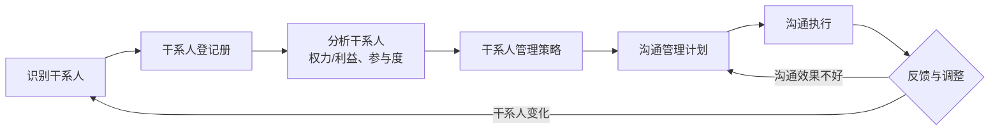
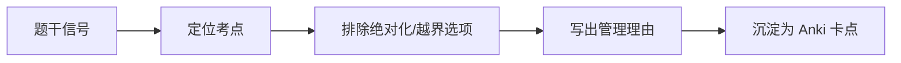

# T-COM-001｜沟通渠道计算与干系人参与管理

> 本专题用于学习"项目沟通管理与干系人管理"中最容易出计算题和辨析题的一组核心内容：**沟通渠道数计算、沟通模型（发送方-接收方）、沟通方式（推/拉/交互）、干系人识别与分类、干系人参与度评估矩阵**。它们不是孤立概念，而是围绕一个核心问题展开：**项目经理如何确保信息在正确的干系人之间有效流动，并让干系人以合适的程度参与项目？**

---

## 先看这个专题的主线

沟通管理和干系人管理在软考中经常被放在一起考，因为它们在现实中紧密相关。沟通管理关心的是"信息怎么传"——渠道对不对、方式合不合适、信息有没有被正确理解。干系人管理关心的是"人怎么管"——谁对项目有影响、他们的期望是什么、参与程度是否足够。

这条主线提醒我们：**沟通管理的起点不是"怎么发邮件"，而是"谁需要知道什么、什么时候需要、以什么方式"。** 而"谁需要知道什么"的答案来自干系人管理。

---

## 沟通渠道数：最常考的计算题

> **[公式｜沟通渠道数]**
>
> 沟通渠道数 = n × (n − 1) / 2
>
> 其中 n 是参与沟通的人数（包括项目经理）。

这个公式的直觉是：在 n 个人的团队中，每两个人之间有一条双向沟通渠道。总渠道数 = C(n, 2) = n(n−1)/2。

> **[易错提醒]** 考试中经常设置一个陷阱：当团队增加 k 个人时，渠道数增加了多少？计算方式是：先算原团队渠道数 C(n,2)，再算新团队渠道数 C(n+k,2)，取差值。而不是简单地加 k(k−1)/2。

例如：原来 5 人，渠道数 = 5×4/2 = 10。增加 3 人（变成 8 人），渠道数 = 8×7/2 = 28。增加了 28 − 10 = 18 条渠道。这意味着每增加一个人，导致的沟通复杂度增长是非线性的——这也是为什么大型团队需要更结构化的沟通管理。

---

## 沟通模型：信息不只是"发出去了"就完了

> **[核心模型｜发送方-接收方沟通模型]**
>
> 发送方：编码 → 发送消息 → 通过媒介传递
> 接收方：接收消息 → 解码 → 理解 → 反馈确认
>
> 噪声存在于整个过程中，可能干扰或曲解信息。

从这个模型中，可以衍生几个考试要点：

1. **编码和解码的不对称性**：发送方和接收方可能用不同的"翻译系统"（不同的专业领域、文化背景、语言习惯），这是沟通障碍的根源。
2. **反馈的重要性**：发送方需要确认接收方是否真正理解了，不能假设"我发了 = 你懂了"。
3. **噪声**：不仅包括技术噪声（信号不好），还包括语义噪声（歧义）、心理噪声（情绪和偏见）、组织噪声（层级过滤）。

---

## 沟通方式：推式、拉式、交互式

> **[概念组｜三种沟通方式]**
>
> - **推式（Push）**：发送方主动推送信息给特定接收方。例如邮件、备忘录、报告。适合单向通知，但不能保证被阅读和理解。
> - **拉式（Pull）**：信息存放在公共位置，接收方自行获取。例如内部知识库、项目门户、文件服务器。适合大量信息的传播，但依赖接收方的主动性。
> - **交互式（Interactive）**：双方或多方实时交换信息。例如会议、电话、即时通讯。适合需要讨论和确认的信息，效率最高但时间成本也最高。

选择题可能这样考："干系人数量多且分布广，适合用什么方式？" → 拉式（把信息放在共享平台上，让干系人自己看）。"紧急的风险问题需要立即讨论解决？" → 交互式（紧急会议或电话）。

---

## 干系人参与度评估：不只是"知道有这个人"

> **[概念组｜干系人参与度分类]**
>
> - **不知晓（Unaware）**：干系人完全不知道项目及其潜在影响
> - **抵制（Resistant）**：干系人知道项目及其影响，但抵制变更
> - **中立（Neutral）**：干系人知道项目，既不支持也不抵制
> - **支持（Supportive）**：干系人知道项目及其影响，支持变更
> - **领导（Leading）**：干系人积极参与并努力确保项目成功

> **[工具｜干系人参与度评估矩阵]** 将每个干系人在以上五个参与度级别中的"当前状态"标记为 C（Current），将"期望状态"标记为 D（Desired）。C 和 D 之间的差距，就是干系人管理的工作方向。

例如：某关键部门经理当前的参与度是"中立（C）"，但你希望他达到"支持（D）"，那么你需要制定一个计划——通过沟通、利益说明、参与决策等方式将他从中立推向支持。

---

## 典型题详解与举一反三

> **例题 1｜沟通渠道数计算**
>
> 项目团队原有 8 人（含项目经理）。后来增加了 4 人。沟通渠道增加了多少条？
>
> A. 6 条
> B. 22 条
> C. 28 条
> D. 38 条

原来 8 人：C(8,2) = 8×7/2 = 28
现在 12 人：C(12,2) = 12×11/2 = 66
增加：66 − 28 = 38 条

正确答案是 **D**。A（6）是只算了新增 4 人之间的渠道数 C(4,2) = 6，这忽略了新增人员与原团队成员之间的渠道数。

**延伸理解：** 这道题反映了沟通管理的核心挑战——团队规模线性增长时，沟通复杂度以平方级增长。8 人团队 28 条渠道尚可自然沟通；12 人团队 66 条渠道就必须有正式的沟通计划了。

**可制卡点：** 沟通渠道公式卡 + 扩展人数计算卡。

---

> **例题 2｜沟通方式选择**
>
> 某项目有 200 多个干系人分散在全国各地。项目经理需要定期向他们发布项目状态信息。最合适的沟通方式是：
>
> A. 逐一电话通知
> B. 召开全体会议
> C. 在项目门户/共享平台上发布
> D. 发送个性化邮件

干系人数量多、分布广、定期发布、信息量大 → 拉式沟通最合适。C（项目门户）是典型的拉式沟通方式。A 和 B 成本太高，D 不是最有效的。正确答案是 **C**。

**延伸理解：** 三种方式的判断口诀：少对少+需要讨论 → 交互式；多对多+单向通知 → 拉式；指定接收方+时效性高 → 推式。

**可制卡点：** 三种沟通方式判断卡（含场景关键词）。

---

> **例题 3｜干系人参与度评估**
>
> 某部门经理知道你的项目正在进行，也了解项目的目标，但他在部门会议上公开表示"这个项目不会成功，不要配合他们"。该经理的当前参与度是：
>
> A. 不知晓
> B. 中立
> C. 抵制
> D. 支持

关键词 "公开表示不会成功、不要配合" → 这是**抵制**的表现。抵制的特征是知道项目但不支持甚至主动反对。正确答案是 **C**。

**延伸理解：** 如果只是"知道但不表态"，那是中立；如果"不知道项目存在"，那是不知晓。抵制级别的干系人需要专门的参与策略——不能靠自然沟通来改变。

**可制卡点：** 干系人参与度五级判断卡（含行为关键词）。

---

> **例题 4｜沟通障碍的识别**
>
> 项目经理用邮件群发了一个重要的技术变更通知。一周后，他发现有一半的团队成员仍然按照旧方案在做，因为他们没有看那封邮件。这个沟通问题属于：
>
> A. 编码问题
> B. 媒介选择不当
> C. 缺乏反馈确认
> D. 噪声干扰

项目经理发出了信息但没有确认接收方是否理解了（没有反馈机制）。正确答案是 **C**。如果邮件内容写得不清楚才算是编码问题；如果这个信息不适合用邮件发那才是媒介选择不当。

**延伸理解：** 沟通从来不只是一个"发送"动作。案例题中如果看到"发了通知但没人看/没人执行"，问题的根源往往在于缺乏反馈确认和跟踪机制。

**可制卡点：** 沟通障碍类型判断卡。

---

> **例题 5｜案例题：沟通与干系人管理问题**
>
> 某项目启动后，项目经理每周向核心团队发进度报告。但项目中期，IT 运维部门突然拒绝在计划时间内配合系统部署——该部门经理表示"从来不知道这个项目的要求"；市场营销部门也对上线日期提出异议。请分析沟通和干系人管理中的问题。

问题：① 干系人识别不完整——IT 运维部门和市场营销部门虽然没有直接参与开发，但明显受项目影响，应被识别为关键干系人；② 沟通范围太窄——仅向核心团队报告，忽略了其他需要知情的干系人；③ 没有做干系人参与度评估——不知道哪些干系人需要达到什么参与度；④ 缺乏反馈机制——直到出了问题才发现信息断层。

改进：① 在项目初始阶段全面识别干系人，包括受项目影响的所有部门和角色；② 制定干系人管理策略，用参与度评估矩阵明确每个干系人的当前和期望参与度；③ 制定沟通管理计划，根据每个干系人的信息需求确定沟通内容、频率、方式；④ 建立反馈确认机制，不是发出去就完了。⑤ 在关键里程碑前主动与受影响的干系人提前沟通。

**延伸理解：** 案例题中看到"某部门/某人不知道"其实就是干系人识别不全或沟通计划缺失的典型表现。答题时不要只写"加强沟通"，要具体：先识别→再分析期望参与度→再制定沟通计划→再执行并确认。

**可制卡点：** 沟通干系人案例模板卡。

---

## 本轮真题覆盖增强：沟通渠道与沟通有效性

本节把 `questions.full.clean.md` 与既有真题映射中的高频考法反查回本专题。题库既考 n(n-1)/2，也在案例中考取消例会、信息不同步和干系人参与不足。 学习时不要只背定义，要能从题干信号判断它在考哪一个管理动作或技术边界。

这类题的识别链路可以这样看：

图里的重点是“先定位，再排错”。软考选择题常用绝对化说法、角色越权、流程跳步来制造干扰；下午案例题则把同一个错误包装成多句背景，需要把事实翻译回管理过程。

> **例题｜沟通渠道与沟通有效性（真题型改编训练题）**
>
> 一个项目团队原有 10 人，沟通渠道数为 45；若新增 2 人，沟通渠道数变为：
>
> A. 55  
> B. 60  
> C. 66  
> D. 90

**考查点：** 沟通渠道计算、团队规模变化。

**题干关键词：** 10 人、增加 2 人、沟通渠道。

**解题过程：** 沟通渠道数公式为 n(n-1)/2。新增后 n=12，12×11/2=66。

**正确答案：** C。

**错项分析：**

- A/B 是线性增加的误算。
- D 把新增渠道或原渠道重复计算。

**举一反三：** 渠道数只是潜在沟通路径，不等于实际消息数量；新增人员常带来协调成本和信息同步风险。

**可制卡点：** 沟通渠道公式；新增成员后渠道变化；渠道数 vs 沟通效果。

## 这个专题应该怎样转化为 Anki 卡片

**公式卡**：沟通渠道数 = n(n−1)/2。附带一个例子和"增加人数"时的计算方式。

**概念卡**：沟通渠道数、沟通模型（发送方-接收方）、推式/拉式/交互式沟通、干系人参与度五级分类。

**辨析卡**：推式 vs 拉式 vs 交互式（谁主动、适合什么场景）。

**判断卡**：给定场景描述 → 判断适合的沟通方式、干系人参与度级别。

**案例模板卡**：干系人识别遗漏 → 沟通不足 → 冲突爆发的标准问题链 + 改进流程。

**陷阱卡**：
- 沟通渠道数不是 n²，是 n(n−1)/2（不要混淆）
- 干系人管理不只是"让他们知道"，还要"让他们以合适的程度参与"

---

## 本专题的最小掌握标准

学完本专题后，你至少应该能做到四件事。

第一，会算沟通渠道数（包括增减变化）。第二，能根据场景选择沟通方式（推式/拉式/交互式）。第三，能识别干系人参与度的五个级别并根据行为描述判断级别。第四，能在案例题中诊断"干系人识别不全"和"沟通计划缺陷"两类问题，并给出系统改进方案。

---

## 待核验与后续改进

- 沟通渠道公式在软考教程中的呈现形式需回查确认。[待核验]
