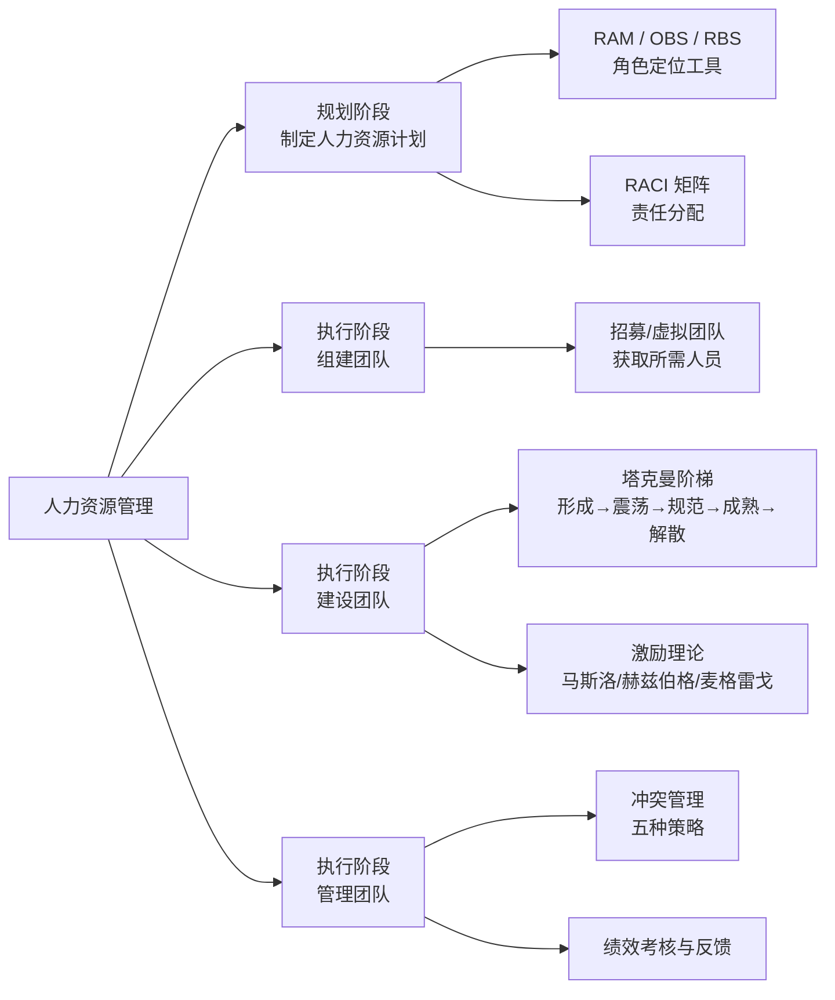
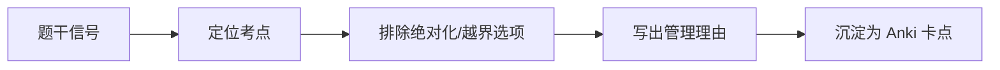

# T-HR-001｜项目人力资源管理：组织计划、团队建设与团队管理

> 本专题用于学习"项目人力资源管理"的核心内容：**人力资源计划、RAM（责任分配矩阵）、OBS（组织分解结构）、RACI 矩阵、团队组建（招募/虚拟团队）、团队建设（塔克曼阶梯模型、激励理论）、团队管理（冲突管理、绩效考核）**。它们不是孤立的人事管理概念，而是围绕一个核心问题展开：**如何确保项目有正确的人、以正确的角色、在正确的阶段、用正确的协作方式，共同完成项目目标？**

---

## 先看这个专题的主线

人力资源管理在十大知识域中是一个"被夹在中间"的领域——它不像成本和进度那样有大量计算题，但选择、辨析和案例题对它特别偏爱。其中最常考的两大块：**一是结构化工具（RAM/OBS/RACI）怎么用；二是塔克曼团队发展阶段和冲突管理怎么判断。**

---

## 结构化组织工具：WBS → OBS → RAM → RACI

这四个缩写的关系是渐进细化的：

> **[概念链｜WBS → OBS → RAM → RACI]** WBS 定义了"做什么"（工作包），OBS 定义了"组织怎么分"（部门/团队结构），RAM 把两者交叉形成"谁做什么"的矩阵，RACI 进一步细化到"谁负责、谁批准、问谁、告诉谁"。

| 工具 | 全称 | 作用 | 考试关键词 |
|---|---|---|---|
| WBS | Work Breakdown Structure | 工作分解 | "做什么" |
| OBS | Organizational Breakdown Structure | 组织分解 | "组织架构" |
| RAM | Responsibility Assignment Matrix | 责任分配 | "谁做什么" |
| RACI | Responsible/Accountable/Consult/Inform | 责任细化 | "R/A/C/I" |

> **[RACI 四角色]** R=负责执行（可以多人），A=最终批准（只有一人），C=需要咨询（双向沟通），I=需要知会（单向通知）。**每个任务必须只有一个 A。**

---

## 塔克曼阶梯模型

> **[概念组｜塔克曼团队发展五阶段]**
>
> 1. **形成期（Forming）**：成员互相认识、了解目标。依赖领导指引。
> 2. **震荡期（Storming）**：意见分歧、出现冲突。**经理需要协调和引导。**
> 3. **规范期（Norming）**：建立规则、形成默契。协作效率开始提升。
> 4. **成熟期（Performing）**：高效协作，自主解决问题。经理可以授权。
> 5. **解散期（Adjourning）**：项目结束，团队解散。需要做好收尾交接。

> **[考试辨析]** 选择题经常描述一个场景让你判断团队在哪个阶段。关键词："成员之间开始互相熟悉"→ 形成期；"出现意见对立和冲突"→ 震荡期；"已经形成了共同的工作方式"→ 规范期；"高度自治，无需太多指导"→ 成熟期。

---

## 冲突管理五种策略

> **[概念组｜冲突管理五策略]**（按"坚持己见"和"合作程度"两个维度区分）
>
> 1. **强制（Forcing）**：一方赢一方输。紧急情况或需要快速决策时使用。
> 2. **合作/解决问题（Collaborating/Problem-Solving）**：双方共赢。**最理想的方式**，但耗时。多选题问"最好的冲突解决方式"→ 合作/解决问题。
> 3. **妥协（Compromising）**：双方各让一步。双方势均力敌时适用。
> 4. **缓和（Smoothing）**：强调共识、淡化分歧。用于维护关系但不解决根本问题。
> 5. **撤退（Withdrawing）**：回避冲突。冷静期使用，但不能解决根本问题。

---

## 激励理论速览

| 理论 | 提出者 | 核心观点 | 考点 |
|---|---|---|---|
| 需求层次 | 马斯洛 | 生理→安全→社交→尊重→自我实现 | 按层级满足，低级未满足时高级无效 |
| 双因素 | 赫兹伯格 | 保健因素（不满足→不满）vs 激励因素（满足→满意） | 涨工资只是保健，给挑战才是激励 |
| X/Y 理论 | 麦格雷戈 | X=人天生懒惰需管控，Y=人天生上进需授权 | 项目经理偏向 Y 理论 |

---

## 典型题详解与举一反三

> **例题 1｜RACI 的角色识别**
>
> 在 RACI 矩阵中，活动必须只有一个的角色是：
>
> A. R（负责）
> B. A（批准/问责）
> C. C（咨询）
> D. I（知会）

正确答案是 **B**。每个任务只能有一个 A（Accountable），确保问责的单一性。R 可以有多个，C 和 I 也可以有多个。

**可制卡点：** RACI 四角色定义卡。R多个/A唯一规则卡。

---

> **例题 2｜塔克曼阶段判断**
>
> 项目团队刚组建两周，成员之间开始出现关于技术方案的激烈争论，有人对分配的任务表示不满。团队处于哪个阶段？
>
> A. 形成期
> B. 震荡期
> C. 规范期
> D. 成熟期

"激烈争论"、"不满"→ 震荡期（Storming）的典型特征。正确答案是 **B**。

**可制卡点：** 塔克曼五阶段的关键词判断卡。

---

> **例题 3｜冲突解决策略判断**
>
> 两名核心开发人员在技术方案上有严重分歧，双方都坚持己见。项目经理决定组织一次深入的方案评审会，让双方充分表达观点、对比数据，共同寻找最优方案。这是什么冲突解决策略？
>
> A. 强制
> B. 妥协
> C. 合作/解决问题
> D. 缓和

"充分表达观点、共同寻找最优方案"→ 合作/解决问题。正确答案是 **C**。

**可制卡点：** 冲突五种策略的场景判断卡。

---

> **例题 4｜激励理论场景**
>
> 某项目经理给团队成员涨了工资，但团队的积极性仍未明显提升。根据赫兹伯格双因素理论，这是因为：
>
> A. 工资不属于任何因素
> B. 工资是保健因素，只能消除不满，不能产生激励
> C. 团队成员不喜欢钱
> D. 工资属于激励因素，但涨得不够多

正确答案是 **B**。赫兹伯格认为工资是保健因素——不涨会不满，但涨了也不一定产生持续激励。激励因素包括成就感、认可、成长机会等。

**可制卡点：** 双因素理论卡（保健因素 vs 激励因素）。

---

> **例题 5｜RAM 与 RACI 的关系**
>
> RAM（责任分配矩阵）和 RACI 矩阵之间的关系是：
>
> A. RAM 和 RACI 是完全不同的工具
> B. RACI 是 RAM 的一种具体形式
> C. RAM 是 RACI 的一种具体形式
> D. 两者没有关系

正确答案是 **B**。RAM 是通用的责任分配矩阵，RACI 是其中最常用的一种具体形式（用 R/A/C/I 四种角色来分配责任）。

**可制卡点：** RAM vs RACI 关系卡。

---

> **例题 6｜案例题：团队管理问题**
>
> 某项目团队发展到中期，核心开发骨干因与项目助理长期不和而提出离职。团队其他成员士气低落。项目经理与两人分别谈话，试图说服他们"以大局为重"。

分析：① 震荡期冲突未有效管理——"长期不和"说明冲突一直在积累未被解决；② 缓和策略不足以解决根本问题——"以大局为重"是缓和/回避，没有解决根源；③ 骨干离职风险→人员连续性风险。

正确应对：① 与两人深入沟通了解冲突根源；② 尝试合作/解决问题模式找到双方都能接受的方案；③ 如无法解决，考虑调整工作分配减少冲突；④ 对团队进行士气建设，明确沟通和冲突解决渠道。

**可制卡点：** 团队冲突案例模板卡。

---

## 本轮真题覆盖增强：RAM、团队建设与激励

本节把 `questions.full.clean.md` 与既有真题映射中的高频考法反查回本专题。2010 上午题考 RAM、马斯洛需要层次；案例题常用新人赶工、士气低、冲突处理设问。 学习时不要只背定义，要能从题干信号判断它在考哪一个管理动作或技术边界。

这类题的识别链路可以这样看：

图里的重点是“先定位，再排错”。软考选择题常用绝对化说法、角色越权、流程跳步来制造干扰；下午案例题则把同一个错误包装成多句背景，需要把事实翻译回管理过程。

> **例题｜RAM、团队建设与激励（真题型改编训练题）**
>
> 项目成员希望清楚看到每项活动由谁负责、谁参与、谁审批。项目经理最适合使用的是：
>
> A. 责任分配矩阵 RAM  
> B. 项目章程  
> C. 风险概率影响矩阵  
> D. 帕累托图

**考查点：** 责任分配矩阵、角色职责。

**题干关键词：** 活动、成员、负责、参与、审批。

**解题过程：** RAM 把工作包或活动与角色/人员对应起来，适合澄清责任、参与和审批关系。

**正确答案：** A。

**错项分析：**

- B 授权项目经理，不细化每项活动责任。
- C 用于风险优先级。
- D 用于质量主要问题分析。

**举一反三：** 凡是题干强调“谁对哪项工作负责”，优先想到 RAM；强调“上下级汇报关系”，再想到组织结构图。

**可制卡点：** RAM 的用途；组织结构图 vs RAM；团队建设不是简单组建人员。

## 这个专题应该怎样转化为 Anki 卡片

**概念卡**：RAM、OBS、RACI、塔克曼五阶段（每阶段一张）、冲突五策略（每策略一张）、马斯洛需求层次、赫兹伯格双因素、麦格雷戈 X/Y 理论。

**辨析卡**：RAM vs RACI、形成期 vs 震荡期、合作 vs 妥协 vs 缓和。

**场景判断卡**：给定团队行为描述 → 判断塔克曼阶段或冲突策略。

**陷阱卡**："RACI 中每个任务可以有多个 A"→ 错，A 必须唯一。

---

## 本专题的最小掌握标准

至少能做到：① 解释 WBS→OBS→RAM→RACI 的递进关系；② 记住 RACI 四角色（特别是 A 必须唯一）；③ 根据行为描述判断塔克曼五阶段；④ 区分冲突五种策略并判断适用场景；⑤ 区分马斯洛需求层次和赫兹伯格双因素理论的核心观点。

---

## 待核验与后续改进

- 激励理论在软考教程中的覆盖深度和具体理论名称需回查。[待核验]
- 塔克曼模型五个阶段的教材中文译名可能与 PMBOK 中文版有差异。[待核验]
