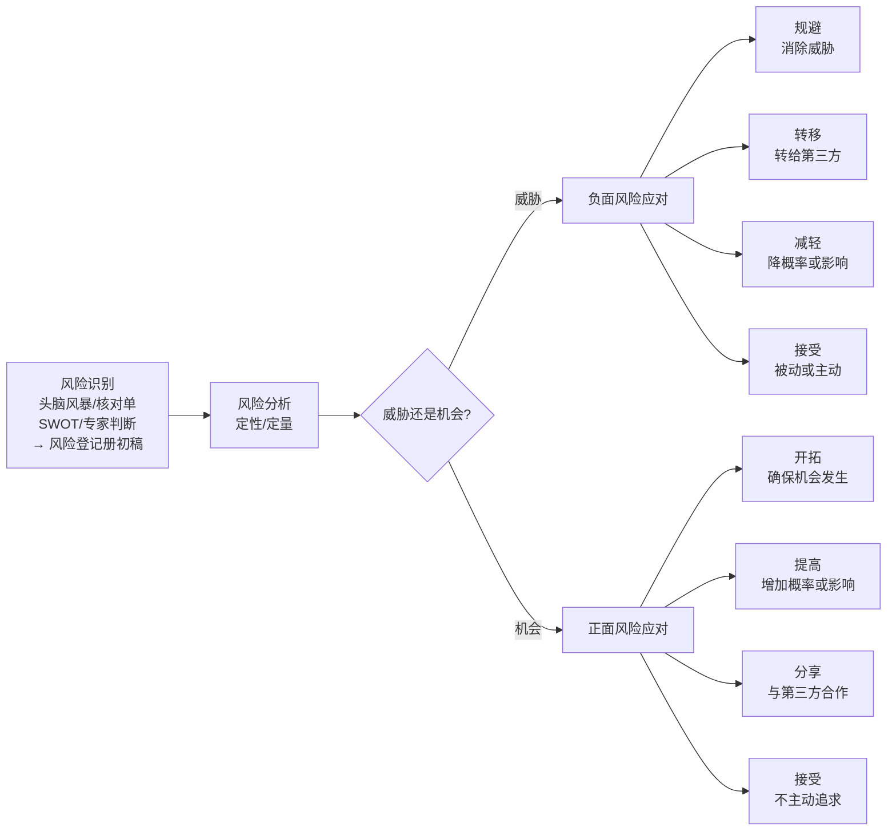
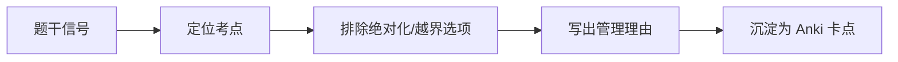

# T-RISK-001｜风险识别、风险登记册与风险应对策略

> 本专题用于学习"项目风险管理"中连接风险分析与应对的核心内容：**风险识别工具、风险登记册（Risk Register）、风险应对策略（规避/转移/减轻/接受/开拓/提高/分享/接受）与残余风险和二次风险**。它们不是孤立的策略卡片，而是围绕一个核心问题展开：**在识别出不希望发生（或希望发生）的事件后，项目经理应该如何系统地选择应对方案——不只是"出了事再说"，而是在出事之前就做好完整的应对计划？**

---

## 先看这个专题的主线

风险管理的学习路径是：识别→分析→应对→控制。识别告诉你"有哪些风险"，分析告诉你"哪些最重要、值多少"，应对告诉你"怎么处理"，控制告诉你"后来怎么样了"。

---

## 风险识别工具

> **[概念组｜主要风险识别工具]**
>
> - **头脑风暴**：组织团队和专家自由提出风险想法，全面但可能发散
> - **核对单（Checklist）**：基于历史项目的风险清单逐一对照，快速但可能遗漏新类型风险
> - **SWOT 分析**：从优势、劣势、机会、威胁四个角度识别风险
> - **专家判断**：邀请有经验的人员识别风险
> - **假设分析**：检验项目假设的有效性，识别假设不成立时的风险
> - **图解技术**：因果图（鱼骨图）、系统流程图、影响图

**风险识别不是一次性活动**——随着项目推进，新的风险不断出现，需要持续更新风险登记册。

---

## 风险登记册

> **[定义｜风险登记册]** 风险登记册是记录已识别风险及其相关信息的核心文件。它至少包含：风险编号、风险描述、概率、影响、优先级、应对策略、责任人、应急计划、触发条件、残余风险。

**风险登记册是一个"活的文件"**——从风险识别开始建立，在定性分析后补充优先级，在定量分析后补充数值，在应对规划后补充策略和应急计划，在控制过程中持续更新状态。当风险实际发生时，转移到**问题日志**。

---

## 负面风险（威胁）应对策略

> **[概念组｜四种威胁应对策略]**
>
> 1. **规避（Avoid）**：消除威胁，使风险不发生。例如：采用成熟技术替代高风险的新技术；取消高风险的工作包。**这是最彻底的应对方式，但可能代价高昂。**
> 2. **转移（Transfer）**：将风险的影响和责任转移给第三方，但**不消除风险本身**。例如：购买保险、外包、使用固定总价合同。**需要支付风险溢价（保费）。**
> 3. **减轻（Mitigate）**：降低风险发生的概率或减轻其影响。例如：增加测试轮次降低缺陷概率；准备备用方案降低影响。
> 4. **接受（Accept）**：不采取主动措施，在风险发生时再应对。分为**被动接受**（不准备预案）和**主动接受**（准备应急储备）。低优先级风险常用接受策略。

> **[高频辨析｜转移 vs 规避]** 转移是把风险"交给别人承担"（如外包、保险）——风险本身还在，只是损失由别人扛。规避是让风险"根本不会发生"（如取消高风险工作）。转移不消除风险，规避消除风险。

> **[高频辨析｜转移 vs 减轻]** 转移是换人承担后果（如买保险后损失由保险公司赔），减轻是自己降低概率或影响（如多测试几轮降低缺陷概率）。转移通常涉及合同或保险，减轻涉及管理措施的加强。

---

## 正面风险（机会）应对策略

> **[概念组｜四种机会应对策略]**
>
> 1. **开拓（Exploit）**：确保机会一定发生。例如：分配最优秀的人员确保提前完工。
> 2. **提高（Enhance）**：增加机会发生的概率或正面影响。例如：增加资源投入以提前完成。
> 3. **分享（Share）**：与第三方合作以抓住机会。例如：与合作伙伴联合投标。
> 4. **接受（Accept）**：不主动追求，机会自己来了就抓住。

---

## 残余风险与二次风险

> **[概念］** **残余风险**：采取应对措施后仍然存在的风险。**二次风险**：因为采取应对措施而引入的新风险。例如：外包（转移风险）→ 残余风险是外包方可能延误；二次风险是沟通和管理成本增加。

---

## 典型题详解与举一反三

> **例题 1｜应对策略识别**
>
> 项目经理决定将项目中一个技术难度最高的模块外包给专业公司。这属于什么风险应对策略？
>
> A. 规避
> B. 转移
> C. 减轻
> D. 接受

将高风险模块外包 → 风险转移给第三方。正确答案是 **B**。注意这不是规避——规避是取消高风险工作，外包后工作还在，只是换了执行方。

**可制卡点：** 四种威胁应对策略的关键动作判断卡。

---

> **例题 2｜规避 vs 转移**
>
> 项目团队原计划使用新技术开发一个关键模块。考虑到技术风险太高，项目经理决定改用成熟技术。这是什么策略？
>
> A. 规避
> B. 转移
> C. 减轻
> D. 接受

"改用成熟技术"→ 原来的高风险工作被取消了（不再用新技术），风险不复存在 → 规避。正确答案是 **A**。如果"仍用新技术但请外部专家指导"→ 那是减轻。

**可制卡点：** 规避（消除风险本身）vs 转移（风险还在但换人扛）辨析卡。

---

> **例题 3｜机会应对**
>
> 项目比计划进度提前了 2 周。项目经理决定利用这段时间进行额外的性能优化，给客户提供更好的产品体验。这属于什么机会应对策略？
>
> A. 开拓
> B. 提高
> C. 分享
> D. 接受

利用提前的时间做优化 → 主动扩大正面影响 → 提高。正确答案是 **B**。如果是"通过安排最优秀的人员来确保提前完工"→ 那是开拓。

**可制卡点：** 四种机会应对策略的关键动作判断卡。

---

> **例题 4｜风险登记册 vs 问题日志**
>
> 某已识别风险在项目执行中实际发生了。项目经理最应该做什么？
>
> A. 在风险登记册中更新状态，并转移到问题日志
> B. 删除风险登记册中的该条目
> C. 不做任何处理，因为已经接受了该风险
> D. 关闭风险登记册

已发生的风险应转为问题处理——更新风险登记册状态 + 在问题日志中记录。正确答案是 **A**。

**可制卡点：** 风险→问题的生命周期卡。

---

> **例题 5｜案例题：风险应对策略选择**
>
> 某系统集成项目发现关键服务器设备的供应商有 30% 的概率延迟交付 2 个月，影响严重。项目经理考虑三个方案：A. 提前 3 个月下单并支付加急费；B. 在合同中加入延迟罚款条款；C. 多选一家供应商同时供货。请分别判断方案的风险应对策略。

A → 提前下单加急 = 降低延迟概率 → **减轻**。B → 合同中罚款条款 = 将财务损失转移给供应商 → **转移**。C → 多供应商同时供货 = 降低单一供应商延迟的影响 → **减轻**（降低影响）。

**延伸理解：** 同一个风险可以同时采用多种应对策略。B 和 C 的组合（转移+减轻）是实践中常见的做法。

**可制卡点：** 风险应对策略综合判断题卡。

---

## 本轮真题覆盖增强：风险识别与风险登记册

本节把 `questions.full.clean.md` 与既有真题映射中的高频考法反查回本专题。2010 上午题考德尔菲技术，案例题常把“已发生的问题”和“未发生风险”混在一起。 学习时不要只背定义，要能从题干信号判断它在考哪一个管理动作或技术边界。

这类题的识别链路可以这样看：

图里的重点是“先定位，再排错”。软考选择题常用绝对化说法、角色越权、流程跳步来制造干扰；下午案例题则把同一个错误包装成多句背景，需要把事实翻译回管理过程。

> **例题｜风险识别与风险登记册（真题型改编训练题）**
>
> 德尔菲技术用于风险识别时，主要优点是：
>
> A. 通过匿名多轮反馈减少个人权威对结果的影响  
> B. 精确计算每个风险的货币期望值  
> C. 自动生成项目进度网络图  
> D. 替代所有专家判断

**考查点：** 风险识别工具、德尔菲技术。

**题干关键词：** 德尔菲、匿名、多轮、减少偏见。

**解题过程：** 德尔菲通过专家匿名反馈和多轮汇总，降低从众、权威和群体压力对识别结果的影响。

**正确答案：** A。

**错项分析：**

- B 是定量风险分析中的 EMV 思路。
- C 属于进度网络技术。
- D 德尔菲仍依赖专家判断，只是组织方式更结构化。

**举一反三：** 识别风险时关注“可能发生”；已经发生的延期、缺陷、争议是问题，应进入问题日志并触发应对。

**可制卡点：** 德尔菲技术用途；风险登记册记录什么；风险 vs 问题。

## 这个专题应该怎样转化为 Anki 卡片

**概念卡**：七种风险应对策略（威胁 4 + 机会 4 - 重复"接受" × 1 = 7 种），风险登记册，残余风险，二次风险。

**辨析卡**：规避 vs 转移（消除风险 vs 换人承担）、减轻 vs 转移（自己降低 vs 换人承担）、开拓 vs 提高（确保发生 vs 增加概率/影响）。

**流程卡**：风险登记册的生命周期：创建→更新优先级→写入应对策略→跟踪状态→转移至问题日志。

**陷阱卡**：四种威胁应对策略中，"接受"也分主动接受（有应急储备）和被动接受（没有准备）。

---

## 本专题的最小掌握标准

至少能做到：① 识别场景属于哪种风险应对策略（威胁 4 种 + 机会 4 种）；② 区分规避和转移的细微差异；③ 理解风险登记册是活文件，已发生的风险应转移到问题日志；④ 在案例题中给出风险应对策略并说明理由。

---

## 待核验与后续改进
- 软考教程中七种应对策略的具体中文术语需与教材核对。[待核验]
