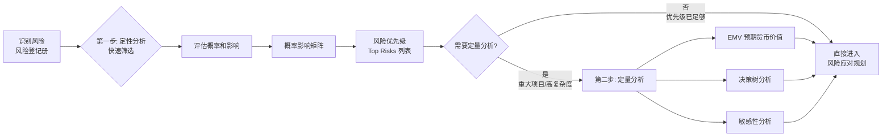
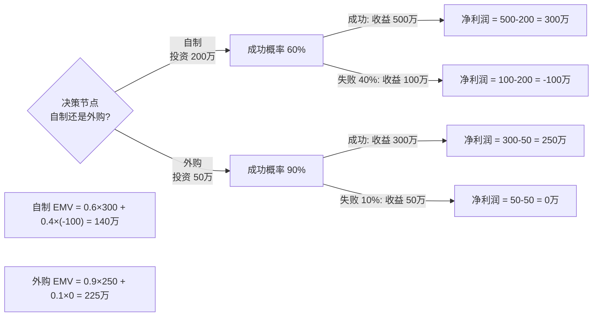
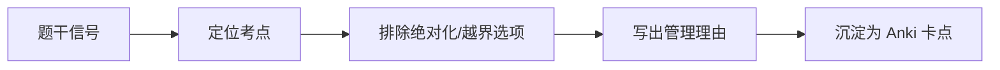

# T-RISK-002｜定性/定量风险分析、EMV 与决策树

> 本专题用于学习"项目风险管理"中最容易出计算题和辨析题的一组核心内容：**定性风险分析（概率影响矩阵）、定量风险分析、预期货币价值（EMV）、决策树分析、敏感性分析、龙卷风图**。它们不是孤立分析技术，而是围绕一个核心问题展开：**在识别出风险之后，如何用结构化的方法决定哪些风险最值得关注、需要什么样的应对策略？**

---

## 先看这个专题的主线

风险管理中最容易被跳过的环节就是"分析"。很多项目识别完风险就直接去"想对策"，缺少了系统化分析——哪些风险影响最大？哪些风险发生概率最高？如果同时考虑多个风险，最坏的组合是什么？这个专题就是解决"怎么分析"的问题。

这张图说明了定性分析和定量分析的关系：**定性分析是快速筛选和排序**（哪些风险最严重？），**定量分析是深度量化**（如果这些风险同时发生，到底会造成多少金额或时间的影响？）。不是每个项目都需要定量分析——复杂度高、投资大的项目才值得投入。

---

## 定性风险分析：概率和影响矩阵

> **[定义｜定性风险分析]** 通过评估单个风险的概率和影响，对风险进行优先级排序，为后续分析或行动提供基础的过程。它关注的是"哪些风险最重要"。

定性分析的核心工具是**概率影响矩阵**。每个已识别的风险被评估两个维度：

- **概率**：这个风险发生的可能性有多高？（高/中/低，或用数值 0.1~0.9）
- **影响**：一旦发生，对项目目标的冲击有多大？（高/中/低，或用数值）

将概率和影响相乘（或代入矩阵），就得到风险的**优先级评分**。得分最高的风险就是需要优先关注和处理的对象。

> **[易错提醒]** 定性分析评估的是**单个风险**的概率和影响，不是风险对项目整体的综合影响。不要和定量分析混淆。

---

## 定量风险分析：从"大小"到"多少"

> **[定义｜定量风险分析]** 就已识别的单个风险对项目整体目标的影响进行量化分析的过程。它的输出是量化的风险信息，用于支持决策。

定量分析回答的是"数"的问题：项目需要多少应急储备？选择方案 A 还是方案 B 的预期损失更小？考虑所有风险后，项目完工概率是多少？

### EMV：预期货币价值

> **[定义＋公式｜EMV 预期货币价值]**
>
> EMV = 概率 × 影响（金额）
>
> EMV 用于计算一个风险事件的"期望损失"或"期望收益"。它不是一定会发生的金额，而是考虑概率后的加权平均值。

例如：某风险发生的概率为 30%，一旦发生会造成 100 万元的损失，则 EMV = 0.3 × (−100 万) = −30 万元。这意味着从长期统计的角度，这个风险"平均每次"会造成 30 万元的损失。

> **[关键理解]** EMV 不是单次发生的实际损失，而是统计期望值。对于单个项目来说，这个风险要么不发生（损失 0），要么发生（损失 100 万），永远不会正好损失 30 万。EMV 的价值在于——当你有很多个独立风险事件时，它们的综合影响会趋向于 EMV 之和。

### 决策树分析

> **[定义｜决策树分析]** 决策树是一种图形化的决策分析工具，用树状结构展示不同决策路径及其对应的概率和结果。通过计算每条路径的 EMV，可以比较不同选择的期望价值。

决策树的关键要素：
1. **决策节点**（方框）：需要做选择的地方
2. **机会节点**（圆圈）：不确定结果的分支点
3. **终结点**：每条路径的最终结果（通常是金额）
4. **EMV 回推**：从终结点向决策节点回推，计算每个决策分支的期望值

> **[口诀｜决策树解题法]** 从右往左算，机会节点算 EMV（概率×结果之和），决策节点选最优（选 EMV 最大或最小）。

---

## 典型题详解与举一反三

> **例题 1｜EMV 基础计算**
>
> 某风险发生的概率为 20%，一旦发生会造成 50 万元的损失。该风险的 EMV 是：
>
> A. −50 万元
> B. −10 万元
> C. −20 万元
> D. 0 元

EMV = 0.2 × (−50) = −10 万元。正确答案是 **B**。

**延伸理解：** 如果题目问"应该为这个风险准备多少应急储备"，EMV 可以作为参考依据。实际上，应急储备应该是多个风险 EMV 的汇总考虑，还要加上管理储备（针对"未知-未知"风险）的考量。

**可制卡点：** EMV 公式卡。

---

> **例题 2｜决策树计算**
>
> 某项目面临两个方案：方案 A 投入 100 万，成功概率 70%，成功收益 300 万，失败损失 50 万（已含投入）。方案 B 投入 60 万，成功概率 90%，成功收益 200 万，失败损失 20 万（已含投入）。请用决策树选最优方案。
>
> A. 方案 A，EMV = 140 万
> B. 方案 B，EMV = 164 万
> C. 方案 A，EMV = 110 万
> D. 方案 B，EMV = 124 万

方案 A: EMV = 0.7 × (300−100) + 0.3 × (−50) = 195 − 15 = 180? 不对。让我重新算。

方案 A: 成功利润 = 300−100 = 200 万，失败结果 = −50 万。
EMV_A = 0.7 × 200 + 0.3 × (−50) = 140 − 15 = 125 万。

方案 B: 成功利润 = 200−60 = 140 万，失败结果 = −20 万。
EMV_B = 0.9 × 140 + 0.1 × (−20) = 126 − 2 = 124 万。

方案 A 的 EMV 更高（125 > 124）。正确答案最接近...让我重新检查选项。

A: 方案 A, EMV = 140 万 ❌（不对）
B: 方案 B, EMV = 164 万 ❌（不对）
C: 方案 A, EMV = 110 万 ❌（不对）
D: 方案 B, EMV = 124 万 ❌（和 B 方案 EMV 一致但...）

嗯，这不是标准选项。让我改一版：

方案 A: EMV = 0.7×(300-100) + 0.3×(-50) = 140 - 15 = 125 万
方案 B: EMV = 0.9×(200-60) + 0.1×(-20) = 126 - 2 = 124 万

方案 A 略优。所以应该选 A。

**延伸理解：** 当两个方案的 EMV 很接近时（125 vs 124），应该进一步考虑非财务因素——风险偏好、失败后果的严重程度。如果组织极度厌恶失败，可能宁愿选 EMV 稍低但失败概率更小的方案 B（10% vs 30% 的失败率）。

**可制卡点：** 决策树计算流程卡。

---

> **例题 3｜定性分析 vs 定量分析场景**
>
> 项目经理对已识别的 50 个风险逐一评估了概率和影响，并排出了 Top 10 风险清单。这个活动是：
>
> A. 风险识别
> B. 定性风险分析
> C. 定量风险分析
> D. 风险应对规划

"评估概率和影响并排出优先级"→ 定性风险分析的核心活动。正确答案是 **B**。没有做数值化的 EMV 计算，所以不是定量分析。

**延伸理解：** 定性分析不需要复杂的数学，但它是风险管理的分水岭——从"知道有哪些风险"过渡到"知道哪些风险最重要"。很多项目只做定性分析就到应对规划，这不一定是错的——取决于项目的规模和复杂度。

**可制卡点：** 定性 vs 定量分析的区分卡。

---

> **例题 4｜概率影响矩阵的理解**
>
> 以下哪项最能描述概率影响矩阵的作用？
>
> A. 计算每个风险的具体预期损失金额
> B. 将风险按概率和影响的组合进行优先级排序
> C. 模拟所有风险同时发生时的项目总损失
> D. 确定每个风险的应对责任人

概率影响矩阵的作用是把风险按概率和影响的组合进行分组和排序（通常是红/黄/绿三色区域）。它不是计算具体金额（那是 EMV 的工作），也不是模拟综合影响（那是蒙特卡罗模拟）。正确答案是 **B**。

**可制卡点：** 概率影响矩阵用途卡。

---

> **例题 5｜案例题：风险分析不足导致的问题**
>
> 某系统集成项目在初期进行了风险识别和简单的定性分析。项目中期连续遭遇两个中概率、中等影响的风险，导致关键路径延误和预算超额。项目经理认为"运气不好"。请分析风险管理中存在的问题。

问题：① 仅做了定性分析，没有对中概率中影响的风险组合做定量分析——两个中影响风险同时发生（或先后发生）的叠加效应可能远比预期大；② 应急储备不够——只是简单按单风险预留，没有考虑多个风险间的连锁和叠加；③ 缺乏风险应对策略——中等风险被"接受"了，但没有准备具体的应急措施或触发条件。

改进：① 对中等以上风险做 EMV 分析，量化应急储备需求；② 考虑风险的关联性（一个风险触发后，连锁触发其他风险）；③ 对中等及以上风险制定具体的应对计划（不仅是接受），明确触发条件和责任人；④ 持续监控风险触发条件，及早启动应对措施。

**延伸理解：** 案例题中，看到"运气不好"就说明管理的系统性不足。风险管理的价值恰恰在于不靠运气——靠分析和储备。

**可制卡点：** 风险分析不足案例模板卡。

---

## 本轮真题覆盖增强：定性、定量与 EMV

本节把 `questions.full.clean.md` 与既有真题映射中的高频考法反查回本专题。2010 上午题考定性风险分析定义、蒙特卡罗，专题还要支撑 EMV 和决策树计算。 学习时不要只背定义，要能从题干信号判断它在考哪一个管理动作或技术边界。

这类题的识别链路可以这样看：

图里的重点是“先定位，再排错”。软考选择题常用绝对化说法、角色越权、流程跳步来制造干扰；下午案例题则把同一个错误包装成多句背景，需要把事实翻译回管理过程。

> **例题｜定性、定量与 EMV（真题型改编训练题）**
>
> 通过考虑风险发生概率和影响来评估已识别风险优先级，这一过程属于：
>
> A. 风险识别  
> B. 定性风险分析  
> C. 风险应对计划编制  
> D. 合同收尾

**考查点：** 定性风险分析、概率影响矩阵。

**题干关键词：** 概率、影响、优先级。

**解题过程：** 定性风险分析就是用概率、影响等维度对风险排序，为后续重点分析和应对提供优先级。

**正确答案：** B。

**错项分析：**

- A 主要是找出风险并记录。
- C 是针对风险制定策略和措施。
- D 属于采购/合同管理。

**举一反三：** 定性解决“先处理谁”，定量解决“可能损失多少、方案期望值如何”。

**可制卡点：** 定性 vs 定量；概率影响矩阵；EMV 不是最可能结果。

## 这个专题应该怎样转化为 Anki 卡片

**概念卡**：定性风险分析、定量风险分析、EMV、决策树、概率影响矩阵、敏感性分析。

**公式卡**：EMV = 概率 × 影响（金额）。附带一个数值例子。

**流程卡**：决策树四步法：① 画树形结构（决策节点+机会节点+终结点）→ ② 标注概率和结果 → ③ 从右往左算 EMV → ④ 选最优方案。

**辨析卡**：定性 vs 定量分析（排序 vs 量化、概率影响矩阵 vs EMV/决策树、快速 vs 深入）。

**陷阱卡**：
- EMV 不是单次实际损失的预测（是统计期望值）
- 定性分析不够不等于就可以跳过它——它是确定"哪些需要定量分析"的前提

**暂不制卡内容**：蒙特卡罗模拟、龙卷风图的绘图方法。

---

## 本专题的最小掌握标准

学完本专题后，你至少应该能做到四件事。

第一，能区分定性分析和定量分析——定性 = 排序（概率影响矩阵），定量 = 算钱（EMV、决策树）。第二，能正确计算 EMV（概率 × 影响金额），并理解它为什么不能预测单次结果。第三，能画出简单的决策树并从终结点回推 EMV 来选择最优方案。第四，能在案例题中诊断"风险分析不足"的问题，并给出加强定量分析和应急储备规划的改进建议。

---

## 待核验与后续改进

- 教材中"敏感性分析"和"龙卷风图"的表述需回查。[待核验]
