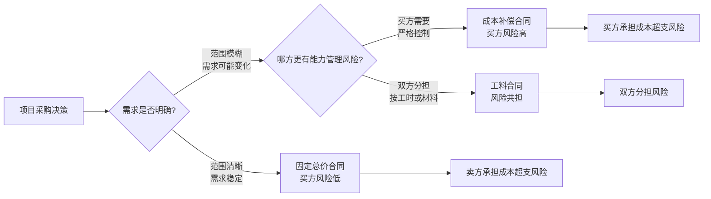
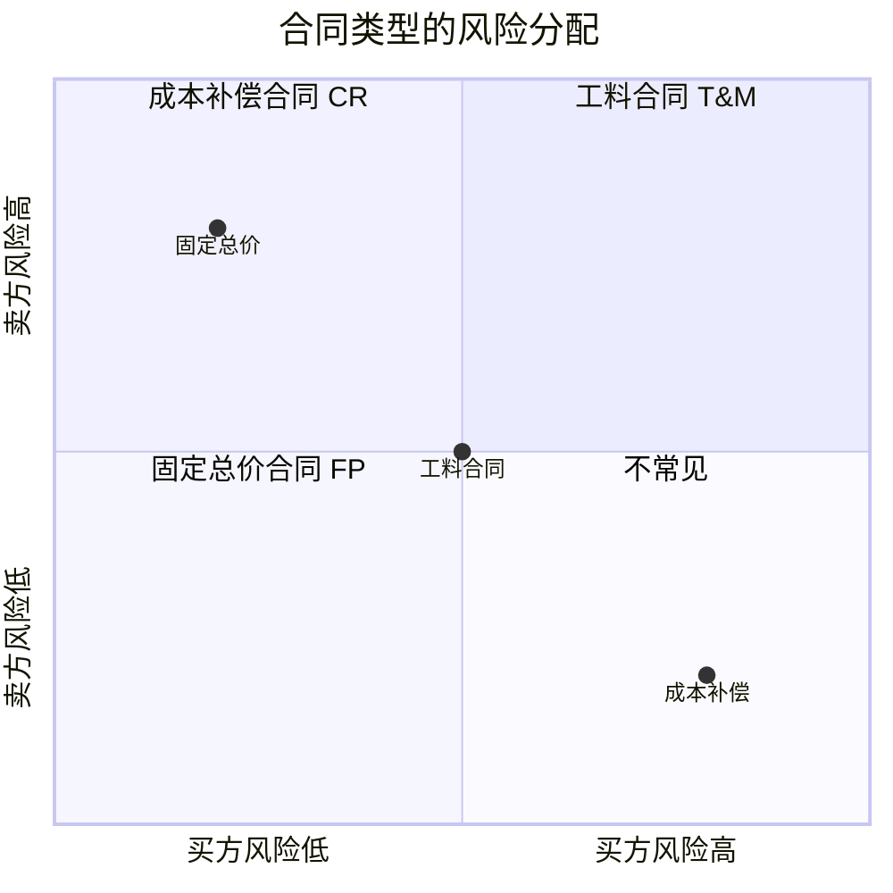

# T-PROC-001｜合同类型、风险分配与采购决策

> 本专题用于学习"项目采购管理"中最容易出选择题和辨析题的一组核心内容：**固定总价合同、成本补偿合同、工料合同、合同类型与风险分配的关系、自制与外购分析**。它们不是孤立法条，而是围绕一个核心问题展开：**在买方和卖方之间，谁承担更多的风险？如何根据项目的不确定性选择最合适的合同类型？**

---

## 先看这个专题的主线

很多同学把合同类型当成"背表格"的题目——固定总价、成本补偿、工料合同各自的特点背一遍。但软考对合同类型的考查关键在于：给你一个项目场景，让你判断哪种合同类型最合适。这个判断不是靠背定义，而是靠理解"买方和卖方谁承担更多风险"。

这张图揭示了合同类型选择的本质：**合同类型 = 风险分配方案**。谁的范围内不确定性更大，合理的做法就是由谁来承担对应的风险。

---

## 三种基本合同类型

### 固定总价合同（Fixed Price, FP）

> **[定义｜固定总价合同]** 买方为定义明确的产品或服务支付固定总价的合同。卖方承担完成工作的全部成本风险，如果实际成本超过合同价格，超出部分由卖方承担。这种合同对买方来说风险最低。

固定总价合同适合：工作范围明确、需求稳定、卖方可以准确估算成本的项目。典型场景是采购标准化产品或明确规格的开发服务。

对买方的好处是预算可控——不管卖方实际花了多少钱，买方付款金额是固定的。风险在于：如果范围不明确，后续的变更会很难处理，因为卖方会对任何额外工作提出加价。

> **[易错提醒]** 固定总价合同不是绝对不能变更。如果出现了合同范围内没有涵盖的工作，买方仍需要通过变更控制流程来追加费用。这个追加过程可能很麻烦——因为卖方已经在固定总价中承担了风险，他们会对变更的定价持强硬态度。

### 成本补偿合同（Cost Reimbursable, CR）

> **[定义｜成本补偿合同]** 买方向卖方支付实际发生的全部合法成本，再加上一笔酬金（利润）的合同。买方承担全部成本风险，卖方只需尽职完成工作即可获得成本报销和酬金。

成本补偿合同适合：工作范围不确定、需求可能频繁变化、无法事先准确估算成本的项目。典型场景是研究开发项目或紧急响应项目。

这种合同又细分为：
- **成本加固定酬金（CPFF）**：成本实报实销 + 固定金额的酬金。卖方没有控成本的动力（因为成本全部报销，酬金固定）。
- **成本加激励酬金（CPIF）**：成本实报实销 + 根据成本绩效浮动的酬金。如果实际成本低于目标成本，卖方可以获得额外的分享比例，从而产生控成本的动力。
- **成本加奖励酬金（CPAF）**：成本实报实销 + 基于买方主观评判的奖励酬金。奖励不取决于成本绩效，而取决于综合表现。

### 工料合同（Time and Materials, T&M）

> **[定义｜工料合同]** 买方按实际消耗的工时和材料向卖方付款的合同。兼具固定总价和成本补偿的特点：小时费率和材料单价相对固定（像固定总价），但总金额取决于实际消耗量（像成本补偿）。

工料合同适合：工作范围有一定方向但无法精确定义、需要灵活调整的项目。典型场景是小规模服务采购、紧急维修、增加人员扩充团队。

---

## 合同类型与风险分配的关系

这是高考频考点。合同类型的本质问题是：**谁来承担成本超支的风险？**

固定总价合同：**买方风险最低，卖方风险最高**。因为不管卖方实际花多少钱，买方只付固定金额。但如果范围不清、需求变化频繁，固定总价合同对双方都不利——卖方的低价中标可能导致偷工减料，买方可能拿不到想要的东西。

成本补偿合同：**买方风险最高，卖方风险最低**。因为买方的付款没有上限约束，卖方的成本全部被覆盖。这需要买方有较强的合同管理和监督能力。

工料合同：**风险共担**。单位费率是固定的（卖方承担费率风险），但总使用量不确定（买方承担总量风险）。

> **[考试口诀]** 范围越清晰 → 越适合固定总价。需求越不确定 → 越适合成本补偿。中间状态 → 工料合同。**合同类型跟风险分配走，不是跟金额大小走。**

---

## 自制与外购分析

采购管理中的另一个重要决策是：这项工作是自己做，还是从外部采购？

> **[定义｜自制与外购分析]** 自制或外购分析是一种通用的管理技术，用于确定某项工作由项目团队自行完成还是从外部采购更为合理。分析中需要考虑直接成本和间接成本，以及非财务因素（如核心竞争力、保密需求、供应市场成熟度、长期战略能力等）。

自制外购分析的关键不是比价，而是综合考虑：
1. 直接成本：自己做要花多少 vs 外购要花多少
2. 间接成本：管理外部供应商的成本、合同管理成本
3. 战略因素：是否涉及核心竞争力、是否需要保留内部能力
4. 风险因素：外部供应的可靠性、市场波动

在考试中，如果题目说"该工作涉及公司核心技术"，即使外购报价更低，也应该倾向于自制。

---

## 典型题详解与举一反三

> **例题 1｜合同类型选择——范围清晰**
>
> 某公司需要采购 100 台标准配置的服务器，技术规格和配置要求已明确，供应商市场成熟。最适合采用哪种合同类型？
>
> A. 成本加固定酬金合同
> B. 工料合同
> C. 固定总价合同
> D. 成本加激励酬金合同

技术规格明确、市场成熟 → 范围清晰，卖方可以准确估算 → 固定总价合同最适合。正确答案是 **C**。

**延伸理解：** 判断句是"技术规格明确 + 市场成熟 = 固定总价"。如果换成"技术方案不确定、需求还在变化"，答案就应该是成本补偿合同。

**可制卡点：** 合同类型选择判断卡（含关键词→合同类型映射）。

---

> **例题 2｜合同类型选择——需求不明确**
>
> 某研发型项目，最终产品形态和技术路线尚未完全确定，项目过程中可能需要大量的方案调整。从买方的角度，采用哪种合同类型最现实？
>
> A. 固定总价合同
> B. 总价加激励费用合同
> C. 成本补偿合同
> D. 固定总价加经济价格调整合同

技术路线不确定、需要大量调整 → 无法事先明确范围和固定总价 → 成本补偿合同最适合。买方承担更多风险，但这是在这种不确定性条件下的现实选择。正确答案是 **C**。

**延伸理解：** 研发项目天然适合成本补偿合同，因为"还不知道要做什么"就无法"固定价格"。如果买方在研发项目上坚持用固定总价，常见结果是：卖方低价中标、后期变更不断、争议频繁。

**可制卡点：** 不确定性 → 成本补偿合同的直觉卡。

---

> **例题 3｜合同类型的风险分配**
>
> 在固定总价合同中，成本超支的风险主要由谁承担？
>
> A. 买方
> B. 卖方
> C. 双方均摊
> D. 由合同约定，通常买方承担

固定总价合同的核心特征是价格固定，卖方如果实际花费超过合同金额，差额由卖方自己承担。正确答案是 **B**。

**延伸理解：** 但也要注意：如果买方在固定总价合同执行期间不断增加变更请求，而这些变更不在原合同范围内，相应的追加费用应由买方承担。所以"卖方承担所有超支风险"的前提是范围不变。

**可制卡点：** 三种合同类型的风险分配卡。

---

> **例题 4｜CPFF vs CPIF**
>
> 在成本补偿合同中，哪种方式能激励卖方控制成本？
>
> A. 成本加固定酬金（CPFF）
> B. 成本加激励酬金（CPIF）
> C. 成本加奖励酬金（CPAF）
> D. 成本加百分比酬金（CPPC）

CPIF 将酬金与实际成本绩效挂钩——如果实际成本低于目标成本，卖方可以分享节省的部分。这种机制产生了控成本的动力。CPFF 的酬金是固定的，卖方控不控成本拿到的酬金一样；CPAF 的奖励取决于主观评判，不直接关联成本。正确答案是 **B**。

**延伸理解：** CPIF 的核心公式：如果实际成本 < 目标成本，卖方获得 = 目标酬金 + (目标成本 − 实际成本) × 分成比例。分成比例决定了激励强度。分成比例越高，卖方控成本的动力越强——但买方也得愿意让出更多节省。

**可制卡点：** CPIF 激励机制公式卡。

---

> **例题 5｜自制与外购分析**
>
> 某项目需要一个专业的数据分析模块。团队内部没有人具备相关经验，招聘和培训需要 3 个月。市场上有成熟的供应商，可以在 1 个月内交付，且费用在预算内。从综合角度看，应该：
>
> A. 自制，以积累内部能力
> B. 外购，利用市场成熟方案
> C. 自制，以保护核心技术
> D. 等待团队具备能力后再决定

这不是核心技术保护的问题（题干没提到核心技术），也不是长期战略能力的问题。团队无经验、时间长，市场有成熟方案、时间短、预算允许 → 外购明显更合理。正确答案是 **B**。

**延伸理解：** 自制外购分析的判断框架：成本、时间、质量、能力可得性、核心竞争力的保护。考试不需要复杂计算，需要的是多因素权衡。

**可制卡点：** 自制外购分析的多因素判断卡。

---

> **例题 6｜案例题：合同类型选择不当的分析**
>
> 某公司承接了一个创新型系统集成项目，客户要求采用固定总价合同。项目执行到中期，客户多次提出需求变更，导致团队频繁返工，成本严重超支，工期延误。请分析合同类型选择是否合理，并给出改进建议。

合同类型选择不当。创新型项目需求不确定、技术路线不成熟，采用固定总价合同使卖方（系统集成公司）承担了本应由双方共担的风险。客户在固定总价下要求频繁变更，而每次变更都涉及成本和工期的重新谈判（因为固定总价不涵盖范围外的变更），导致双方关系和项目执行出现问题。

改进建议：① 这类创新型项目更适合成本补偿合同（如 CPIF），让买方承担一部分不确定性成本，同时通过激励条款鼓励卖方控成本。② 如果客户坚持固定总价，则应在合同签订前充分投入需求分析和方案设计，锁定范围基线，并对变更约定明确的定价和审批机制。③ 建立健全的变更控制流程，让变更的成本和工期影响被正式评估、批准和记录。

**延伸理解：** 合同类型选择不是技术细节，在案例题中是管理决策的重要部分。选错合同类型会导致整个项目的商业关系失控。

**可制卡点：** 合同选型案例模板卡。

---

## 本轮真题覆盖增强：合同类型与风险分配

本节把 `questions.full.clean.md` 与既有真题映射中的高频考法反查回本专题。题库和案例常考需求明确时选固定总价、需求不确定时成本补偿风险，以及索赔必须依据合同。 学习时不要只背定义，要能从题干信号判断它在考哪一个管理动作或技术边界。

这类题的识别链路可以这样看：

图里的重点是“先定位，再排错”。软考选择题常用绝对化说法、角色越权、流程跳步来制造干扰；下午案例题则把同一个错误包装成多句背景，需要把事实翻译回管理过程。

> **例题｜合同类型与风险分配（真题型改编训练题）**
>
> 需求清晰、范围稳定，买方希望把总价控制住并让卖方承担成本超支风险，较适合采用：
>
> A. 固定总价合同  
> B. 成本加酬金合同  
> C. 工料合同  
> D. 无合同口头约定

**考查点：** 合同类型、风险分配、需求明确度。

**题干关键词：** 需求清晰、总价控制、卖方承担成本风险。

**解题过程：** 固定总价合同价格较稳定，卖方承担成本超支风险更高，适合范围明确的采购。

**正确答案：** A。

**错项分析：**

- B 买方承担成本不确定性更大。
- C 适合工作量不确定但可按单价结算的场景。
- D 无法形成清晰合同约束。

**举一反三：** 合同类型题先看需求是否明确，再看风险想让谁承担，最后看价格调整机制。

**可制卡点：** 固定总价合同风险；成本补偿合同适用场景；索赔为什么必须以合同为依据。

## 这个专题应该怎样转化为 Anki 卡片

**概念卡**：固定总价合同、成本补偿合同、工料合同、CPFF、CPIF、CPAF、自制外购分析。每个概念附一句话定义和适用场景。

**辨析卡**：
- 固定总价 vs 成本补偿（谁承担风险 + 适合什么场景）
- CPFF vs CPIF（有没有激励、激励来自哪里）
- 三种合同类型的风险分配（买方风险从低到高）

**场景判断卡**：题干描述一个项目场景 → 判断适合什么合同类型。"需求明确 + 标准产品 → 固定总价"；"研发 + 不确定性 → 成本补偿"；"短期 + 灵活 → 工料"。

**案例模板卡**：合同类型选择不当的常见错误 + 改进建议。

**暂不制卡内容**：具体合同条款的法律表述。

---

## 本专题的最小掌握标准

学完本专题后，你至少应该能做到四件事。

第一，能绘制合同类型的风险分配关系——固定总价（卖方高风险/买方低风险）、成本补偿（买方高风险/卖方低风险）、工料（双方共担）。第二，给定一个项目场景，能根据需求明确程度和不确定性水平选择最合适的合同类型。第三，能区分 CPFF、CPIF 和 CPAF 的激励机制差异。第四，能在案例题中分析合同类型选择不当带来的问题，并给出替代方案。

---

## 待核验与后续改进

- 软考教程中合同类型的具体分类和表述（特别是"总价加激励费用合同 FPIF"是否与 PMBOK 完全一致）需回查教材原文。[待核验]
- 中国政府采购法规对合同类型的特殊要求需结合法规专题补充。[待核验]
