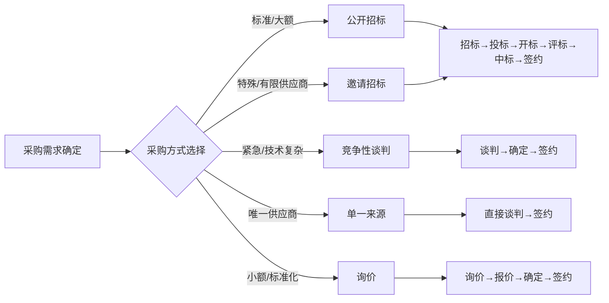
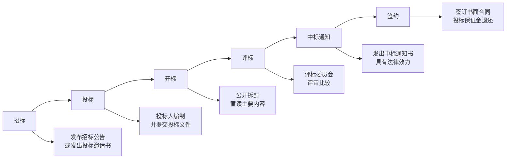

# T-PROC-002｜招投标、政府采购与采购流程管理

> 本专题用于学习"项目采购管理"中涉及法规和流程的内容：**招标方式（公开招标/邀请招标）、政府采购方式（公开招标/邀请招标/竞争性谈判/单一来源/询价）、招投标基本流程（招标→投标→开标→评标→中标→签约）、否决投标的情形、评标委员会组成**。它们不是孤立的法律条文，而是围绕一个核心问题：**在合规的前提下，如何通过竞争性采购选择最合适的供应商？**

---

## 先看这个专题的主线

招投标和政府采购在软考中主要考查的是"规则识别"——在什么情况下该用什么采购方式、什么行为是不合规的、招投标流程中哪些节点有特殊时限或程序要求。

---

## 招标方式

> **[概念组｜主要招标方式]**
>
> 1. **公开招标**：通过公开发布招标公告，邀请不特定的供应商投标。**原则是"公开、公平、公正"。** 适用：大多数达到限额标准的政府采购。
> 2. **邀请招标**：向**三家以上**特定的供应商发出投标邀请。适用：公开招标成本过高、只有少数供应商具备能力、涉及商业秘密或国家安全。
>
> **[关键数字]** 投标人不足 3 家 → 应重新招标。

---

## 政府采购方式

> **[概念组｜五种政府采购方式]**
>
> 1. **公开招标**：政府采购的主要方式。
> 2. **邀请招标**：适用于特殊性、公开招标费用占比过高。[待核验具体条件]
> 3. **竞争性谈判**：适用于技术复杂、不能确定详细规格、招标失败后。邀请**不少于 3 家**谈判。
> 4. **单一来源**：适用于只能从唯一供应商处获得、发生了不可预见的紧急情况、必须保证原有项目一致性/服务配套。**不需要三家以上，只需一家。**
> 5. **询价**：适用于采购的货物规格统一、现货充足、价格变化小。向**不少于 3 家**询价。

> **[辨析｜竞争性谈判 vs 询价]** 竞争性谈判用于"需求不明确、需要谈"的场景，询价用于"规格明确、只需比价"的场景。

---

## 招投标基本流程

---

## 否决投标与废标

> **[概念｜否决投标/废标的常见情形]**
> - 投标文件未按要求密封、签署或盖章
> - 投标人资格条件不符合招标文件要求
> - 投标报价低于成本价（低于成本竞标）—[待核验具体规定]
> - 投标文件未实质响应招标文件要求
> - 串通投标行为
> - 以他人名义投标或弄虚作假

---

## 典型题详解与举一反三

> **例题 1｜采购方式选择**
>
> 某政府单位需要采购一批标准配置的办公电脑，预算 200 万元。最适合采用哪种政府采购方式？
> A. 单一来源
> B. 竞争性谈判
> C. 公开招标
> D. 询价

标准配置、大额、市场成熟 → 公开招标。正确答案是 **C**。询价通常适用于小额/现货充足/价格变化小的货物，200 万元的采购通常超过询价限额 [待核验具体限额]。

**可制卡点：** 采购方式选择判断卡。

---

> **例题 2｜单一来源条件**
>
> 以下哪种情况最适合采用单一来源采购方式？
> A. 市场上有多家供应商可以满足需求
> B. 项目需求不明确需要谈判
> C. 只有一家供应商能满足，且为保证项目一致性必须从该供应商处采购
> D. 需要快速采购标准化的产品

"只有一家"且"一致性"→ 单一来源的两个核心条件都满足了。正确答案是 **C**。

**可制卡点：** 单一来源采购的关键条件卡。

---

> **例题 3｜投标人数**
>
> 某项目进行公开招标，投标截止时只有 2 家投标人递交了投标文件。招标人应该：
> A. 从两家投标人中直接选择
> B. 改为竞争性谈判
> C. 重新招标
> D. 提交上级审批后继续

不足 3 家→ 重新招标。正确答案是 **C**。

**可制卡点：** 投标不足 3 家的处理规则卡。

---

> **例题 4｜否决投标**
>
> 评标委员会发现某投标人的投标文件中，关键页面的签字为他人代签且无法提供授权证明。评标委员会应该：
> A. 要求投标人补签
> B. 否决该投标
> C. 视为有效并按正常程序评审
> D. 直接宣布废标

投标文件未按要求签署 → 应否决该投标。正确答案是 **B**。

**可制卡点：** 否决投标常见情形判断卡。

---

> **例题 5｜中标通知的法律效力**
>
> 中标通知书发出后，招标人改变中标结果，应当：
> A. 口头通知即可
> B. 依法承担法律责任（缔约过失责任或违约责任）
> C. 只要没签合同就没有法律责任
> D. 可以随意改变

中标通知书具有法律效力，改变中标结果需承担法律责任。正确答案是 **B**。[待核验具体法律条文]

**可制卡点：** 中标通知书法律效力卡。

---

## 这个专题应该怎样转化为 Anki 卡片

**概念卡**：公开招标、邀请招标、竞争性谈判、单一来源、询价——每种采购方式的定义+适用条件。

**辨析卡**：竞争性谈判 vs 询价、公开招标 vs 邀请招标、否决投标 vs 废标。

**数字卡**：投标人≥3 家、邀请/谈判/询价≥3 家、单一来源=1 家。

**流程卡**：招标→投标→开标→评标→中标→签约 的完整链路。

**陷阱卡**："中标通知书发出后可以随便改"→ 错。"不足 3 家也可以继续评标"→ 错。

---

## 本专题的最小掌握标准

至少能做到：① 区分五种政府采购方式的适用条件；② 记住"3 家"这个关键数字（招标/邀请/谈判/询价都≥3 家，单一来源=1 家）；③ 识别常见的否决投标/废标情形；④ 知道招投标的基本流程顺序。

---

## 待核验与后续改进

- 政府采购限额标准、招标投标法具体数字以最新法规为准。[待核验]
- 中标通知书的法律责任性质（缔约过失 vs 违约）在法律实践中有争议，本专题仅录通用规则。[待核验]
- 建议与 T-LAW-001 法律法规基础专题配合学习。
