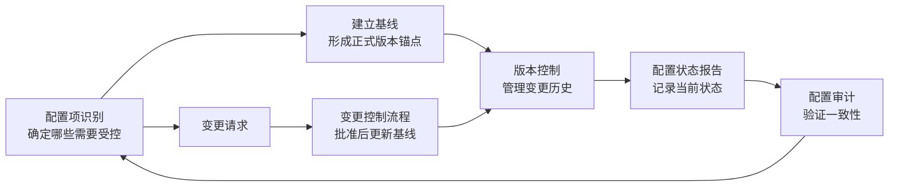

# T-CFG-001｜配置管理：配置项、基线、配置库与版本控制

> 本专题用于学习"信息文档与配置管理"中最容易出选择题和辨析题的一组核心内容：**配置项识别、配置基线（功能基线/分配基线/产品基线）、配置库（开发库/受控库/产品库）、版本控制、配置状态报告与配置审计、配置管理与变更管理的关系**。它们不是孤立的文档管理操作，而是围绕一个核心问题展开：**项目产生的众多文档、代码、交付物，如何保持它们的"身份"（这是什么？什么版本？什么状态？）和"可追溯性"（谁在什么时候改了什么？为什么改？）？**

---

## 先看这个专题的主线

配置管理最容易被低估——很多人以为就是"文件存档"。但软考对配置管理的考查集中在两个核心能力上：一是区分配置管理和变更管理各自管什么，二是理解从"配置项→基线→版本控制→审计"的完整管理闭环。

---

## 配置项与基线

> **[定义｜配置项]** 配置项是配置管理的基本单位——需要受控的任何工作产品、交付物或组件。包括代码、文档、设计图、测试用例、硬件规格等。

> **[概念组｜三类基线]**
>
> 1. **功能基线**：系统级需求评审通过后建立。对应"需求基线"——确定了系统要做什么。
> 2. **分配基线**：概要设计评审通过后建立。对应"设计基线"——将功能分配到各子系统/组件。
> 3. **产品基线**：产品通过测试和验收后建立。对应"发布基线"——最终交付的产品版本。

> **[辨析｜基线 vs 备份]** 基线是"经过正式评审和批准的、作为后续工作基础的"配置项版本。基线不是普通备份——它意味着"从这一点开始，任何修改都必须走正式的变更控制流程"。

---

## 配置库：开发库、受控库、产品库

> **[概念组｜三类配置库]**
>
> 1. **开发库（动态库）**：开发者日常工作区，可自由修改。未纳入基线控制。
> 2. **受控库（主库）**：已纳入基线控制的配置项存储区。修改需走变更流程。管理当前正在开发的配置项。
> 3. **产品库（静态库）**：已发布产品的最终版本存储区。严格受控，修改需最高级别审批。

> **[考试判断]** 开发者日常写代码 → 开发库。代码评审通过、纳入基线 → 受控库。产品发布给客户 → 产品库。入库升级方向：开发库 → 受控库 → 产品库。

---

## 配置管理与变更管理的关系

> **[辨析｜配置管理 vs 变更管理]**
>
> **配置管理**：管的是配置项的"身份"和"状态"——识别配置项、建立基线、版本控制、状态记录和审计。
> **变更管理**：管的是变更的"审批"和"过程"——变更请求、影响分析、CCB 审批、变更实施和验证。
>
> 两者紧密配合：每次批准的变更，都必须在配置管理系统中更新对应配置项的状态和版本。**变更控制决定"改不改"，配置管理负责"改完以后记录成什么版本"。**

---

## 典型题详解与举一反三

> **例题 1｜三类库的判断**
>
> 开发人员完成了代码编写和单元测试，将代码提交到了项目基线库中。这个"基线库"是什么？
>
> A. 开发库
> B. 受控库
> C. 产品库
> D. 动态库

纳入基线控制的配置项存储在受控库。正确答案是 **B**。开发库是工作区，产品库是发布后的最终版本。

**可制卡点：** 三类配置库的定位判断卡。

---

> **例题 2｜基线的作用**
>
> 配置基线的主要作用是：
>
> A. 提供日常工作的存储空间
> B. 作为后续工作的正式起点，任何修改需走变更控制
> C. 记录团队成员的工作量
> D. 存放项目合同文件

正确答案是 **B**。基线的核心价值在于：提供一个正式锚点，从此以后的修改必须受控。

**可制卡点：** 基线定义与作用卡。

---

> **例题 3｜配置管理 vs 变更管理**
>
> 某变更请求经 CCB 批准后，项目经理需要更新什么来确保变更被正式记录和跟踪？
>
> A. 仅更新项目管理计划
> B. 在配置管理系统中更新对应配置项的状态和版本
> C. 仅通知团队成员
> D. 关闭变更请求

变更批准后，需要在配置管理系统中更新对应配置项 → 这正是配置管理和变更管理的衔接点。正确答案是 **B**。

**可制卡点：** 变更批准后 → 配置更新的衔接卡。

---

> **例题 4｜产品库的权限**
>
> 以下关于产品库的说法，正确的是：
>
> A. 产品库中的配置项可以被随意修改
> B. 产品库中的配置项通过变更控制流程批准后才能修改
> C. 产品库就是开发库的另一个名称
> D. 产品库仅用于存储开发中的代码

产品库是最严格的库——修改需要最高级别的变更审批。正确答案是 **B**。

**可制卡点：** 三类库权限比较卡。

---

## 这个专题应该怎样转化为 Anki 卡片

**概念卡**：配置项、基线、功能基线/分配基线/产品基线、开发库/受控库/产品库、配置审计。

**辨析卡**：配置管理 vs 变更管理、开发库 vs 受控库 vs 产品库、基线 vs 普通版本/备份。

**流程卡**：配置项识别 → 基线 → 版本控制 → 状态报告 → 审计的闭环流程。

**陷阱卡**："配置审计就是检查代码质量" → 错，配置审计检查的是配置项与基线的一致性，不是代码质量（那属于 QA/QC）。

---

## 本专题的最小掌握标准

至少能做到：① 区分配置管理和变更管理各自管什么；② 识别三类基线（功能/分配/产品）的建立时机；③ 判断一个版本应该进入哪个配置库；④ 理解变更批准后需要更新配置状态。

---

## 待核验与后续改进

- 三类基线的中文术语与软考教程第二版的一致性需确认。[待核验]
