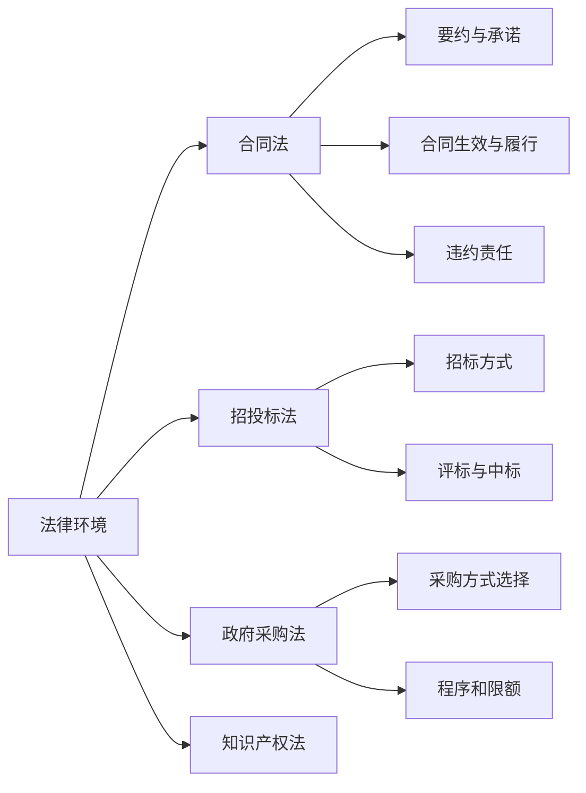
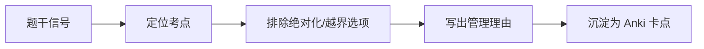

# T-LAW-001｜法律法规基础、合同法、招投标法与政府采购法考点

> 本专题用于学习"法律法规与标准规范"中的核心考试内容：**合同法的基本原则（要约/承诺/生效/履行/违约责任）、招投标法要点、政府采购法要点、标准化与标准规范基础**。它们不是需要逐条背诵的法条，而是围绕一个核心问题：**在项目管理的法律语境中，哪些规则直接影响合同的有效性、变更的合法性、争议的解决方式和项目经理的决策边界？**

---

## 先看这个专题的主线

法律法规在软考中集中出现在上午选择题中，考点分散但难度不高——核心考查"识别对错"而非"背诵法条"。重点在于：合同法（合同成立→生效→履行→违约）、招投标法（程序合规性）、政府采购法（采购方式选择）、知识产权法（详见 T-IP-001）。

---

## 合同法核心考点

### 要约与承诺

> **[概念组｜合同成立的两步]**
>
> - **要约**：一方提出订立合同的意思表示。内容必须具体确定。例如：招标公告通常被视为要约邀请（不是要约），投标文件是要约，中标通知书是承诺。
> - **承诺**：受要约人对要约表示同意的意思表示。承诺到达要约人时合同成立（非面对面时）。

> **[辨析｜要约 vs 要约邀请]** 要约邀请是希望他人向自己发出要约。招标公告 = 要约邀请，投标 = 要约，中标通知书 = 承诺。这几个对应关系在选择中常考。

### 合同生效与无效

> **[概念]** 合同成立 ≠ 合同生效。依法成立的合同，自成立时生效。但附条件或附期限的合同，条件成就或期限到来时才生效。无效合同：违反法律/行政法规强制性规定、恶意串通损害他人利益、以合法形式掩盖非法目的等。[待核验具体法条]

### 违约责任

> **[概念组｜违约责任形式]**
>
> - **继续履行**：强制违约方继续履行合同
> - **采取补救措施**：修理、更换、重做、退货、减少价款
> - **赔偿损失**：赔偿因违约造成的实际损失
> - **支付违约金**：按合同约定支付违约金。违约金过高可请求调整

---

## 招投标法要点

（详见 T-PROC-002 招投标专题，此处仅补充法律原则）

> **[原则]** 招标投标活动应当遵循**公开、公平、公正和诚实信用**的原则。

> **[禁区]** ① 不得将必须招标的项目化整为零规避招标；② 不得以不合理条件限制或排斥潜在投标人；③ 不得串通投标；④ 招标人和投标人不得就实质性内容进行谈判。

---

## 政府采购法要点

政府采购采用以下方式：公开招标、邀请招标、竞争性谈判、单一来源采购、询价。**公开招标应作为政府采购的主要方式。**（详见 T-PROC-002）

---

## 标准化与标准规范

> **[概念组｜标准的层级]**
>
> 国家标准（GB）、行业标准、地方标准、企业标准。**国家鼓励采用推荐性标准。**

> **[概念｜强制性标准 vs 推荐性标准]** 强制性标准必须执行。推荐性标准鼓励采用。涉及人身健康、生命财产安全、国家安全等的标准通常为强制性标准。[待核验具体划分]

---

## 典型题详解与举一反三

> **例题 1｜要约与承诺的对应**
>
> 在招投标过程中，投标文件的法律性质是：
> A. 要约邀请
> B. 要约
> C. 承诺
> D. 反要约

招标公告 = 要约邀请，**投标 = 要约**，中标通知书 = 承诺。正确答案是 **B**。

**可制卡点：** 招标公告/投标/中标通知书的要约阶段卡。

---

> **例题 2｜合同成立与生效**
>
> 以下关于合同的表述，哪项是正确的？
> A. 合同成立即生效
> B. 依法成立的合同，自成立时生效，但法律另有规定或当事人另有约定的除外
> C. 所有合同都需要政府部门批准才生效
> D. 口头达成的合同一律无效

正确答案是 **B**。一般合同成立即生效，但有例外（附条件/附期限/需审批等）。A 的绝对化表述是陷阱。

**可制卡点：** 合同成立 vs 生效辨析卡。

---

> **例题 3｜招标原则**
>
> 某招标文件中要求投标人"必须是在本市注册的企业"。这一做法：
> A. 合法，可以限定供应商地域
> B. 不合法，属于以不合理条件限制潜在投标人
> C. 合法，但需报上级批准
> D. 视项目金额而定

限定本地注册 → 以不合理条件限制排斥 → **不合法**。正确答案是 **B**。

**可制卡点：** 招投标禁止行为判断卡。

---

> **例题 4｜违约金**
>
> 合同约定的违约金低于造成的实际损失时，当事人可以：
> A. 自行修改合同
> B. 请求法院或仲裁机构予以增加
> C. 要求对方双倍赔偿
> D. 不能调整，按约定执行

违约金低于实际损失→可请求法院或仲裁机构增加。过高则可请求减少。正确答案是 **B**。[待核验合同法具体条文]

**可制卡点：** 违约金调整原则卡。

---

> **例题 5｜标准化**
>
> 涉及人身健康和生命财产安全的强制性标准，以下说法正确的是：
> A. 企业可以选择是否执行
> B. 必须执行
> C. 仅供行业参考
> D. 属于推荐性标准

强制性标准 → **必须执行**。正确答案是 **B**。

**可制卡点：** 强制 vs 推荐标准判断卡。

---

## 本轮真题覆盖增强：法律小题与标准代号

本节把 `questions.full.clean.md` 与既有真题映射中的高频考法反查回本专题。2010 上午题和旧题常考合同有效性、合同条款含混、招标文件送达、GB/GB/T 等标准化小点。 学习时不要只背定义，要能从题干信号判断它在考哪一个管理动作或技术边界。

这类题的识别链路可以这样看：

图里的重点是“先定位，再排错”。软考选择题常用绝对化说法、角色越权、流程跳步来制造干扰；下午案例题则把同一个错误包装成多句背景，需要把事实翻译回管理过程。

> **例题｜法律小题与标准代号（真题型改编训练题）**
>
> 在招投标法律关系中，中标通知书通常对应合同订立过程中的：
>
> A. 要约邀请  
> B. 要约  
> C. 承诺  
> D. 违约通知

**考查点：** 要约、承诺、招投标法律关系。

**题干关键词：** 招标公告、投标文件、中标通知书。

**解题过程：** 招标公告通常是要约邀请，投标文件是要约，中标通知书是承诺。

**正确答案：** C。

**错项分析：**

- A 更接近招标公告。
- B 更接近投标文件。
- D 与合同订立无关。

**举一反三：** 法律题少背条文号，多背“角色-行为-法律性质”的对应关系；涉及具体时限和比例时统一标注待核验后再制卡。

**可制卡点：** 招标公告/投标/中标通知书对应关系；合同条款含混为什么危险；GB vs GB/T vs GB/Z。

## 这个专题应该怎样转化为 Anki 卡片

**概念卡**：要约、承诺、要约邀请、违约责任形式、强制性标准、推荐性标准。

**辨析卡**：要约 vs 要约邀请、合同成立 vs 合同生效、强制性 vs 推荐性标准。

**流程卡**：招投标法律流程：要约邀请（招标公告）→要约（投标）→承诺（中标通知书）→签约。

**规则卡**：招投标"三公一诚"原则、不得以不合理条件限制投标人。

**陷阱卡**："招标公告是要约"→ 错，招标公告是要约邀请，投标才是要约。

---

## 本专题的最小掌握标准

至少能做到：① 区分要约、承诺、要约邀请在招投标过程中的对应关系；② 区分合同成立与生效；③ 记住常见违约责任的承担形式；④ 识别招投标中的合规/违规行为；⑤ 区分强制性标准和推荐性标准。

---

## 待核验与后续改进

- 合同法、招投标法、政府采购法的具体条文编号和原文以现行法律为准。[待核验]
- 标准化的层级划分（国家/行业/地方/企业）以《标准化法》为准。[待核验]
- 违约金调整的具体法律依据需对照合同法相关条款。[待核验]
