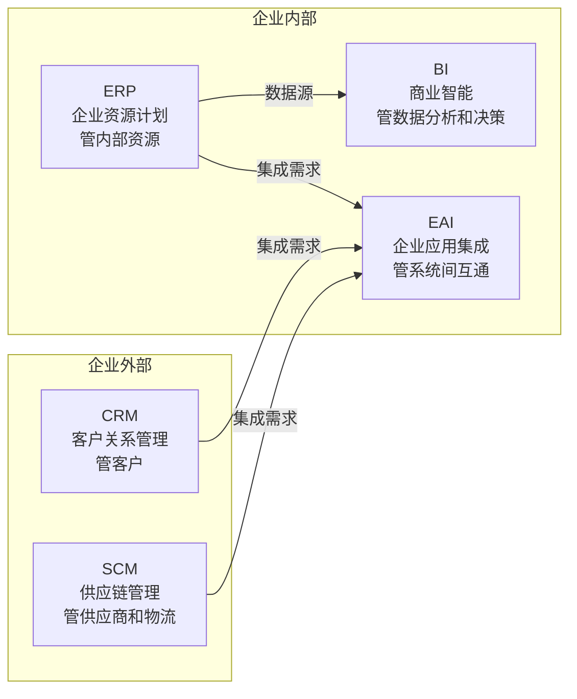
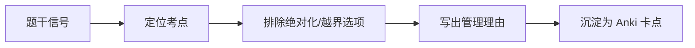

# T-INFO-002｜企业信息化系统：ERP、CRM、SCM、BI、EAI 辨析

> 本专题用于系统辨析上午选择题中必出的一组企业信息化系统概念：**ERP（企业资源计划）、CRM（客户关系管理）、SCM（供应链管理）、BI（商业智能）、EAI（企业应用集成）**。核心问题：**每个系统的管理对象是谁？业务焦点是什么？考试中最常见的"张冠李戴"陷阱有哪些？**

---

## 先看这个专题的主线

这五个系统考的不是技术实现，而是**"谁管什么"的区分**。考试中常用"把 A 系统的作用安在 B 头上"来设陷阱。

---

## 五系统逐个精讲

### 1. ERP（企业资源计划）

> **管理对象**：企业内部资源（人、财、物、信息）。核心模块：财务、生产、采购、库存、人力资源。**关键词**："整合内部资源"、"打破部门壁垒"、"统一的数据平台"。

> **[考试判断]** 题干描述"想统一管理财务、库存、人力资源"→ ERP。

### 2. CRM（客户关系管理）

> **管理对象**：客户。核心功能：市场营销、销售管理、客户服务、客户数据分析。**关键词**："客户"、"销售"、"服务"、"营销"。

> **[考试判断]** 题干描述"想管理客户信息、跟踪销售机会、提升客户满意度"→ CRM。

### 3. SCM（供应链管理）

> **管理对象**：供应链上下游。核心关注：采购、库存控制、物流配送、需求预测、供应商协同。**关键词**："供应商"、"库存"、"物流"、"上下游协同"。

> **[考试判断]** 题干描述"想减少库存、加快物流、协同供应商"→ SCM。

### 4. BI（商业智能）

> **管理对象**：数据→决策。核心技术：数据仓库、OLAP（联机分析处理）、数据挖掘、报表、仪表盘。**关键词**："数据仓库"、"多维分析"、"数据挖掘"、"决策支持"。

> **[考试判断]** 题干描述"想从大量经营数据中提取决策信息、做趋势分析"→ BI。

### 5. EAI（企业应用集成）

> **管理对象**：异构系统的互通。解决"信息孤岛"问题。集成层次：表示层集成、数据层集成、业务逻辑层集成、流程层集成。**关键词**："信息孤岛"、"异构系统"、"集成"、"互通"。

> **[考试判断]** 题干描述"ERP 和 CRM 之间数据不通，需要让它们互通"→ EAI。

---

## 辨析速查表

| 系统 | 1 句话定位 | 最常见的张冠李戴陷阱 |
|---|---|---|
| ERP | 管企业的内部资源 | 别和 CRM 混淆——ERP 对内，CRM 对外 |
| CRM | 管客户关系 | 别和 ERP 混淆——CRM 不主管财务和库存 |
| SCM | 管供应链上下游 | 别和 ERP 混淆——SCM 穿过企业边界到外部 |
| BI | 管数据分析和决策支持 | 别和 EAI 混淆——BI 分析数据，EAI 打通系统 |
| EAI | 管异构系统之间的集成 | 别和 BI 混淆——EAI 连接，BI 分析 |

---

## 典型题详解与举一反三

> **例题 1｜ERP vs CRM**
>
> 某企业需要管理从原材料采购到产品交付全过程的资源协调，包括财务、库存、生产计划。最合适的信息系统是：
> A. CRM  B. ERP  C. BI  D. EAI

"财务、库存、生产计划"→ 企业内部资源管理→ **ERP**。正确答案是 **B**。

**可制卡点：** ERP vs CRM 的判断卡（管内部资源 vs 管客户关系）。

---

> **例题 2｜BI 的特征**
>
> 某企业已有多年的经营数据，管理层希望通过数据的多维分析来发现销售趋势、支持战略决策。最需要的系统是：
> A. SCM  B. EAI  C. CRM  D. BI

"多维分析"、"发现趋势"、"决策支持"→ **BI**。正确答案是 **D**。

**可制卡点：** BI 特征关键词卡（数据仓库/OLAP/数据挖掘/决策支持）。

---

> **例题 3｜EAI 的用途**
>
> 一个集团公司有 ERP、CRM、OA 三套系统，但数据互不相通，形成了"信息孤岛"。解决这个问题最合适的技术方案是：
> A. 废弃所有系统重新开发  B. 实施 BI 系统  C. 实施 EAI 企业应用集成  D. 增加新的 ERP 模块

"信息孤岛"、"数据互不相通"→ 需要**EAI**将异构系统集成。正确答案是 **C**。BI 分析数据但不管系统互通。

**可制卡点：** EAI vs BI 的场景区分卡。

---

> **例题 4｜SCM 的定位**
>
> 以下哪项最接近 SCM 的核心管理目标？
> A. 统一管理企业内部的财务和人事
> B. 优化从原材料到最终客户的整个供应链
> C. 分析客户购买行为的趋势
> D. 将不同信息系统的数据打通

"从原材料到最终客户的整个供应链"→ **SCM**。ERP 管内部（A 更接近 ERP），BI 管分析（C），EAI 管打通（D）。正确答案是 **B**。

**可制卡点：** 五系统一句话定位卡。

---

> **例题 5｜综合场景**
>
> 某制造企业想建设信息系统。需求包括：① 打通现有的财务系统和销售系统实现数据共享；② 统一管理财务、库存和采购流程；③ 分析历史销售数据预测下季度需求。请分别指出对应的系统方案。

① 打通现有系统→ **EAI**（企业应用集成）
② 统一管理财务/库存/采购→ **ERP**（企业资源计划）
③ 分析历史数据预测→ **BI**（商业智能）

**可制卡点：** 企业信息化场景匹配综合卡。

---

## 本轮真题覆盖增强：企业系统与数据分析小题

本节把 `questions.full.clean.md` 与既有真题映射中的高频考法反查回本专题。2010 上午题考 ERP 相比 MRP II 的供应链扩展，题库还考 CRM 数据、BI/数据仓库/OLAP。 学习时不要只背定义，要能从题干信号判断它在考哪一个管理动作或技术边界。

这类题的识别链路可以这样看：

图里的重点是“先定位，再排错”。软考选择题常用绝对化说法、角色越权、流程跳步来制造干扰；下午案例题则把同一个错误包装成多句背景，需要把事实翻译回管理过程。

> **例题｜企业系统与数据分析小题（真题型改编训练题）**
>
> 与 MRP II 相比，ERP 最大特点之一是在制定计划时把哪一类资源或关系纳入统一考虑？
>
> A. 整个供应链  
> B. 只考虑企业内部库存  
> C. 只考虑竞争对手广告  
> D. 只考虑员工宿舍

**考查点：** ERP、MRP II、供应链扩展。

**题干关键词：** ERP、MRP II、延伸管理范围、供应链。

**解题过程：** ERP 在 MRP II 基础上把客户需求、企业制造活动和供应商资源放入完整供应链中管理。

**正确答案：** A。

**错项分析：**

- B 更接近传统内部资源计划。
- C/D 不是 ERP 的核心扩展方向。

**举一反三：** 企业系统辨析题用“管理对象”拆：ERP 管内部资源并延伸供应链，CRM 管客户关系，SCM 管供应链协同，BI 管分析决策。

**可制卡点：** ERP vs MRP II；CRM 数据类型；数据仓库与 OLAP。

## 这个专题应该怎样转化为 Anki 卡片

**概念卡**：ERP/CRM/SCM/BI/EAI 每个系统一张（管理对象+核心功能+关键词）。

**辨析卡**：ERP vs CRM、BI vs EAI、SCM vs ERP。

**场景判断卡（最重要）**：正面=企业需求描述，背面=最匹配的系统。

**陷阱卡**："ERP 管客户关系"→ 错，CRM 管客户。"EAI 是做数据分析的"→ 错，BI 做分析，EAI 做集成。

---

## 本专题的最小掌握标准

至少能做到：给一个企业需求场景，立即匹配到最合适的系统。记住五句话定位：ERP 管内部资源、CRM 管客户、SCM 管供应链、BI 做数据分析、EAI 打通系统。

---

## 待核验与后续改进

- 各系统的中文名称在软考教程中的准确表述需回查。[待核验]
