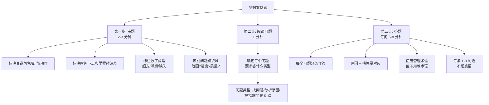

# T-CASE-001｜下午案例题通用审题与答题方法

> 本专题用于学习"系统集成项目管理工程师"下午案例分析题的通用应对方法。它不针对某个具体知识域，而是解决一个所有案例题都绕不开的核心问题：**给定一段项目场景描述，如何快速识别问题、组织原因、给出措施、控制篇幅，并在有限时间内获得最多分数？**

---

## 先看这个专题的主线

下午案例题和上午选择题的思维模式完全不同。选择题考查的是"识别判断"——看到关键词、套公式或概念、选出正确答案。案例题考查的是"诊断和处方"——先看出问题在哪、再解释为什么会出问题、再提出具体怎么做。这意味着你需要一套不同于选择题的解题工作流。

这张图是所有案例题通用的工作流。不论题目考的是进度延误、成本超支、范围蔓延还是质量问题，你审题和答题的底层逻辑是一样的。

---

## 第一步：快速审题——这是最关键的一步

拿到案例题后，不要马上开始写答案。先用 2-3 分钟快速从头到尾读一遍题干，在读的过程中用笔标注四类关键信息。

### 标注 1：关键角色和部门

案例题中出现的每个角色/部门都是潜在的问题来源。标注：
- 项目经理做了什么（或没做什么）
- 客户/甲方做了什么
- 开发团队/测试团队/运维团队做了什么
- 领导/发起人/CCB 做了什么
- 供应商/分包商做了什么

### 标注 2：时间节点和里程碑偏差

任何提到"计划 X 月完成，实际到了 X 月只完成了 Y%"、"延迟了""提前了""赶不上"的地方都要标注。这些直接关系到进度管理的案例分析。

### 标注 3：数字异常

成本数据（超支了多少）、质量数据（发现了多少缺陷）、范围数据（增加了多少功能），这些数字是你后续做挣值分析或影响判断的输入。

### 标注 4：知识域信号词

读题时在脑中把问题归类到知识域：

| 信号词 | 知识域 |
|---|---|
| 增加了功能、客户要求多做了、范围不明确 | **范围管理** |
| 延期、加班、赶不上、活动并行 | **进度管理** |
| 花多了、超预算、预算不够 | **成本管理** |
| bug 多、返工、测试通不过 | **质量管理** |
| 不知道、没人通知、没收到报告 | **沟通管理** |
| 投诉、不满意、不配合 | **干系人管理** |
| 改了没审批、擅自修改、领导口头同意 | **变更管理** |
| 出了问题、意外、之前没想到 | **风险管理** |
| 合同纠纷、供应商不履约、索赔 | **采购/合同管理** |

---

## 第二步：读问题——确定答题类型

案例题通常有 3-4 个问题，每个问题的答题类型不同。

### 类型 A：找问题/识别错误

典型问法："请指出该项目管理中存在的问题。"

答题方式：**逐条列出**，每条一句话，用"存在/缺失/没有/不足"开头。按知识域分组。不要只写一个"管理不善"，要具体到"范围管理方面：WBS 分解不够细致，缺少 WBS 词典，导致工作包边界不清"。

### 类型 B：分析原因

典型问法："请分析造成该项目进度延误/成本超支/质量问题的原因。"

答题方式：**按因果逻辑链展开**。不是列出所有可能原因，而是从题干中找出直接原因和间接原因。先写直接原因（如"关键路径活动延误"），再写深层原因（如"活动历时估算时未进行三点估算，乐观估计了工期"）。

### 类型 C：提出措施/改进建议

典型问法："请提出改进措施"或"项目经理应该怎么做"。

答题方式：措施必须和前面分析的问题/原因**一一对应**。每个措施要可执行——不是"加强进度管理"，而是"重新评估关键路径活动，对关键活动安排有经验的人员支援，并建立每周进度偏差预警机制"。

> **[关键原则]** 原因分析和措施建议必须对得上。如果你前面分析了"范围管理方面的 WBS 不清晰"，后面就要有针对 WBS 的措施，不能突然跳到"加强沟通"。

### 类型 D：判断对错/评价做法

典型问法："项目经理的做法是否正确？请说明理由。"

答题方式：先明确回答"不正确"或"不完全正确"，再逐一说明为什么。

---

## 第三步：答题——分条、分层、用术语但不堆术语

### 分条原则

每条答案独立成行，编号或用项目符号。一条说一件事。不要写成一大段文字——阅卷人按点给分。

### 语言原则

使用项目管理术语能展示专业度，但不要光堆术语没有内容。对比以下两种写法：

- 不合格："项目经理应该做好进度管理、成本管理、质量管理、沟通管理"——空洞
- 合格："项目经理应重新评估关键路径，识别进度偏差最大的活动，分析原因（是估算偏差还是执行不力），针对性地采取赶工（增加关键资源）或快速跟进（调整活动逻辑），并评估这些措施对成本和质量的连带影响"——具体

### 时间分配

下午案例题通常 90 分钟，约 3-4 道题，每道题约 20-25 分钟。建议分配：
- 审题：2-3 分钟
- 读问题：1 分钟
- 每问作答：5-8 分钟
- 检查：2 分钟

---

## 常见案例类型的答题框架

### 进度延误类

问题 → 识别关键路径延误 → 原因（估算太乐观/资源不足/需求变更/技术困难）→ 措施（赶工/快速跟进/资源优化/调整依赖/变更控制）→ 评估（对成本/质量/风险的影响）

### 成本超支类

问题 → 计算 CV/CPI → 诊断原因（范围蔓延/资源价格高于预算/返工/低效）→ 措施（成本控制/变更控制/资源替换/提高效率）→ 预测 EAC

### 范围蔓延类

问题 → 根源（需求不明确/客户直接要求/缺少变更控制/WBS 不全）→ 措施（强化变更控制/重新确认范围基准/CCB 审批/客户预期管理）

### 质量问题类

问题 → 表现（返工/bug 多/测试不通过/客户验收拒绝）→ 原因（缺质量计划/缺 QA 过程/QC 集中在后期）→ 措施（补质量计划/增加过程评审/加强各阶段测试/根因分析）

### 沟通与干系人冲突类

问题 → 表现（不知道/不配合/投诉/冲突）→ 原因（干系人识别不全/沟通计划缺失/反馈机制缺失）→ 措施（全面识别干系人/评估参与度/制定沟通计划/建立反馈机制）

---

## 典型题详解

> **例题 1｜案例审题训练**
>
> 阅读以下案例片段，识别问题和对应的知识域。
>
> "某系统集成项目计划 8 个月完成，项目执行到第 5 个月时，客户多次直接联系开发人员要求增加功能模块。开发人员为了维护客户关系，口头答应了并加班完成了这些新增功能。项目经理在周会上才发现项目范围已经远远超过原计划，进度滞后 1.5 个月，开发团队因长期加班出现情绪问题。"

标注分析：
- "客户多次直接联系开发人员" → **变更管理**问题（变更没有走正式流程）+ **干系人管理**问题（客户绕过项目经理）
- "增加功能模块" → **范围管理**问题（范围蔓延）
- "口头答应了并加班完成" → **变更管理**问题（未经审批的变更）+ **进度管理**问题（加班 = 不可持续的赶工）
- "进度滞后 1.5 个月" → **进度管理**问题
- "团队因长期加班出现情绪问题" → **人力资源管理**问题

核心问题：**变更失控 + 范围蔓延**。次级问题：干系人期望管理不足、团队管理不足。

**延伸理解：** 这道题展示了案例题中多个知识域问题的交织。答题时先识别"主要问题"（导致其他问题链条启动的根源），再分析连带影响。这道题的根源是变更控制缺失——客户可以直接找开发人员改需求，意味着整个变更控制流程形同虚设。

---

> **例题 2｜原因分析与措施对应**
>
> 基于例题 1 的场景：
> 问题 1：请分析造成项目困境的主要原因。（5 分）
> 问题 2：请提出改进措施。（10 分）

**问题 1 答题思路**：

主要原因：① 没有建立有效的变更控制流程（或流程未被遵守），客户绕开项目经理直接找开发人员，变更未经评估和 CCB 审批就实施；② 范围基准未被有效维护，范围蔓延没有及时被发现和控制；③ 项目经理对项目执行状况的监控不及时——直到周会才发现问题，说明工作绩效信息收集和上报机制不到位；④ 开发人员缺乏变更管理意识，在未经授权的情况下接受并实施范围外的工作。

**问题 2 答题思路**（必须和原因对应）：

① 立即暂停所有未经审批的变更工作，重新评估已增加的"新增功能"对范围、进度、成本、质量的影响，补走变更控制流程。
② 强化变更控制：所有变更必须提交正式变更请求 → 项目经理组织影响分析 → 提交 CCB 审批 → 批准后更新项目管理计划和基准 → 通知相关干系人。
③ 教育客户和开发团队：变更不是不允许，但必须走流程。客户有变更需求应统一通过项目经理提交，开发人员不得在未经授权的情况下接受变更请求。
④ 重新评估当前进度状态：识别关键路径、计算实际偏差，评估是否可通过赶工或快速跟进挽回部分工期，并评估成本和风险影响。
⑤ 关注团队状态：加班不宜长期化，评估是否需要增加外部资源或调整任务分配，同时做好团队沟通和激励。

**延伸理解：** 注意原因和措施的对应关系——原因 ①（变更控制缺失）→ 措施 ②（强化变更控制）；原因 ③（监控不及时）→ 措施 ④（重新评估进度+加强监控）；原因 ④（团队意识不足）→ 措施 ③（教育培训）；原因 ②（范围蔓延）→ 措施 ①（立即暂停并评估）。好的案例答案就是"对症下药"。

---

## 这个专题应该怎样转化为 Anki 卡片

**流程卡**：案例题三步解题法（审题标注→读问题→分条作答）。每一步的关键动作。

**模板卡**：五类常见案例的答题框架（进度/成本/范围/质量/沟通干系人）。每类一张卡，背的是"问题→原因→措施"的框架结构，不是具体内容。

**信号词卡**：题干关键词 → 对应知识域。例如："客户直接找开发人员"→ 变更失控 + 范围蔓延；"团队不知道"→ 沟通问题 + 干系人识别不全。

**陷阱卡**：
- "加强管理"不是有效答案
- 原因和措施不对应是常见的失分点
- 只写术语不写具体做法——得分低

**暂不制卡内容**：具体案例的完整答案（不适合做卡，适合当练习素材）。

---

## 本专题的最小掌握标准

学完本专题后，你至少应该能做到四件事。

第一，拿到案例题后能在 3 分钟内完成标注（角色、时间偏差、数字异常、知识域信号词）。第二，能判断每个问题的答题类型（找问题/分析原因/提措施/判断对错）并采用对应的答题格式。第三，能保证原因分析和措施建议的一一对应关系。第四，输出的每条答案都是具体的、可执行的、短而有信息的——不以"加强管理"这类空话搪塞。

---

## 待核验与后续改进

- 下午案例题的具体分值分布和评分细则每年可能有调整，本专题的答题策略基于通用考试规律。[待核验]
- 建议结合具体知识域的案例模板专题（如 T-CASE-002 进度延误案例）做综合训练。
