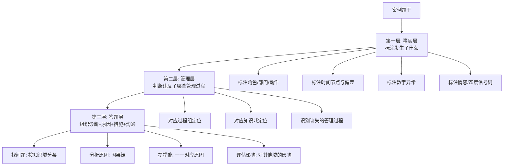
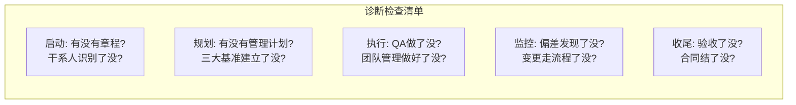
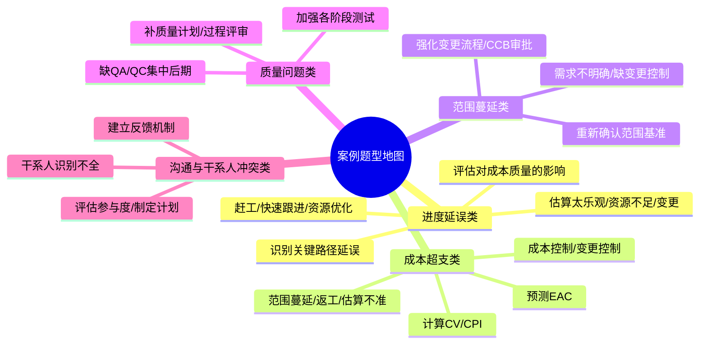

# T-CASE-001｜下午案例题通用审题与答题方法

> 本专题用于学习"系统集成项目管理工程师"下午案例分析题的通用应对方法。它不针对某个具体知识域，而是解决一个所有案例题都绕不开的核心问题：**给定一段项目场景描述，如何快速识别问题、归因到管理过程、组织原因、给出可执行措施、控制篇幅，并在有限时间内获得最多分数？**

---

## 先看这个专题的主线

下午案例题和上午选择题的思维模式完全不同。选择题考查的是"识别判断"——看到关键词、套公式或概念、选出正确答案。案例题考查的是"诊断和处方"——先看出问题在哪、再解释为什么会出问题、再提出具体怎么做。

这意味着你需要一套不同于选择题的解题工作流。这套工作流可以总结为三层：

这三层递进是整个专题的核心方法论。**事实层是"看"（看见什么写什么），管理层是"想"（用框架分析），答题层是"写"（按规则输出）。**

---

## 第一步：事实层——快速审题与标注

拿到案例题后，不要马上开始写答案。先用 2-3 分钟快速从头到尾读一遍题干，在阅读中标注四类关键信息。

### 标注 1：关键角色和部门

案例题中出现的每个角色/部门都是潜在的问题来源：
- 项目经理做了什么（或没做什么）→ 判断项目经理是否履职到位
- 客户/甲方做了什么 → 判断干系人行为是否合规
- 开发团队/测试团队做了什么 → 判断执行层面问题
- 领导/发起人/CCB 做了什么 → 判断治理层面问题
- 供应商/分包商做了什么 → 判断采购和合同问题

### 标注 2：时间节点和里程碑偏差

任何提到时间的地方都要标注："计划 X 月完成，实际只完成了 Y%"、"延迟了"、"提前了"、"赶不上"。这些直接指向进度管理问题。

### 标注 3：数字异常

成本数据（超支了多少）、预算数据（追加了多少）、质量数据（多少缺陷、多少返工），这些数字是后续挣值分析或影响判断的直接输入。

### 标注 4：知识域信号词

这是最重要的标注。读题时在脑中（或草稿纸上）把题干的信号词归类到知识域：

| 信号词 | 对应知识域 | 问题类型 |
|---|---|---|
| 增加功能、多做了、范围不清、没人知道做什么 | 范围管理 | 范围蔓延/范围定义不清 |
| 延期、加班、赶不上、并行、压缩工期 | 进度管理 | 进度延误/压缩不当 |
| 超预算、花多了、成本超支、报价低 | 成本管理 | 成本失控/估算不准 |
| bug 多、返工、测试通不过、质量差、投诉 | 质量管理 | 质量缺陷/QA 缺失 |
| 不知道、没通知、没收到报告、没说 | 沟通管理 | 沟通计划缺失 |
| 不满意、不配合、反对、抵制 | 干系人管理 | 干系人识别不足/参与度低 |
| 口头同意、没走流程、擅自改了、领导直接说 | 变更管理 | 变更失控 |
| 没想到、意外、突然、原以为 | 风险管理 | 风险识别不足/应对缺失 |
| 合同纠纷、供应商不交货、索赔、验收不通过 | 采购/合同管理 | 合同管理/供应商管理 |
| 记不清版本、不知道哪个是最新版、配置乱了 | 配置管理 | 配置管理缺失 |
| 项目结束了没人总结、文档丢了 | 收尾管理 | 收尾不完整 |
| 团队成员离职、冲突、士气低、加班太多 | 人力资源管理 | 团队管理/激励不足 |

---

## 第二步：管理层——用过程组×知识域框架定位问题

在完成事实标注后，你需要把标注信息"升维"到管理层面——哪些管理过程缺失了？哪些管理动作做错了？这需要你调用"过程组×知识域"框架（详见 T-PM-002）。

具体做法：读完题干后，在心里（或草稿上）按五大过程组逐一过一遍：
1. **启动做了什么？** ——有没有项目章程？干系人识别完整吗？
2. **规划做了什么？** ——有没有项目管理计划？WBS 建了吗？进度计划做了吗？成本基准定了吗？质量标准明确了吗？风险识别了吗？
3. **执行做了什么？** ——QA 做了吗？团队建设了吗？采购执行规范吗？
4. **监控做了什么？** ——偏差分析做了吗？变更控制走了吗？QC 做了吗？干系人参与监控了吗？
5. **收尾做了什么？** ——验收了吗？文档归档了吗？经验教训总结了吗？

**题干中没有提到的，往往就是缺失的。** 这是案例诊断的第一法则。

---

## 第三步：答题层——四类问题的答题格式

案例题通常有 3-4 个子问题，每个子问题的答题类型不同。需要先判断问的是什么类型，再采用对应的格式。

### 类型 A：找问题/识别错误

典型问法："请指出该项目管理中存在的问题。"

答题要诀：**逐条列出，按知识域分组，用"缺失/没有/不足/未"开头。**
- 不要写"管理不善"——太笼统
- 不要写"项目经理不行"——不是评价人，是评价管理过程
- 正确示范："范围管理方面：未建立 WBS 和工作包分解，导致工作边界不清。变更管理方面：变更控制流程形同虚设，客户直接找开发人员修改需求，变更未经 CCB 评估和审批。"

### 类型 B：分析原因

典型问法："请分析造成 X 问题的原因。"

答题要诀：**按因果链展开——先写直接原因，再写深层原因。**
- 直接原因：题干里能直接读出来的（如"关键路径上活动延误"）
- 深层原因：需要推理的（如"活动历时估算时采用了单点估算，未考虑不确定性和风险储备"）
- 系统原因：需要在更大管理框架下判断的（如"整体管理方面：缺乏系统的进度管理计划和偏差预警机制"）

### 类型 C：提出措施/改进建议

典型问法："请提出改进措施"或"项目经理应该怎么做。"

答题要诀：**措施必须和前面分析的问题/原因一一对应。** 每个措施要可执行。对比：
- 不合格："加强进度管理"——空洞
- 合格："重新评估关键路径上各活动的实际工期，对延误活动分析原因并制定针对性追赶方案；对后续活动采用三点估算替代单点估算，增加适当的进度储备"——具体

> **[关键原则｜因果对应]** 原因分析和措施建议必须对得上。如果你分析了"WBS 不清晰导致范围蔓延"，后面的措施就要有"重新梳理 WBS 并补充 WBS 词典"。不能前面分析范围问题、后面跳到沟通管理去给措施。

### 类型 D：判断对错/评价做法

典型问法："项目经理的做法是否正确？请说明理由。"

答题要诀：**先明确回答，再逐一说明。**
- 第一步：明确表态——"不正确"或"不完全正确"
- 第二步：逐一分析每个做法——哪里错了、为什么错、正确做法应该是什么
- 第三步（如果有）：分析可能的后果

---

## 第三步（续）：答题格式与时间分配

### 分条原则

每条答案独立成行，用 ①②③ 或 - 开头。一条说一件事。不要写成一大段——阅卷人是按点给分的。

### 时间分配

下午案例题通常 90 分钟，约 3-4 道大题，每道题约 20-25 分钟：
- 审题标注：2-3 分钟
- 读问题：1 分钟
- 每问作答：5-8 分钟
- 检查补充：2 分钟

### 字数控制

每个"问题点"或"措施点"用 1-3 句话，不超过 4 行。不要求写长文，要求每个点都"有信息"。

---

## 五大常见案例框架速查

### 进度延误类

**诊断**：关键路径活动延误→ **原因**：估算太乐观/资源不足/需求变更/技术困难→ **措施**：赶工（加关键资源）/快速跟进（调整逻辑）/资源优化/调整依赖关系→ **评估**：对成本/质量/风险的影响→ **控制**：加强进度监控和偏差预警

### 成本超支类

**诊断**：CV负/CPI<1→ **原因**：范围蔓延/资源价格高/返工/效率低→ **措施**：成本控制/变更控制/资源替换/提升效率→ **预测**：EAC→ **控制**：设偏差阈值，触发预警

### 范围蔓延类

**诊断**：做了WBS外的工作→ **根源**：需求不明确/客户直接要求/缺少变更控制/WBS不全→ **措施**：立即暂停未审批工作→补走变更流程→强化变更控制→重新确认范围基准→ **预防**：客户预期管理

### 质量问题类

**诊断**：返工/bug多/测试不通过→ **原因**：缺质量计划/缺 QA 过程/QC 只做在最后→ **措施**：补质量计划→增加过程评审→加强各阶段测试→根因分析→更新质量检查清单

### 沟通与干系人冲突类

**诊断**：不知道/不配合/投诉/抵制→ **原因**：干系人识别不全/沟通计划缺失/反馈机制缺失→ **措施**：全面识别干系人→评估参与度→制定沟通计划→建立定期反馈机制→对抵制型干系人制定专门策略

---

## 案例训练片段

以下 6 个训练片段覆盖了下午案例题最常见的场景类型。每个片段包含完整的"审题→定位→答题"训练。

---

### 训练片段 1｜进度延误

> 某信息化项目计划工期 12 个月。项目经理在项目启动后制定了里程碑计划（每季度一个里程碑），但未对具体活动进行历时估算。第 8 个月末，项目只完成了原计划第 5 个月末应完成的工作。项目经理开始要求所有成员加班，但进度改善不明显。

**问题识别**：
- "未对具体活动进行历时估算"→ **进度管理**缺失：没有活动定义和活动历时估算过程
- "只完成了第 5 个月末的工作"→ 进度严重滞后（SV 为负）
- "要求所有成员加班"→ 赶工但未识别关键路径——**对所有活动赶工效率低**
- "改善不明显"→ 加班作用不在关键路径上，或存在人员疲劳/效率下降

**涉及知识域**：进度管理（核心）、人力资源管理（加班导致疲劳）、成本管理（加班增加成本）

**答题框架**：
问题：① 进度管理计划缺失，未进行活动历时估算和关键路径分析；② 进度监控缺失——到第 8 个月才发现偏差；③ 赶工缺乏针对性——未识别关键路径活动，盲目要求全员加班。
改进：① 立即评估当前进度偏差，识别关键路径和延误活动；② 对关键路径活动分析赶工可行性（增加关键资源、技术支援），评估对成本和质量的影响；③ 考虑是否可通过快速跟进（调整活动逻辑）压缩后续工期；④ 建立周期性进度偏差预警机制。

**易漏点**：很多人只写"赶工"不写"关键路径"——赶工的核心是优先压缩**关键路径上的活动**。
**可制卡点**：进度延误案例模板卡（"未做活动估算→未识别关键路径→盲目赶工→效果不佳"链）。

---

### 训练片段 2｜成本超支 + 挣值分析

> 某项目 BAC = 600 万元，计划工期 10 个月。第 6 个月末，PV = 360 万元，EV = 300 万元，AC = 390 万元。项目经理向领导汇报项目进度正常——"完成了 50%"，但财务提醒成本已经超支。

**问题识别**：
- SPI = 300/360 ≈ 0.83 → 进度滞后（不是"正常"）
- CPI = 300/390 ≈ 0.77 → 成本严重超支
- "完成了 50%"→ 项目经理用"时间进度"而非"挣值"判断进度 → **缺乏挣值管理意识**
- 未预测 EAC → 缺乏前瞻性管理

**涉及知识域**：成本管理（核心）、进度管理

**答题框架**：
问题：① 项目经理未使用挣值管理方法评估绩效，仅以时间进度（50%）判断，掩盖了进度滞后和成本超支；② 未进行偏差根因分析；③ 成本超支已严重（CPI=0.77），如按当前绩效继续，EAC ≈ 600/0.77 ≈ 779 万元。
措施：① 立即采用挣值管理方法持续监控绩效；② 分析成本超支原因（范围蔓延/资源价格/返工/低效），针对性改进；③ 评估是否需走变更控制更新成本基准；④ 预测 EAC 并与干系人沟通，做好预期管理。

**易漏点**：不能只说"成本超支了"，要给出量化的 CPI、SPI 和 EAC 预测。
**可制卡点**：挣值案例模板卡（"只看时间进度→掩盖真实绩效→缺 EVM 方法"链）。

---

### 训练片段 3｜范围蔓延 + 变更失控

> 某项目开发过半时，客户单位的信息中心主任多次直接找到开发人员，口头要求增加报表功能。开发人员为维护关系照做了。项目经理在项目例会上才发现范围已远超出原计划，时间已严重滞后。

**问题识别**：
- "客户直接找开发人员"→ **变更管理**失控 + **干系人管理**失控（绕过项目经理）
- "口头要求增加功能"→ 变更未经正式流程（无变更请求、无影响分析、无 CCB 审批）
- "开发人员照做了"→ 团队缺乏变更管理意识
- "范围远超出原计划"→ **范围蔓延**
- "例会上才发现"→ 项目经理监控频率不足

**涉及知识域**：范围管理、变更管理、干系人管理、进度管理

**答题框架**：
问题：① 变更控制流程缺失——客户绕过项目经理直接对接开发人员，变更未提交正式请求、未做影响分析、未经 CCB 审批；② 范围基准形同虚设，范围蔓延未及时发现和阻止；③ 项目经理监控不到位——等到例会才发现问题；④ 开发人员缺乏变更管理意识。
措施：① 立即暂停所有未审批的变更工作，对已增加的"报表功能"重新评估影响，补走变更控制流程；② 与客户沟通：所有变更需求统一通过项目经理提交，走正式流程；③ 向团队强调：未经授权不得接受和实施变更请求；④ 重新确认范围基准，更新 WBS 和 WBS 词典；⑤ 加强监控频率，缩短信息收集和上报周期。

**易漏点**：不只说"加强变更管理"，要具体到"提交变更请求→影响分析→CCB 审批→更新文件→通知→实施→验证"。
**可制卡点**：范围蔓延案例模板卡（"绕过PM→口头变更→无流程→蔓延"链）。

---

### 训练片段 4｜质量问题

> 某系统集成项目在交付前一周进行集中测试，发现了 230 个缺陷，其中 40 个为严重缺陷。经查，项目在开发过程中没有进行过代码评审，也没有分阶段测试。项目经理决定推迟上线，加班修复。

**问题识别**：
- "交付前一周集中测试"→ QC 集中在最后 → **质量管理前置不足**
- "没有代码评审"→ **QA 缺失**（没有过程保证）
- "没有分阶段测试"→ 质量控制点设置不当
- "230 个缺陷，40 个严重"→ 质量成本极高（内部失败成本）
- "推迟上线，加班修复"→ 让团队承担前期质量管理失败的全部后果

**涉及知识域**：质量管理（核心）、进度管理、人力资源管理、成本管理

**答题框架**：
问题：① 质量规划缺失——未制定质量测量指标和必要的质量活动安排；② QA 过程缺失——无代码评审、无过程审计，过程质量无保证；③ QC 设置不当——所有测试集中在交付前，早该发现的缺陷积累到最后一刻才暴露；④ 预防成本投入严重不足导致内部失败成本急剧放大。
措施：① 补质量计划，明确各阶段的质量活动和质量标准；② 建立代码评审流程（QA），在编码阶段持续保证过程质量；③ 重新设计测试策略：单元测试→集成测试→系统测试→验收测试，分阶段及早发现问题；④ 建立缺陷根因分析机制，从过程上防止同类缺陷反复出现；⑤ 评估推迟上线的影响并与客户沟通，同时避免仓促交付有质量问题的产品。

**易漏点**：不只是说"要加强测试"——问题不是测试不够，而是测试做晚了+过程没保证。
**可制卡点**：质量案例模板卡（"无QA→QC集中在后期→缺陷爆发→失败成本高"链）。

---

### 训练片段 5｜干系人与沟通冲突

> 某项目启动后，项目团队每周四召开例会，会后项目经理发送会议纪要给参会人员。第 4 个月，IT 运维部门突然拒绝配合系统部署——该部门经理表示"从来不知道这个项目什么时候要上线"。市场部也对上线日期提出异议，表示没有为营销活动预留准备时间。

**问题识别**：
- "运维部门从来不知道"→ **干系人识别不全**：运维部门是受项目影响的干系人，未被识别
- "市场部对上线日期提出异议"→ **干系人识别不全**：市场部需要为营销做准备，但未纳入沟通范围
- "会议纪要只发给参会人员"→ **沟通范围太窄**：关键干系人不在周会名单内，也没有其他渠道获得信息
- "第 4 个月才暴露"→ 反馈机制缺失

**涉及知识域**：沟通管理、干系人管理

**答题框架**：
问题：① 干系人识别不完整——未识别 IT 运维部门、市场部门等受项目成果影响的干系人；② 沟通计划缺陷——沟通范围仅限核心团队，未覆盖所有关键干系人，且沟通方式单一（仅会议纪要）；③ 缺乏反馈确认机制——没有确认干系人是否收到并理解了项目信息；④ 干系人参与度评估缺失——不知道各干系人期望什么程度的参与。
措施：① 补充干系人识别，更新干系人登记册（包括运维、市场、客服等受影响的部门）；② 使用干系人参与度评估矩阵，明确每个干系人的当前参与度和期望参与度；③ 更新沟通管理计划：针对不同干系人群体采用不同沟通方式（如向运维部门发送定期部署简报、向市场部门同步关键里程碑日期）；④ 在关键里程碑前主动与受影响的干系人提前沟通，确认准备状态。

**易漏点**：只写"加强沟通"不够。要具体到：识别谁→分析参与度→定沟通计划→确认反馈。
**可制卡点**：沟通干系人案例模板卡（"识别不全→沟通范围窄→无反馈→冲突爆发"链）。

---

### 训练片段 6｜合同采购纠纷

> 某公司通过固定总价合同将系统测试工作外包给第三方公司。合同签订后，需求发生了多次变更，第三方公司要求追加费用。买方项目经理认为"反正是固定总价，变更也是你的事"。第三方公司暂停了测试工作，买方以对方违约为由准备起诉。

**问题识别**：
- "固定总价合同 + 需求多次变更"→ 合同类型选择可能不当（变更频繁的项目不适合纯固定总价）
- "反正是固定总价，变更也是你的事"→ **项目经理认知错误**：固定总价不意味着卖方必须承担范围外变更的成本
- "第三方暂停工作"→ 合同纠纷处理不当，缺乏变更管理和索赔管理
- "准备起诉"→ 缺少争议解决机制（协商→调解→仲裁→诉讼的递进路径被跳过）

**涉及知识域**：采购管理、合同管理、变更管理

**答题框架**：
问题：① 合同类型选择不当——频繁变更的项目采用固定总价合同导致变更费用分配规则模糊；② 项目经理对合同条款理解有误——固定总价保障的是合同范围内的工作价格固定，范围外的变更需要另行计价；③ 变更管理缺失——需求变更后未通过正式的合同变更流程明确追加费用的分担；④ 争议处理不当——直接跳到起诉，未尝试协商和调解等更高效的争议解决方式。
措施：① 立即暂停法律行动，尝试与第三方公司协商，明确哪些变更是原合同范围内的，哪些是范围外的，合理分担追加费用；② 补走合同变更流程，对范围外的变更签署合同补充协议；③ 如项目后续仍有变更预期，考虑将合同类型调整为工料合同或增加合同变更条款；④ 建立合同变更控制流程，确保变更→评估→补充协议→实施有序衔接。

**易漏点**：固定总价合同不是"卖方承担一切费用"的同义词。范围变化需要重新定价和补充协议。
**可制卡点**：合同纠纷案例模板卡（"合同类型不当→变更费用不明→争议升级"链）。

---

## 本轮真题覆盖增强：案例题三层审题法实战

本节把 `questions.full.clean.md` 与既有真题映射中的高频考法反查回本专题。2019 下午题覆盖合同、范围、进度成本、质量四大案例，几乎都能用事实层-管理层-答题层拆解。 学习时不要只背定义，要能从题干信号判断它在考哪一个管理动作或技术边界。

这类题的识别链路可以这样看：

图里的重点是“先定位，再排错”。软考选择题常用绝对化说法、角色越权、流程跳步来制造干扰；下午案例题则把同一个错误包装成多句背景，需要把事实翻译回管理过程。

> **例题｜案例题三层审题法实战（真题型改编训练题）**
>
> 案例中写道“需求未经用户确认即进入方案设计，后期用户多次提出范围变更”。答题时最先应定位的管理问题是：
>
> A. 范围管理和变更控制不足  
> B. 项目已自然收尾  
> C. 沟通渠道数计算错误  
> D. 采购合同类型选择正确

**考查点：** 案例审题、信号词定位、范围/变更。

**题干关键词：** 需求未经确认、范围变更、多次提出。

**解题过程：** 事实层抓“未经确认、多次变更”；管理层定位范围确认、范围控制和整体变更控制；答题层写问题、原因和措施。

**正确答案：** A。

**错项分析：**

- B 与题干相反，项目仍在实施。
- C 可能伴生沟通问题，但不是首要定位。
- D 题干未给采购合同类型。

**举一反三：** 案例题不要复述背景，要把题干动作翻译成管理过程缺失，再按“问题-原因-措施”输出。

**可制卡点：** 事实层/管理层/答题层；信号词到知识域；措施必须对应原因。

## 这个专题应该怎样转化为 Anki 卡片

**流程卡**：三层审题法（事实标注→管理定位→答题组织）。每一步的关键动作和检查问题。

**模板卡**：五大案例类型的"问题→原因→措施"框架卡。每类一张，背框架结构而非具体内容。

**信号词卡**：题干关键词→对应知识域的双向映射卡。正面给信号词，背面答知识域；反向卡正面给知识域，背面答典型信号词。

**陷阱卡**：
- "加强管理"不是有效答案——每条措施必须具体到管理动作
- 原因和措施不对应是最常见的失分模式
- "项目经理做得不好"不是问题诊断——诊断的是管理过程缺失，不是人
- 案例题写得多不等于得分高——分条、有信息、有管理术语才得分

**诊断清单卡**（非常重要）：五大过程组的诊断检查清单——每个过程组该检查什么、典型的缺失表现是什么。

**暂不制卡内容**：具体案例的完整答案文本（太长，适合当练习素材阅读）。具体知识域的深入诊断规则（应由各知识域专题的案例题部分承接）。

---

## 本专题的最小掌握标准

学完本专题后，你至少应该能做到六件事。

第一，拿到任意案例题，能在 3 分钟内完成事实层标注（角色、时间偏差、数字异常、信号词），并初步归类到知识域。

第二，能用"过程组×知识域"框架逐一检查——启动有什么管理动作缺失？规划有什么管理动作缺失？……能在心里形成一个缺失项清单。

第三，能判断每个子问题属于哪种答题类型（找问题/分析原因/提措施/判断对错），并用对应的格式分条作答。

第四，写出的每条"原因"都有因果链（不只是"资源不足"——而是"为什么资源不足——是因为资源估算时没有考虑可用性"），每条"措施"都具体可执行并与原因一一对应。

第五，面对进度延误、成本超支、范围蔓延、质量问题、沟通干系人冲突、合同纠纷六大常见场景，能立即调用对应的诊断和答题框架。

第六，输出的每条答案都是"有管理术语、有具体管理动作、短而有信息"的——不以"加强管理""注意沟通""做好计划"这类空话搪塞阅卷人。

---

## 待核验与后续改进

- 下午案例题的具体分值分布和评分细则每年可能有调整，本专题的答题策略基于通用考试规律。[待核验]
- 建议学完本专题后，结合具体知识域的案例模板专题做锚定训练——在进度延误案例中使用本专题的审题方法，在合同索赔案例中练习原因-措施对应。
- 第 5 个训练片段的市场部和运维部门场景为典型仿真场景，实际考试可能以不同部门/角色出现。[待核验]
