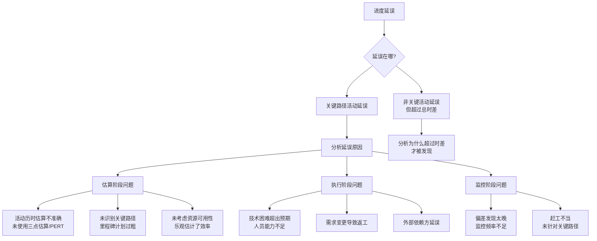
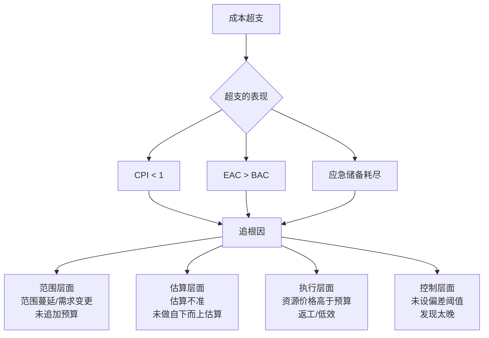
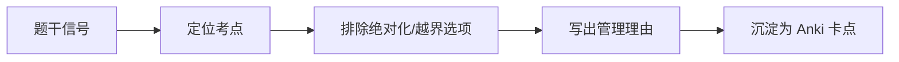

# T-CASE-002｜进度延误与成本超支案例专项模板

> 本专题与 T-CASE-001（通用案例方法）配合使用。提供进度延误和成本超支两类高频案例的**专项诊断模板**，解决"知道该写什么框架，但具体到进度/成本案例时不知道从哪些角度展开"的问题。

---

## 进度延误案例模板

### 诊断框架

### 措施模板

| 问法 | 回答框架 | 关键词 |
|---|---|---|
| 如何追赶进度 | 识别关键路径→赶工/快速跟进→评估对成本质量的影响→更新计划 | 关键路径、成本斜率、返工风险 |
| 如何防止再延误 | 三点估算替代单点估算→建立偏差预警→周期性进度审查 | PERT、预警阈值、控制 |
| 团队效率不足 | 培训/技术支援→调整任务分配→考虑人员替换或增援 | 技能匹配、沟通成本 |

---

## 成本超支案例模板

### 诊断框架

成本超支的根因很少是"花钱太多"——通常它连着一串项目管理问题：

### 措施模板

| 问法 | 回答框架 |
|---|---|
| 控制成本 | 立即停止范围蔓延→严格变更控制→分析CV/CPI根因→针对性控制 |
| 预测最终成本 | 计算EAC（典型/非典型）→沟通干系人→如超预算需走变更 |
| 防止再超支 | 改进估算方法→设偏差阈值→周期性挣值分析→加强范围控制 |

---

## 典型题目训练

> **进度案例｜盲目赶工**
>
> 某项目计划8个月完成。第5个月末只完成了原计划第3个月末的工作。项目经理要求全体成员每周加班20小时。2周后，团队疲劳导致bug增多，进度改善不明显。

**诊断**：① 未识别关键路径→赶工缺乏针对性；② 加班幅度过大→引入质量问题和疲劳→二次风险；③ 进度监控严重滞后（偏差2个月才行动）。

**措施**：① 识别关键路径和时差，定位真正延误的活动；② 评估赶工可行性（优先关键路径活动→评估新增成本→评估人员负荷）；③ 考虑快速跟进（审视选择性依赖关系→识别可并行的活动）；④ 评估是否需追加工期变更请求；⑤ 监控赶工期间的质量绩效。

**易漏点**：只写"赶工"不写"识别关键路径"，不写"评估赶工的成本和质量影响"。

---

> **成本案例｜EVM诊断**
>
> 项目BAC=500万。第4月末：PV=200万，EV=160万，AC=220万。项目经理认为"花得多因为做得快"，实际进度提前。

**诊断**：SV=EV−PV=160−200=−40万（进度滞后），CV=EV−AC=160−220=−60万（成本严重超支），SPI=0.8，CPI≈0.73。"花得多因为做得快"→判断完全错误——实际上是花得比别人多但做得比别人少。

**措施**：① 采用EVM方法客观评估绩效而非主观感觉；② CPI=0.73，如按当前绩效继续，EAC=500/0.73≈685万→需立即进行根因分析；③ 检查是否存在范围蔓延→加强变更控制；④ 评估剩余工作资源效率→可能的资源替换或方法改进。

**易漏点**：主观判断替代数据、不预测EAC、不追根因。

---

## 本轮真题覆盖增强：进度成本案例数据化

本节把 `questions.full.clean.md` 与既有真题映射中的高频考法反查回本专题。2019 下午试题三、四分别给出进度拖期和 EVM 数据，是本专题的核心案例来源。 学习时不要只背定义，要能从题干信号判断它在考哪一个管理动作或技术边界。

这类题的识别链路可以这样看：

图里的重点是“先定位，再排错”。软考选择题常用绝对化说法、角色越权、流程跳步来制造干扰；下午案例题则把同一个错误包装成多句背景，需要把事实翻译回管理过程。

> **例题｜进度成本案例数据化（真题型改编训练题）**
>
> 项目经理只根据 AC 大于 PV 就判断“成本超支且进度落后”。这个判断的问题是：
>
> A. 没有 EV，无法用 EVM 判断成本和进度绩效  
> B. AC 大于 PV 一定表示进度提前  
> C. PV 与 AC 无法出现在同一张表中  
> D. 成本管理不允许使用数字分析

**考查点：** EVM 案例、数据充分性、诊断边界。

**题干关键词：** AC、PV、没有 EV、判断绩效。

**解题过程：** 成本偏差 CV=EV-AC，进度偏差 SV=EV-PV。没有 EV，就不知道完成了多少价值。

**正确答案：** A。

**错项分析：**

- B 把花钱多误认为做得快。
- C 三值可以同表出现。
- D EVM 正是数字化控制方法。

**举一反三：** 下午成本题要先算三值，再算四指标，最后用“成本超支/节约、进度落后/提前”写文字结论。

**可制卡点：** EVM 案例答题步骤；赶工先看关键路径；加新人为什么可能拖慢项目。

## 这个专题应该怎样转化为 Anki 卡片

**模板卡**：进度延误诊断框架卡、成本超支根因分层卡（范围→估算→执行→控制）。

**陷阱卡**："赶工=全体加班"→错，赶工需先识别关键路径；"花得多=做得快"→错，需要用EVM数据判断。

---

## 本专题的最小掌握标准

面对进度延误案例：能按"识别关键路径→分析延误原因（估算/执行/监控层）→针对性赶工/快速跟进→评估连锁影响"的路径分条答题。面对成本超支案例：能计算CV/CPI→判断偏差方向→按"范围/估算/执行/控制"分层分析根因→预测EAC→提措施。

---

## 待核验与后续改进

- 案例题的具体分值分配可能与本专题假设有差异，实际考试以真题为准。[待核验]
