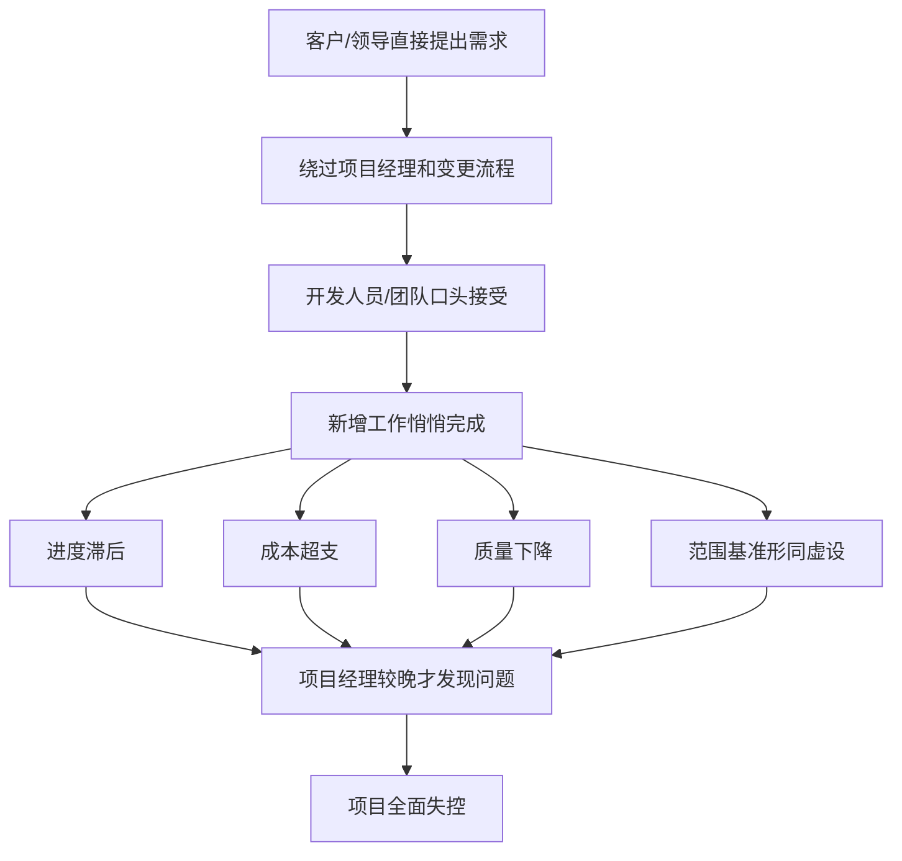
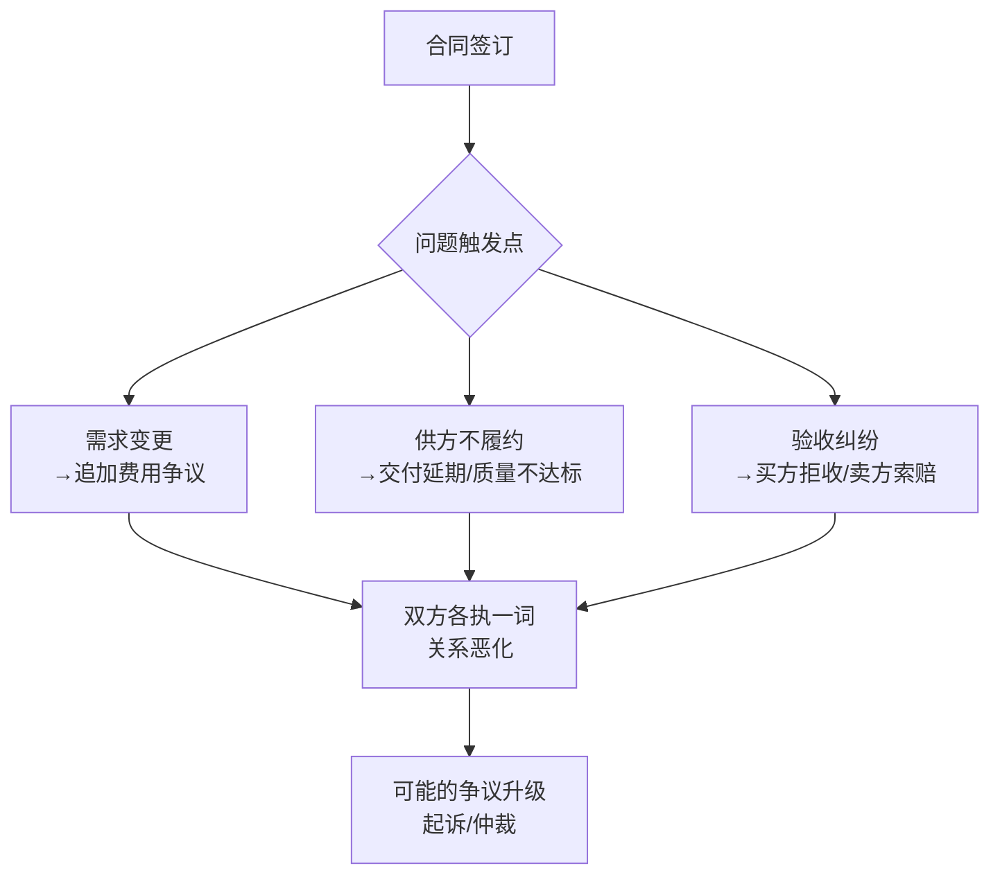

# T-CASE-003｜范围蔓延、变更失控与合同纠纷案例模板

> 本专题与 T-CASE-001 和 T-CASE-002 配合使用。提供范围蔓延/变更失控和合同纠纷/索赔两类案例的**专项诊断模板**。

---

## 范围蔓延与变更失控案例模板

### 典型剧情模式

范围蔓延和变更失控的案例题有高度可识别的"标准剧情"：

### 变体识别

| 剧情变体 | 关键信号词 |
|---|---|
| 客户绕路型 | "客户直接联系开发人员"、"口头要求"、"为了维护客户关系" |
| 领导越权型 | "领导直接要求"、"高层打招呼"、"没走流程" |
| 团队擅自型 | "团队自己决定"、"觉得应该加上"、"没通知PM" |
| 渐进蔓延型 | "每次加一点"、"需求不知不觉就变多了"、"回头看才发现" |

### 答题框架（答题得分点）

**找问题**：① 变更控制流程缺失/形同虚设；② 范围基准未被维护；③ 干系人/客户绕过项目经理；④ PM监控频率不足；⑤ 团队缺乏变更管理意识。

**分析原因**：① 项目启动时未建立有效的变更控制流程；② 未与客户/干系人就变更路径达成共识（谁可以发起变更、通过什么渠道）；③ WBS 不全/不清晰→范围边界模糊→蔓延容易发生；④ PM未能及时收集工作绩效信息。

**提措施**：① 立即暂停所有未审批的变更工作→逐项评估影响→补走正式变更流程（CCB审批）→更新基准→通知干系人；② 与客户建立变更管理的单一接口（统一通过PM提交）；③ 对团队进行变更管理意识培训；④ 缩短监控周期。

---

## 合同纠纷与采购案例模板

### 典型剧情模式

### 诊断框架

**合同类型判断是最先要做的**——很多合同纠纷的根源是合同类型与项目特性不匹配：

- 固定总价 + 频繁变更 = 争议黑洞。卖方承担变更成本不合理，买方以为"固定价格 = 所有变更都包含在内"。
- 成本补偿 + 弱管控 = 成本失控。买方对卖方花销几乎无限兜底。

**合同纠纷答题模板**：

| 问题类型 | 诊断要点 | 措施方向 |
|---|---|---|
| 合同类型不当 | 需求频繁变更但用了固定总价 | 评估是否应转工料合同、补签变更协议 |
| 变更管理缺失 | 需求变了但无合同变更流程 | 建立合同变更控制→评估变更→签补充协议 |
| 供方选择不当 | 技术能力不足、低价中标 | 评估是否需换供方（考虑中断成本） |
| 验收标准不明 | 合同未明确验收标准 | 补充验收标准→记录问题清单→修复后重新验收 |
| 索赔管理缺失 | 发生损失但没有走索赔流程 | 收集证据→按合同条款提出索赔→协商→调解→仲裁 |

---

## 典型题目训练

> **变更失控案例**
>
> 某项目开发过半时，甲方信息中心主任多次直接找开发人员增加报表功能。开发人员为维护客户关系口头答应了。项目经理在周例会上才发现范围严重超限，进度滞后2个月，团队因额外加班出现离职倾向。

**即时诊断**：变更失控典型剧情（客户绕路型）+团队影响。

**答题要点**：
- 问题：① 变更无正式流程—客户绕过PM直接对接开发方；② 范围蔓延—新增功能未评估、未审批、未更新基准；③ PM监控失效—例会才暴露说明信息收集滞后；④ 团队风险—额外加班导致离职倾向。
- 措施：① 立即暂停新增功能开发，评估已增部分对范围/进度/成本/质量的影响，补走变更流程；② 与客户建立单一变更接口（所有变更→PM→评估→CCB审批）；③ 与团队沟通当前情况和后续计划，缓解焦虑情绪；④ 重新评估进度，针对性采取补救措施；⑤ 如有必要走整体变更控制更新基准。

---

> **合同纠纷案例**
>
> 某公司以固定总价合同将测试工作外包给第三方。执行中需求发生4次变更，第三方要求追加费用。买方PM认为"固定总价意味着不管怎么变都不加钱"。第三方暂停工作，买方准备起诉。

**即时诊断**：合同类型认知错误 + 变更管理缺失 + 争议解决路径跳跃。

**答题要点**：
- 问题：① PM对固定总价合同认知错误—固定总价保障合同范围内工作的价格固定，范围外的变更需另行计价；② 变更管理缺失—需求变更后未走合同变更流程、未签补充协议；③ 争议处理不当—直接跳到起诉，应优先协商或调解。
- 原则：固定总价不是"不管怎么变都包干"，合同范围外的变更需要重新定价→应通过合同变更控制→签署补充协议。

---

## 这个专题应该怎样转化为 Anki 卡片

**模板卡**：范围蔓延四类剧情模板（客户绕路/领导越权/团队擅自/渐进蔓延）及其标准诊断-措施链。合同纠纷的合同类型判断优先原则。

**陷阱卡**："固定总价=卖方承担一切变更成本"→错；"变更管理流程=填个表"→错；"合同纠纷=直接起诉"→错（应有协商→调解→仲裁→诉讼的递进路径）。

---

## 本专题的最小掌握标准

面对范围蔓延/变更失控案例：能识别剧情模式→按标准诊断清单输出问题→给出"暂停→评估→补流程→更新→沟通"的措施链。面对合同纠纷案例：能先判断合同类型是否匹配→分析变更管理是否缺失→给出争议解决的递进路径。

---

## 待核验与后续改进

- 合同纠纷处理中协商/调解/仲裁/诉讼的具体程序性规定需对照相关法规核实。[待核验]
