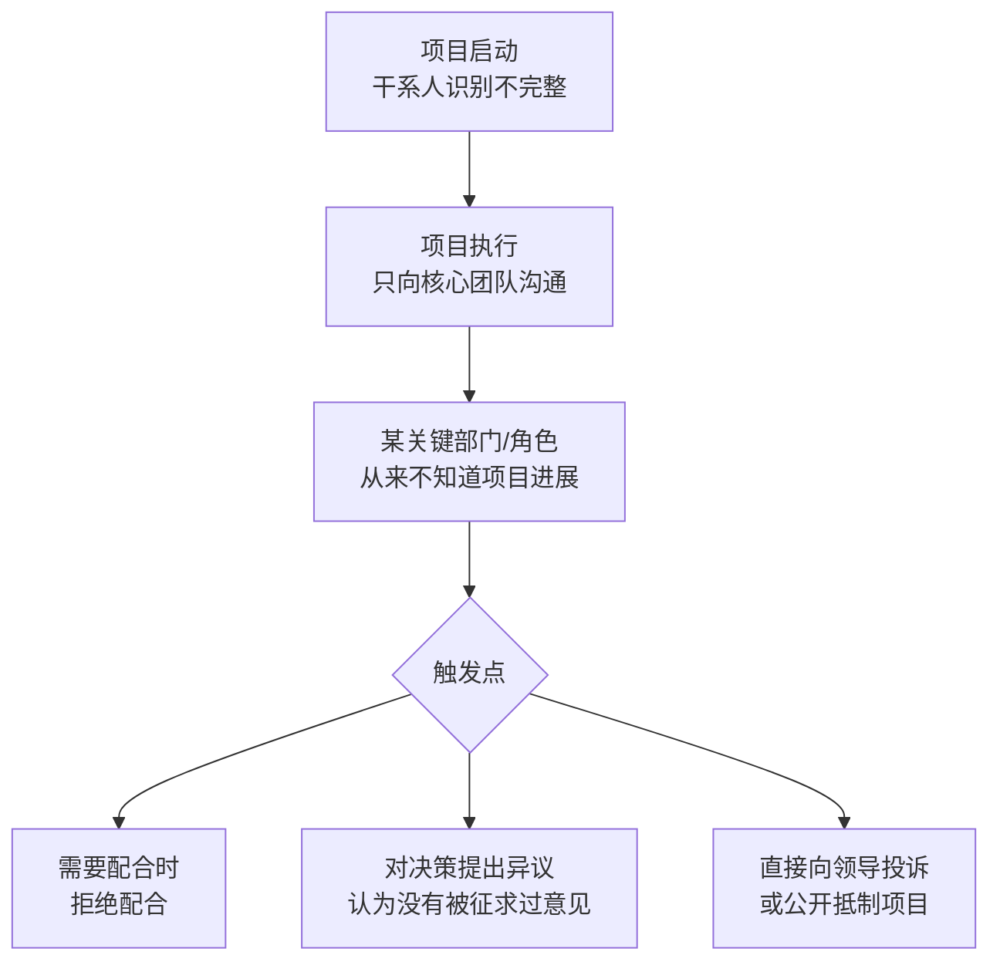
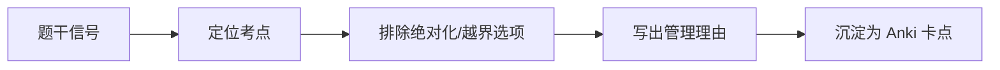

# T-COM-002｜沟通管理与干系人冲突案例模板

> 本专题与 T-CASE-001 和 T-COM-001 配合使用。提供"沟通不畅与干系人冲突"这一高频下午案例场景的**专项诊断模板和答题框架**。核心问题是：**为什么项目进展好好的，突然有人跳出来说"不知道"、"不同意"、"不配合"？怎么在案例题中组织一个从"诊断"到"修复"的完整答案？**

---

## 典型剧情模式

---

## 诊断框架（三问法）

**问 1：干系人识别完整吗？**
- 是否只识别了"直接参与项目的核心团队"而漏了"受项目影响的部门/角色"？
- IT 运维、客服、市场、法务、合规——这些人受项目影响吗？识别了吗？

**问 2：沟通管理计划到位吗？**
- 每个干系人需要什么信息？什么频率？什么方式？
- "把会议纪要发给参会的人"是不是沟通计划？不是——这叫"方便的沟通"，不叫"有计划的沟通"。

**问 3：反馈确认机制有吗？**
- 发了信息 ≠ 对方看了 ≠ 对方理解了
- 有没有收到反馈？有没有确认理解？

---

## 答题框架

| 步骤 | 内容 |
|---|---|
| **找问题** | ① 干系人识别不完整——漏掉受项目影响的关键方 ② 沟通管理计划缺失或范围过窄 ③ 缺乏反馈确认机制 ④ 干系人参与度评估缺失 |
| **分析原因** | 项目启动阶段投入在干系人识别和沟通规划上的精力不足，只看"谁在项目组里"，没看"谁受项目影响" |
| **提措施** | ① 补充识别干系人→更新干系人登记册 ② 用参与度评估矩阵标出 C（当前）和 D（期望）的差距 ③ 制定针对每类干系人的沟通策略 ④ 建立反馈确认机制—在关键里程碑前主动沟通 ⑤ 对抵制型干系人制定专门的参与策略 |
| **预防** | 将干系人识别和沟通计划作为项目启动的必做动作，而非可选项 |

---

## 案例训练片段

> **训练的片段｜突然的抵制**
>
> 某集团 ERP 项目已实施 8 个月。在准备上线时，财务部突然拒绝配合数据迁移，理由"我们不知道你们什么时候要上线，我们这个月财务结账不能动系统"。同时，IT 运维团队表示"从来不知道项目要求的安全规范，你们开发的系统不符合我们的安全基线，不能上线"。

**问题识别**：① 干系人识别不全——财务部和 IT 运维团队在上线前才暴露"不知道"；② 沟通管理严重缺失——8 个月的项目从未与财务确认上线窗口、从未与运维对齐安全基线；③ 参与度评估缺失——这两方一直处于"不知晓"状态。

**措施**：① 立即补干系人登记册（财务部/运维团队）；② 分析参与度差距（当前=不知晓，期望=支持）；③ 制定针对性沟通计划：对财务部→明确上线窗口和可能影响，提前 2 个月沟通；对运维团队→提交安全方案评审并获得书面确认；④ 建立关键里程碑前的外部干系人沟通日历。

**易漏点**：不要只说"沟通不足"，要具体到"对谁、什么时候、以什么方式、沟通什么内容"。
**可制卡点**：沟通干系人案例三问诊断法卡。

---

## 本轮真题覆盖增强：干系人冲突案例

本节把 `questions.full.clean.md` 与既有真题映射中的高频考法反查回本专题。2019 范围案例里客户主管长期缺席、翻译传递失真，是沟通与干系人管理的典型证据。 学习时不要只背定义，要能从题干信号判断它在考哪一个管理动作或技术边界。

这类题的识别链路可以这样看：

图里的重点是“先定位，再排错”。软考选择题常用绝对化说法、角色越权、流程跳步来制造干扰；下午案例题则把同一个错误包装成多句背景，需要把事实翻译回管理过程。

> **例题｜干系人冲突案例（真题型改编训练题）**
>
> 项目中只有翻译人员与项目组持续沟通，真正的业务主管长期未参与评审，最终对成果不认可。首要改进措施是：
>
> A. 只要求翻译人员承担全部责任  
> B. 重新识别关键干系人，建立定期评审和书面确认机制  
> C. 取消所有会议以提高效率  
> D. 不再记录会议纪要

**考查点：** 干系人识别、沟通确认、冲突预防。

**题干关键词：** 业务主管、长期未参与、不认可、确认机制。

**解题过程：** 业务主管是关键干系人，不能用翻译或中间人完全替代；应建立直接评审、纪要和签字确认。

**正确答案：** B。

**错项分析：**

- A 是追责思路，不是项目管理措施。
- C 会放大信息不同步。
- D 会丢失争议证据。

**举一反三：** 沟通案例里“没人知道、没确认、不参与、不满意”通常同时指向沟通计划和干系人参与管理。

**可制卡点：** 关键干系人识别；沟通确认机制；会议纪要的证据价值。

## 这个专题应该怎样转化为 Anki 卡片

**框架卡**：沟通干系人案例三问法。**模式卡**："不知道→不配合→冲突"的标准剧情链。**措施卡**：干系人识别→参与度评估→沟通计划→反馈确认的完整闭环。

---

## 本专题的最小掌握标准

面对沟通/干系人冲突案例：能按三问法诊断→输出从"识别"到"反馈"的完整措施链→每条措施具体到对象/方式/频率。

---

## 待核验与后续改进

- 干系人参与度五级分类的教材术语需对照。[待核验]
