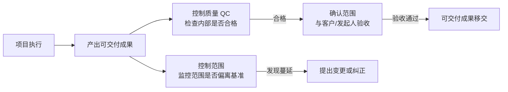

# T-CROSS-001｜高频跨域概念辨析与易错点

> 本专题用于集中辨析系统集成项目管理工程师考试中**最容易在选择题和案例题中被混淆的高频概念对**。这些概念对跨域出现，如果你只背了各自独立的定义，不知道它们在真题中怎么被"调换着问"，就很容易失分。本专题的核心问题是：**考试中最容易把哪两个概念调换说法、张冠李戴，怎样练出"一读题就能识别调换"的判断力？**

---

## 先看这个专题的主线

以下概念辨析按考试频率排列。每个辨析都包含：概念核心、关键区别、常考调换方式、一句话判断口诀。

---

## 辨析 1：项目章程 vs 项目管理计划

> **[高 频]** 选择题和案例题中最高频的调换对。

| 维度 | 项目章程 | 项目管理计划 |
|---|---|---|
| 谁发布 | 发起人（或项目以外的高层） | 项目经理领导制定，团队参与 |
| 主要作用 | 正式批准项目存在，授权项目经理动用资源 | 说明项目将如何执行、监督和控制 |
| 内容层级 | 高层级：项目目标、总体范围、里程碑、关键干系人 | 详细：各子管理计划 + 三大基准（范围/进度/成本） |
| 生成时间 | 项目最早，启动过程组 | 规划过程组，章程之后 |
| 是否可轻易修改 | 通常不轻易修改，重大变化需发起人批准 | 可通过变更控制流程修改 |

> **[陷阱提示]** 题目如果说"项目经理批准了项目章程"——错，章程由发起人批准或发布。题目如果说"项目管理计划由发起人编写"——错，由项目经理领导团队编写。

**一句话判断**：章程 = 出生证（授权项目存在），管理计划 = 操作手册（怎么做项目）。

---

## 辨析 2：确认范围 vs 控制质量 vs 控制范围

> **[高 频]** 三者都属于监控过程组，极易混淆。

**控制质量（QC）**：面向内部，检查可交付成果是否满足质量要求。主要是项目团队做的事——测试、检查、测量。

**确认范围**：面向外部（客户/发起人），由客户/发起人正式验收可交付成果。关注的是"交付物是否是约定要做的"（范围正确性），而不是"交付物有没有缺陷"（质量正确性）。

**控制范围**：不是验收，而是持续监控范围基准是否被遵守。如果发现有人在没有变更审批的情况下增加或遗漏工作，就是控制范围要处理的问题。

> **[陷阱提示]** 题目说"项目经理组织团队检查可交付成果是否满足质量标准"→ 控制质量（QC），不是确认范围。题目说"邀请客户来验收项目成果"→ 确认范围。题目说"发现项目做了范围外的工作"→ 控制范围。

**一句话判断**：QC = 内部检查"好不好"，确认范围 = 客户验收"对不对"，控制范围 = 监控"有没有多干或少干"。

---

## 辨析 3：质量保证（QA）vs 质量控制（QC）

> **[高 频]** 参见 T-QUAL-001 专题的详细讲解。

**QA（质量保证）**：关注过程是否可靠。手段：质量审计、过程分析。所属过程组：执行。

**QC（质量控制）**：关注结果是否合格。手段：测量、测试、检查。所属过程组：监控。

> **[陷阱提示]** 题目说"质量审计发现流程不符合标准"→ QA 活动，不是 QC。

**一句话判断**：QA 问"做法对不对"，QC 问"东西好不好"。

---

## 辨析 4：赶工 vs 快速跟进 vs 资源平衡

> **[高 频]** 参见 T007 专题的详细讲解。

| 方法 | 核心动作 | 主要代价 | 关键词 |
|---|---|---|---|
| **赶工** | 增加资源/加班 | 成本增加 | "加人""加班""加资源""增加投入" |
| **快速跟进** | 活动并行/重叠 | 风险增加、返工 | "并行""重叠""同时做""未完成就提前开始" |
| **资源平衡** | 调整活动时间以适应资源限制 | 工期可能延长 | "资源冲突""资源过度分配""同一资源被多用" |

**一句话判断**：赶工 = 加资源，快速跟进 = 改逻辑（并行），资源平衡 = 迁就资源（可能延长工期）。

---

## 辨析 5：配置管理 vs 变更管理

> **[高 频]** 参见 T-INT-004 专题的详细讲解。

**配置管理**：关注交付物和文档的"身份"和"状态"。包括配置项识别、基线建立、版本控制、配置状态报告、配置审计。

**变更管理**：关注"是否允许改变"。包括变更请求、影响分析、CCB 审批、变更实施、结果验证、文件更新。

> **[陷阱提示]** "版本控制和基线建立"→ 配置管理（不是变更管理）。"提交变更请求给 CCB 审批"→ 变更管理。

**一句话判断**：配置管"是什么、什么状态"，变更管"改不改、怎么批"。

---

## 辨析 6：纠正措施 vs 预防措施 vs 缺陷补救

> **[中 频]** 参见 T-INT-004 专题的变更请求分类。

- **纠正措施**：使项目绩效和计划重新一致（事后纠偏，针对过程）
- **预防措施**：确保未来绩效符合计划（事前预防，针对过程）
- **缺陷补救**：修复不符合要求的产品组件（针对产品）

**一句话判断**：纠正 = "偏了拉回来"，预防 = "还没偏先堵住"，缺陷补救 = "产品坏了修好"。

---

## 辨析 7：风险登记册 vs 问题日志

- **风险登记册**：记录的是未来的、可能发生但尚未发生的事件（风险 = 不确定性）。
- **问题日志**：记录的是已经发生的、正在影响项目的事件（问题 = 已发生的风险或新出现的确定性问题）。

> **[陷阱提示]** 如果一个风险"已经发生"了，它应该从风险登记册转移到问题日志。如果题目说"某个风险已经发生，项目经理仍只在风险登记册中更新"——这是不够的，应该同时更新问题日志。

---

## 辨析 8：管理收尾 vs 合同收尾

- **管理收尾（行政收尾）**：项目或阶段结束时的全面收尾活动。包括验收可交付成果、总结经验教训、归档项目文件、释放资源。
- **合同收尾**：仅针对合同的收尾活动。包括确认合同条款已满足、完成合同结算、更新合同记录。

> **[陷阱提示]** 合同收尾发生在管理收尾之前。每个合同都要单独做合同收尾，但管理收尾只做一次（除非多阶段）。

---

## 辨析 9：工作绩效数据 vs 工作绩效信息 vs 工作绩效报告

> **[中 频]**

- **工作绩效数据（Data）**：原始观察和测量值，未经加工。如"本周完成了 3 个功能模块的编码"。
- **工作绩效信息（Information）**：对绩效数据进行加工分析后的结果，与计划做比较。如"根据挣值分析，SV = −8 万元，进度滞后"。
- **工作绩效报告（Report）**：将工作绩效信息汇编成正式的、面向干系人的报告。如"项目月度绩效报告"。

**一句话判断**：数据 = 原始读数，信息 = 比较分析结果，报告 = 正式文档。

---

## 典型题详解

> **例题 1｜章程 vs 管理计划**
>
> 以下哪项是项目章程的内容？
>
> A. 详细的 WBS
> B. 成本绩效基准
> C. 任命项目经理并授权
> D. 风险应对计划

A、B、D 都属于项目管理计划的内容（或子组件）。C 是章程的核心内容之一——批准项目存在并授权项目经理。正确答案是 **C**。

---

> **例题 2｜确认范围 vs 质量控制**
>
> 项目团队完成了所有模块的集成测试，测试报告显示所有功能正常。项目经理接下来应该：
>
> A. 直接交付客户使用
> B. 组织正式的范围确认，邀请客户验收
> C. 再进行一轮控制质量检查
> D. 更新风险登记册

测试通过（QC 完成）后，应该进行确认范围——邀请客户/发起人正式验收。正确答案是 **B**。

---

> **例题 3｜管理收尾 vs 合同收尾的顺序**
>
> 项目进入收尾阶段，以下哪个顺序是正确的？
>
> A. 管理收尾 → 合同收尾
> B. 合同收尾 → 管理收尾
> C. 两者同时进行
> D. 由项目规模决定顺序

合同收尾（结算每个合同）在先，管理收尾（全面关闭项目）在后。先结清每个合同，再关闭整个项目。正确答案是 **B**。

---

> **例题 4｜风险 vs 问题**
>
> 某已识别风险的概率在持续升高，但尚未发生。该项目经理在风险登记册中更新了概率评分，提高了应急储备额度。这种做法：
>
> A. 错误，风险一旦变化就应该移到问题日志
> B. 正确，风险尚未发生，应继续在风险登记册中跟踪
> C. 错误，应该直接进入风险应对
> D. 正确，但不需要调整应急储备

风险尚未发生，只是在变化（概率升高），应该继续在风险登记册中跟踪和更新。同时调整应急储备是合理的。正确答案是 **B**。

---

## 这个专题应该怎样转化为 Anki 卡片

本专题天然适合做**辨析卡**和**陷阱卡**。

**辨析卡**要设计成"双向"的：正面给一个概念描述，背面答它对应哪个概念（而不是另一个易混淆概念）。例如："项目经理组织团队检查可交付成果是否满足技术规格——这是确认范围还是控制质量？"

**陷阱卡**记录最常见的"调换出题方式"。例如："题目说'项目经理批准了项目章程'——对吗？"答："不对，章程由发起人批准。"

每对辨析建议做 2-3 张卡：一张正面的定义区分卡，一张场景判断卡，一张陷阱识别卡。

---

## 本专题的最小掌握标准

学完本专题后，你至少应该能做到三件事。

第一，对以上 9 对高频易混概念，能不看笔记说出每对概念的核心区别和一句话判断口诀。第二，在选择题中，能一眼识别"把 A 的说法安在 B 头上"的典型陷阱。第三，在案例题中，不会把"确认范围"写成"质量控制"，不会把"变更管理"写成"配置管理"，不会把"纠正措施"写成"预防措施"。

---

## 待核验与后续改进

- 建议结合自己的错题记录，在本专题基础上扩展个性化的易混卡片。
- 部分辨析的教材术语可能与 PMBOK 有细微差异，考前以教材为准。[待核验]
