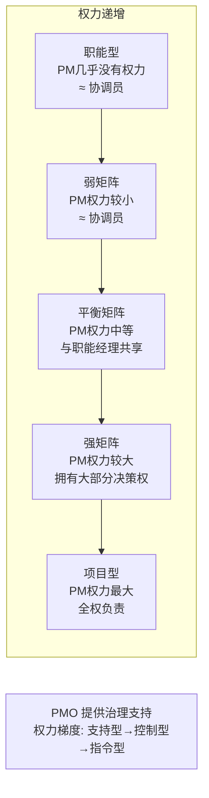

# T-ORG-001｜组织结构、项目经理权限与 PMO

> 本专题用于系统辨析"项目管理基础"中三个高度耦合、考试中常被交叉考查的概念：**组织结构类型（职能型/项目型/矩阵型）、项目经理在各结构中的权限差异、项目管理办公室（PMO）的三种类型和职能**。核心问题是：**组织凭什么把项目交给项目经理管？项目经理有多大权力？PMO 在组织和项目之间扮演什么角色？**

---

## 先看这个专题的主线

组织结构和项目经理权限是一组"连续体"——从职能型（项目经理几乎无权力）到项目型（项目经理权力最大），矩阵型在中间，又分弱矩阵/平衡矩阵/强矩阵。考试核心不是背诵定义，而是**判断一个组织场景中，项目经理处于什么权力位置、应该怎么管理。**

---

## 三种基本组织结构

| 类型 | 项目经理权力 | 资源归属 | 适用场景 | 典型特征 |
|---|---|---|---|---|
| **职能型** | 几乎没有 | 各职能部门 | 日常运营为主的组织 | PM 只是"喊人帮忙" |
| **项目型** | 高，全权负责 | 项目团队独占 | 以项目为主业的组织 | 项目结束团队解散 |
| **矩阵型** | 弱/中/强，共享 | 职能经理控制(弱)到PM控制(强) | 同时有运营和项目 | 双重汇报关系 |

---

## 矩阵型的进一步细分

> **[辨析｜弱矩阵 vs 平衡矩阵 vs 强矩阵]**
>
> - **弱矩阵**：职能经理掌握大部分权力。PM 更像是**项目协调员**而非真正的经理，主要做沟通协调和文档管理。
> - **平衡矩阵**：PM 和职能经理共享权力。PM 负责项目决策，职能经理负责人员管理和技术决策。双重汇报关系更明显。
> - **强矩阵**：PM 掌握大部分权力。通常有专门的项目管理部门（可能发展为 PMO），项目经理对项目预算、资源、进度负主要责任。

> **[考试关键词]** "项目经理权力很小，主要负责沟通协调"→ 弱矩阵。"项目经理和部门经理共同决策"→ 平衡矩阵。"项目经理全权负责项目"→ 项目型或强矩阵（视上下文而定）。

---

## PMO 的三种类型

> **[概念组｜PMO 的三级授权]**
>
> 1. **支持型 PMO（Supportive）**：项目顾问角色——提供模板、培训、最佳实践、经验教训库。**控制程度最低**，不对项目做直接管控。
> 2. **控制型 PMO（Controlling）**：项目管理合规角色——要求项目必须使用特定方法、模板和工具，项目必须遵循一定的治理框架。比支持型更进一步。
> 3. **指令型 PMO（Directive）**：直接管理项目——PMO 派出项目经理直接管理项目。**控制程度最高。**

> **[辨析｜PMO vs 项目经理]** PMO 管理的是**所有项目的方法论、标准、治理**和**跨项目的资源协调**——它是组织级的。项目经理管理的是**单个具体项目**的日常执行——它是项目级的。

---

## 典型题详解与举一反三

> **例题 1｜组织结构判断**
>
> 某公司中，开发人员属于开发部，测试人员属于测试部。项目启动后，项目经理需要向两个部门的经理"借人"，且项目经理无法直接决定项目的预算和人员调配。这种组织结构最接近于：
> A. 项目型
> B. 强矩阵
> C. 弱矩阵或职能型
> D. 平衡矩阵

"需要借人"、"无法直接决定预算和人员调配"→ PM 权力很小→ 弱矩阵或职能型。正确答案是 **C**（两者都可能：职能型中 PM 更无权力，弱矩阵中 PM 是协调员）。

**可制卡点：** 组织结构类型的关键词判断卡。

---

> **例题 2｜PMO 类型**
>
> 某组织的 PMO 向项目经理提供标准化的项目模板和风险管理框架，但不强制要求使用，也不参与项目的直接管理。该 PMO 属于哪类？
> A. 支持型  B. 控制型  C. 指令型  D. 管理型

"提供模板但不强制、不直接管理"→ **支持型**。正确答案是 **A**。如果它要求"必须用"→ 控制型。

**可制卡点：** PMO 三级分类判断卡。

---

> **例题 3｜矩阵型中的双重汇报**
>
> 某项目采用平衡矩阵结构。开发人员的技术方案评审由开发部经理负责，但项目进度和日常任务安排由项目经理决定。如果开发部经理和项目经理的意见冲突，开发人员最可能面临的问题是：
> A. 工作量不足
> B. 双重汇报导致指令冲突
> C. 工资调整
> D. 没有影响

双重汇报→"两个领导意见不一致时听谁的？"→指令冲突。正确答案是 **B**。

**可制卡点：** 矩阵型双重汇报关系卡。

---

> **例题 4｜项目管理办公室的核心职能**
>
> PMO 最核心的职能定位是：
> A. 替代项目经理管理单个项目
> B. 负责项目团队的绩效考核
> C. 在组织层面管理项目的标准、方法论和治理
> D. 只负责项目的财务审计

正确答案是 **C**。PMO 是组织级的项目管理治理机构，不是单个项目的替代管理者（除非是指令型 PMO 直接派 PM）。

**可制卡点：** PMO 核心职能 vs 项目经理职责辨析卡。

---

> **例题 5｜组织结构对项目的影响**
>
> 一个大型系统集成项目，需要从多个技术部门抽调专家，且客户对进度要求非常严格。从项目经理的角度，最适合的组织结构是：
> A. 职能型
> B. 弱矩阵
> C. 强矩阵或项目型
> D. 任何结构都一样

需要抽多人、进度严格 → PM 需要较强的资源调配权和决策权 → 强矩阵或项目型最好。正确答案是 **C**。

**可制卡点：** 项目特征 vs 组织结构的匹配卡。

---

## 这个专题应该怎样转化为 Anki 卡片

**概念卡**：职能型/项目型/矩阵型（弱/平衡/强）每种结构的关键特征、项目经理权力大小。

**辨析卡**：职能型 vs 弱矩阵、支持型 PMO vs 控制型 PMO、PMO vs 项目经理。

**场景判断卡**：描述一个组织场景→判断结构类型或 PMO 类型。

**陷阱卡**："所有矩阵型的项目经理权力都一样"→ 错，弱/平衡/强矩阵权力递进。

---

## 本专题的最小掌握标准

至少能做到：① 按项目经理权力从小到大排列组织结构（职能→弱矩阵→平衡→强矩阵→项目型）；② 区分 PMO 三种类型；③ 根据组织场景判断项目经理面临的权力边界。

---

## 待核验与后续改进

- 组织结构/PMO 分类术语与软考教程第二版的一致性需回查。[待核验]
