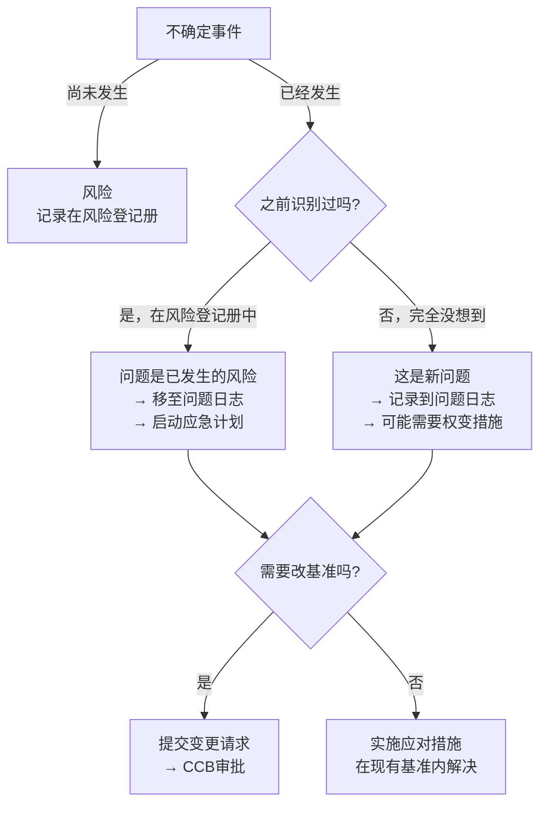

# T-RISK-003｜风险、问题、变更与应急措施的跨域辨析

> 本专题用于厘清考试中四个常被混用的管理概念：**风险 vs 问题 vs 变更请求 vs 应急措施/权变措施**。核心问题是：**项目执行中突然出了状况——这到底是风险发生了（转入问题）、新出现的问题（之前没识别）、还是需要走变更控制？应急措施和权变措施又有什么区别？**

---

## 四个概念的边界

---

## 核心辨析

### 风险 vs 问题

> **风险**：尚未发生，有概率。记录在**风险登记册**中。**问题**：已经发生，是确定性的。记录在**问题日志**中。**风险发生 = 问题**。已发生的风险 → 从风险登记册转移到问题日志。

### 应急措施 vs 权变措施

> **应急措施（Contingency Plan）**：针对**已识别风险**提前制定好的应对方案。风险一发生，立即启动应急措施。**是有准备的应对。**
>
> **权变措施（Workaround）**：针对**未识别风险/未预料到的问题**的临时应对方案。是现场"急中生智"想出来的。**权变措施是"没想到"的临时处理，应急措施是"想到了"的预案。**

### 问题 vs 变更请求

> 出了问题后，如果解决问题需要**修改基准**（范围/进度/成本基准），就必须提交**变更请求**走 CCB 审批。如果不需要改基准（在浮动时间或应急储备内解决），则不需要走变更。

---

## 典型题详解与举一反三

> **例题 1｜风险 vs 问题**
>
> 某已识别风险（概率 40%）在项目执行中实际发生了。项目经理应该：
> A. 从风险登记册中删除该条记录
> B. 在风险登记册中更新状态，并在问题日志中记录该问题
> C. 只更新问题日志
> D. 什么都不做

已发生的风险→更新风险登记册状态+在问题日志中记录。正确答案是 **B**。

**可制卡点：** 风险→问题的状态转换卡。

---

> **例题 2｜应急措施 vs 权变措施**
>
> 项目经理提前预见到"核心开发人员可能离职"，所以储备了 2 名后备人员并做好交接预案。核心人员真的离职了，项目经理启动了交接预案。这属于：
> A. 权变措施  B. 应急措施  C. 预防措施  D. 缺陷补救

"提前预见到并制定好了预案"→风险是已识别的，预案是应急措施。正确答案是 **B**。

**可制卡点：** 应急措施（有预案）vs 权变措施（临时想）辨析卡。

---

> **例题 3｜权变措施的场景**
>
> 项目执行中服务器突然被雷击损坏——这个风险之前完全没人想到。团队临时租用了云服务器恢复工作，同时紧急采购新服务器。这个临时租用的做法是：
> A. 应急措施  B. 权变措施  C. 预防措施  D. 赶工

"没人想到"、"临时"→这是权变措施。正确答案是 **B**。没提前识别的风险→没有应急计划→只能临时应对（权变措施）。

**可制卡点：** 权变措施判断卡（未识别风险+临时方案）。

---

> **例题 4｜问题需要走变更吗？**
>
> 问题的解决需要增加预算 20 万元，这超出了原成本基准。项目经理应该：
> A. 直接使用应急储备
> B. 直接使用管理储备
> C. 提交变更请求走 CCB 审批
> D. 拒绝增加预算

超出成本基准→需要变更→提交变更请求走 CCB 审批。正确答案是 **C**。如果增加的 20 万元在应急储备范围内且应急储备可以覆盖→可以动用应急储备（应急储备在成本基准内）。但题干说"超出原成本基准"，说明已经超过应急储备额度→必须走变更。

**可制卡点：** 问题→是否需要变更的判断卡。

---

## 这个专题应该怎样转化为 Anki 卡片

**辨析卡**（核心卡型）：风险 vs 问题、应急措施 vs 权变措施、问题 vs 变更请求。

**流程卡**：已识别风险发生→应急措施→更新风险登记册+问题日志。未识别事件发生→权变措施→记录到问题日志→评估是否需变更。

**陷阱卡**："风险发生了就是问题，不需要再管风险登记册"→错，应在风险登记册中更新状态。

---

## 本专题的最小掌握标准

给任意一个"项目出了状况"的场景→判断：这是风险还是问题、需不需要走变更、应用应急措施还是权变措施。

---

## 待核验与后续改进

- 权变措施/应急措施的教材术语需对照确认。[待核验]
