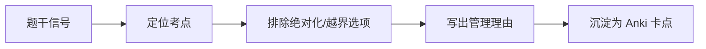
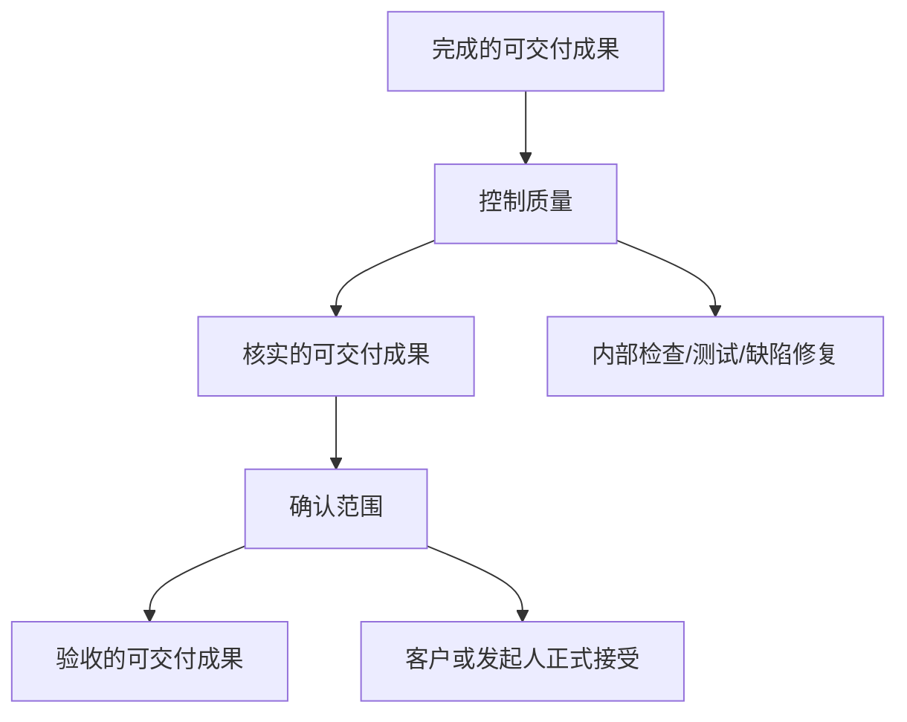

# T-SCOPE-003｜范围确认、质量控制、验收与测试的边界辨析

> 本专题用于集中辨析"确认范围 vs 控制质量 vs 验收 vs 测试"这四个在考试中张冠李戴频率最高的概念组。核心问题：**项目交付一个东西后，接下来要做的事——谁来做、做什么、属于哪个过程组、属于哪个知识域？**

---

## 核心辨析表

| 概念 | 谁做 | 做什么 | 过程组 | 知识域 |
|---|---|---|---|---|
| **控制质量 QC** | 项目团队 | 检查可交付成果是否满足质量标准（测试/检查/测量） | 监控 | 质量管理 |
| **确认范围** | 客户/发起人+项目团队 | 正式验收可交付成果（验收=确认是做对了东西） | 监控 | 范围管理 |
| **最终验收** | 客户/发起人 | 项目整体成果的正式接受 | 收尾 | 整体管理 |
| **测试** | 测试团队/项目团队 | 执行测试用例，验证功能和非功能需求 | QC 手段 | 质量管理 |

---

## 辨析 1：QC vs 确认范围

> **[核心区分]** QC 问的是"东西好不好"（内部技术检查），确认范围问的是"东西对不对"（外部正式验收）。**QC 在先，确认范围在后。** QC 通过了才能拿给客户做确认范围。

> **[考试陷阱]** 题干描述"项目团队检查软件是否满足技术规格"→ QC。题干描述"邀请客户来验收已完成的功能模块"→ 确认范围。把 QC 说成是确认范围，或者反过来——都是典型的错误选项。

---

## 辨析 2：确认范围 vs 最终验收

> **[核心区分]** 确认范围是**过程中**的验收（每个可交付成果完成后都可以做），最终验收是**项目结束时**的总体验收。**多次确认范围 → 一次最终验收。**

---

## 辨析 3：确认范围 vs 控制范围

> **[核心区分]** 确认范围=验收可交付成果。控制范围=监控是否做了范围外的工作。一个是"确认交付的东西对不对"，一个是"盯着不要做多或做少"。

---

## 辨析 4：测试 vs QC

> **[核心区分]** 测试是 QC 的手段之一（不是全部）。QC 还包括检查、测量、抽检、走查等其他手段。

---

## 典型题详解与举一反三

> **例题 1｜QC 还是确认范围？**
>
> 项目团队对已完成的一个功能模块进行了集成测试，确认所有技术指标达标。接下来最应该做什么？
> A. 直接交付给运维团队
> B. 邀请客户进行确认范围（验收）
> C. 再进行一轮回归测试
> D. 直接进入收尾

QC 过了→下一步是确认范围（客户验收）。正确答案是 **B**。

**可制卡点：** QC→确认范围的顺序卡。

---

> **例题 2｜确认范围的位置**
>
> "确认范围"属于哪个过程组？
> A. 规划  B. 执行  C. 监控  D. 收尾

确认范围属于**监控过程组**。正确答案是 **C**。很多人误以为是收尾——区分"确认范围"（过程监控）和"最终验收"（收尾）。

**可制卡点：** 确认范围→监控过程组卡。

---

> **例题 3｜测试与控制质量**
>
> 关于"测试"和"控制质量"的关系，最准确的表述是：
> A. 测试就是控制质量
> B. 测试是控制质量的手段之一
> C. 控制质量是测试的手段之一
> D. 两者没有关系

正确答案是 **B**。QC 的手段包括测试、检查、测量等，测试是其中之一。

**可制卡点：** 测试 vs QC 关系卡。

---

> **例题 4｜确认范围 vs 控制范围**
>
> 项目经理发现团队在未经审批的情况下开发了一个"挺好用"的额外功能。这属于什么过程要处理的问题？
> A. 确认范围
> B. 控制范围
> C. 控制质量
> D. 最终验收

"做了范围外的工作"（虽然好但是多余的）→ **控制范围**（监控范围是否偏离基准）。正确答案是 **B**。

**可制卡点：** 确认范围（验收）vs 控制范围（监控偏离）辨析卡。

---

## 本轮真题覆盖增强：确认范围、验收与测试边界

本节把 `questions.full.clean.md` 与既有真题映射中的高频考法反查回本专题。历年题直接考“范围确认是客户正式验收并接受已完成可交付物”，也是案例题最常见边界。 学习时不要只背定义，要能从题干信号判断它在考哪一个管理动作或技术边界。

这类题的识别链路可以这样看：

图里的重点是“先定位，再排错”。软考选择题常用绝对化说法、角色越权、流程跳步来制造干扰；下午案例题则把同一个错误包装成多句背景，需要把事实翻译回管理过程。

> **例题｜确认范围、验收与测试边界（真题型改编训练题）**
>
> 项目团队完成系统测试并修复缺陷后，客户代表签署验收单。这里“签署验收单”最接近哪个过程？
>
> A. 确认范围  
> B. 控制质量  
> C. 风险识别  
> D. 活动排序

**考查点：** 确认范围、客户验收、控制质量边界。

**题干关键词：** 客户代表、签署验收单、接受可交付物。

**解题过程：** 控制质量关注成果是否符合质量标准；客户正式接受已完成可交付成果，是确认范围。

**正确答案：** A。

**错项分析：**

- B 更接近测试和检查活动。
- C 识别不确定事件。
- D 属于进度管理。

**举一反三：** 题干出现“测试、检查、缺陷”先看 QC；出现“客户、验收、接受、签字”先看确认范围。

**可制卡点：** 确认范围定义；QC vs 验收；核实的可交付成果 vs 验收的可交付成果。

确认范围和控制质量最容易混，可以再用一张边界图压住：

这张图说明：测试通过只是把成果推到“核实的可交付成果”，只有经过客户或发起人的正式接受，才进入“验收的可交付成果”。

## 这个专题应该怎样转化为 Anki 卡片

**辨析卡（核心卡型）**：QC vs 确认范围、确认范围 vs 最终验收、确认范围 vs 控制范围。每张卡正面=场景描述，背面=正确的概念归属。

**流程卡**：执行→QC（内部检查）→确认范围（客户验收）→最终验收（收尾）的完整链路。

**陷阱卡**："确认范围属于收尾过程组"→错（属于监控）。

---

## 本专题的最小掌握标准

给任意一个"对完成工作的检查/验收"场景→立即判断是 QC、确认范围、最终验收还是控制范围。

---

## 待核验与后续改进

- [待核验] 确认范围/控制范围教材术语与 PMBOK 的一致性。
