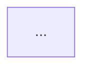
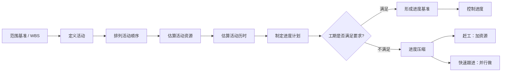
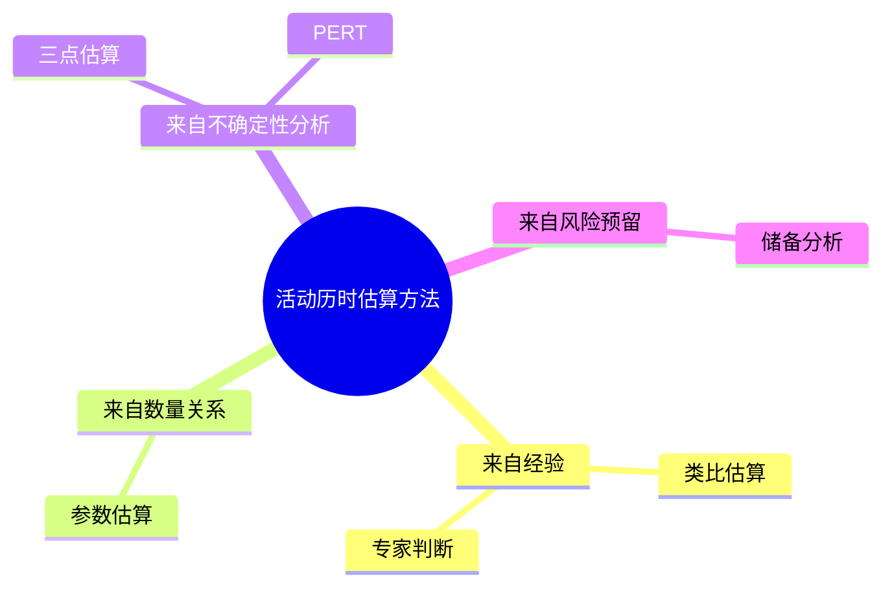
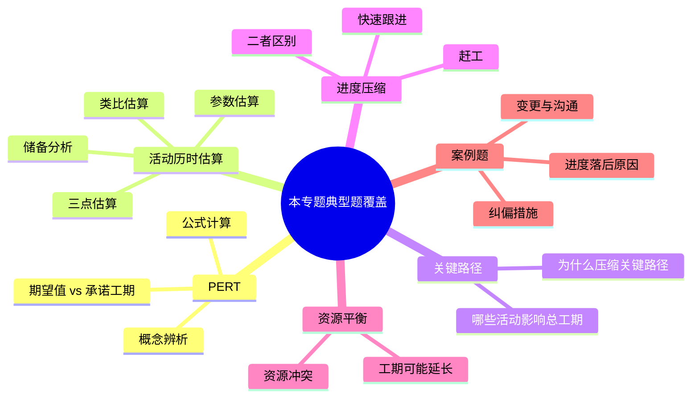

# 软考专题学习包生成规范 Skill v1

> 适用对象：用于让 Codex / Claude Code / 其他 Agent 基于软考“系统集成项目管理工程师”材料，生成高质量专题学习文件。  
> 目标：让每一份专题文件都像一份**信息密度高、讲解充分、结构清晰、带图辅助理解、配套典型题详解、可后续制卡**的专题讲义，而不是资料摘抄、提纲、题库答案或零散笔记。

---

## 一、这个 Skill 要解决的问题

本 Skill 用来生成“专题学习包”。专题学习包处在整个学习工程的中间位置：


它不是最终的 Anki 卡片，也不是原始教材的缩写。它的核心作用是：

**把一个专题讲清楚、讲完整、讲到能做题，并且为后续制卡提供高质量原料。**

因此，生成专题学习包时必须同时满足四个目标：

1. **理解性**：像大学教材或高质量讲义一样解释概念之间的关系，而不是只列定义。
2. **考试性**：围绕软考考点组织内容，知道哪些点会考、怎么考、容易怎么错。
3. **可视化**：围绕核心思想、流程、辨析关系、题型结构绘制图，优先使用图而不是表。
4. **可制卡性**：学习之后能自然导出概念卡、辨析卡、流程卡、公式卡、案例模板卡、错题卡。

---

## 二、输入要求

Agent 生成专题学习包时，最好收到以下输入。缺失时应合理推断，但必须标出不确定处。

```yaml
专题ID: T007
专题名称: PERT、活动历时估算与进度压缩
所属知识域: 项目进度管理
上级专题: 项目管理十大知识域 / 进度管理
前置知识: WBS、活动定义、活动排序、网络图基础
覆盖范围:
  - 活动历时估算
  - PERT 三点估算
  - 关键路径
  - 赶工
  - 快速跟进
  - 资源平衡
  - 进度控制
排除范围:
  - 复杂网络图手工推导的完整训练
  - 挣值管理详细计算
资料来源:
  - 官方教程相关章节
  - 学习笔记相关页
  - 历年真题与题库
  - 用户已有专题划定表
用户偏好:
  - 讲义式连续讲解
  - 信息密度高但不要过度格式化
  - 多用图帮助理解
  - 题目要足够全面，每题要有延伸
  - 制卡建议放在专题末尾，不直接制卡
```

如果只有“专题名称”，也应生成，但要在开头加入：

> **[待核验]** 本专题范围根据专题名称和软考常见考法推断，后续需要与知识树、官方教程和真题材料对齐。

---

## 三、输出文件的总体形态

输出必须是一个 Markdown 文件，文件名建议：

```text
T007_专题学习包_PERT活动历时估算与进度压缩.md
```

文件整体应像一份“可阅读的讲义”，而不是表格清单。推荐长度：

- 小专题：约 5,000～8,000 中文字
- 中等专题：约 8,000～15,000 中文字
- 大专题：约 15,000～25,000 中文字，必要时拆分

不要为了短而牺牲解释。专题学习包的价值在于帮助理解，因此允许比普通复习笔记更长、更细。

---

## 四、必须采用的文风

### 4.1 讲义式、教材式，而不是提纲式

正文应保持连续讲解，像老师带着读者理解这个专题。每一节都要说明：

- 这个概念为什么出现；
- 它解决什么问题；
- 它和前后概念有什么关系；
- 考试为什么喜欢考它；
- 学习者容易在哪里误解。

错误示例：

```markdown
活动历时估算：估算活动时间。
方法：类比估算、参数估算、三点估算、储备分析。
PERT 公式：(O+4M+P)/6。
```

正确风格：

```markdown
活动历时估算之所以重要，是因为项目进度计划并不是直接从 WBS 自动生成的。WBS 告诉我们要做哪些工作，活动定义把工作包进一步拆成可安排的活动，而活动历时估算则回答“每个活动大约要持续多久”。如果这个环节估得过于乐观，后面的进度计划看起来再漂亮，也只是纸面计划。

估算方法可以按“依据从哪里来”来理解：如果依据来自过去类似项目，就是类比估算；如果依据来自工作量、资源数量和生产率之间的数量关系，就是参数估算；如果活动不确定性较高，需要同时考虑乐观、最可能和悲观三种情景，就进入三点估算或 PERT。
```

### 4.2 信息密度要高，但要用解释降低理解难度

信息密度高不是“多塞术语”，而是：每段都提供有效信息，同时用背景、例子、对比、因果关系帮助理解。

每个重要概念至少要讲清：

- **它是什么**；
- **它为什么重要**；
- **它和相邻概念的区别**；
- **它在题目中如何出现**；
- **它可能如何误导考生**。

### 4.3 弱化机械格式，避免视觉噪音

不要大量使用“4.5.1”“一、二、三”“一句话定义：”“常见考法：”“易错点：”这类强模板。标题层级一般控制在两级以内：

```markdown
# T007｜PERT、活动历时估算与进度压缩

## 先抓住这个专题的主线

## 活动历时估算：不是估整个项目，而是估具体活动

## PERT：用三种情景处理不确定性

## 典型题详解与举一反三

## 学完本专题后，应该留下哪些能力
```

如需进一步分割内容，优先使用段落、引用框、加粗关键词，而不是继续增加三级、四级标题。

---

## 五、重点标注规则

### 5.1 关键词必须加粗

以下内容必须加粗：

- 核心概念名称：**PERT**、**关键路径**、**赶工**、**快速跟进**。
- 关键判断：**赶工改变资源投入，快速跟进改变活动逻辑关系**。
- 易错提醒：**这里要注意：资源平衡可能延长工期，不是典型的进度压缩技术。**
- 公式名称：**PERT 期望时间**、**活动历时估算公式**。
- 题解结论：**正确答案是 B**。

错误示例：

```markdown
这里要注意的是资源平衡可能导致工期延长。
```

正确示例：

```markdown
**这里要注意：资源平衡可能导致工期延长**，因为它的主要目标不是压缩工期，而是让资源使用不超过可用量。
```

### 5.2 定义、公式、判断规则可用引用框

当某个概念、公式或判断规则相对独立时，使用 Markdown 引用框。引用框不要只是放一句话，要包含必要解释。

```markdown
> **[定义｜活动历时估算]** **活动历时估算**是估算完成单项活动所需工作时段数的过程。它估的是活动持续时间，不是整个项目工期，也不是工作量本身。
>
> **这里要注意：工作量、资源数量、生产率和持续时间不是同一个概念。** 一个活动需要 40 人天工作量，投入 2 人时理论上可能持续 20 天，但现实中还会受到沟通成本、资源熟练度和并行限制影响。
```

```markdown
> **[公式｜PERT 期望时间]**
>
> \[
> T_E = \frac{O + 4M + P}{6}
> \]
>
> 其中 **O** 是乐观时间，**M** 是最可能时间，**P** 是悲观时间。公式中 **M 的权重是 4**，说明 PERT 更相信正常情况下最可能出现的估计，而不是简单平均三种情景。
```

引用框适合承载：

- 定义；
- 公式；
- 判断规则；
- 易错提醒；
- 题目原文；
- 案例背景。

---

## 六、图的使用规则

### 6.1 尽量用图，不要优先用表

图比表更适合帮助理解关系。专题文件中应根据内容复杂度加入 2～6 张 Mermaid 图。优先使用：

- `flowchart`：流程、因果链、管理过程；
- `mindmap`：概念分类、估算方法组织；
- `timeline`：阶段、生命周期、流程演进；
- `graph LR/TD`：前后依赖、网络关系；
- `quadrantChart`：二维辨析；
- `stateDiagram-v2`：状态转换。

表格不是禁用，但只能用于非常适合并列比较的场景，例如“赶工 vs 快速跟进”的极简对比。即使用表，也不要让它取代讲解。

### 6.2 图必须围绕考点或核心思想

不要为了好看而画图。每张图都必须帮助读者理解一个考点：

- 进度管理主线图：帮助理解 PERT、关键路径、赶工、控制进度之间的关系；
- 估算方法 mindmap：帮助记住估算方法不是死列表，而是来自不同依据；
- 赶工/快速跟进图：帮助辨析二者机制和代价；
- 资源平衡流程图：帮助判断它何时出现、可能造成什么影响；
- 题型地图：帮助理解本专题会怎么考。

### 6.3 每张图前后都要有文字解释

错误示例：

```markdown

```

正确示例：

```markdown
进度管理最容易学散，因为它既有概念，又有公式，又有网络图，还会出案例题。真正理解这个专题，要先抓住一条主线：项目经理不是凭感觉排日期，而是先拆活动、排顺序、估历时，再形成进度计划；计划不满足目标时压缩，执行偏离计划时控制。



这张图提醒我们：**PERT 不是孤立公式，赶工和快速跟进也不是孤立概念，它们都发生在制定或调整进度计划的过程中。**
```

### 6.4 Mermaid 语法必须能渲染

生成文件后必须自检 Mermaid 代码。不要使用会导致 Mermaid 失败的特殊符号。节点文本尽量简洁，避免过长句子。

---

## 七、分点与列表规则

### 7.1 不要频繁堆列表

大量列表会降低可读性，也不利于记忆。遇到多个要点时，应先说明组织原则，再分点。

错误示例：

```markdown
活动历时估算方法包括：
- 类比估算
- 参数估算
- 三点估算
- PERT
- 储备分析
```

正确示例：

```markdown
估算方法可以按“依据从哪里来”来组织。来自经验的估算，通常是**类比估算**和**专家判断**；来自数量关系的估算，通常是**参数估算**，例如根据工作量和生产率推算持续时间；来自不确定性分析的估算，则会进入**三点估算**和 **PERT**；如果题目强调风险和缓冲，就要想到**储备分析**。


```

### 7.2 必须使用列表时，要有金字塔式组织

如果确实需要列出多个点，列表前必须写出“上位原则”。例如：

```markdown
项目进度落后时，措施可以从三个层次展开：先判断偏差，再调整计划，最后落实沟通与变更控制。按这个思路，答案就不会变成零散堆砌。

- **判断偏差**：比较实际进度与进度基准，识别落后的活动是否位于关键路径。
- **调整计划**：对关键路径活动考虑赶工或快速跟进，必要时重新估算资源和历时。
- **落实控制**：评估对成本、质量、风险的影响，走变更流程，更新进度基准并通知干系人。
```

---

## 八、专题学习包的推荐结构

下面是生成专题文件时推荐采用的结构。不要机械套标题，可以根据专题调整，但整体功能必须保留。

```markdown
# T007｜PERT、活动历时估算与进度压缩

> 本专题用于学习……它们不是孤立知识点，而是围绕一个核心问题展开：……

---

## 先抓住这个专题的主线

连续讲解专题为什么重要、它在知识树中的位置、考试为什么考它。加入一张总览图。


解释图的意义，点出本专题的核心思想。

## 第一个核心部分：用讲义式正文讲清概念

连续讲解，穿插引用框定义。

> **[定义｜核心概念]** ……

继续解释概念之间的关系，举项目场景。

## 第二个核心部分：讲公式、方法或流程

如果有公式，用引用框承载公式、变量解释、考试陷阱。

> **[公式｜公式名称]**
>
> \[
> ...
> \]
>
> 解释……

加入图，帮助理解公式或流程不是孤立的。

## 第三个核心部分：讲易混淆点

用连续文字解释，再配一张辨析图。少用大表格。

## 典型题详解与举一反三

> **例题 1｜题型名称**
>
> 题目正文……
>
> A. ...  
> B. ...  
> C. ...  
> D. ...

讲解解题过程、选项排除、正确答案、延伸理解、可制卡点。

> **例题 2｜题型名称**
>
> ……

## 学完本专题后，应该留下哪些能力

用少量高层次总结，避免长列表。

## 后续制卡建议

只给建议，不直接批量制卡。说明哪些适合概念卡、辨析卡、流程卡、公式卡、案例模板卡。

## 待核验与后续改进

列出需要与官方教程、真题或用户反馈核验的内容。
```

---

## 九、典型题详解规则

### 9.1 题目数量要足够，且高内聚低耦合

每个专题必须包含足够的典型题，不能只放 1～2 道题。建议数量：

- 小专题：4～6 道；
- 中等专题：6～10 道；
- 大专题：10～15 道，或拆分专题。

题目要覆盖不同考法，而不是同一公式反复换数字。以“PERT、活动历时估算与进度压缩”为例，例题应覆盖：



### 9.2 每道题必须有完整题解

每道题都要包含：

- 题目原文，用引用框；
- 考查点；
- 题干关键词；
- 解题过程；
- 正确答案；
- 错项分析；
- 延伸理解；
- 可制卡点。

不要只写“答案 B”。

### 9.3 每道题后必须延伸

题目不是为了刷题，而是为了引出一类知识。每道题后必须有“延伸理解”或“举一反三”。

示例：

```markdown
**延伸理解：** 这道题表面考 PERT 公式，实际上是在考你能否识别“三点估算”的语言信号。只要题干同时出现**乐观时间、最可能时间、悲观时间**，就要立刻想到三点估算。如果进一步强调“最可能时间权重更高”，就是 PERT 加权平均，而不是简单平均。

**可制卡点：** 这道题至少可以转化出两张卡：一张公式卡，问 **PERT 期望时间如何计算**；一张陷阱卡，问 **PERT 期望时间为什么不是简单平均**。
```

### 9.4 题目要有层次递进

题目安排应从基础到综合：

1. 定义识别；
2. 公式计算；
3. 概念辨析；
4. 场景判断；
5. 综合案例；
6. 反向陷阱。

这能让例题本身承担教学功能。

---

## 十、专题结尾的制卡建议规则

专题学习包末尾必须给“制卡建议”，但不要直接生成大批 Anki 卡片。制卡建议应指导后续调用 Anki 制卡 Skill。

建议按卡片类型组织：

```markdown
## 后续制卡建议

本专题不建议把整篇讲义直接切成卡片。更好的做法是先把内容分成“必须长期记住的判断”和“做题时需要调用的思路”。

**概念卡**适合承载：**活动历时估算**、**PERT**、**关键路径**、**赶工**、**快速跟进**、**资源平衡**等定义。

**辨析卡**应重点覆盖：**赶工 vs 快速跟进**、**PERT 期望时间 vs 承诺工期**、**资源平衡 vs 进度压缩**、**关键路径活动 vs 非关键路径活动**。

**公式卡**只需要少量高质量卡，例如 **PERT 期望时间公式**，并附一个极简例子。

**案例模板卡**应围绕“项目进度落后怎么办”制作，答案要按“识别偏差—分析关键路径—采取压缩措施—评估影响—走变更流程—沟通干系人”的结构组织。

**暂不制卡内容**包括过长的题解原文、复杂背景故事、只用于理解的类比说明。这些内容保留在讲义中，不进入 Anki。
```

---

## 十一、禁止事项

生成专题学习包时，严禁出现以下问题：

### 11.1 禁止把专题写成大纲

不要输出只有标题、列表、关键词的文件。专题必须有连续讲解。

### 11.2 禁止过度模板化

不要频繁出现：

- “一句话定义：”
- “常见考法：”
- “易错点：”
- “考点说明：”
- “知识点 1 / 2 / 3”
- 多层编号如 “4.5.2.1”

如果需要这些功能，用自然段和内联标记表达。

### 11.3 禁止只有表格没有讲解

表格不能替代讲义。尤其是专题核心部分，必须用文字讲清概念关系。

### 11.4 禁止题目只有答案

典型题必须有详细解题过程和延伸理解。

### 11.5 禁止伪造权威来源

如果无法确定某个表述是否来自官方教程或真题，必须标注 **[待核验]**。不要编造页码、年份、真题出处。

### 11.6 禁止过度简化

不要因为追求易读而删掉背景、限制条件和细节。软考很多错误来自“只记了口号，不知道适用条件”。

---

## 十二、质量自检清单

生成完专题学习包后，Agent 必须自检以下问题。文件末尾可以保留简短的“自检结果”，也可以不显示，但生成过程必须执行。

### 内容完整性

- 是否覆盖了专题边界内的核心概念？
- 是否说明了概念之间的关系，而不是只列定义？
- 是否指出了考试常见考法？
- 是否包含了易混淆点和陷阱？
- 是否说明了适用条件和限制？

### 可读性

- 正文是否像讲义，而不是像知识点清单？
- 是否避免了过多编号和模板块？
- 是否在关键判断处加粗？
- 定义、公式、题目是否用引用框形成适度区分？
- 列表是否有上位组织原则，而不是零散堆砌？

### 图示质量

- 是否至少有 2 张真正有用的图？
- 图是否围绕核心思想或考点？
- 图前后是否有解释？
- Mermaid 语法是否能正常渲染？
- 是否避免用表格替代图？

### 题解质量

- 例题数量是否足够？
- 题目是否覆盖不同考法？
- 每道题是否有详细解题过程？
- 是否分析了错误选项？
- 每道题后是否有延伸理解？
- 是否指出了可制卡点？

### 制卡准备

- 是否明确哪些内容适合制卡？
- 是否明确哪些内容不适合制卡？
- 是否区分概念卡、辨析卡、流程卡、公式卡、案例模板卡？
- 是否为后续制卡 Skill 提供足够清晰的输入？

---

## 十三、可直接交给 Codex / Claude Code 的执行提示词

下面是一份可以直接使用的提示词。实际使用时，把 `{专题信息}`、`{可用资料}`、`{输出路径}` 替换为具体内容。

```markdown
你是一名“软考系统集成项目管理工程师”专题讲义与备考材料设计专家。请根据我提供的资料，为指定专题生成一份 Markdown 格式的“专题学习包”。

## 专题信息

{专题信息}

## 可用资料

{可用资料}

## 输出路径

{输出路径}

## 生成目标

这份专题学习包不是普通提纲，也不是原始资料摘要，而是一份用于正式学习的高质量专题讲义。它应该像大学教材或优秀培训讲义一样，具备较高信息密度，同时通过背景解释、概念关系、图示、例题和延伸讲解降低理解难度。

请严格遵守以下要求：

### 1. 文风与结构

- 使用讲义式连续讲解，不要写成大纲或表格堆砌。
- 信息密度要高，但必须补充背景、动机、适用条件、易混淆点和考试语境。
- 弱化机械格式，避免大量“4.5.1”式层级。
- 不要频繁使用“一句话定义：”“常见考法：”“易错点：”这类强模板。
- 定义、公式、判断规则可以使用 Markdown 引用框，例如：
  - `> **[定义｜关键路径]** **关键路径**是……`
  - `> **[公式｜PERT 期望时间]** ...`
- 关键概念、关键判断、注意事项必须加粗。

### 2. 图示要求

- 根据专题内容绘制 2～6 张 Mermaid 图。
- 优先用图帮助理解，不要优先用表。
- 可使用 flowchart、mindmap、timeline、quadrantChart、stateDiagram 等。
- 每张图必须服务一个核心考点或核心思想。
- 每张图前后必须有文字解释。
- Mermaid 语法必须能渲染。

### 3. 分点与列表要求

- 避免大量零散分点。
- 如果必须列点，先说明上位组织原则，再列点。
- 例如不要直接列“方法有 A、B、C、D”，而要说明这些方法可以按“依据来自经验、数量关系、不确定性、风险预留”来组织。

### 4. 典型题要求

- 必须加入“典型题详解与举一反三”部分。
- 题目数量要足够，小专题 4～6 道，中等专题 6～10 道，大专题 10～15 道或建议拆分。
- 题目要高内聚低耦合，覆盖本专题主要考法，而不是同类题反复换数字。
- 每道题题目本身用 Markdown 引用框展示。
- 每道题必须包含：考查点、题干关键词、解题过程、正确答案、错项分析、延伸理解、可制卡点。
- 每道题后必须“举一反三”，说明与本题类似或高度相关的知识点。

### 5. 制卡建议

- 专题最后给“后续制卡建议”，但不要直接批量生成 Anki 卡片。
- 制卡建议要区分概念卡、辨析卡、流程卡、公式卡、案例模板卡、陷阱卡。
- 指出哪些内容适合制卡，哪些内容只适合保留在讲义中。

### 6. 可信度要求

- 优先依据我提供的官方教程、学习笔记、真题和题库。
- 不确定的内容标注 `[待核验]`。
- 不要编造真题年份、页码或官方表述。

### 7. 输出质量

生成后请自检：

- 是否像讲义而不是提纲？
- 是否有足够解释帮助理解？
- 是否有 2～6 张有用的图？
- 是否有足够典型题？
- 每道题是否有延伸理解？
- 是否为后续制卡提供了清晰建议？

请直接输出完整 Markdown 文件内容，并保存到指定输出路径。
```

---

## 十四、专题文件微型示例片段

下面不是完整专题，只是样式示范。

```markdown
# T007｜PERT、活动历时估算与进度压缩

> 本专题用于学习“项目进度管理”中最容易出选择题、计算题和案例题的一组内容：**活动历时估算、PERT 三点估算、关键路径、赶工、快速跟进、资源平衡与进度控制**。它们不是孤立知识点，而是围绕一个核心问题展开：**当项目工期不确定或进度出现压力时，项目经理如何估算、判断、压缩和控制进度？**

## 先抓住这个专题的主线

进度管理最容易学散，因为它既有概念，又有公式，又有网络图，还会出案例题。真正理解这个专题，要先抓住一条主线：项目经理并不是“凭感觉排日期”，而是先把项目工作拆成活动，再判断活动之间的逻辑关系，估算每个活动需要多久，进而形成进度计划；当计划不能满足目标时，再考虑压缩工期；当执行出现偏差时，再进入控制进度。


这张图很重要。它提醒我们：**PERT 不是孤立公式，赶工和快速跟进也不是孤立概念，它们都发生在“制定或调整进度计划”的过程中。** 选择题经常把这些概念拆开问，案例题则经常把它们放在一个混乱的项目情境里让你判断该怎么办。

> **[定义｜活动历时估算]** **活动历时估算**是估算完成单项活动所需工作时段数的过程。这里估算的是**活动持续时间**，不是整个项目工期，也不是工作量本身。
>
> **这里要注意：工作量、资源数量、生产率和持续时间不是同一个概念。** 例如，一个活动需要 40 人天工作量，如果投入 2 人，理想情况下持续时间可能是 20 天；如果投入 4 人，可能压缩到 10 天。但现实中还要受到沟通成本、资源熟练度、并行限制等因素影响，不能机械相除。
```

---

## 十五、版本迭代建议

每生成 2～3 个专题后，应根据用户反馈更新本 Skill。重点观察：

- 专题是否仍然太像提纲；
- 图是否真的帮助理解；
- 题目是否覆盖足够全面；
- 例题延伸是否有启发性；
- 制卡建议是否可执行；
- 是否出现过度加粗或格式噪音；
- 是否需要拆分大专题。

更新时不要推翻整个规范，而是在以下位置增补：

```markdown
## 版本修订记录

### v1.1
- 调整……
- 增加……
- 删除……
```

---

## 版本修订记录

### v1.0

- 初版规范。
- 确立“讲义式连续讲解 + 图示辅助 + 典型题详解 + 后续制卡建议”的专题学习包形态。
- 明确反对过度模板化、过度表格化、只给答案的题解形式。
